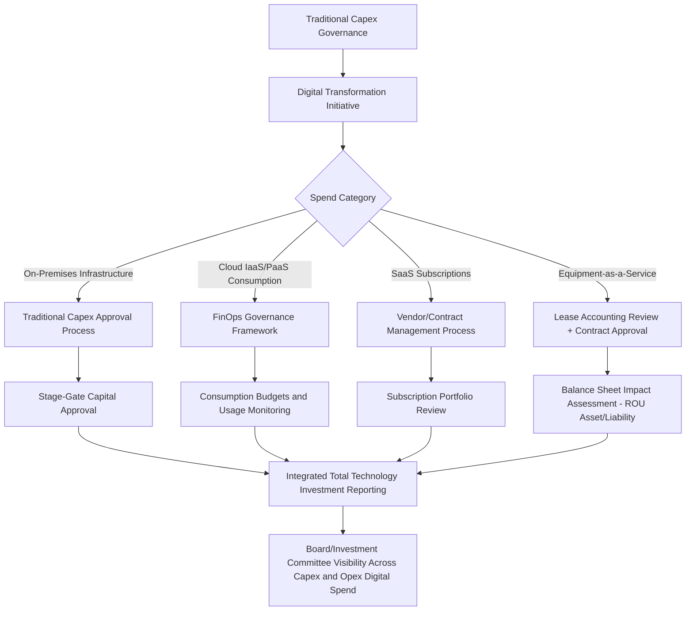

## Digital Transformation and Shifting Capex-to-Opex Models

### Overview

Digital transformation has materially altered the traditional capital expenditure profile of many organizations by shifting significant categories of technology spending from capitalized, upfront capex investments to recurring, consumption-based operating expenditure (opex). This shift — most visibly driven by cloud computing, Software-as-a-Service (SaaS), Infrastructure-as-a-Service (IaaS), and "as-a-service" consumption models across IT and increasingly operational technology — has implications that extend well beyond accounting classification, affecting capital budgeting processes, financial statement presentation, tax treatment, valuation methodology, and the fundamental skill set required of capital planning functions.

Understanding this shift is essential for capex governance because it changes what counts as "capital intensity" for an organization, alters historical benchmarking comparability, and requires capital planning frameworks originally designed around discrete, large, infrequent capital projects to adapt to a world of continuous, granular, subscription-based technology spend.

### Drivers of the Capex-to-Opex Shift

**Key Points**

- **Cloud computing adoption**: migration from owned data center infrastructure (a capex-heavy model) to public cloud infrastructure (IaaS/PaaS), which is typically consumed and expensed as a recurring operating cost rather than capitalized.
- **SaaS adoption for enterprise software**: replacing perpetual software license purchases (historically often capitalized) with subscription-based SaaS arrangements, generally expensed as incurred under most accounting frameworks.
- **Equipment-as-a-service models**: extending beyond IT into industrial and operational contexts — manufacturing equipment, vehicle fleets, and even specialized machinery increasingly offered under subscription or usage-based models rather than outright purchase.
- **Flexibility and risk transfer incentives**: opex models shift asset obsolescence risk, maintenance responsibility, and technology refresh cycles to the vendor/provider, appealing to organizations seeking to reduce balance sheet risk and technology obsolescence exposure.
- **Speed and scalability advantages**: opex-based consumption models typically enable faster deployment and more granular scaling (up or down) than traditional capex-funded infrastructure, which is often over- or under-provisioned relative to actual near-term demand.

### Accounting and Classification Considerations

#### Cloud Computing Arrangements

Under most major accounting frameworks (including US GAAP and IFRS), the accounting treatment of cloud computing arrangements depends significantly on the nature of the arrangement:

- **Hosting arrangements without a software license component** (typical SaaS): generally expensed as incurred, consistent with opex treatment, since the customer does not control the underlying software or infrastructure asset.
- **Implementation costs for cloud computing arrangements**: many frameworks (e.g., under US GAAP guidance such as ASU 2018-15, and analogous positions reached under IFRS through IFRIC agenda decisions) permit or require certain implementation costs associated with SaaS arrangements to be capitalized and amortized over the term of the arrangement, even though the underlying subscription fee itself is expensed — creating a hybrid treatment that requires careful policy application. [Inference: specific accounting treatment depends on the applicable framework, jurisdiction, and the specific facts of each arrangement; organizations should apply current authoritative guidance rather than relying solely on general principles summarized here.]
- **On-premises software with a perpetual license**: generally still eligible for capitalization as an intangible asset under traditional treatment, in contrast to subscription-based access.

#### Equipment-as-a-Service and Lease Accounting Interactions

- Equipment-as-a-service arrangements often intersect with lease accounting standards (e.g., ASC 842 under US GAAP, IFRS 16), which in many cases require recognition of a right-of-use asset and corresponding liability on the balance sheet even for arrangements structured to appear "opex-like," partially offsetting the off-balance-sheet appeal that motivated some historical equipment leasing structures.
- This creates an important distinction: an arrangement may shift cash payments from a large upfront capex outlay to periodic payments (a genuine cash flow and capital planning shift) while still requiring balance sheet recognition under modern lease accounting standards (a more limited "opex" effect from a pure accounting classification perspective).

### Capital Planning Implications

#### 1. Redefining Capital Intensity Metrics

Traditional capex-to-revenue and capex-to-depreciation benchmarking becomes less reliable for cross-period or cross-company comparison as the mix between capitalized and expensed technology spend shifts, requiring organizations to track a broader "total technology investment" metric that captures both capex and opex-classified digital spend for meaningful trend analysis.

$$\text{Total Technology Investment} = \text{IT/Digital Capex} + \text{Cloud/SaaS Opex} + \text{Equipment-as-a-Service Opex}$$

#### 2. Budgeting and Approval Process Changes

- **From discrete project approval to continuous consumption governance**: traditional capex approval processes (stage-gate reviews, board-level sign-off for large discrete projects) are often poorly suited to granular, continuously scaling cloud consumption, requiring new governance mechanisms such as consumption budgets, usage monitoring, and periodic true-up reviews rather than one-time approval gates.
- **FinOps emergence**: the discipline of cloud financial operations (FinOps) has developed specifically to manage the governance, cost allocation, and optimization challenges created by variable, consumption-based cloud opex, functioning as a parallel governance structure to traditional capex committees for this category of spend.
- **Budget predictability challenges**: opex-based consumption models can introduce budget variability that traditional capex planning (with fixed, approved project budgets) did not face, requiring new forecasting and variance management approaches tailored to usage-based cost structures.

#### 3. Financial Statement and Valuation Effects

- **EBITDA impact**: shifting spend from capex to opex directly reduces reported EBITDA (since opex flows through the income statement while capex does not), which can materially affect valuation multiples applied to EBITDA-based metrics and requires careful normalization in M&A and investor communication contexts.
- **Free cash flow presentation**: while capex reduction increases free cash flow available for debt service or distribution in a traditional FCF calculation (FCF = EBITDA − capex), the corresponding increase in opex reduces EBITDA, meaning the net effect on free cash flow is often more muted than a simple capex reduction would suggest — a nuance frequently misunderstood in high-level analysis.
- **Return on invested capital effects**: shifting from capitalized to expensed technology spend reduces the invested capital base, which can mechanically increase ROIC even without any genuine improvement in underlying capital efficiency, requiring analysts to adjust for this effect when benchmarking ROIC trends over periods spanning a significant capex-to-opex shift.

### Capex-to-Opex Shift: Governance Adaptation Framework

### Comparative Model Overview

| Dimension | Traditional Capex Model (On-Prem) | Cloud/Opex Model (Consumption-Based) |
| --- | --- | --- |
| Upfront cash outlay | High | Low to none |
| Balance sheet treatment | Capitalized asset, depreciated over useful life | Generally expensed as incurred (implementation costs may be capitalized) |
| Cost predictability | High (fixed budget for defined scope) | Variable, usage-dependent |
| Scalability | Constrained by physical capacity, lead time | Elastic, near-real-time scaling |
| Obsolescence risk | Borne by the organization | Largely borne by the provider |
| Governance mechanism | Stage-gate capital approval | FinOps / continuous consumption governance |
| EBITDA impact | Neutral (cost is depreciated, not expensed) | Reduces EBITDA (cost is expensed) |
| Approval cadence | Periodic, discrete project-based | Continuous, consumption-based with periodic review |

### Worked Example

A mid-market financial services firm is evaluating whether to renew and expand its on-premises data center (requiring an estimated $18 million capex investment with a 7-year useful life) or migrate core workloads to a public cloud IaaS/PaaS environment (estimated at $3.5 million in one-time migration capex plus approximately $4.2 million in annual recurring cloud opex).

**Traditional capex lens**: the on-premises option requires a single large capital approval, generates $18 million of capitalized asset value, and produces annual depreciation of approximately $2.6 million (straight-line over 7 years) with minimal ongoing opex beyond maintenance staff and utilities.

**Total cost and governance comparison**: the cloud migration option dramatically reduces upfront capex (from $18 million to $3.5 million) but introduces a new $4.2 million annual opex line that reduces EBITDA in every year of the cloud arrangement, whereas the on-premises option's cost impact is spread through depreciation, which is added back in EBITDA calculations.

**Capital planning implication**: while the cloud option reduces near-term capital intensity and improves several traditional capex-efficiency metrics (capex-to-revenue, ROIC via reduced invested capital base), the firm's investment committee must evaluate the decision using a total cost of ownership (TCO) framework spanning both capex and opex over a comparable multi-year horizon, rather than relying on capex figures alone, since the cloud option's true multi-year cost ($3.5M + [$4.2M × 7 years] ≈ $33.9 million) exceeds the on-premises option's capex ($18 million) plus estimated ongoing opex — requiring the qualitative benefits of scalability, reduced obsolescence risk, and faster deployment to be explicitly weighed against the higher cumulative cash cost.

### Common Pitfalls

- **Comparing capex-only figures across a capex-to-opex transition period**: benchmarking current capex intensity against historical periods without adjusting for a structural shift toward opex-classified digital spend produces a misleading picture of declining "capital intensity" that may not reflect genuine improvement in underlying technology investment efficiency.
- **Underestimating cumulative multi-year opex cost in migration decisions**: the lower upfront cash requirement of cloud/opex models can create a bias toward these models in capital-constrained decision processes, even when the total multi-year cost of ownership exceeds the capex alternative — a comparison that requires disciplined TCO analysis rather than a narrow focus on initial outlay.
- **Governance gaps for consumption-based spend**: applying traditional discrete-project capital governance (single approval, then minimal ongoing oversight) to continuously variable cloud consumption can result in cost overruns that would have triggered scrutiny under a capex framework but go unmonitored under opex classification, absent dedicated FinOps governance.
- **Inconsistent capitalization policy for implementation costs**: failing to apply a consistent, well-documented policy for capitalizing eligible SaaS/cloud implementation costs (where permitted) versus expensing them can create both financial reporting inconsistency and comparability issues across business units or reporting periods.
- **Overlooking lease accounting balance sheet effects**: assuming equipment-as-a-service arrangements are automatically "off-balance-sheet" without evaluating them against current lease accounting standards can result in unexpected balance sheet recognition and related covenant or ratio impacts.

### Next Steps

- FinOps frameworks and cloud cost governance methodologies
- Lease accounting standards (ASC 842, IFRS 16) and their capital planning implications
- Total cost of ownership (TCO) modeling for capex vs. opex technology decisions
- Cloud computing arrangement accounting (implementation cost capitalization policy)
- EBITDA normalization considerations amid structural capex-to-opex shifts
- Equipment-as-a-service and subscription-based industrial asset models
- Capital intensity benchmarking in a shifting capex/opex landscape