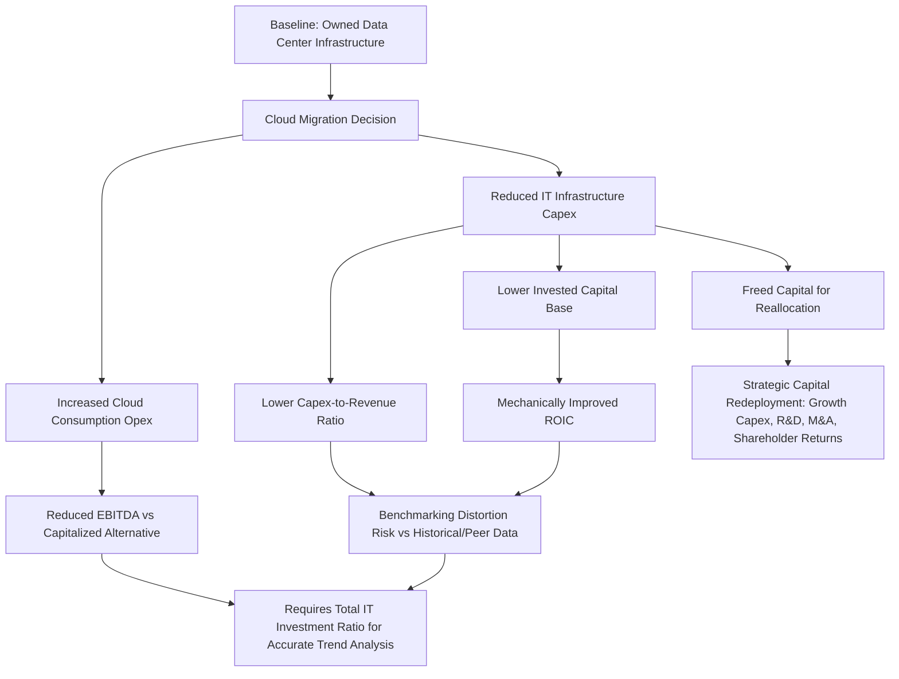

## Cloud Computing's Effect on Corporate Capital Intensity

### Overview

Cloud computing has fundamentally altered corporate capital intensity by enabling organizations to access computing infrastructure, platforms, and software as a consumable, on-demand service rather than as owned, depreciable capital assets. This shift affects capital intensity measurement across virtually every sector, not only technology-native businesses, since IT infrastructure represents a material capex category for organizations ranging from financial services to manufacturing to healthcare. Understanding cloud computing's specific effect on capital intensity metrics is essential for accurate cross-period trend analysis, peer benchmarking, and capital planning governance, distinguishing this topic from the broader digital transformation capex-to-opex shift by focusing specifically on cloud infrastructure's quantifiable balance sheet and capital efficiency effects.

### Mechanisms Through Which Cloud Computing Reduces Capital Intensity

**Key Points**

- **Elimination of owned data center infrastructure**: migrating compute, storage, and networking workloads to public cloud providers removes the need to purchase, house, and depreciate physical servers, storage arrays, and networking equipment.
- **Shift from capitalized asset to consumption expense**: cloud infrastructure (IaaS/PaaS) consumption is generally expensed as incurred rather than capitalized, directly reducing the invested capital base used in capital efficiency calculations such as ROIC.
- **Reduced facilities capex**: data center-related real estate, power infrastructure, and cooling systems — historically significant capex categories for organizations operating owned data centers — are substantially reduced or eliminated when workloads migrate to cloud providers who bear this capital burden themselves.
- **Variable cost structure replacing fixed capital commitment**: cloud consumption scales with actual usage, avoiding the traditional capex pattern of provisioning for peak or forecast future demand years in advance, which historically required significant upfront capital commitment based on demand projections that carried inherent forecasting risk.

### Quantifying the Capital Intensity Effect

#### Capital Intensity Ratio Impact

$$\text{Capital Intensity} = \frac{\text{Total Capex}}{\text{Total Revenue}} \times 100\%$$

As IT infrastructure capex migrates to cloud opex, the numerator (capex) declines while the denominator (revenue) is unaffected by the accounting classification, mechanically reducing the reported capital intensity ratio — even absent any change in the underlying volume or sophistication of computing resources actually consumed by the business.

#### Invested Capital and ROIC Effects

$$\text{ROIC} = \frac{\text{NOPAT}}{\text{Invested Capital}}$$

Because cloud opex does not add to the invested capital base (unlike owned infrastructure, which is capitalized and included in invested capital), organizations migrating to cloud infrastructure often see a mechanical improvement in ROIC, independent of any genuine improvement in operating efficiency. This effect requires careful interpretation when using ROIC trends to assess management capital allocation quality across a period spanning significant cloud migration.

#### Asset Turnover Effects

$$\text{Asset Turnover} = \frac{\text{Revenue}}{\text{Total Assets}}$$

Reduced owned infrastructure lowers the total asset base, which — holding revenue constant — mechanically increases asset turnover, a metric sometimes used as a proxy for capital efficiency but subject to the same interpretive caution as ROIC in this context.

### Industry-Level Capital Intensity Trends

Cloud adoption's effect on capital intensity is not uniform across sectors, reflecting differences in the proportion of total capex historically represented by IT infrastructure:

| Sector | Historical IT Capex as % of Total Capex | Relative Capital Intensity Impact from Cloud Adoption |
| --- | --- | --- |
| Financial services | High | Significant — IT infrastructure often represents the majority of historical capex |
| Technology/software | Very high | Significant — core infrastructure for the business itself |
| Media and entertainment | Moderate-High | Meaningful, particularly for streaming/digital distribution infrastructure |
| Retail | Moderate | Meaningful for e-commerce infrastructure; less so for physical store capex |
| Manufacturing/industrials | Low-Moderate | Modest — IT infrastructure typically a smaller share of total capex relative to production equipment |
| Utilities/energy | Low | Modest — core capex remains dominated by physical infrastructure not substitutable by cloud computing |

[Inference: these categorizations are directional and illustrative of general patterns observed across sectors; actual capital intensity impact varies significantly by individual company's specific technology architecture, cloud adoption maturity, and business model.]

### Capital Planning and Governance Implications

#### 1. Benchmarking Distortion

Cross-company and cross-period capital intensity benchmarking becomes less reliable when comparing organizations or time periods with materially different cloud adoption maturity, since two companies with genuinely similar underlying computing resource consumption can show very different reported capex figures purely due to differences in owned-versus-cloud infrastructure mix.

#### 2. Total Technology Investment Tracking

To maintain meaningful trend analysis, capital planning functions increasingly track a blended metric capturing both capitalized IT infrastructure spend and cloud consumption opex, providing a more accurate picture of the organization's actual technology investment level independent of accounting classification.

$$\text{Total IT Investment Ratio} = \frac{\text{IT Capex} + \text{Cloud/SaaS Opex}}{\text{Total Revenue}} \times 100\%$$

#### 3. Capital Allocation Reallocation

Capital historically committed to data center infrastructure becomes available for reallocation to other strategic priorities (growth capex, R&D, M&A, shareholder returns), representing one of the more significant second-order capital planning effects of cloud migration — the direct capex reduction is often less strategically important than the optionality created for redeploying that freed capital.

#### 4. Risk Profile Shift

- **Reduced technology obsolescence risk**: the risk of owning infrastructure that becomes technologically outdated is substantially transferred to the cloud provider.
- **Introduced vendor concentration risk**: capital intensity reduction is achieved partly by substituting owned-asset risk for vendor dependency risk, including pricing risk (cloud provider pricing changes), availability risk, and switching cost risk (cloud migration reversibility), which are not captured in traditional capital intensity metrics but represent a genuine risk transfer that capital planning governance should separately evaluate.

### Cloud Migration's Capital Intensity Effect: Analytical Framework

### Worked Example

A regional insurance company with $800 million in annual revenue historically maintained two owned data centers, representing approximately $14 million in annual IT infrastructure capex (1.75% of revenue) out of total company capex of $32 million (4.0% of revenue overall).

**Post-cloud-migration state** (three years after completing migration of core policy administration and claims systems to a public cloud provider):

- IT infrastructure capex declines to approximately $2 million annually (primarily end-user computing equipment and network edge infrastructure not migrated to cloud), reducing total company capex to approximately $20 million (2.5% of revenue).
- Cloud consumption opex increases to approximately $11 million annually, appearing as an operating expense that reduces reported EBITDA by a corresponding amount versus the prior depreciation-based treatment.
- Invested capital base declines by the cumulative effect of the eliminated data center assets (net of remaining depreciation on legacy assets being run off), contributing to a reported ROIC improvement from 9.8% to 11.4% over the three-year period — a portion of which is attributable to the mechanical invested capital base reduction rather than solely to operating performance improvement.

**Analytical treatment**: management's capital planning function calculates a "Total IT Investment Ratio" combining the $2 million residual IT capex and $11 million cloud opex ($13 million total, or 1.625% of revenue), noting this is reasonably comparable to the pre-migration 1.75% figure, supporting the conclusion that the company's underlying technology investment intensity has remained roughly stable even though headline capex intensity declined significantly — the shift is substantially a reclassification effect rather than a reduction in genuine technology investment. The freed capex capacity (approximately $12 million annually) is redirected toward the company's separately tracked digital product development growth capex initiative.

### Common Pitfalls

- **Interpreting capex intensity decline as genuine efficiency gain without adjustment**: attributing an improved capex-to-revenue ratio or ROIC entirely to operational excellence, without isolating the mechanical effect of cloud-driven asset base reduction, can lead to inaccurate performance assessment and potentially misaligned incentive compensation tied to these metrics.
- **Inconsistent peer benchmarking**: comparing capital intensity ratios against industry peers without adjusting for differing cloud adoption maturity can produce misleading competitive positioning conclusions.
- **Underweighting vendor concentration risk in capital planning governance**: capital intensity metrics do not capture the risk transfer inherent in cloud migration; governance frameworks should separately track vendor dependency, contract terms, and migration reversibility as distinct risk considerations alongside capital intensity trends.
- **Failing to track total technology investment consistently over time**: without a blended capex-plus-opex technology investment metric, organizations risk drawing incorrect conclusions about whether technology investment is genuinely increasing, decreasing, or merely being reclassified.
- **Overlooking multi-year cloud commitment capital-like characteristics**: some cloud contracts involve multi-year minimum commitments that, while classified as opex, carry capital-commitment-like characteristics (long-term financial obligation, limited flexibility to exit) that warrant similar governance scrutiny to traditional capex approval processes despite the accounting classification. [Inference: the degree to which organizations apply capex-equivalent governance rigor to large multi-year cloud commitments varies by organizational maturity and is not standardized practice.]

### Related Topics

- Digital transformation and shifting capex-to-opex models
- FinOps frameworks and cloud cost governance
- Return on invested capital (ROIC) analysis and capital base normalization
- Capital intensity benchmarking methodologies across industry peers
- Vendor concentration and third-party dependency risk management
- Lease accounting standards and their interaction with cloud/equipment-as-a-service arrangements
- Capital reallocation strategy following technology infrastructure transformation