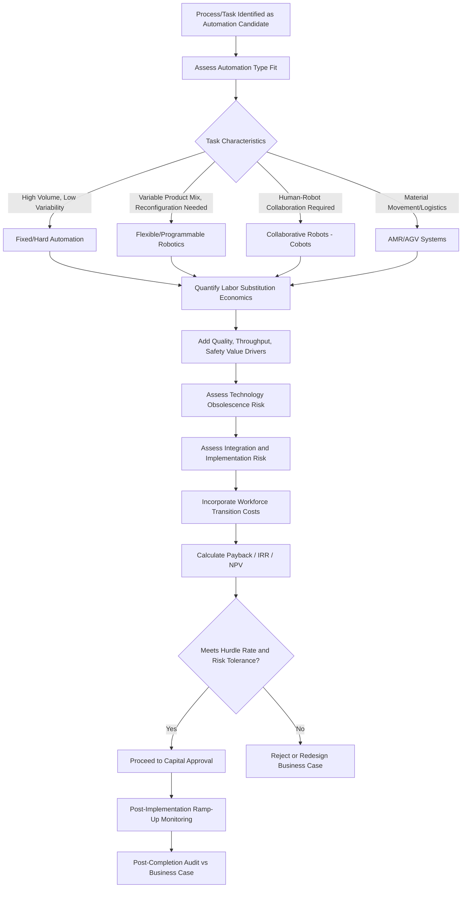

## Automation and Robotics Capex Decisions

### Overview

Automation and robotics capex decisions involve the evaluation and approval of capital investments in industrial robots, automated material handling systems, robotic process automation (RPA) infrastructure, and related control/integration systems intended to replace, augment, or enhance manual labor and processes. These decisions have become an increasingly prominent category of capital intensity management, driven by labor cost inflation, labor availability constraints, quality and consistency requirements, and advances in robotics technology that have expanded the range of economically viable automation applications beyond traditional high-volume manufacturing into logistics, warehousing, and even service-sector operations.

Unlike many traditional capex categories, automation and robotics investments typically require appraisal frameworks that explicitly quantify labor substitution economics alongside conventional capital budgeting metrics, and they carry distinct risk considerations related to technology obsolescence, workforce transition, and integration complexity that differentiate them from standard equipment replacement decisions.

### Categories of Automation and Robotics Capex

**Key Points**

- **Fixed/hard automation**: purpose-built equipment for a specific, typically high-volume, repetitive task with limited flexibility to reconfigure for different products or processes.
- **Flexible/programmable robotics**: industrial robots and robotic cells capable of reprogramming for multiple tasks or product variants, offering greater adaptability at typically higher per-unit capital cost than fixed automation.
- **Collaborative robots (cobots)**: robots designed to operate safely alongside human workers without extensive safety caging, generally requiring lower capex per unit than traditional industrial robots but typically operating at lower speed/payload capacity.
- **Autonomous mobile robots (AMRs) and automated guided vehicles (AGVs)**: material handling and logistics automation for warehouse and factory floor movement, increasingly deployed in distribution and fulfillment operations.
- **Robotic process automation (RPA)**: software-based automation of digital, rules-based business processes; distinct from physical robotics but often evaluated under similar capex/opex frameworks and increasingly bundled into broader "automation capex" reporting categories.

### Financial Appraisal Framework for Automation Investments

#### Labor Substitution Economics

The core financial justification for most automation and robotics capex rests on quantifying labor cost savings against the capital and ongoing operating cost of the automated alternative:

$$\text{Annual Labor Savings} = (\text{FTE Displaced} \times \text{Fully Loaded Labor Cost per FTE}) - \text{Incremental Automation Operating Cost}$$

Where incremental automation operating cost includes maintenance, energy, programming/reconfiguration labor, and any residual human oversight labor required to supervise or support the automated system.

#### Payback and ROI Calculation

$$\text{Payback Period} = \frac{\text{Total Automation Capex}}{\text{Annual Net Labor Savings} + \text{Annual Productivity/Quality Gains}}$$

Automation and robotics investments in mature applications (e.g., established manufacturing use cases) are frequently evaluated against relatively aggressive payback thresholds compared to other capex categories, reflecting both the more quantifiable savings basis and the competitive pressure driving adoption; however, appropriate thresholds vary significantly by industry, application maturity, and organizational capital allocation policy. [Inference: specific payback thresholds used in practice are organization- and industry-specific rather than governed by a universal standard.]

#### Beyond Direct Labor Savings — Additional Value Drivers

- **Quality and consistency improvement**: reduction in defect rates, rework, and scrap attributable to automated process consistency versus manual variability, often quantifiable as a distinct cash flow benefit.
- **Throughput and capacity gains**: automation frequently enables higher sustained output rates or extended operating hours (e.g., "lights-out" operation) not achievable with equivalent manual staffing, representing a growth-capex-like benefit alongside the maintenance/efficiency rationale.
- **Safety and injury cost reduction**: removing human workers from hazardous tasks reduces workers' compensation costs, safety incident liability, and associated indirect costs (training replacement workers, production disruption from incidents).
- **Labor availability risk mitigation**: in tight labor markets or industries facing structural labor shortages, automation capex is increasingly justified partly on the basis of reducing dependency on labor availability that may not be reliably sourceable at any cost, a consideration that is harder to quantify but increasingly explicit in business case narratives.

### Risk Considerations Specific to Automation Capex

#### Technology Obsolescence and Flexibility Risk

Robotics and automation technology continues to evolve rapidly, particularly in areas incorporating machine learning and computer vision for adaptive tasks; capital committed to a specific automation solution carries risk of technological obsolescence or the emergence of more capable/cost-effective alternatives before the asset's full depreciable life is realized. Flexible/programmable systems generally carry lower obsolescence risk than fixed automation, since they can be reconfigured for new applications rather than requiring full replacement.

#### Integration and Implementation Risk

- **Integration complexity**: automation systems frequently require integration with existing production lines, enterprise resource planning (ERP) systems, warehouse management systems, and quality control processes, introducing implementation risk and potential for extended commissioning timelines beyond initial estimates.
- **Ramp-up curve risk**: similar to other complex capital projects, automation systems often require a training/optimization period before reaching designed throughput, and business cases that assume immediate full-capacity performance from commissioning risk overstating near-term returns (a pattern also discussed in post-completion audit findings for capital projects generally).

#### Workforce Transition Considerations

- **Redeployment vs. reduction planning**: organizations vary in whether automation-displaced labor is redeployed to other roles or results in workforce reduction; this decision has direct implications for the realized savings in the business case (redeployment may reduce net cost savings but avoid severance costs and preserve institutional knowledge/goodwill).
- **Retraining and change management costs**: capex business cases for automation should typically incorporate the cost of retraining remaining staff to operate, maintain, or work alongside the new automated systems, which is sometimes underestimated or omitted from initial appraisals.

### Automation Capex Decision Framework

### Comparative Overview of Automation Types

| Type | Typical Capex Range (Relative) | Flexibility | Common Applications |
| --- | --- | --- | --- |
| Fixed/hard automation | Low-Moderate per unit at high volume | Low | High-volume, stable product manufacturing |
| Industrial robots (programmable) | Moderate-High | Moderate-High | Welding, assembly, material handling, palletizing |
| Collaborative robots (cobots) | Low-Moderate | High (for lighter-duty tasks) | Small-batch assembly, quality inspection, human-assist tasks |
| AMR/AGV systems | Moderate | High (reprogrammable routing) | Warehouse and factory floor logistics |
| RPA (software automation) | Low (software licensing/development) | High (process-specific reconfiguration) | Back-office, transactional, rules-based digital processes |

[Inference: relative capex ranges are illustrative and directional; actual costs vary substantially by application complexity, scale, vendor, and geography, and should be validated against current vendor quotations for any specific investment decision.]

### Worked Example

A consumer packaged goods manufacturer is evaluating a $2.8 million capex investment in a robotic palletizing and case-packing system for a production line currently staffed by 14 FTEs across three shifts, with a fully loaded labor cost of $58,000 per FTE annually.

**Labor substitution analysis**: the automated system is projected to displace 9 of the 14 FTEs (retaining 5 for oversight, maintenance support, and exception handling), yielding gross annual labor savings of approximately $522,000 (9 × $58,000), less estimated incremental automation operating costs (maintenance contracts, additional energy consumption, periodic reprogramming labor) of approximately $95,000 annually, for net annual labor savings of approximately $427,000.

**Additional value drivers quantified**: the business case separately quantifies an estimated $140,000 annual benefit from reduced case-packing defect rates (improved consistency versus manual packing) and an estimated $65,000 annual reduction in workers' compensation and safety-related costs, bringing total quantified annual benefit to approximately $632,000.

**Payback calculation**: $2.8 million capex ÷ $632,000 annual benefit ≈ 4.4 years simple payback, which the investment committee evaluates against the company's standard 5-year payback threshold for automation capex, alongside a calculated IRR of approximately 19% against the company's 12% hurdle rate.

**Risk-adjusted considerations**: the business case separately addresses a projected 4-month ramp-up period before the system reaches designed throughput (during which a portion of the projected labor savings will not yet be realized), and includes a $180,000 retraining and change management budget for the 5 retained FTEs and adjacent production staff, both incorporated into the cash flow timing used in the final NPV calculation.

### Common Pitfalls

- **Overstating labor savings without accounting for retained oversight roles**: business cases that assume full FTE displacement without recognizing the ongoing labor required for automation oversight, maintenance, and exception handling tend to overstate net savings.
- **Omitting ramp-up period effects**: assuming immediate full-capacity performance from commissioning, rather than modeling a realistic ramp-up curve, is a common source of business case-to-actual variance identified in post-completion audits of automation projects.
- **Underestimating integration costs**: focusing appraisal primarily on the core equipment cost while underestimating the cost and timeline of integrating the automation system with existing production, quality, and enterprise systems.
- **Insufficient consideration of technology obsolescence in flexible vs. fixed automation choice**: selecting lower-cost fixed automation for applications facing meaningful future product variability risk can result in premature obsolescence and stranded capital when product lines change.
- **Excluding workforce transition costs from the business case**: retraining, severance (where applicable), and change management costs are sometimes treated as a separate HR budget item rather than integrated into the capital project's full cost-benefit analysis, understating the true investment required and distorting comparability against other capex options.
- **Neglecting cybersecurity and connectivity requirements**: increasingly networked and software-integrated automation systems introduce cybersecurity considerations (secure connectivity, software patching, operational technology security) that require capex and ongoing opex allocation not always present in traditional appraisal templates designed for standalone mechanical equipment. [Inference: the extent to which organizations formally incorporate cybersecurity costs into automation capex business cases varies considerably by industry maturity and is not yet universal practice.]

### Related Topics

- Return on invested capital (ROIC) and capital efficiency benchmarking
- Post-completion audits and capital project reviews
- Labor cost inflation and workforce planning interaction with capex strategy
- Digital transformation and shifting capex-to-opex models
- Technology obsolescence risk assessment in capital appraisal
- Safety capex and workplace injury cost reduction metrics
- Stage-gate capital approval processes for complex technical projects
- Operational technology (OT) cybersecurity considerations in industrial capex