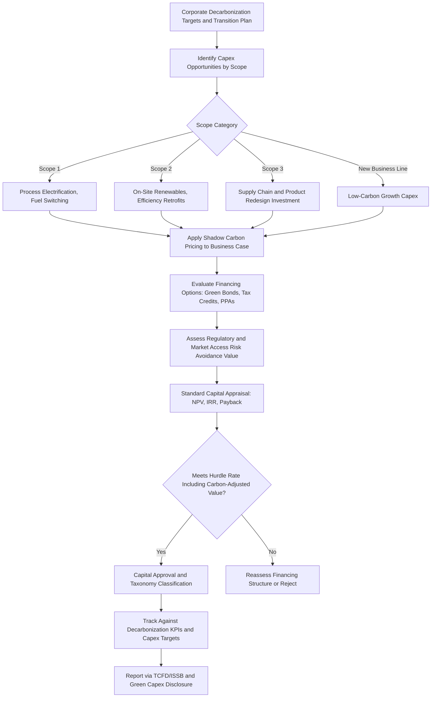

## Decarbonization Capex and Energy Transition Investment

### Overview

Decarbonization capex refers to capital expenditure specifically directed at reducing greenhouse gas emissions across an organization's operations, assets, and value chain, encompassing everything from renewable energy generation and electrification of industrial processes to carbon capture infrastructure and energy efficiency retrofits. Energy transition investment is the broader category encompassing decarbonization capex alongside capital deployed toward new low-carbon business lines, products, and revenue streams. This category of capital intensity management has grown rapidly in strategic importance as regulatory pressure, investor expectations, physical climate risk, and shifting demand patterns converge to make decarbonization a mainstream capital allocation priority rather than a peripheral sustainability initiative, connecting directly to the broader ESG considerations in capital planning discussed elsewhere in capex governance frameworks.

### Categories of Decarbonization and Energy Transition Capex

**Key Points**

- **Scope 1 reduction capex**: direct investment in reducing an organization's own operational emissions — process electrification, fuel switching, equipment upgrades, and fugitive emissions reduction (e.g., methane leak detection and repair in oil and gas operations).
- **Scope 2 reduction capex**: investment in reducing emissions associated with purchased energy — on-site renewable generation, power purchase agreements (PPAs) requiring capital commitment, and energy efficiency retrofits that reduce overall energy consumption.
- **Scope 3 / value chain capex**: capital directed at influencing supply chain and downstream emissions, which is typically harder to directly capitalize but may include investments in supplier decarbonization support, low-carbon product redesign, or logistics electrification.
- **Carbon capture, utilization, and storage (CCUS)**: capital-intensive infrastructure for capturing CO2 from industrial processes or power generation and either utilizing it in other processes or storing it permanently underground.
- **New low-carbon business line capex**: investment in genuinely new revenue-generating assets aligned with the energy transition (e.g., an oil and gas company investing in offshore wind, a utility investing in battery storage), distinct from decarbonizing existing operations.

### Financial Appraisal Considerations Specific to Decarbonization Capex

#### Multiple Value Streams Beyond Direct Cost Savings

Unlike traditional efficiency capex, decarbonization investments frequently derive value from multiple, sometimes non-traditional sources that must be explicitly modeled:

- **Direct energy/fuel cost savings**: reduced energy consumption or fuel switching to lower-cost alternatives (where applicable).
- **Carbon price avoidance**: value derived from avoiding compliance costs under existing or anticipated carbon pricing mechanisms (cap-and-trade allowances, carbon taxes), which requires forward-looking carbon price scenario assumptions in the business case.
- **Regulatory compliance value**: avoiding penalties, restricted operating permits, or forced closure under tightening emissions regulations, which may not be easily monetized but represents a genuine risk-avoidance benefit.
- **Access to preferential financing**: decarbonization capex is frequently eligible for green bonds, sustainability-linked loans, government grants, tax credits, and concessional financing not available to conventional capex, which can materially lower the effective cost of capital for qualifying projects.
- **Revenue and market access preservation**: in sectors facing customer-driven decarbonization requirements (e.g., automotive suppliers facing OEM emissions requirements, or industrial suppliers facing corporate customer scope 3 reduction targets), decarbonization capex may be required to retain existing revenue rather than generate new revenue — a defensive rather than offensive capital allocation rationale.

#### Shadow Carbon Pricing in Appraisal

$$\text{Carbon-Adjusted Project Value} = \sum_{t=0}^{n} \frac{CF_t^{operational} + (E_t^{avoided} \times P_t^{carbon})}{(1+r)^t} - C_0$$

Where $E_t^{avoided}$ represents tonnes of CO2e avoided in period $t$ and $P_t^{carbon}$ represents the assumed shadow or actual carbon price in that period. Organizations applying internal carbon pricing typically use a forward price trajectory reflecting anticipated regulatory tightening rather than a static current price, since decarbonization capex decisions are inherently long-horizon and static pricing assumptions can materially understate the value of emissions reduction achieved in later years of an asset's operating life.

#### Levelized Cost Comparisons for Energy Investments

For renewable energy and generation-related decarbonization capex specifically, levelized cost of energy (LCOE) is a standard comparative metric:

$$\text{LCOE} = \frac{\text{Total Lifecycle Cost (Capex + Opex, discounted)}}{\text{Total Lifetime Energy Output (discounted)}}$$

LCOE enables comparison across different generation technologies (solar, wind, gas, storage) on a normalized cost-per-unit-of-energy basis, though it has recognized limitations for comparing intermittent renewable generation against dispatchable conventional generation, since it does not capture the value of dispatchability, grid services, or timing of generation relative to demand. [Inference: the specific limitations and appropriate adjustments to LCOE comparisons are subject to ongoing methodological debate in energy economics and vary depending on the specific grid context and comparison being made.]

### Financing Structures for Decarbonization Capex

- **Green bonds and green loans**: proceeds specifically ring-fenced for eligible environmental projects under frameworks such as the ICMA Green Bond Principles, typically requiring third-party verification of use of proceeds.
- **Sustainability-linked financing**: loans or bonds with interest margins tied to achievement of decarbonization KPIs, applicable to general corporate capex programs rather than ring-fenced projects.
- **Government incentives and tax credits**: many jurisdictions offer specific tax credits, grants, or accelerated depreciation for qualifying decarbonization investments (e.g., investment tax credits for renewable energy generation, though the specific mechanisms, eligibility criteria, and credit values vary by jurisdiction and are subject to legislative change).
- **Power purchase agreements (PPAs)**: while not always classified as direct capex, PPAs (particularly virtual/financial PPAs) often require capital commitment analysis similar to traditional capex decisions and are a common mechanism for corporate renewable energy procurement without direct asset ownership.
- **Carbon credit and offset revenue**: in some project structures, generated carbon credits or offsets provide an additional revenue stream that can be incorporated into the project's financial model, subject to the specific carbon market mechanism and verification standard applicable.

### Decarbonization Capex Decision and Governance Framework

### Comparative Overview of Decarbonization Capex Categories

| Category | Typical Capital Intensity | Payback Characteristics | Primary Value Driver |
| --- | --- | --- | --- |
| Energy efficiency retrofits | Low-Moderate | Often shortest payback (1-5 years) | Direct energy cost savings |
| On-site renewable generation | Moderate | Moderate payback (5-10 years), varies by incentive availability | Energy cost savings + carbon price avoidance |
| Process electrification | Moderate-High | Variable, often longer | Carbon compliance + operational cost shift |
| Carbon capture (CCUS) | Very High | Long, often dependent on carbon price/credit support | Regulatory compliance, carbon credit revenue |
| New low-carbon business lines | High | Long-horizon, growth-capex risk/return profile | New revenue generation, strategic positioning |

[Inference: payback and capital intensity characterizations are illustrative generalizations; actual figures vary substantially by technology maturity, geography, applicable incentive structures, and prevailing energy/carbon prices at the time of investment.]

### Worked Example

A specialty chemicals manufacturer with significant natural gas-fired process heating is evaluating a $22 million capex investment to convert a major production line to electric heating technology, paired with a 15-year virtual power purchase agreement (VPPA) for renewable electricity to supply the increased electrical load.

**Direct cost analysis**: the conversion increases annual electricity costs by approximately $1.8 million while eliminating approximately $2.1 million in annual natural gas costs, yielding modest direct annual net operating savings of approximately $300,000 — insufficient on its own to justify the capex under the company's standard 5-year payback threshold.

**Carbon-adjusted analysis**: the conversion eliminates an estimated 18,000 tonnes of CO2e annually. Applying the company's internal shadow carbon price (starting at $45/tonne, escalating to $90/tonne by year 10 based on anticipated regulatory tightening in the company's key operating jurisdictions), the carbon avoidance value adds approximately $810,000 in year 1, growing to approximately $1.62 million by year 10, materially improving the project's risk-adjusted NPV.

**Financing structure**: the project qualifies for a green loan facility offering a 75-basis-point interest rate discount versus the company's standard corporate borrowing rate, and the associated VPPA structure allows the company to lock in electricity pricing certainty for the 15-year term, reducing exposure to future electricity price volatility that would otherwise represent a modeling risk in the direct cost analysis.

**Strategic and compliance value**: the company's largest customer segment (automotive component manufacturers) has begun incorporating supplier scope 3 emissions reduction requirements into procurement criteria; the business case explicitly notes that failure to proceed with decarbonization investments of this type carries a qualitative but material risk to future contract retention in this customer segment, a consideration the investment committee weighs alongside the quantified financial metrics.

**Outcome**: incorporating the carbon-adjusted value, preferential financing terms, and market access risk avoidance, the investment committee approves the project despite the modest standalone direct-cost-savings payback, explicitly documenting the carbon-adjusted IRR (approximately 14%, versus 6% on a direct-cost-only basis) and the qualitative customer retention rationale as key components of the approval decision.

### Common Pitfalls

- **Relying solely on direct cost savings without carbon-adjusted valuation**: many genuinely value-accretive decarbonization projects fail standard capital appraisal hurdles when evaluated only on direct energy/operating cost savings, without incorporating carbon price avoidance, regulatory risk avoidance, or market access value — requiring an explicit, consistently applied methodology for incorporating these harder-to-quantify value streams.
- **Inconsistent internal carbon price application**: applying a shadow carbon price to some decarbonization projects but not consistently to competing conventional capex alternatives distorts relative capital allocation decisions across the portfolio.
- **Greenwashing and taxonomy misalignment risk**: classifying capex as "decarbonization" or "green" without rigorous alignment to recognized taxonomies or verification standards exposes the organization to regulatory scrutiny and reputational risk as disclosure requirements tighten (see related ESG considerations in capital planning).
- **Underestimating technology and regulatory pathway uncertainty**: decarbonization technology (particularly emerging categories like CCUS and green hydrogen) and the regulatory/incentive landscape supporting it remain subject to significant uncertainty; business cases should incorporate scenario analysis rather than relying on a single optimistic technology cost or incentive availability assumption. [Unverified: the pace of cost decline and regulatory support for specific emerging decarbonization technologies is inherently uncertain and subject to ongoing change; assumptions should be validated against current market conditions at the time of any specific investment decision.]
- **Overlooking stranded asset risk in transition planning**: capital allocated to extending the life of high-carbon assets (rather than transitioning away from them) can create stranded asset risk if regulatory or market conditions shift faster than the asset's assumed useful life, a consideration requiring integration with the organization's broader climate scenario planning.
- **Insufficient integration with core capital planning process**: treating decarbonization capex as a separate "sustainability budget" disconnected from mainstream capital allocation governance can result in inconsistent appraisal standards and difficulty prioritizing across the full capital portfolio.

### Next Steps

- ESG and sustainability considerations in capital planning
- Internal/shadow carbon pricing methodologies in capital budgeting
- Green bonds, sustainability-linked loans, and transition finance instruments
- Stranded asset risk assessment and climate scenario analysis
- EU Taxonomy and sustainable finance classification systems
- Power purchase agreement (PPA) structuring and capital commitment analysis
- TCFD/ISSB climate disclosure and capex-linked reporting requirements
- Levelized cost of energy (LCOE) methodology and limitations