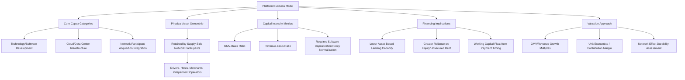

## Capital Intensity in the Platform and Asset-Light Economy

### Overview

The platform and asset-light economy describes business models that generate revenue and scale operations primarily by orchestrating transactions, connections, or access between parties — rather than by owning the underlying physical or productive assets involved in delivering the good or service. Ride-hailing platforms that do not own vehicles, accommodation marketplaces that do not own real estate, and software platforms that enable third-party commerce without holding inventory are archetypal examples. This model fundamentally inverts traditional capital intensity assumptions: growth in transaction volume, user base, or gross merchandise value (GMV) can occur with capital expenditure requirements that scale far more slowly than revenue, in sharp contrast to traditional capital-intensive business models where output growth typically requires roughly proportional capital investment.

Understanding capital intensity dynamics in this model is essential for capital planning functions because it changes fundamental relationships between growth, capex, valuation, and risk that traditional capital budgeting frameworks were designed around.

### Structural Characteristics of Asset-Light Capital Intensity

**Key Points**

- **Decoupling of revenue growth from capex growth**: unlike a traditional manufacturer that must add production capacity (capex) roughly in proportion to sales growth, platform businesses can grow GMV or transaction volume with capex requirements concentrated primarily in technology infrastructure and software development rather than physical asset acquisition.
- **Capital intensity concentrated in technology, not physical assets**: the primary capex categories for asset-light platforms are typically software development (which may be partially capitalized depending on accounting treatment), data center/cloud infrastructure, and increasingly, capitalized costs associated with acquiring and integrating supply-side or demand-side network participants.
- **Risk transfer to network participants**: the capital risk associated with the underlying physical assets (vehicles, real estate, inventory) is borne by independent supply-side participants (drivers, hosts, sellers) rather than the platform operator, fundamentally altering the platform's own balance sheet risk profile relative to a traditional owner-operator in the same industry.
- **Network effects as a substitute for capital-intensive competitive moats**: traditional capital-intensive industries often derive competitive advantage from scale economies in physical asset ownership; asset-light platforms typically derive competitive advantage from network effects (value increasing with the number of participants on both sides of the platform) — a fundamentally different and less capital-dependent source of defensibility.

### Capital Intensity Metrics in an Asset-Light Context

#### Traditional Metrics Require Reinterpretation

$$\text{Capital Intensity} = \frac{\text{Total Capex}}{\text{Total Revenue}} \times 100\%$$

For asset-light platforms, this ratio is typically structurally far lower than for comparable traditional operators in the same end-market, but the metric requires careful interpretation: low reported capital intensity does not necessarily indicate low overall capital requirements for the ecosystem the platform participates in — it primarily indicates that the platform operator itself has structured its business to avoid direct ownership of the capital-intensive assets, with that capital burden instead borne elsewhere (by drivers, hosts, merchants, or other network participants).

#### GMV vs. Revenue as the Denominator

Because many platform businesses report both gross merchandise value (GMV) or gross transaction value (the total value of transactions facilitated) and net revenue (the platform's actual take-rate-based revenue), capital intensity ratios can differ substantially depending on which denominator is used:

$$\text{Capital Intensity (GMV basis)} = \frac{\text{Total Capex}}{\text{GMV}} \times 100\%$$

$$\text{Capital Intensity (Revenue basis)} = \frac{\text{Total Capex}}{\text{Net Revenue}} \times 100\%$$

The GMV-basis ratio provides a more accurate picture of capital efficiency relative to the total economic activity the platform enables, while the revenue-basis ratio reflects capital efficiency relative to the platform's own captured economics; both are useful depending on the analytical question being addressed.

#### Software Capitalization Considerations

A meaningful portion of platform capex is often software development cost, subject to specific capitalization criteria under applicable accounting standards (e.g., costs incurred during the application development stage may be eligible for capitalization under US GAAP ASC 350-40 for internal-use software, or under IAS 38 for IFRS reporters, subject to meeting relevant recognition criteria). This creates a distinct normalization consideration: two platform businesses with similar underlying technology investment can report different capex figures purely based on differences in capitalization policy aggressiveness, a consideration directly relevant to the capex normalization practices discussed in the M&A diligence context.

### Capital Structure Implications

#### Lower Fixed Asset Base, Different Financing Needs

- Asset-light platforms typically require less traditional debt financing secured against physical collateral, since they have fewer hard assets to pledge, often relying more heavily on equity financing (particularly in growth stages) or unsecured/covenant-based debt structures rather than asset-based lending common in capital-intensive industries.
- Working capital dynamics can differ significantly from traditional businesses: platforms that collect payment from customers before remitting to supply-side participants (a common marketplace structure) can generate favorable working capital characteristics (negative working capital, effectively platform-provided float) that partially substitute for the balance sheet strength traditionally provided by owned physical assets.

#### Valuation Implications

- Traditional capital-intensity-based valuation approaches (e.g., asset-based valuation, replacement cost analysis) are typically less relevant for asset-light platforms, which are more commonly valued on revenue or GMV growth multiples, unit economics (contribution margin per transaction), and network effect durability rather than asset base or capital efficiency metrics in the traditional sense.
- ROIC and capital efficiency metrics can appear extremely favorable for asset-light platforms during growth phases (very high revenue growth against modest capex), though this comparison requires context: the metric primarily reflects the business model's structural characteristics rather than necessarily indicating superior capital allocation skill relative to a capital-intensive competitor.

### Asset-Light Platform Capital Structure Framework

### Comparative Capital Intensity: Traditional vs. Asset-Light Models (Illustrative)

| Dimension | Traditional Owner-Operator Model | Asset-Light Platform Model |
| --- | --- | --- |
| Primary capex category | Physical assets (fleet, real estate, equipment) | Technology infrastructure, software development |
| Capex scaling with growth | Roughly proportional to output/capacity | Substantially decoupled from GMV/transaction growth |
| Physical asset risk bearer | The company itself | Independent network participants |
| Typical financing structure | Asset-based lending, secured debt | Equity-heavy, unsecured/covenant-based debt |
| Working capital profile | Often positive (inventory, receivables) | Can be negative (payment timing float) |
| Competitive moat source | Scale economies in owned assets | Network effects, data, switching costs |
| Primary valuation approach | Asset-based, replacement cost, EBITDA multiples | Growth/GMV multiples, unit economics |

[Inference: this comparison presents generalized, illustrative characteristics of each model; actual capital structure and metrics vary considerably across specific companies and evolve over a platform's maturity lifecycle, particularly as some platforms selectively integrate backward into asset ownership for strategic reasons.]

### Worked Example

A logistics marketplace platform connects independent truck owner-operators with shippers, facilitating $1.2 billion in annual gross transaction value while generating $180 million in net platform revenue (a 15% take rate) and reporting total capex of $22 million annually, almost entirely allocated to software development and cloud infrastructure supporting the matching algorithm, mobile applications, and payment processing systems.

**Capital intensity comparison**: on a revenue basis, the platform's capex-to-revenue ratio is approximately 12.2% ($22M / $180M) — while this may appear moderate in isolation, on a GMV basis the ratio is approximately 1.8% ($22M / $1.2B), starkly illustrating how little direct capital the platform itself deploys relative to the total economic activity it facilitates. By contrast, a traditional asset-based trucking company generating comparable $180 million in revenue would typically require capex in the range of 15-25% of revenue for fleet acquisition and maintenance, representing a materially different capital intensity profile for functionally overlapping economic activity.

**Structural interpretation**: the platform's low capital intensity does not mean the trucking capacity underlying the $1.2 billion in GMV requires no capital — it means that capital burden (vehicle acquisition, maintenance, fuel, insurance) is borne by the independent owner-operators using the platform, not by the platform company itself. This has direct implications for how the platform's financial risk should be assessed: the platform bears technology and demand-generation risk, while a very different set of capital and operational risks (vehicle financing, driver retention, fuel price volatility) are borne elsewhere in the ecosystem, risks that could indirectly affect the platform's business (e.g., if owner-operator capital constraints limit network supply growth) even though they do not appear on the platform's own balance sheet or capex reporting.

### Common Pitfalls

- **Treating low capital intensity as a direct proxy for superior capital allocation skill**: structurally low capex ratios in asset-light models primarily reflect the business model design rather than necessarily indicating better capital allocation discipline than a capital-intensive peer; meaningful comparison requires assessing return generation relative to the capital genuinely at risk across the full ecosystem, not solely the platform operator's own balance sheet.
- **Ignoring ecosystem-level capital risk**: capital planning and risk assessment focused solely on the platform operator's own capex can miss material indirect exposure to capital constraints or distress among network participants (e.g., if independent drivers/hosts cannot access financing for the underlying assets, platform growth and supply reliability can be directly affected, even though this risk does not appear in the platform's own capital intensity metrics).
- **Inconsistent software capitalization policy comparisons**: benchmarking capital intensity across platform companies without normalizing for differences in software development cost capitalization policy can produce misleading comparative conclusions, echoing the capitalization policy normalization considerations relevant in M&A capex diligence generally.
- **Underestimating technology capex as the business scales**: while physical asset capex remains structurally low, technology infrastructure and platform reliability/security investment requirements often grow with scale and complexity in ways that can be underestimated in early-stage capital planning, particularly as platforms expand into new geographies, verticals, or regulatory environments.
- **Strategic drift toward asset ownership without capital planning recalibration**: some platforms selectively integrate backward into asset ownership over time (e.g., a marketplace beginning to own inventory or a mobility platform acquiring its own vehicle fleet for specific segments) for competitive or quality-control reasons; failing to recalibrate capital planning frameworks and metrics when this strategic shift occurs can result in continued reliance on asset-light-era capital intensity assumptions that no longer reflect the business's actual capital requirements. [Inference: the prevalence and strategic rationale for such backward integration decisions vary considerably by company and industry context.]

### Next Steps

- Capex normalization in EBITDA add-back adjustments
- Software capitalization policy and internal-use software accounting standards
- Network effects and platform business model valuation approaches
- Unit economics and contribution margin analysis for marketplace businesses
- Working capital management in payment-timing-advantaged business models
- Digital transformation and shifting capex-to-opex models
- Ecosystem risk assessment beyond direct balance sheet exposure