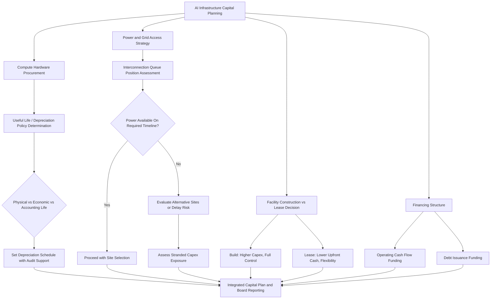

## Artificial Intelligence Infrastructure and Data Center Capex Trends

### Overview

Artificial intelligence infrastructure and data center capex represents one of the largest and fastest-growing capital expenditure categories in the global economy, encompassing spending on GPU/accelerator hardware, purpose-built data center facilities, power and cooling infrastructure, and networking equipment required to train and serve large-scale AI models. The scale and pace of this investment cycle have created distinctive capital planning challenges: unprecedented capital intensity ratios among the companies leading the buildout, a live and unresolved debate over appropriate asset useful-life and depreciation assumptions, a fundamental shift in the binding constraint from chip supply to electrical power availability, and a structural shift in financing mix from internally generated cash flow toward debt issuance.

This is a rapidly evolving area where figures change quarter to quarter; the data below reflects analyst and company disclosures available as of September 2026 and should be treated as a snapshot rather than a static reference.

### Scale of the Current Investment Cycle

**Key Points**

- Analyst estimates for combined 2026 capital expenditure among the five largest hyperscalers (commonly referenced as Amazon, Microsoft, Alphabet/Google, Meta, and Oracle) have been revised upward repeatedly throughout 2025 and into 2026, with figures cited in recent (Q1 2026 earnings-informed) analysis reaching approximately $775–800 billion, roughly 64% above 2025 levels, though estimates from different sources and time periods in this cycle have varied considerably, with some analysis citing figures around $725 billion, with 75% directed at AI-specific infrastructure. [alcapitaladvisory](https://alcapitaladvisory.com/research/intelligence/ai-infrastructure.html)[nexi](https://nexi.fund/ai-infrastructure-guide-hyperscaler-capex-2026/)
- A substantial and rising share of this spend — approximately 75% of aggregate hyperscaler capex in 2026 is estimated to fund AI-related infrastructure specifically, as distinct from traditional cloud computing capacity. [creditsights](https://know.creditsights.com/insights/technology-hyperscaler-capex-2026-estimates/)
- Capital intensity, measured as capex relative to revenue, has reached levels described by credit analysts as previously unthinkable, with capital intensity for certain individual hyperscalers reaching the mid-40% to upper-50% range of quarterly revenue, and one analysis noting that several major hyperscalers are projected to spend roughly the full amount of their cloud revenue on capex in 2026, effectively recycling nearly all cloud income back into AI infrastructure. [creditsights](https://know.creditsights.com/insights/technology-hyperscaler-capex-2026-estimates/)[Yahoo Finance](https://finance.yahoo.com/technology/ai/articles/ai-absurd-spending-boom-hyperscalers-162709082.html)
- Multi-year cumulative projections are similarly large: one widely cited estimate places hyperscaler AI infrastructure spending at approximately $4.1 trillion from 2026 through 2028, roughly tripling the amount deployed over the prior six years. [Yahoo Finance](https://finance.yahoo.com/technology/ai/articles/ai-absurd-spending-boom-hyperscalers-162709082.html)

[Inference: given the pace of upward revision observed throughout this cycle, any specific dollar figure cited here should be understood as a point-in-time estimate likely to be superseded by subsequent quarterly disclosures and analyst updates.]

### Composition of AI Infrastructure Capex

AI infrastructure capex is often popularly conflated with GPU/accelerator purchases alone, but the actual spending composition is broader and increasingly weighted toward power and physical infrastructure:

- **Compute hardware**: GPUs, AI accelerators, and associated server/rack hardware — the most visible category but representing a declining relative share as other infrastructure requirements scale.
- **Power and cooling infrastructure**: increasingly described as the dominant cost driver, with one analysis estimating more than 60% of spend now going into power, cooling, and related physical infrastructure rather than the compute hardware itself. [nexi](https://nexi.fund/ai-infrastructure-guide-hyperscaler-capex-2026/)
- **Data center construction and real estate**: purpose-built, high-density facilities capable of supporting AI workloads, which has tripled since 2022 and is on track to surpass general office construction spending in the United States. [sec](https://www.sec.gov/Archives/edgar/data/0001144879/000114487926000048/apld-20260531.htm)
- **Networking and interconnect**: high-bandwidth networking infrastructure required to connect large GPU clusters for distributed training workloads.
- **Grid interconnection and energy infrastructure**: capital directed at securing power access, including transmission infrastructure and, in some cases, direct investment in generation capacity (including emerging interest in nuclear and small modular reactor arrangements).

### The Binding Constraint: Power, Not Chips

A defining characteristic of the current cycle, distinct from earlier phases of AI infrastructure buildout, is that the binding constraint on frontier AI scale has shifted from GPU/chip allocation to power infrastructure — megawatts, interconnection queues, and the physical ability to deliver electricity to data center racks. This has several capital planning implications: [gpuinsights](https://gpuinsights.net/ai-data-center-power-infrastructure-2026/)

- **Extended lead times**: hardware supply bottlenecks such as HBM fabrication and advanced packaging capacity can typically be resolved within 18-24 months, whereas utility-scale grid expansion operates on timelines comparable to broader industrial infrastructure projects, creating a structural mismatch between the pace of chip/compute investment and the pace at which power infrastructure can be delivered. [spheron](https://www.spheron.network/blog/ai-data-center-power-constraints-2026/)
- **Demand projections**: the U.S. Department of Energy projects the grid will require approximately 100 GW of new capacity by 2030, roughly half of it driven by data centers, while the Boston Consulting Group estimates a potential U.S. data center power shortfall exceeding 45 GW by 2030. [sec](https://www.sec.gov/Archives/edgar/data/0001144879/000114487926000048/apld-20260531.htm)
- **Stranded capex risk**: facilities teams face a scenario where GPUs depreciate while awaiting power delivery, effectively stranding capital that has already been committed — a capital planning risk distinct from traditional technology obsolescence risk, since the asset itself is not obsolete, merely unable to be energized on the originally planned timeline. [gpuinsights](https://gpuinsights.net/ai-data-center-power-infrastructure-2026/)
- **Site selection as a capital allocation decision**: a site that appears economically favorable on a cost-per-megawatt-hour basis can become effectively more expensive if interconnection queue position delays energization beyond the assumed depreciation schedule, making power availability and queue position first-order factors in AI data center capital allocation decisions. [gpuinsights](https://gpuinsights.net/ai-data-center-power-infrastructure-2026/)

### The GPU Useful Life and Depreciation Debate

A significant and unresolved accounting and capital planning debate concerns the appropriate useful-life assumption applied to GPU and AI accelerator assets for depreciation purposes, with direct implications for reported earnings and the true economics of AI infrastructure investment.

#### The Core Dispute

- **The shortened-life argument**: prominent critics, including investor Michael Burry, have argued that hyperscalers are artificially boosting reported earnings by extending useful-life assumptions on AI hardware beyond what actual 2-3 year technology replacement cycles justify, with one estimate suggesting the cumulative earnings impact of shortening depreciation schedules from the currently common four-to-six-year range to a two-to-three-year economic replacement cycle could exceed $176 billion across 2026-2028. [Substack](https://interestingengineering.substack.com/p/why-michael-burry-is-wrong-about)[natlawreview](https://natlawreview.com/article/deep-quarry-useful-lives-gpus-key-considerations)
- **The extended-life counterargument**: chip manufacturers and hyperscalers have pushed back, with Nvidia arguing that customers consistently apply four-to-six-year depreciable lives based on observed utilization patterns and hardware longevity, and industry analysis noting that physical lifespan studies and hyperscaler hardware retention data both indicate useful physical life of six years or more for well-maintained GPU hardware, materially longer than the shorter technological-obsolescence-driven estimates. [natlawreview](https://natlawreview.com/article/deep-quarry-useful-lives-gpus-key-considerations)[whitefiber](https://www.whitefiber.com/blog/understanding-gpu-lifecycle)

#### Three Distinct Concepts of "Life"

Analysis of this debate distinguishes three separate concepts that are frequently conflated:

- **Physical lifespan**: how long the silicon continues to function under operational load, which with proper cooling and power delivery can extend well beyond the depreciation schedule typically applied. [whitefiber](https://www.whitefiber.com/blog/understanding-gpu-lifecycle)
- **Accounting/depreciable life**: the useful-life assumption formally applied under the company's depreciation policy, currently clustering around a multi-year range that has itself shifted over time — described in some analysis as a "6-year shift" representing the new de facto standard depreciation schedule for AI-focused cloud infrastructure. [thecuberesearch](https://thecuberesearch.com/298-breaking-analysis-resetting-gpu-depreciation-why-ai-factories-bend-but-dont-break-useful-life-assumptions/)
- **Economic life**: how long the equipment continues to earn the margin that originally justified building it — a GPU does not need to physically fail to become economically depreciated faster; it only needs to stop being the best available option for the workload. [theforwardview](https://theforwardview.com/essays/useful-life-ai-hardware-depreciation-economic-life-gap)

#### The "Value Cascade" and Workload Diversification Argument

A key argument supporting longer useful-life assumptions holds that GPUs have an economic life extending well beyond their primary training role — as hardware ages out of frontier training use, it can be redeployed to inference, analytics, and other long-tail workloads, giving the asset an economic life the analysis characterizes as two to three times longer than its primary use alone would suggest. Whether this "value cascade" pattern, historically observed with general-purpose server hardware, holds equally well for AI-specific accelerator fleets is characterized as an open question given the more expensive, power-constrained, and rapidly evolving nature of current-generation AI hardware. [Unverified: whether historical general-purpose server depreciation patterns will hold analogously for AI-specific accelerator hardware is an active subject of debate among industry analysts, without empirical resolution as of the current information available.] [thecuberesearch](https://thecuberesearch.com/298-breaking-analysis-resetting-gpu-depreciation-why-ai-factories-bend-but-dont-break-useful-life-assumptions/)

#### Accounting Treatment and Precedent

- Under U.S. GAAP, changes in depreciable useful-life assumptions are treated as changes in accounting estimate under ASC 250, not as corrections of a prior error, and useful-life assessments are inherently company-specific — meaning two companies can reach different, individually compliant estimates when operating comparable hardware. [natlawreview](https://natlawreview.com/article/deep-quarry-useful-lives-gpus-key-considerations)
- A notable divergence occurred when Amazon shortened the useful life of a subset of its servers from six years to five years, explicitly citing the increased pace of technology development in AI and machine learning, resulting in a reported $700 million hit to operating income and $920 million in accelerated depreciation charges, illustrating that individual company choices on this assumption can move in different directions even within the same investment cycle and technology environment. [Substack](https://davefriedman.substack.com/p/the-176-billion-accounting-question)

### The Financing Shift: From Cash Flow to Debt

A structural change distinguishing this AI investment cycle from prior hyperscaler capex patterns is a pronounced shift toward debt-financed infrastructure buildout:

- The four largest hyperscalers spent a combined approximately $238 billion on capex in 2024, with the combined 2026 figure confirmed in Q1 2026 earnings at approximately $775-800 billion — a scale of increase that has outpaced the companies' ability to fund the buildout purely from operating cash flow. [alcapitaladvisory](https://alcapitaladvisory.com/research/intelligence/ai-infrastructure.html)
- Morgan Stanley and J.P. Morgan have projected the technology sector will need to issue approximately $1.5 trillion in new debt over the following three years to fund the AI infrastructure build-out, representing a marked departure from the historically cash-rich, low-leverage balance sheets characteristic of large technology companies prior to this cycle. [alcapitaladvisory](https://alcapitaladvisory.com/research/intelligence/ai-infrastructure.html)
- Some industry analysis notes a related structural shift toward an evolving capex mix increasingly favoring leasing data center capacity rather than direct construction, reducing upfront cash requirements while preserving operational flexibility in a rapidly changing technology landscape — a capital structure choice directly analogous to the equipment-as-a-service and lease-versus-buy considerations relevant to capital planning more broadly. [creditsights](https://know.creditsights.com/insights/technology-hyperscaler-capex-2026-estimates/)

### AI Infrastructure Capex Decision Framework

### Comparative Snapshot of Cited 2026 Estimates (Illustrative of Estimate Variability)

| Source/Period Cited | Combined Top Hyperscaler 2026 Capex Estimate | AI-Specific Share |
| --- | --- | --- |
| Analysis citing ~113 days prior | Over $600 billion (36% increase from 2025) | ~75% ($450 billion) |
| Analysis citing ~296 days prior (CreditSights) | ~$602 billion (36% YoY increase) | ~75% ($450 billion) |
| Analysis citing ~52 days prior | $725 billion | 75% ($545 billion) |
| Analysis citing ~42 days prior (post-Q1 2026 earnings) | ~$775–800 billion (~64% above 2025) | Not separately quantified in this source |

This range illustrates the degree to which estimates for the same fiscal year have continued to shift materially even within a single calendar year, underscoring the importance of using current-quarter disclosures rather than any single historical estimate for capital planning purposes.

### Capital Planning and Governance Implications

- **Sensitivity of reported earnings to a single estimate**: given the debate outlined above, organizations and analysts evaluating AI infrastructure investment should explicitly model earnings and return sensitivity to a range of useful-life assumptions rather than relying on a single company-disclosed figure, particularly for comparative or benchmarking purposes.
- **Power availability as a primary capital allocation gate**: capital planning frameworks for AI infrastructure increasingly require power/interconnection feasibility confirmation as a gating criterion prior to capital commitment, a departure from traditional data center site selection processes where power was typically a design input rather than the binding constraint.
- **Financing risk monitoring**: the shift toward debt-funded buildout introduces balance sheet and interest rate exposure not previously characteristic of the hyperscaler sector, requiring capital planning governance to incorporate debt capacity and covenant considerations more central to leveraged capital structures.
- **Demand-supply reconciliation**: bullish infrastructure investment is partly justified by disclosed contractual backlog — for instance, Google Cloud's backlog reaching $462 billion and Amazon's AWS backlog standing at $364 billion, representing committed contracts rather than speculative projections — though the degree to which backlog figures reliably predict realized capacity utilization over the full depreciable life of the underlying assets remains a key uncertainty for capital planners to monitor. [Unverified: the correlation between disclosed contractual backlog and actual multi-year utilization of AI infrastructure assets has not been established through a long enough historical track record to be treated as a settled empirical relationship.] [nexi](https://nexi.fund/ai-infrastructure-guide-hyperscaler-capex-2026/)

### Common Pitfalls

- **Treating any single capex or useful-life figure as durable**: given the pace of upward revision and ongoing debate documented above, capital planning analysis relying on a single point-in-time estimate risks rapid obsolescence; current-quarter source verification is essential for any material decision.
- **Underweighting power/interconnection risk relative to chip supply risk**: capital plans structured primarily around securing GPU allocation, without equal or greater attention to power availability and grid interconnection timelines, risk stranding committed capital.
- **Applying historical general-purpose server depreciation patterns without adjustment**: assuming the "value cascade" redeployment pattern observed with prior-generation general-purpose servers will apply identically to AI-specific accelerator fleets, without accounting for the more rapid architectural change and higher power intensity of current-generation hardware, is a live and unresolved assumption rather than an established fact.
- **Overlooking financing structure risk in return calculations**: evaluating AI infrastructure returns purely on an operating/EBITDA basis without incorporating the cost and risk of the debt financing increasingly required to fund the buildout can overstate genuine risk-adjusted returns.

### Related Topics

- Digital transformation and shifting capex-to-opex models
- Cloud computing's effect on corporate capital intensity
- Asset useful life and depreciation policy determination
- Debt financing structures and covenant considerations for capital-intensive buildouts
- Power purchase agreements and energy infrastructure capital commitments
- Capital intensity benchmarking and ROIC interpretation during rapid buildout cycles
- Technology obsolescence risk assessment in capital appraisal