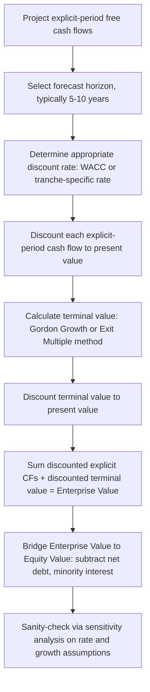

## Time Value of Money and Discounted Cash Flow Fundamentals

### Overview

Time Value of Money (TVM) is the foundational principle that a unit of currency available today is worth more than the same unit available in the future, due to its earning potential, inflation erosion, and opportunity cost. Discounted Cash Flow (DCF) analysis extends TVM into a valuation framework that converts future cash flows into a single present value by applying a discount rate that reflects risk and opportunity cost. In capital structuring and syndication, TVM/DCF underpins every core task: pricing debt tranches, modeling waterfall distributions, evaluating covenant headroom, structuring amortization schedules, and negotiating syndicate allocations based on risk-adjusted returns.

### Core Principle: Why Money Has Time Value

Three forces justify discounting future cash flows:

- **Opportunity cost** — capital deployed today could earn a return elsewhere (e.g., risk-free rate, cost of capital)
- **Inflation** — purchasing power erodes over time, reducing real value of nominal future receipts
- **Risk/uncertainty** — future cash flows are never fully guaranteed; a bird in hand is worth more than one in the bush

The discount rate used in DCF models is typically constructed to compensate for all three, which is why capital structuring professionals distinguish between the **risk-free rate**, **inflation premium**, and **risk premium** when building a discount rate from the ground up.

### Future Value (FV)

Future Value calculates what a present sum grows to after compounding over time.

**Single sum, compounded annually:**

$$FV = PV \times (1 + r)^n$$

Where:

- $PV$ = present value (initial sum)
- $r$ = periodic interest/discount rate
- $n$ = number of compounding periods

**Compounding with sub-annual periods (e.g., quarterly, monthly):**

$$FV = PV \times \left(1 + \frac{r}{m}\right)^{m \times n}$$

Where $m$ is the number of compounding periods per year.

**Continuous compounding** (used in some derivatives and advanced credit models):

$$FV = PV \times e^{r \times n}$$

**Example:**

A syndicate member commits $10,000,000 today at an annual compounded rate of 8% for 5 years.

$$FV = 10{,}000{,}000 \times (1.08)^5 = 14{,}693{,}280.77$$

### Present Value (PV)

Present Value reverses the FV formula to determine what a future cash flow is worth today.

$$PV = \frac{FV}{(1 + r)^n}$$

**Example:**

A structured note pays $5,000,000 in 3 years. The applicable discount rate (reflecting the note's credit risk) is 6%.

$$PV = \frac{5{,}000{,}000}{(1.06)^3} = 4{,}198{,}101.00$$

This is the core mechanic behind pricing zero-coupon tranches, deferred consideration in M&A financings, and terminal value discounting in enterprise valuation models feeding into leverage capacity analysis.

### Present Value of an Annuity

An annuity is a series of equal cash flows at regular intervals — directly relevant to level debt service schedules, lease payments, and preferred dividend streams in structured capital.

**Ordinary annuity (payments at period end):**

$$PV_{annuity} = PMT \times \frac{1 - (1 + r)^{-n}}{r}$$

**Annuity due (payments at period start)** — common in lease-financing structures:

$$PV_{annuity\ due} = PMT \times \frac{1 - (1 + r)^{-n}}{r} \times (1 + r)$$

**Example — Term Loan B amortization:**

A term loan requires level quarterly payments of $2,500,000 for 20 quarters at a 2% quarterly rate.

$$PV = 2{,}500{,}000 \times \frac{1 - (1.02)^{-20}}{0.02} = 40{,}875{,}555.78$$

This PV represents the original principal the loan facility supports given that payment structure — a critical check when structuring amortization schedules against a target facility size.

### Future Value of an Annuity

Used to project sinking fund accumulation or escrow reserve buildup over a facility's life.

$$FV_{annuity} = PMT \times \frac{(1 + r)^n - 1}{r}$$

**Example:**

A debt service reserve account (DSRA) receives $1,000,000 annually for 6 years at a 4% reinvestment rate.

$$FV = 1{,}000{,}000 \times \frac{(1.04)^6 - 1}{0.04} = 6{,}632{,}975.78$$

### Perpetuities

A perpetuity is an infinite stream of equal payments — the basis for terminal value calculations and perpetual preferred stock valuation.

**Ordinary perpetuity:**

$$PV = \frac{PMT}{r}$$

**Growing perpetuity (Gordon Growth Model)** — used extensively in terminal value estimation for enterprise DCF models that inform leverage multiples:

$$PV = \frac{PMT}{r - g}$$

Where $g$ is the constant growth rate, and the model requires $r > g$ for convergence.

**Example — terminal value in an LBO/credit model:**

Final projected free cash flow is $50,000,000, expected to grow at 2.5% in perpetuity, discounted at a WACC of 9%.

$$TV = \frac{50{,}000{,}000 \times 1.025}{0.09 - 0.025} = 788{,}461{,}538.46$$

This terminal value is itself then discounted back to present value using the single-sum PV formula — illustrating how DCF building blocks compose into larger valuation frameworks used to size debt capacity.

### Net Present Value (NPV)

NPV sums the discounted values of all cash flows (including the initial outlay, typically negative) associated with a transaction or investment.

$$NPV = \sum_{t=0}^{n} \frac{CF_t}{(1 + r)^t}$$

- $NPV > 0$: value-accretive; proceed
- $NPV < 0$: value-destructive; reject or renegotiate terms
- $NPV = 0$: breakeven at the given discount rate

**Example — evaluating a mezzanine tranche investment:**

| Period | Cash Flow |
| --- | --- |
| 0 | -20,000,000 |
| 1 | 2,500,000 |
| 2 | 2,500,000 |
| 3 | 2,500,000 |
| 4 | 24,500,000 (final coupon + principal) |

At a required return of 11%:

$$NPV = -20{,}000{,}000 + \frac{2{,}500{,}000}{1.11} + \frac{2{,}500{,}000}{1.11^2} + \frac{2{,}500{,}000}{1.11^3} + \frac{24{,}500{,}000}{1.11^4}$$

$$NPV \approx -20{,}000{,}000 + 2{,}252{,}252 + 2{,}029{,}057 + 1{,}827{,}079 + 16{,}135{,}652 \approx 2{,}244{,}040$$

A positive NPV of ~$2.24M signals this tranche clears the required 11% hurdle rate, supporting syndication at that pricing level.

### Internal Rate of Return (IRR)

IRR is the discount rate at which NPV equals zero — the "breakeven" rate of return implied by a series of cash flows.

$$0 = \sum_{t=0}^{n} \frac{CF_t}{(1 + IRR)^t}$$

IRR has no closed-form algebraic solution for $n > 2$ periods and is solved iteratively (Newton-Raphson method, or via spreadsheet functions like `IRR()`/`XIRR()`). [Inference: exact convergence behavior and edge-case handling can vary by implementation/solver settings.]

**Key limitations relevant to capital structuring:**

- **Multiple IRRs**: cash flow streams with more than one sign change (common in projects with interim negative flows, e.g., re-investment tranches) can yield multiple mathematically valid IRRs
- **Reinvestment assumption**: IRR implicitly assumes interim cash flows are reinvested at the IRR itself, which is often unrealistic for large distributions — this is why **MOIC (Multiple on Invested Capital)** and **MIRR (Modified IRR)** are used alongside IRR in syndication return decks
- **Scale blindness**: IRR does not indicate absolute dollar value created, only rate of return — a smaller deal can show a higher IRR than a larger, more value-accretive one

**MIRR** addresses the reinvestment flaw by specifying separate finance and reinvestment rates:

$$MIRR = \left( \frac{FV_{positive\ flows\ at\ reinvestment\ rate}}{PV_{negative\ flows\ at\ finance\ rate}} \right)^{1/n} - 1$$

### Discount Rate Construction

Selecting the appropriate discount rate is the most consequential — and most judgment-driven — step in DCF work for capital structuring.

**Weighted Average Cost of Capital (WACC)** — used for enterprise/asset-level valuation informing overall capital structure decisions:

$$WACC = \frac{E}{V} \times r_e + \frac{D}{V} \times r_d \times (1 - T)$$

Where:

- $E$ = market value of equity, $D$ = market value of debt, $V = E + D$
- $r_e$ = cost of equity (often via CAPM)
- $r_d$ = pre-tax cost of debt
- $T$ = marginal tax rate (the $(1-T)$ term captures the debt tax shield)

**Cost of Equity via CAPM:**

$$r_e = r_f + \beta \times (r_m - r_f)$$

Where $r_f$ is the risk-free rate, $\beta$ is systematic risk relative to the market, and $(r_m - r_f)$ is the equity market risk premium.

**Tranche-specific discount rates**: In syndication, each tranche (senior secured, second lien, mezzanine, equity co-invest) carries its own discount rate reflecting its position in the capital stack, collateral coverage, and covenant package — senior tranches use rates closer to the risk-free rate plus a modest credit spread, while subordinated/equity tranches require substantially higher rates to compensate for loss-absorption priority. [Inference: specific spread magnitudes are market- and credit-cycle-dependent and are not fixed constants.]

### DCF Model Construction Workflow

**Terminal value via Exit Multiple method** (alternative to Gordon Growth, often preferred in leveraged/syndicated contexts):

$$TV = EBITDA_{final\ year} \times Exit\ Multiple$$

This method anchors terminal value to observable market transaction multiples rather than a perpetual growth assumption, and is frequently cross-checked against the Gordon Growth output as a reasonableness test.

### Amortization Schedule Mechanics

DCF principles directly generate loan amortization tables, essential for structuring term debt within a syndicate.

For a level-payment (fully amortizing) loan, each period's payment splits into interest and principal:

$$Interest_t = Balance_{t-1} \times r$$

$$Principal_t = PMT - Interest_t$$

$$Balance_t = Balance_{t-1} - Principal_t$$

**Example (first two periods) — $40,875,556 loan, 2% quarterly rate, $2,500,000 quarterly payment:**

| Period | Beginning Balance | Interest | Principal | Ending Balance |
| --- | --- | --- | --- | --- |
| 1 | 40,875,556 | 817,511 | 1,682,489 | 39,193,067 |
| 2 | 39,193,067 | 783,861 | 1,716,139 | 37,476,928 |

This table structure underlies debt service coverage ratio (DSCR) testing and cash sweep mechanics in syndicated credit agreements.

### Effective Annual Rate (EAR) vs. Nominal (Stated) Rate

Critical for comparing facilities quoted with different compounding conventions (common across a syndicate where lenders quote pricing differently).

$$EAR = \left(1 + \frac{r_{nominal}}{m}\right)^m - 1$$

**Example:**

A facility quotes 9% nominal, compounded monthly.

$$EAR = \left(1 + \frac{0.09}{12}\right)^{12} - 1 = 9.3807\%$$

Failing to convert to EAR before comparing quotes across lenders with different compounding frequencies is a common structuring error that misstates true cost of capital.

### DCF Sensitivity Structure (SVG Diagram)

Visualization of how Enterprise Value responds to joint changes in discount rate and terminal growth rate — a standard "two-way data table" used in structuring committee decks.

DCF Sensitivity: Enterprise Value vs. Discount Rate and Growth Rate (svg_diagram)

<svg xmlns="http://www.w3.org/2000/svg" viewBox="0 0 640 380">
<text x="320" y="28" text-anchor="middle" font-size="16" font-weight="bold" fill="#1a1a1a">DCF Sensitivity: Enterprise Value vs. Discount Rate and Growth Rate (svg_diagram)</text>

<line x1="120" y1="330" x2="580" y2="330" stroke="#333" stroke-width="1.5" />
<line x1="120" y1="330" x2="120" y2="60" stroke="#333" stroke-width="1.5" />

<text x="350" y="365" text-anchor="middle" font-size="13" fill="#333">Discount Rate (WACC) →</text>

<text x="40" y="195" text-anchor="middle" font-size="13" fill="#333" transform="rotate(-90 40 195)">Enterprise Value ($MM) →</text>

<text x="170" y="345" text-anchor="middle" font-size="11" fill="#555">7%</text>

<text x="270" y="345" text-anchor="middle" font-size="11" fill="#555">9%</text>

<text x="370" y="345" text-anchor="middle" font-size="11" fill="#555">11%</text>

<text x="470" y="345" text-anchor="middle" font-size="11" fill="#555">13%</text>

<text x="560" y="345" text-anchor="middle" font-size="11" fill="#555">15%</text>

<path d="M 170,90 C 250,130 350,190 470,250 C 520,275 550,290 560,300" fill="none" stroke="#2166ac" stroke-width="2.5" />

<path d="M 170,120 C 250,160 350,215 470,270 C 520,290 550,305 560,315" fill="none" stroke="#5aae61" stroke-width="2.5" />

<path d="M 170,150 C 250,185 350,235 470,285 C 520,300 550,312 560,320" fill="none" stroke="#e08214" stroke-width="2.5" />

<rect x="430" y="65" width="14" height="4" fill="#2166ac" />
<text x="450" y="72" font-size="11" fill="#333">g = 3.5%</text>
<rect x="430" y="82" width="14" height="4" fill="#5aae61" />
<text x="450" y="89" font-size="11" fill="#333">g = 2.5%</text>
<rect x="430" y="99" width="14" height="4" fill="#e08214" />
<text x="450" y="106" font-size="11" fill="#333">g = 1.5%</text>

<text x="350" y="375" text-anchor="middle" font-size="10" fill="#777">Illustrative curvature only — not derived from live model outputs</text>

</svg>

### Common Structuring Applications

**Key Points**

- **Tranche pricing**: DCF discount rates differentiate senior/mezzanine/equity pricing within a syndicated facility based on risk-adjusted return requirements
- **Covenant headroom testing**: Projected cash flows discounted under stress scenarios test whether DSCR/leverage covenants hold under downside cases
- **Prepayment/refinancing analysis**: PV comparisons determine whether refinancing an existing facility at a new rate creates positive NPV after transaction costs
- **Yield-to-maturity (YTM) calculations**: Bond/loan pricing uses IRR-style iterative solving to back out the market-implied discount rate from a quoted price
- **OID (Original Issue Discount) structuring**: TVM formulas price notes issued below par, with the discount amortized as imputed interest over the note's life

### Worked Example: Bridging DCF to Facility Sizing

**Scenario**: A borrower's projected unlevered free cash flows over a 5-year hold, used to determine maximum sustainable leverage for a syndicated term loan.

| Year | Unlevered FCF ($MM) | Discount Factor @ 9% | PV ($MM) |
| --- | --- | --- | --- |
| 1 | 45.0 | 0.9174 | 41.28 |
| 2 | 52.0 | 0.8417 | 43.77 |
| 3 | 58.0 | 0.7722 | 44.79 |
| 4 | 63.0 | 0.7084 | 44.63 |
| 5 | 68.0 | 0.6499 | 44.19 |

Sum of discounted explicit FCFs: **$218.66MM**

Terminal value (Exit Multiple, 7.5x final-year EBITDA of $80MM): $600MM, discounted at 9% over 5 years:

$$PV_{TV} = \frac{600}{(1.09)^5} = 389.94\ MM$$

**Total Enterprise Value ≈ $608.60MM**

This EV then anchors the leverage capacity discussion (e.g., "syndicate will support up to 5.5x EBITDA of senior debt against this EV"), directly linking TVM/DCF mechanics to the capital structuring decision.

### Practical Pitfalls

- Mismatching nominal vs. effective rates when comparing lender quotes
- Using a single blanket discount rate across a capital stack with materially different tranche risk profiles
- Double-counting risk by both raising the discount rate for risk *and* haircutting the cash flow forecasts for the same risk
- Terminal value dominance — when PV of terminal value exceeds ~70-80% of total EV, model conclusions become highly sensitive to long-term assumptions and warrant additional scrutiny [Inference: specific dominance thresholds are a matter of practitioner convention rather than a universal rule]
- Circularity between capital structure (which affects WACC via the $D/V$ weight) and enterprise value (which is used to determine capital structure) — typically resolved via iterative solving or target/market-value convergence in a spreadsheet model

**Next Steps**

- Cost of Capital Components: CAPM, Cost of Debt, and the Tax Shield
- Capital Structure Theory: Modigliani-Miller and Trade-Off Theory
- Credit Spread Analysis and Yield Curve Construction
- Leveraged Buyout (LBO) Modeling Mechanics
- Debt Service Coverage Ratios and Covenant Design
- Waterfall Structures and Distribution Mechanics in Syndicated Deals
- Sensitivity and Scenario Analysis Techniques for DCF Models
- Original Issue Discount (OID) and Imputed Interest Accounting