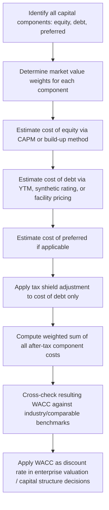

## Cost of Capital and the Weighted Average Cost of Capital

### Overview

The cost of capital is the minimum rate of return a firm must generate on its invested capital to satisfy the return expectations of all its capital providers — debt holders, equity holders, and any hybrid/mezzanine claimants. The Weighted Average Cost of Capital (WACC) blends these component costs, weighted by their proportional share of the capital structure, into a single blended hurdle rate. In capital structuring and syndication, WACC (and its component parts) is the primary discount rate used to value the enterprise, evaluate whether a proposed capital structure is value-accretive, and benchmark the pricing of individual tranches within a syndicated facility.

### Conceptual Foundation

Every capital provider bears a different risk profile and therefore demands a different required return:

- **Debt holders** hold a contractual, senior claim with fixed payments — lowest risk, lowest required return
- **Preferred/mezzanine holders** sit subordinate to debt but senior to common equity — intermediate risk and return
- **Common equity holders** hold a residual claim after all other obligations — highest risk, highest required return

WACC captures the reality that a firm is not financed by a single source of capital, and that the marginal cost of raising a dollar of new capital reflects the blended cost across the target (or current) capital structure — not the cost of whichever instrument was most recently issued.

### The WACC Formula

$$WACC = \frac{E}{V} \times r_e + \frac{D}{V} \times r_d \times (1 - T) + \frac{P}{V} \times r_p$$

Where:

- $E$ = market value of common equity
- $D$ = market value of interest-bearing debt
- $P$ = market value of preferred stock (if present)
- $V = E + D + P$ = total market value of capital
- $r_e$ = cost of common equity
- $r_d$ = pre-tax cost of debt
- $r_p$ = cost of preferred stock
- $T$ = marginal corporate tax rate

The $(1 - T)$ term applies only to the debt component and reflects the **tax shield**: interest expense is tax-deductible, so the after-tax cost of debt is lower than its stated (coupon) rate. Preferred dividends are typically paid from after-tax income and receive no equivalent shield.

**Simplified two-component form (no preferred stock):**

$$WACC = \frac{E}{V} \times r_e + \frac{D}{V} \times r_d \times (1 - T)$$

### Component 1: Cost of Equity ($r_e$)

Cost of equity is unobservable directly (unlike a bond coupon) and must be estimated. The dominant approach is the **Capital Asset Pricing Model (CAPM)**.

$$r_e = r_f + \beta \times (r_m - r_f)$$

Where:

- $r_f$ = risk-free rate (typically the yield on a long-dated government bond matching the investment horizon)
- $\beta$ = systematic risk of the equity relative to the broad market
- $(r_m - r_f)$ = equity market risk premium (EMRP), the excess return investors demand for holding market risk over the risk-free asset

**Beta estimation nuances relevant to structuring:**

- **Levered beta** ($\beta_L$) reflects the actual capital structure of the comparable company (includes financial risk from leverage)
- **Unlevered/asset beta** ($\beta_U$) strips out financial risk, isolating pure business risk — used when building a discount rate for a target with a different capital structure than its comparables (common in LBO and recapitalization structuring)

**Hamada equation** (unlevering and relevering beta):

$$\beta_U = \frac{\beta_L}{1 + (1 - T) \times \frac{D}{E}}$$

$$\beta_L = \beta_U \times \left[1 + (1 - T) \times \frac{D}{E}\right]$$

**Workflow**: unlever the betas of several comparable public companies using their respective $D/E$ ratios, average the resulting asset betas, then relever using the *target's* proposed $D/E$ ratio to obtain a beta appropriate for the specific capital structure being evaluated. This is standard practice when the subject company doesn't have a reliable standalone traded beta, such as in private LBO or project finance structuring.

**Build-up method (alternative for private/illiquid companies):**

$$r_e = r_f + EMRP + Size\ Premium + Company\text{-}Specific\ Risk\ Premium$$

Used when no clean set of public comparables exists, common in middle-market syndication contexts. [Inference: the magnitude of size and specific-risk premiums is a matter of appraiser/practitioner judgment rather than a standardized formula.]

### Component 2: Cost of Debt ($r_d$)

Cost of debt represents the effective interest rate the firm pays on its interest-bearing obligations, before the tax adjustment.

**Method 1 — Yield to Maturity (YTM) on existing traded debt:**

If the firm has publicly traded bonds, the YTM (solved via the same iterative PV-based approach as IRR) is the most direct market-based estimate of current cost of debt.

**Method 2 — Synthetic credit rating approach** (common for private/unrated borrowers, standard in syndication):

1. Calculate an interest coverage ratio (e.g., EBIT / Interest Expense)
2. Map the ratio to an implied synthetic credit rating using a ratings-to-coverage table
3. Apply the credit spread typically associated with that rating over the risk-free rate

$$r_d = r_f + Credit\ Spread_{(synthetic\ rating)}$$

**Method 3 — Weighted average of existing facility pricing:**

For firms with multiple debt tranches (term loan, revolver, notes), calculate a principal-weighted average of stated coupon/margin rates across the tranches — often the most practical approach in an active syndication where actual facility pricing is known.

**After-tax cost of debt:**

$$r_{d,after\text{-}tax} = r_d \times (1 - T)$$

**Example:**

A borrower's Term Loan B is priced at SOFR + 400bps, with SOFR at 4.30%, giving a stated $r_d$ of 8.30%. At a marginal tax rate of 25%:

$$r_{d,after\text{-}tax} = 0.0830 \times (1 - 0.25) = 6.225\%$$

### Component 3: Cost of Preferred Stock ($r_p$)

For non-convertible, perpetual preferred stock with a fixed dividend, cost of preferred is calculated using the perpetuity formula:

$$r_p = \frac{D_p}{P_0}$$

Where $D_p$ is the annual preferred dividend and $P_0$ is the current market price (or issuance price) of the preferred share. No tax adjustment is applied since preferred dividends are paid from after-tax earnings.

**Example:**

Preferred stock with an $8.00 annual dividend, issued at $100 per share:

$$r_p = \frac{8.00}{100.00} = 8.00\%$$

For convertible or participating preferred (common in mezzanine/structured syndication tranches), the effective cost must incorporate the value of the conversion option or participation feature, typically via an option-pricing or scenario-weighted approach. [Inference: exact treatment of convertible features varies by deal structure and is negotiated case-by-case.]

### Determining Capital Structure Weights

Weights must use **market values**, not book values, since WACC is a forward-looking discount rate reflecting current economic claims on the firm.

- **Equity weight**: market capitalization (public) or negotiated/implied equity value (private)
- **Debt weight**: market value of debt if traded; face/par value is an acceptable proxy for debt trading near par [Inference: acceptability of the par-value proxy depends on how far the instrument trades from par and the precision required by the analysis]

**Target vs. current capital structure**: In structuring new syndicated facilities, analysts often use a **target capital structure** (the intended post-transaction leverage profile) rather than the pre-transaction structure, since WACC should reflect the capital structure the cash flows will actually be discounted under going forward — critical in LBO, recapitalization, and refinancing contexts.

### Worked WACC Calculation

**Scenario**: A borrower is structuring a syndicated facility with the following post-transaction target structure:

| Component | Market Value ($MM) | Weight | Cost (pre-tax where applicable) |
| --- | --- | --- | --- |
| Common Equity | 300 | 50.0% | $r_e$ = 14.2% |
| Preferred Stock | 60 | 10.0% | $r_p$ = 9.0% |
| Senior Term Debt | 240 | 40.0% | $r_d$ = 8.3% |
| **Total ($V$)** | **600** | **100%** |  |

Assume marginal tax rate $T = 25\%$.

**Step 1 — After-tax cost of debt:**

$$r_{d,after\text{-}tax} = 8.3\% \times (1 - 0.25) = 6.225\%$$

**Step 2 — Weighted contribution of each component:**

$$WACC = (0.50 \times 14.2\%) + (0.10 \times 9.0\%) + (0.40 \times 6.225\%)$$

$$WACC = 7.10\% + 0.90\% + 2.49\% = 10.49\%$$

This 10.49% blended rate becomes the discount rate applied to the firm's unlevered free cash flows when valuing the enterprise, and serves as the benchmark hurdle against which individual tranche pricing (senior, mezzanine, preferred) is checked for internal consistency — i.e., each tranche's return should reflect its position in the risk hierarchy relative to this blended figure.

### WACC Calculation Flow

### The Marginal Cost of Capital and the U-Shaped WACC Curve

A central insight for capital structuring is that WACC is **not static** with respect to leverage — it typically traces a U-shaped (or gently U-shaped) curve as leverage increases:

- At low leverage, adding debt lowers WACC because debt is cheaper than equity and carries a tax shield
- Beyond an optimal point, additional leverage raises both $r_d$ (credit spread widens as default risk increases) and $r_e$ (equity holders demand higher returns to compensate for increased financial risk/volatility), causing WACC to rise
- The theoretical minimum of this curve represents the **optimal capital structure** — the leverage level that minimizes the firm's blended cost of capital and, correspondingly, maximizes enterprise value for a given set of cash flows

This dynamic is the analytical basis for "right-sizing" leverage in a syndicated transaction — pushing debt capacity to capture the tax shield and lower blended cost, while avoiding the point where incremental credit spread and equity risk premium erode the benefit.

### WACC vs. Optimal Leverage (SVG Diagram)

WACC and Component Costs vs. Leverage Ratio (svg_diagram)

<svg xmlns="http://www.w3.org/2000/svg" viewBox="0 0 640 380">
<text x="320" y="28" text-anchor="middle" font-size="16" font-weight="bold" fill="#1a1a1a">WACC and Component Costs vs. Leverage Ratio (svg_diagram)</text>
<line x1="110" y1="330" x2="580" y2="330" stroke="#333" stroke-width="1.5" />
<line x1="110" y1="330" x2="110" y2="60" stroke="#333" stroke-width="1.5" />

<text x="345" y="365" text-anchor="middle" font-size="13" fill="#333">Debt / Total Capital (D/V) →</text>

<text x="35" y="195" text-anchor="middle" font-size="13" fill="#333" transform="rotate(-90 35 195)">Cost of Capital (%) →</text>

<text x="160" y="345" text-anchor="middle" font-size="11" fill="#555">0%</text>

<text x="270" y="345" text-anchor="middle" font-size="11" fill="#555">25%</text>

<text x="380" y="345" text-anchor="middle" font-size="11" fill="#555">50%</text>

<text x="490" y="345" text-anchor="middle" font-size="11" fill="#555">75%</text>

<path d="M 160,180 C 260,175 350,150 490,90" fill="none" stroke="#b2182b" stroke-width="2.5" />

<path d="M 160,290 C 260,288 350,280 490,230" fill="none" stroke="#2166ac" stroke-width="2.5" />

<path d="M 160,220 C 230,205 300,198 350,200 C 420,205 470,225 490,250" fill="none" stroke="#1a1a1a" stroke-width="3" />

<circle cx="350" cy="200" r="5" fill="#5aae61" />
<text x="350" y="185" text-anchor="middle" font-size="11" fill="#2e7d32" font-weight="bold">Optimal D/V</text>
<rect x="440" y="65" width="14" height="4" fill="#b2182b" />
<text x="460" y="72" font-size="11" fill="#333">Cost of Equity</text>
<rect x="440" y="82" width="14" height="4" fill="#2166ac" />
<text x="460" y="89" font-size="11" fill="#333">Cost of Debt</text>
<rect x="440" y="99" width="14" height="4" fill="#1a1a1a" />
<text x="460" y="106" font-size="11" fill="#333">WACC</text>

<text x="345" y="375" text-anchor="middle" font-size="10" fill="#777">Illustrative curvature only — actual shape is firm- and market-specific</text>

</svg>

### WACC's Role in Capital Structuring and Syndication

**Key Points**

- **Enterprise valuation anchor**: WACC discounts unlevered free cash flows to determine enterprise value, which in turn determines total debt capacity and equity check size
- **Tranche pricing consistency check**: individual tranche return requirements should be internally consistent with their position relative to the blended WACC — a senior secured tranche priced *above* the firm's blended WACC would be anomalous absent unusual risk factors
- **Investment/deal screening hurdle**: WACC (or a project-specific variant) serves as the minimum acceptable return threshold — NPV-positive decisions require project/deal IRR to exceed WACC
- **Refinancing and recapitalization analysis**: comparing current WACC to a proposed post-refinancing WACC quantifies whether a capital structure change is value-accretive
- **Syndicate return benchmarking**: lead arrangers use WACC-derived hurdle rates to assess whether proposed syndicate pricing will clear investor return requirements at each level of the capital stack

### Common Adjustments and Practical Considerations

- **Multi-business/divisional WACC**: conglomerates or multi-segment borrowers may require segment-specific discount rates using segment-specific comparable betas, rather than a single blended corporate WACC, when cash flows being valued relate to a specific division or asset class
- **Country/currency risk premium**: cross-border syndications add a country risk premium (often proxied by sovereign credit default swap spreads or sovereign bond yield differentials) to the cost of equity when cash flows originate in a market with elevated political/economic risk
- **Circularity in target-capital-structure WACC**: since equity value depends on WACC (via DCF) and WACC depends on the equity/debt weights (which depend on equity value), models often solve iteratively or use enabled circularity switches; some practitioners instead use a fixed target leverage ratio to avoid the circular reference entirely
- **Private company illiquidity discount**: cost of equity for private/illiquid equity stakes is sometimes increased by a discount for lack of marketability (DLOM), reflected either in the discount rate or applied directly to the resulting equity value [Inference: whether the adjustment is embedded in the rate or applied post-valuation is a matter of methodology choice, not a fixed rule]

### Practical Pitfalls

- Using book value weights instead of market value weights, which systematically misstates the true blended cost when debt and equity trade materially away from book/par
- Applying a single company-wide WACC to value projects or divisions with materially different risk profiles than the overall firm
- Forgetting to unlever and relever beta when the target's capital structure differs meaningfully from that of the comparable companies used to estimate beta
- Mismatching the tax rate used in the debt tax shield with the tax rate actually applicable to the borrower (e.g., ignoring NOL carryforwards, non-U.S. statutory rates, or tax shield limitations under interest deductibility caps)
- Ignoring the circularity between capital structure and enterprise value in models that iterate market-value weights without proper convergence controls

**Next Steps**

- Time Value of Money and Discounted Cash Flow Fundamentals
- Capital Asset Pricing Model (CAPM) and Beta Estimation in Depth
- Capital Structure Theory: Modigliani-Miller Propositions and the Trade-Off Theory
- Credit Rating Methodologies and Synthetic Rating Construction
- Leverage Ratios and Debt Capacity Analysis
- Optimal Capital Structure and the Cost of Financial Distress
- Mezzanine and Preferred Capital Structuring
- Cross-Border Capital Structuring and Country Risk Premiums