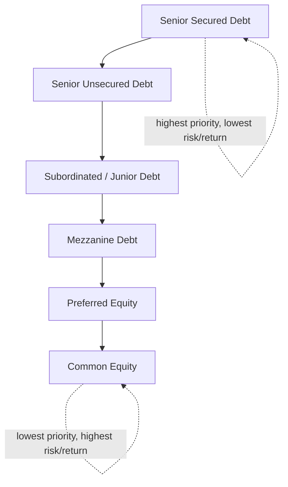
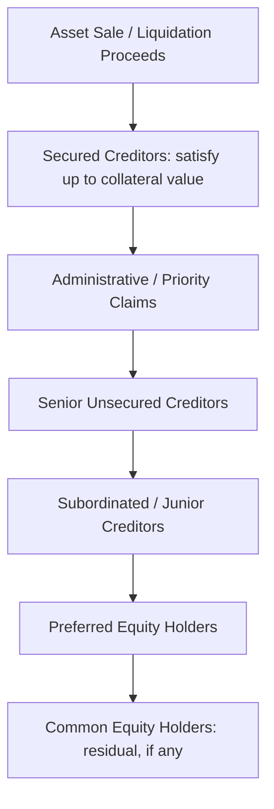

## Balance Sheet Anatomy: Debt, Equity, and Hybrid Claims

### Overview

The balance sheet's right-hand side (liabilities and equity) represents the complete map of claims against a firm's assets — the capital structure itself. For capital structuring and syndication professionals, understanding the anatomy of these claims is foundational: every negotiation over pricing, collateral, covenants, and payment priority is fundamentally a negotiation over where a new instrument sits within this claim hierarchy. This item catalogs the major claim classes — debt, equity, and hybrid instruments — and the structural features that determine their relative risk and priority.

### The Capital Structure Hierarchy

Claims against a firm's assets and cash flows are ranked by **priority of payment** (who gets paid first in a distress/liquidation scenario) and **seniority in the capital stack**. From highest to lowest priority:

This hierarchy is not merely descriptive — it is the operative framework a syndicate uses to structure a facility: each new tranche is priced and structured relative to its position in this stack, and intercreditor agreements formalize the payment priority contractually.

### Debt Claims

Debt represents a contractual obligation to repay principal plus interest according to fixed terms, and holds no ownership stake in the firm.

**Core characteristics:**

- Fixed or floating contractual payment obligations (principal + interest)
- Defined maturity date
- Payment priority ahead of all equity classes
- Interest expense is tax-deductible (creates the debt tax shield)
- No voting rights or governance participation in ordinary course, but covenants create indirect control rights
- Holders have legal remedies (acceleration, foreclosure) upon default

**Major debt subcategories:**

**Senior Secured Debt**

- Backed by a perfected security interest (lien) over specific collateral (assets, receivables, equity of subsidiaries)
- Typically the first-priority claim in a liquidation or restructuring
- Common instruments: revolving credit facilities (RCF), Term Loan A, Term Loan B, asset-based lending (ABL) facilities
- Often includes maintenance covenants (tested quarterly regardless of activity) in addition to incurrence covenants

**Senior Unsecured Debt**

- Contractual priority equal to senior secured debt in terms of *ranking order* among unsecured claims, but structurally subordinated to secured claims with respect to the specific collateral securing those claims
- Common instruments: senior unsecured notes/bonds
- Typically carries incurrence-only covenants (tested only upon a triggering action, e.g., issuing more debt)

**Subordinated/Junior Debt**

- Contractually subordinated to senior debt via subordination provisions in the indenture or credit agreement
- Higher coupon to compensate for lower priority
- Common instruments: subordinated notes, second lien term loans (structurally between senior and true subordinated debt — secured but junior-priority lien)

**Second Lien Debt** (a hybrid position within debt)

- Secured by the same collateral pool as senior secured debt, but with a junior-priority lien established through an intercreditor agreement
- Sits contractually between senior secured and unsecured/subordinated debt

### Equity Claims

Equity represents an ownership interest in the firm with a residual claim on assets and cash flows after all debt and preferred obligations are satisfied.

**Core characteristics:**

- No contractual obligation for the firm to pay dividends or return capital
- Residual claim: paid only after all creditors are satisfied in liquidation
- Typically carries voting rights and governance participation (board representation, approval rights)
- Unlimited upside potential, but also full downside exposure (can go to zero)
- Not tax-deductible: dividends are paid from after-tax income

**Major equity subcategories:**

**Common Equity**

- Most junior claim in the capital structure
- Standard voting rights (typically one vote per share, though dual-class structures exist)
- Receives value only after all debt, preferred, and other senior claims are fully satisfied

**Preferred Equity** (bridges debt and equity — discussed further under Hybrid Claims below, given its dual characteristics)

### Hybrid Claims

Hybrid instruments combine debt-like and equity-like features, and are especially significant in structured/syndicated finance because they allow issuers and investors to customize risk-return and priority profiles precisely.

**Preferred Stock**

- Fixed dividend (like debt) but dividends are discretionary and can be deferred without triggering default (like equity)
- Senior to common equity, subordinate to all debt, in both dividend priority and liquidation priority
- **Cumulative preferred**: unpaid dividends accrue and must be paid before any common dividend is paid
- **Non-cumulative preferred**: unpaid dividends are simply forfeited, not carried forward
- **Participating preferred**: entitled to its stated preference *plus* a pro-rata share of remaining distributions alongside common equity — common in growth-equity and late-stage private structuring
- **Convertible preferred**: holder has the option to convert into common shares at a specified ratio, capturing equity upside while retaining downside protection until conversion

**Convertible Debt**

- Structured as debt (fixed coupon, maturity, seniority) but includes an embedded option to convert into common equity at a specified conversion price
- Allows issuers to achieve a lower coupon than straight debt, in exchange for giving investors equity upside
- Common in growth-company financing and as a syndication tool when senior lenders want partial equity-like upside participation

**Mezzanine Debt**

- Subordinated debt frequently combined with equity-like features (warrants, PIK toggles, equity kickers)
- Sits between senior/second lien debt and preferred/common equity in priority
- **PIK (Payment-in-Kind) toggle**: allows the borrower to pay interest in additional debt principal rather than cash, common in mezzanine structures to preserve cash flow for senior debt service
- Frequently used to fill the "gap" between what senior lenders will underwrite and the equity check size a sponsor wants to commit in an LBO

**Warrants and Equity Kickers**

- Attached to debt or preferred instruments to provide additional upside participation without directly increasing the coupon rate
- Give the holder the right (not obligation) to purchase common equity at a fixed strike price within a specified window
- Used by mezzanine and subordinated lenders to enhance blended returns without inflating the cash-pay coupon (which could strain the borrower's near-term liquidity)

**Trust Preferred Securities (TruPS)** and **Hybrid Capital Instruments** (bank/insurance regulatory capital)

- Structured to qualify as regulatory capital (e.g., Tier 1/Tier 2 capital under Basel frameworks) while retaining tax-deductible interest treatment for the issuer in some structures
- Highly specialized instruments primarily relevant in financial-institution capital structuring rather than general corporate syndication [Inference: specific regulatory qualification criteria are jurisdiction- and framework-dependent and subject to ongoing regulatory revision]

### Comparative Feature Matrix

| Feature | Senior Secured Debt | Subordinated Debt | Preferred Equity | Common Equity |
| --- | --- | --- | --- | --- |
| Payment priority | Highest | Above equity, below senior | Above common, below all debt | Lowest (residual) |
| Collateral/security | Yes (liened) | Typically unsecured | Unsecured | Unsecured |
| Payment obligation | Contractual, mandatory | Contractual, mandatory | Discretionary (often cumulative) | Fully discretionary |
| Tax treatment of payments | Deductible (interest) | Deductible (interest) | Not deductible (dividend) | Not deductible (dividend) |
| Maturity | Fixed | Fixed | Often perpetual | None |
| Voting/governance rights | Covenant-based control only | Covenant-based control only | Limited, often contingent | Full (standard) |
| Upside participation | None (fixed return) | None, unless convertible | Limited, unless participating/convertible | Unlimited |
| Typical required return | Lowest | Moderate | Moderate-high | Highest |

### Intercreditor Agreements and Payment Waterfall Mechanics

When multiple debt tranches with different priority levels coexist, an **intercreditor agreement (ICA)** governs the relative rights of each creditor class, including:

- **Lien subordination**: establishes which lienholder's claim on collateral is satisfied first
- **Payment subordination (payment blockage/standstill provisions)**: restricts payments to junior creditors during a senior default or payment default
- **Turnover provisions**: require a junior creditor who mistakenly receives a payment during a blockage period to remit it to the senior creditor
- **Enforcement rights**: typically grant the senior secured lender (or "controlling creditor," often defined by outstanding principal thresholds) primary control over enforcement actions against shared collateral, subject to standstill periods for junior lienholders

**Liquidation/distress waterfall** (simplified, illustrating priority of proceeds distribution):

At each stage, if proceeds are exhausted before a class is fully satisfied, that class receives a pro-rata partial recovery and all junior classes receive nothing — the fundamental logic underlying recovery-rate analysis in syndicated credit risk assessment.

### Off-Balance-Sheet and Contingent Claims

Capital structuring analysis must also account for claims that may not appear as traditional line items but affect the true risk profile of the capital stack:

- **Operating lease obligations**: under modern lease accounting standards (e.g., ASC 842, IFRS 16), most leases are now capitalized on the balance sheet as right-of-use assets and lease liabilities, but analysts should still verify treatment consistency across comparables when calculating leverage ratios [Inference: comparability adjustments needed depend on the specific accounting standard and jurisdiction applicable to the entity under review]
- **Pension and post-retirement obligations**: unfunded pension liabilities represent a quasi-debt claim that can be structurally senior or pari passu with unsecured debt depending on jurisdiction
- **Guarantees and contingent liabilities**: parent/subsidiary guarantees, letters of credit, and surety bonds represent contingent claims that can materially affect recovery analysis in a syndicated structure
- **Minority interest (non-controlling interest)**: represents third-party ownership claims in consolidated subsidiaries, relevant when bridging enterprise value to equity value in structuring analysis

### Structural Subordination vs. Contractual Subordination

A distinction critical to syndication structuring:

- **Contractual subordination**: created explicitly by agreement (e.g., a subordinated note indenture stating the debt is junior to senior credit facility obligations)
- **Structural subordination**: arises from corporate organization rather than explicit agreement — debt issued at a holding company level is effectively subordinated to all debt and liabilities at operating subsidiaries, because holdco creditors only have a claim on equity value flowing up from the subsidiaries, after subsidiary-level creditors are paid

This is why syndicated structures frequently require **upstream guarantees** from operating subsidiaries to noteholders/lenders at the parent level — to eliminate or reduce structural subordination and align the lender's claim more closely with the operating assets generating cash flow.

### Practical Application to Syndication Structuring

**Key Points**

- **Tranche design**: understanding claim anatomy allows structurers to design a capital stack that matches investor risk appetites at each layer — de-risked senior tranches for risk-averse syndicate members, higher-yielding mezzanine/preferred tranches for return-seeking investors
- **Collateral allocation**: security package design (first lien vs. second lien vs. unsecured) directly determines expected recovery rates and therefore appropriate pricing at each tranche
- **Covenant negotiation**: the relative priority of a claim informs how much covenant protection that class can reasonably negotiate — senior secured lenders typically obtain the most restrictive covenant packages given their capital-at-risk position
- **Rating agency analysis**: credit rating agencies explicitly model this priority hierarchy (notching methodology) to assign different ratings to different tranches of the same issuer based on relative position in the capital structure
- **Fulcrum security identification**: in distressed/restructuring contexts, identifying which claim class is the "fulcrum security" (the most senior class that will not be paid in full, and therefore receives the reorganized equity) is central to structuring negotiations and workout strategy

### Practical Pitfalls

- Treating all "debt" as homogeneous without distinguishing secured/unsecured/subordinated priority, which materially misstates recovery expectations and appropriate pricing
- Overlooking structural subordination when a holding company issues debt without adequate operating-subsidiary guarantees
- Ignoring PIK toggle features when calculating current cash-pay debt service coverage, since PIK interest accrues to principal rather than requiring cash payment
- Failing to model contingent/off-balance-sheet claims (guarantees, unfunded pensions, capitalized leases) when assessing true leverage and priority stack
- Miscounting convertible instruments in fully diluted share calculations or underweighting their equity-upside cost when assessing blended cost of capital

**Next Steps**

- Cost of Capital and the Weighted Average Cost of Capital
- Leverage Ratios and Credit Metrics in Capital Structuring
- Intercreditor Agreements and Lien Subordination Mechanics
- Mezzanine Financing Structures and PIK Toggle Design
- Covenant Design: Maintenance vs. Incurrence Covenants
- Fulcrum Security Analysis in Restructuring Contexts
- Structural Subordination and Guarantee Structures in Holdco/Opco Financings
- Rating Agency Notching Methodology Across Capital Structure Tranches