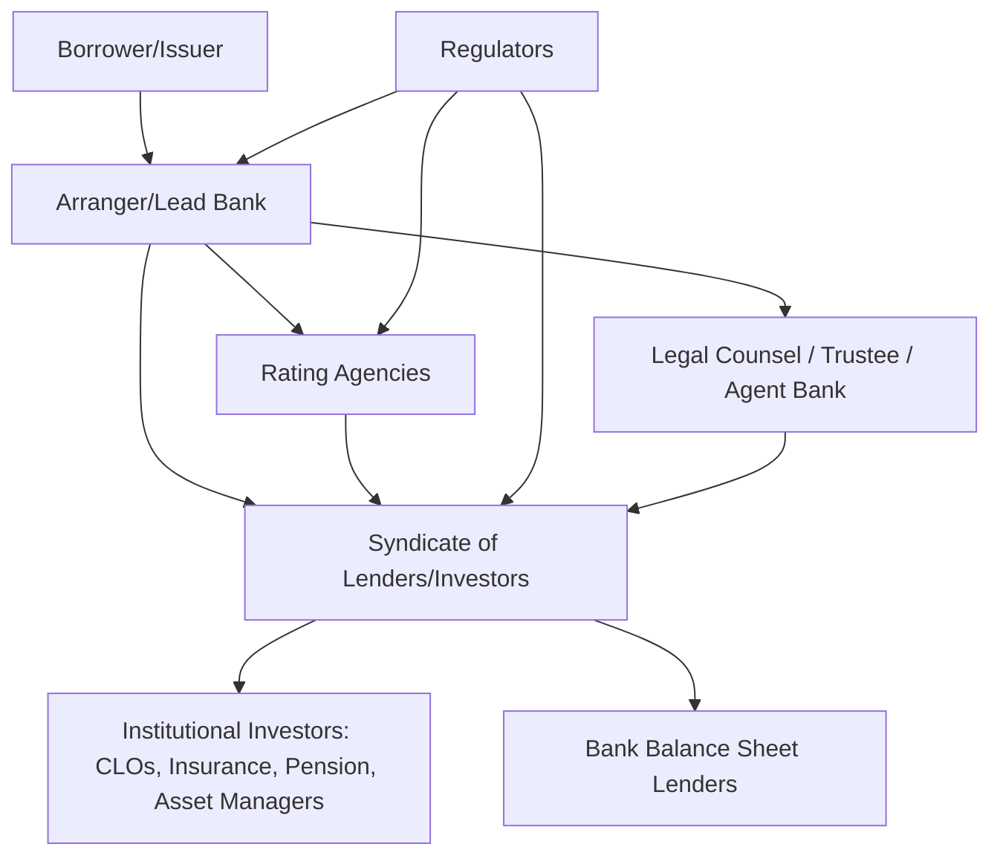
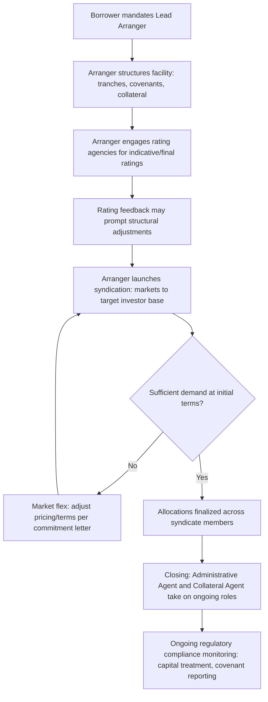

## Capital Markets Ecosystem: Banks, Institutional Investors, Rating Agencies, and Regulators

### Overview

Capital structuring and syndication does not occur in a vacuum — every transaction is shaped by the interlocking roles of commercial and investment banks, institutional investors who ultimately hold syndicated paper, rating agencies who assess and communicate credit risk, and regulators who constrain how capital can be raised, sold, and held. Understanding each participant's role, incentives, and constraints is essential to designing a structure that will actually clear the market and close.

### Ecosystem Map

### Banks and Their Roles

**Commercial Banks**

- Provide traditional balance-sheet lending: revolving credit facilities, term loans, letters of credit
- Hold loans on their own balance sheet (in whole or in part) subject to regulatory capital requirements
- Often act as the **administrative agent** in a syndicated facility, managing day-to-day relationship functions (covenant compliance monitoring, payment processing, waiver/amendment coordination)

**Investment Banks / Arrangers**

- Structure and underwrite the transaction, determining tranche sizing, pricing, covenant package, and collateral structure
- Act as **lead arranger** or **bookrunner**, responsible for marketing the deal to the syndicate and building the order book
- May provide a **bridge commitment** (a fully underwritten short-term facility) to guarantee funding certainty to the borrower while the syndication process is completed, then work to "flex" pricing/terms to clear the market and be taken out by permanent syndicated debt
- Earn arrangement, underwriting, and agency fees, distinct from the interest income earned by balance-sheet lenders

**Roles within an Arranger Group:**

| Role | Function |
| --- | --- |
| Lead Arranger / Bookrunner | Structures the deal, leads marketing, builds the syndicate order book |
| Joint Lead Arranger | Shares structuring/underwriting responsibility with the lead |
| Co-Manager | Smaller marketing/distribution role, minimal structuring input |
| Administrative Agent | Post-closing operational point of contact for the syndicate |
| Collateral Agent | Holds and administers the security interest on behalf of secured lenders |

**Market flex provisions**: a mechanism in underwritten commitment letters allowing the arranger to adjust pricing, terms, or structure (within pre-agreed parameters) if initial syndication demand is insufficient at the originally proposed terms — a critical risk-transfer mechanism that shifts market risk from the arranger back toward pricing adjustment rather than failed syndication.

### Institutional Investors

Institutional investors are the ultimate holders of syndicated debt and equity instruments, and their differing mandates, risk tolerances, and regulatory constraints directly shape what structures the market will absorb.

**Collateralized Loan Obligations (CLOs)**

- Structured vehicles that pool leveraged loans and issue tranched securities against that pool, with equity/mezzanine tranches absorbing first losses and senior tranches receiving priority payment
- Among the largest buyers of institutional term loans (Term Loan B) in the leveraged finance market
- Subject to portfolio concentration limits, weighted average rating factor (WARF) tests, and other structural tests embedded in their governing indentures, which constrain what loans a CLO manager can purchase [Inference: specific test thresholds vary by CLO vintage and indenture terms]

**Insurance Companies**

- Generally seek longer-duration, higher-quality, investment-grade or upper-tier leveraged credit to match long-dated policyholder liabilities
- Subject to risk-based capital (RBC) charges that penalize lower-rated holdings more heavily, making credit rating a direct driver of portfolio construction and appetite

**Pension Funds**

- Similarly liability-driven, often allocating to private credit, direct lending, and syndicated leveraged loans as part of a diversified fixed income/alternatives allocation
- Governed by fiduciary duty standards and often subject to internal investment policy statement (IPS) constraints on credit quality and concentration

**Asset Managers / Mutual Funds / Loan Participation Funds**

- Actively trade in the secondary leveraged loan and high-yield bond markets
- Provide liquidity but can also create redemption-driven selling pressure during market stress, affecting secondary pricing that in turn influences new-issue pricing benchmarks

**Business Development Companies (BDCs) and Direct Lenders**

- Provide privately negotiated, non-syndicated (or lightly syndicated/"club") credit, particularly to middle-market borrowers
- Increasingly compete with traditional syndicated bank/institutional markets for the same borrower base, especially in the upper middle market, creating pricing and structural competition relevant to arranger structuring decisions [Inference: the degree of competitive overlap between direct lending and broadly syndicated markets fluctuates with credit cycle conditions]

**Hedge Funds and Distressed/Opportunistic Funds**

- Participate across the capital structure, often concentrating in stressed or distressed tranches, or providing rescue/DIP financing in restructuring contexts
- May take activist positions to influence restructuring outcomes, particularly around identifying and acquiring the fulcrum security

### Rating Agencies

**Core Function**: assign independent credit opinions (ratings) that communicate relative default risk and expected loss severity to investors who often lack the resources to independently underwrite every credit.

**Major agencies**: Moody's, S&P Global Ratings, Fitch Ratings — the "Big Three," though other agencies (e.g., DBRS Morningstar, KBRA) are also active in certain segments.

**Rating scale structure (illustrative, S&P convention):**

| Category | Ratings | General Description |
| --- | --- | --- |
| Investment Grade | AAA to BBB- | Strong to adequate capacity to meet obligations |
| Speculative Grade (High Yield) | BB+ to CCC | Increasing vulnerability to adverse conditions |
| Default/Near-Default | CC, C, D | Highly vulnerable to or currently in default |

**Notching methodology**: rating agencies assign different ratings to different debt instruments issued by the *same* entity, based on the instrument's relative position in the capital structure and expected recovery in a default scenario. A senior secured facility typically receives a notch (or more) above the issuer's corporate family/issuer rating, while subordinated or unsecured instruments are notched below it — directly operationalizing the priority-of-claims concepts central to capital structuring.

**Key rating agency data points used in structuring:**

- **Issuer/Corporate Family Rating (CFR)**: overall assessment of the borrower's capacity to meet all financial obligations
- **Instrument-specific rating**: reflects the notched view for a specific tranche given its collateral/priority position
- **Recovery rating**: an estimate of expected recovery in a default scenario, often expressed as a percentage of principal or a recovery rating scale
- **Outlook (Positive/Stable/Negative)**: forward-looking indicator of potential rating direction

**Relevance to structuring**: rating agency feedback (often solicited pre-launch via a "ratings advisory" process) directly informs structuring decisions — collateral packages, subordination levels, and covenant flexibility are frequently adjusted specifically to achieve a target rating that unlocks a broader or cheaper investor base (e.g., insurance companies constrained to investment-grade paper).

### Regulators

Regulatory frameworks constrain both the supply side (what banks can originate and hold) and demand side (what institutional investors can purchase) of the capital markets ecosystem.

**Bank Capital and Prudential Regulation**

- **Basel III/IV framework** (implemented via national regulators): sets risk-weighted capital requirements for banks, directly affecting the economics of banks holding leveraged loans and other credit exposures on balance sheet, which in turn influences banks' appetite to hold vs. distribute syndicated paper
- **Leveraged lending guidance** (e.g., interagency guidance in the U.S. from the Federal Reserve, OCC, and FDIC): historically established supervisory expectations around leverage multiples and underwriting standards for leveraged transactions, influencing how aggressively regulated banks can structure and hold highly leveraged credits [Unverified: the precise current enforcement posture and specific numerical thresholds of such guidance are subject to periodic regulatory revision and should be verified against current regulatory publications rather than assumed static]

**Securities Regulation**

- Governs disclosure requirements, offering exemptions (e.g., private placement exemptions under Regulation D or equivalent frameworks in other jurisdictions), and ongoing reporting obligations for issuers accessing public or quasi-public capital markets
- Directly shapes whether a transaction is structured as a registered public offering, a Rule 144A private placement, or a fully private club/bilateral deal — a foundational structuring decision affecting marketing process, disclosure burden, and investor eligibility

**Risk Retention Rules**

- Require sponsors of certain securitized products (including some CLOs, depending on jurisdiction and structure) to retain an economic interest in the underlying exposures, aligning originator incentives with those of investors [Inference: applicability and specific retention percentages vary significantly by jurisdiction, product type, and current regulatory framework, and should be confirmed against current rules for the specific structure contemplated]

**Insurance and Pension Regulators**

- Set risk-based capital charge frameworks and investment eligibility rules (e.g., NAIC designations in the U.S. insurance context) that determine which rated tranches specific classes of institutional investors are permitted or capital-incentivized to hold — directly linking rating agency output to the addressable institutional investor base for a given tranche

**Central Banks and Monetary Policy**

- Set the risk-free rate benchmarks (policy rates, and reference rates like SOFR that have succeeded LIBOR) that anchor floating-rate loan pricing and discount rate construction throughout capital structuring analysis
- Market liquidity conditions driven by monetary policy stance directly affect syndication execution risk and the pricing flex arrangers may need to exercise to clear a deal

### How the Ecosystem Interacts in a Live Syndication

### Practical Application to Structuring Decisions

**Key Points**

- **Investor base targeting**: the choice of tranche structure (institutional Term Loan B vs. pro-rata bank facility vs. high-yield bond) is driven substantially by which investor class (CLOs, banks, insurance companies, retail-facing funds) the arranger intends to target, since each has different structural and rating preferences
- **Rating-driven structuring**: achieving a specific target rating (e.g., securing investment-grade status for a senior tranche to access insurance company demand) can justify additional collateral, tighter covenants, or lower leverage than a pure cash-flow-based analysis alone would suggest
- **Regulatory capital arbitrage considerations**: bank balance sheet capacity and appetite for a given exposure is directly affected by the risk-weighting that exposure carries under prevailing capital rules, which can make certain structures (e.g., asset-backed vs. cash-flow lending) more or less attractive to bank lenders specifically
- **Market conditions and flex risk**: an arranger's underwriting risk is directly tied to prevailing institutional investor demand conditions at the time of launch; deals launched during periods of retrenchment among key buyer classes (e.g., CLO formation slowdown) carry materially higher flex/execution risk

### Practical Pitfalls

- Assuming all "institutional lenders" have homogeneous mandates and risk appetites, when in fact CLOs, insurers, pensions, and direct lenders each operate under materially different constraints
- Underestimating the influence of rating agency notching on structuring decisions, particularly when a specific tranche's marketability depends on achieving a rating threshold
- Failing to account for market flex provisions when assessing an arranger's true underwriting exposure in a bridge/backstop commitment
- Overlooking how regulatory capital treatment at bank lenders can shift appetite and pricing for a given facility type independent of the borrower's underlying credit quality
- Ignoring the feedback loop between secondary market trading levels (driven by institutional investor sentiment) and new-issue pricing benchmarks in a syndication process

**Next Steps**

- Syndication Process Mechanics: Bookbuilding, Allocation, and Market Flex
- Collateralized Loan Obligations (CLO) Structure and Investment Criteria
- Rating Agency Methodologies and Notching in Depth
- Bank Regulatory Capital Frameworks (Basel III/IV) and Their Impact on Loan Pricing
- Private Placements vs. Registered Offerings: Structuring Implications
- Direct Lending and BDC Competition with Broadly Syndicated Markets
- Secondary Market Trading Dynamics for Leveraged Loans and High-Yield Bonds
- Distressed Debt Investing and Fulcrum Security Identification