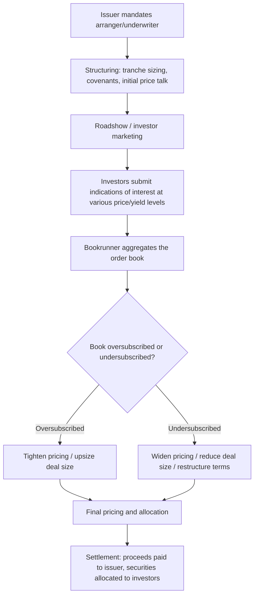

## Primary versus Secondary Capital Markets

### Overview

The distinction between primary and secondary capital markets is foundational to understanding how capital is raised, priced, and subsequently traded. The **primary market** is where new securities (debt or equity) are originated and sold directly by the issuer to investors for the first time, generating actual proceeds for the issuer. The **secondary market** is where previously issued securities are subsequently traded among investors, with no proceeds flowing to the original issuer. For capital structuring and syndication professionals, this distinction shapes everything from new-issue pricing benchmarks to liquidity assumptions to the ongoing monitoring of credit performance post-close.

### Primary Market Mechanics

**Definition and Function**: the primary market is the venue (in a practical, not always physical, sense) through which an issuer raises new capital by selling securities directly to initial investors, whether through a syndicated bank loan, a bond offering, an IPO, or a follow-on equity issuance.

**Key characteristics:**

- Proceeds flow directly to the issuer (net of fees)
- Pricing is typically set through a structured process: bookbuilding, price talk, and final pricing based on investor demand
- New-issue pricing frequently incorporates a **new-issue concession** — pricing modestly cheaper than where comparable outstanding securities trade in the secondary market, to compensate investors for taking on a new, unseasoned position and to ensure sufficient demand for a successful syndication
- Involves intensive due diligence, documentation (credit agreements, indentures, offering memoranda/prospectuses), and often rating agency engagement prior to launch

**Primary market origination channels relevant to capital structuring:**

| Channel | Typical Use Case |
| --- | --- |
| Syndicated bank loan (Term Loan A/B, RCF) | Leveraged buyouts, refinancings, general corporate purposes |
| High-yield bond offering | Sub-investment-grade issuers seeking fixed-rate, less restrictive-covenant financing |
| Investment-grade bond offering | Established issuers accessing broad institutional debt demand |
| Private placement (e.g., Rule 144A, Reg D-equivalent) | Issuers seeking reduced disclosure burden or targeting a narrower institutional base |
| IPO / follow-on equity offering | Public equity capital raising |
| Rights offering | Existing shareholders offered pro-rata right to purchase new shares, often at a discount |

**The Bookbuilding Process** (core primary market mechanic in syndicated debt and equity offerings):

**New-issue pricing determinants:**

- Prevailing yields/spreads on comparable outstanding (secondary market) securities of similar credit quality and tenor
- Current market technicals (supply/demand imbalances, fund flows into or out of the relevant asset class)
- Issuer-specific credit factors (leverage, coverage ratios, industry outlook)
- Deal-specific structural factors (collateral package, covenant flexibility, use of proceeds)

### Secondary Market Mechanics

**Definition and Function**: the secondary market is where investors buy and sell previously issued securities among themselves. No new capital reaches the issuer; the transaction simply transfers ownership of an existing claim from one investor to another.

**Key characteristics:**

- Provides **liquidity** to initial investors, allowing them to exit or resize positions without waiting for maturity
- Establishes an observable, continuously updated **market price/yield**, which becomes the primary benchmark for pricing new primary issuance of similar credits
- Trading can occur via organized exchanges (for public equities and some listed bonds) or, more commonly for leveraged loans and many corporate bonds, via **over-the-counter (OTC)** dealer-to-dealer and dealer-to-investor markets
- Secondary market price movements are a real-time signal of changing credit perception, directly relevant to covenant/amendment negotiations and refinancing timing decisions

**Secondary market venues relevant to credit/leveraged finance:**

- **OTC dealer markets**: the dominant venue for syndicated leveraged loan trading; dealers (often the same banks active as arrangers) make markets by quoting bid/ask levels
- **Loan trading platforms/systems**: electronic platforms that facilitate price discovery and settlement for institutional loan trading (e.g., LSTA-standardized settlement conventions in the U.S. leveraged loan market) [Inference: specific platform names and market share shift over time and should be verified against current market infrastructure]
- **Bond exchanges and electronic trading platforms**: used for publicly listed bonds, though a substantial portion of corporate bond secondary trading also occurs OTC
- **Public equity exchanges**: centralized, continuous-auction markets (e.g., NYSE, Nasdaq) providing the deepest liquidity and most transparent pricing among the asset classes discussed here

### The Relationship Between Primary and Secondary Markets

The two markets are deeply interdependent, and this interdependency is central to how syndication desks price and execute new transactions:

- **Secondary levels set the benchmark for primary pricing**: an arranger pricing a new Term Loan B for a borrower will reference where the borrower's existing debt (or comparable issuers' debt) trades in the secondary market, then apply a new-issue concession
- **Primary supply affects secondary levels**: a large wave of new primary issuance in a sector or rating category can pressure secondary spreads wider (cheaper) as investors reallocate capital to absorb new paper, and vice versa during periods of primary market scarcity
- **Secondary market liquidity affects primary structuring decisions**: instruments expected to have deep secondary liquidity (e.g., broadly syndicated institutional term loans) can be priced more efficiently and marketed to a broader investor base than instruments expected to be illiquid (e.g., small, bespoke private placements), which typically require an illiquidity premium
- **Distressed secondary trading signals structuring/restructuring dynamics**: when a credit's secondary debt trades at a significant discount to par, it signals market-implied credit deterioration and can presage refinancing difficulty, covenant renegotiation, or eventual restructuring — directly relevant to ongoing portfolio monitoring for syndicate members and to identifying the fulcrum security in a distressed scenario

### Primary vs. Secondary Comparison

| Dimension | Primary Market | Secondary Market |
| --- | --- | --- |
| Proceeds destination | Issuer receives proceeds | No proceeds to issuer; transfer between investors |
| Price discovery mechanism | Bookbuilding, price talk, investor demand | Continuous bid/ask quoting, executed trade prints |
| Typical participants | Issuer, arranger/underwriter, initial investors | Existing holders, new investors, dealers/market-makers |
| Documentation intensity | High (new credit agreement/indenture, offering documents) | Low (assignment agreements, standard trade confirmations) |
| Primary structuring relevance | Directly determines tranche terms, covenants, pricing | Provides pricing benchmark and liquidity signal for structuring |
| Fee structure | Arrangement/underwriting fees paid by issuer | Bid/ask spread captured by market-makers; no issuer fee |

### Par vs. Discount/Premium Trading in Secondary Markets

Secondary market prices for debt instruments are typically quoted as a percentage of par (face value):

$$Price\ (\%\ of\ par) = \frac{Market\ Price}{Face\ Value} \times 100$$

- **Trading at par (100)**: market price equals face value, implying the instrument's coupon closely matches the market's required yield for that credit/tenor
- **Trading at a discount (below 100)**: signals the market requires a higher yield than the stated coupon provides — often reflecting credit deterioration, rising rates, or general market risk-off conditions
- **Trading at a premium (above 100)**: signals the market requires a lower yield than the stated coupon — reflecting credit improvement, declining rates, or a coupon set above current market clearing levels at issuance

**Relevance to structuring**: current secondary trading levels of existing debt are a primary input when assessing refinancing economics — if existing debt trades meaningfully below par, a issuer/sponsor may find it economically preferable to repurchase existing debt in the open market (a "discounted debt buyback") rather than refinance at par through a new primary issuance, subject to the terms of the existing debt agreement permitting such repurchases.

### Practical Application to Capital Structuring and Syndication

**Key Points**

- **New-issue benchmarking**: structurers reference live secondary market spreads/yields on comparable credits as the starting point for setting initial price talk on a new primary transaction
- **Liquidity premium quantification**: instruments with limited expected secondary liquidity (club deals, bespoke private placements, smaller issue sizes) require a liquidity premium built into pricing to compensate investors for reduced exit optionality
- **Timing execution risk**: arrangers monitor secondary market technicals (fund flows, CLO formation activity, dealer inventory positioning) to select optimal launch timing for primary transactions, since favorable secondary market conditions typically translate into tighter achievable primary pricing
- **Post-close monitoring**: syndicate members and agents track secondary market pricing of the debt they hold as an ongoing, market-based signal of credit health, supplementing periodic financial covenant reporting
- **Refinancing and buyback strategy**: secondary market discount levels directly inform whether a sponsor/issuer should pursue open-market debt repurchases, tender offers, or exchange offers versus a full primary refinancing

### Practical Pitfalls

- Assuming primary market pricing exists in isolation from secondary market conditions, when in practice virtually all new-issue pricing is benchmarked against live secondary comparables
- Underpricing the liquidity premium for instruments with genuinely limited secondary market depth, leading to investor pushback or undersubscription
- Confusing "trading at a discount" with "distressed," when modest discounts to par are common and can simply reflect rate/duration effects rather than credit deterioration
- Failing to monitor secondary market technicals when timing a primary launch, increasing the risk of needing to exercise market flex provisions
- Overlooking debt repurchase/exchange offer restrictions embedded in existing credit agreements or indentures when evaluating discounted buyback strategies

**Next Steps**

- Capital Markets Ecosystem: Banks, Institutional Investors, Rating Agencies, and Regulators
- Syndication Process Mechanics: Bookbuilding, Allocation, and Market Flex
- Credit Spread Analysis and Yield Curve Construction
- Discounted Debt Buybacks, Tender Offers, and Exchange Offers
- Leveraged Loan and High-Yield Bond Market Technicals
- Rule 144A and Private Placement Structuring Considerations
- Distressed Debt Trading and Fulcrum Security Analysis
- Liquidity Premium Quantification in Structured/Private Credit