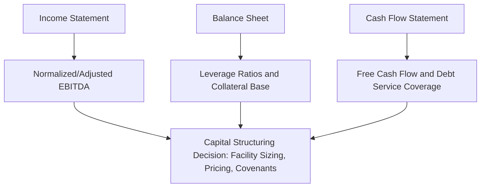

## Financial Statement Analysis for Capital Structuring Decisions

### Overview

Financial statement analysis is the diagnostic process of interpreting a company's income statement, balance sheet, and cash flow statement to assess creditworthiness, debt capacity, and capital structure fit. In capital structuring and syndication, this analysis directly determines how much leverage a business can support, what covenant package is appropriate, and how a proposed facility should be sized and structured relative to the borrower's actual cash-generating capacity — as distinct from accounting earnings alone.

### The Three Statements and Their Structuring Relevance

**Income Statement**: measures profitability over a period, and is the starting point for normalizing EBITDA, the near-universal earnings metric used in leverage-based structuring.

**Balance Sheet**: captures the point-in-time snapshot of assets, liabilities, and equity, and is the primary source for calculating leverage ratios, working capital dynamics, and collateral coverage analysis.

**Cash Flow Statement**: reconciles net income to actual cash generation, separating operating, investing, and financing activities — essential because debt service is paid in cash, not accounting earnings, making this statement indispensable for debt service coverage analysis.

### EBITDA and Its Adjustments

**EBITDA** (Earnings Before Interest, Taxes, Depreciation, and Amortization) serves as the near-universal proxy for cash operating profitability in leveraged finance, because it strips out capital structure decisions (interest), tax jurisdiction effects, and non-cash accounting charges (D&A) to enable comparability across companies with different financing and asset bases.

$$EBITDA = Net\ Income + Interest + Taxes + Depreciation + Amortization$$

**"Adjusted" or "Pro Forma" EBITDA** — the version actually used in credit agreements and syndication marketing — layers additional add-backs onto reported EBITDA:

- Non-recurring/one-time expenses (restructuring costs, litigation settlements, transaction fees)
- Non-cash charges beyond D&A (stock-based compensation, impairments)
- Pro forma cost savings/synergies from announced but not-yet-realized initiatives (often subject to negotiated caps and time limits in credit agreement definitions)
- Pro forma run-rate adjustments for completed acquisitions or divestitures (annualizing a partial-year contribution)
- Management fees or other sponsor-related add-backs in private equity-owned structures

**Structuring relevance**: the definition of "Consolidated EBITDA" in a credit agreement is one of the most heavily negotiated provisions, because every leverage covenant, pricing grid, and covenant basket is calculated as a function of this defined term. A more permissive EBITDA definition (more add-backs) mechanically loosens covenant headroom and can support a higher leverage multiple at the same nominal covenant level. [Inference: the degree of scrutiny given to specific add-back categories varies by market conditions and lender leverage in a given negotiation.]

### Key Leverage Ratios

**Total Leverage Ratio (Total Debt / EBITDA)**

$$Total\ Leverage = \frac{Total\ Debt}{Adjusted\ EBITDA}$$

The primary metric used to size overall debt capacity and to benchmark against industry/rating category norms.

**Senior/Secured Leverage Ratio**

$$Senior\ Leverage = \frac{Senior\ Secured\ Debt}{Adjusted\ EBITDA}$$

Isolates the leverage ahead of unsecured/subordinated claims — critical for assessing the senior tranche's collateral coverage and recovery prospects.

**Net Leverage Ratio**

$$Net\ Leverage = \frac{Total\ Debt - Cash\ \&\ Equivalents}{Adjusted\ EBITDA}$$

Nets available cash against gross debt, often used when a company holds meaningful cash balances that could be applied to debt reduction; frequently the basis for pricing grid step-downs in credit agreements.

**Example:**

A borrower has $400MM total debt (of which $250MM is senior secured), $50MM cash, and $80MM adjusted EBITDA.

$$Total\ Leverage = \frac{400}{80} = 5.0x$$

$$Senior\ Leverage = \frac{250}{80} = 3.1x$$

$$Net\ Leverage = \frac{400 - 50}{80} = 4.4x$$

These three figures together give a syndicate a layered view of where risk concentrates within the capital stack — informative for both senior lenders (focused on senior leverage) and subordinated/mezzanine investors (focused on total leverage as their relevant coverage metric).

### Coverage Ratios

**Interest Coverage Ratio**

$$Interest\ Coverage = \frac{EBITDA}{Interest\ Expense}$$

Measures how many times over current earnings could cover interest obligations — a core input to synthetic credit rating estimation for cost-of-debt purposes.

**Fixed Charge Coverage Ratio (FCCR)**

$$FCCR = \frac{EBITDA - Capex - Cash\ Taxes}{Interest\ Expense + Scheduled\ Principal\ Payments}$$

A more conservative, comprehensive coverage measure that captures maintenance capital requirements and mandatory amortization alongside interest — often the binding maintenance covenant in asset-based and middle-market credit agreements. [Inference: the exact FCCR formula composition (which items are included/excluded) is subject to specific credit agreement definitions and varies by transaction.]

**Debt Service Coverage Ratio (DSCR)**

$$DSCR = \frac{Cash\ Available\ for\ Debt\ Service}{Total\ Debt\ Service\ (Principal + Interest)}$$

Widely used in project finance and real estate-backed structuring, where cash flow predictability and the specific debt service schedule are central to structuring the facility.

### Working Capital and Liquidity Analysis

Working capital dynamics directly affect a borrower's cash conversion cycle and, therefore, revolving credit facility (RCF) sizing.

$$Net\ Working\ Capital = Current\ Assets - Current\ Liabilities$$

**Cash Conversion Cycle (CCC)**:

$$CCC = DIO + DSO - DPO$$

Where:

- $DIO$ (Days Inventory Outstanding) = $\frac{Average\ Inventory}{COGS} \times 365$
- $DSO$ (Days Sales Outstanding) = $\frac{Average\ Accounts\ Receivable}{Revenue} \times 365$
- $DPO$ (Days Payable Outstanding) = $\frac{Average\ Accounts\ Payable}{COGS} \times 365$

A longer CCC indicates the business ties up cash longer in the operating cycle before converting sales to collected cash — directly informing appropriate revolver sizing and seasonal borrowing base structuring in asset-based lending facilities.

### Free Cash Flow and Debt Paydown Capacity

**Levered Free Cash Flow** (cash available to service and repay debt after all operating and capital needs):

$$Levered\ FCF = EBITDA - Capex - \Delta Net\ Working\ Capital - Cash\ Taxes - Cash\ Interest$$

This figure directly determines a borrower's organic deleveraging capacity — the pace at which the company can pay down mandatory amortization and optional prepayments absent refinancing, a key input to structuring amortization schedules and assessing whether a proposed leverage level is sustainable over the facility's tenor.

### Quality of Earnings (QoE) Analysis

Beyond ratio calculation, capital structuring diligence typically includes a **Quality of Earnings** review — an in-depth normalization exercise (often performed by a specialized accounting firm) that scrutinizes the reported EBITDA build for:

- Revenue recognition timing issues or channel-stuffing patterns
- Non-recurring items improperly classified as recurring (or vice versa)
- Related-party transactions priced off market terms
- Working capital normalization (identifying a "normal" working capital peg for purposes of a purchase price/facility sizing adjustment)
- Customer concentration and revenue durability assessment

**Structuring relevance**: QoE findings directly inform the negotiated EBITDA definition in the credit agreement, the working capital peg in an M&A-linked financing, and the ultimate leverage multiple the syndicate is willing to underwrite.

### Balance Sheet Analysis for Collateral and Structuring

**Asset composition analysis** informs the appropriate lending structure:

| Asset Profile | Typical Structuring Implication |
| --- | --- |
| High tangible asset base (inventory, receivables, PP&E) | Supports asset-based lending (ABL) with borrowing base mechanics |
| High intangible/goodwill concentration | Favors cash-flow-based (EBITDA multiple) lending structures |
| Significant real estate/fixed assets | May support mortgage-style or sale-leaseback structuring alternatives |
| Minimal hard collateral, strong recurring revenue | Common in software/services credits; structuring relies heavily on cash flow predictability and covenant protection rather than asset coverage |

**Borrowing base construction** (for ABL facilities):

$$Borrowing\ Base = (Eligible\ AR \times Advance\ Rate_{AR}) + (Eligible\ Inventory \times Advance\ Rate_{Inventory})$$

Advance rates are typically discounted below 100% (e.g., 85% on eligible AR, 50-65% on eligible inventory) to build in a liquidation cushion, with specific eligibility criteria (aging, concentration limits, obsolescence) excluding lower-quality collateral from the base. [Inference: specific advance rate percentages are negotiated and vary by asset quality, industry, and lender.]

### Trend and Peer Benchmarking Analysis

Static ratio calculation is necessarily supplemented by:

- **Trend analysis**: multi-year historical ratio trajectories reveal whether credit metrics are improving, stable, or deteriorating — informative for covenant cushion-setting and pricing grid step design
- **Peer/comparable company benchmarking**: positions the borrower's leverage, coverage, and margin profile against industry norms, informing both credit rating expectations and appropriate covenant tightness relative to market convention for similarly-situated credits

### Worked Example: Structuring Facility Sizing from Financial Statement Analysis

**Scenario**: A borrower reports the following normalized figures for the trailing twelve months (TTM):

| Metric | Value |
| --- | --- |
| Revenue | $220MM |
| Reported EBITDA | $38MM |
| Add-backs (one-time restructuring, sponsor fees) | $4MM |
| Adjusted EBITDA | $42MM |
| Maintenance Capex | $6MM |
| Cash Taxes | $3MM |
| Existing Cash | $12MM |

**Step 1 — Determine target total leverage** based on industry benchmark (assume 4.5x is market-clearing for this credit profile):

$$Target\ Total\ Debt = 4.5 \times 42MM = 189MM$$

**Step 2 — Size senior tranche** at a conservative 3.0x senior leverage:

$$Senior\ Debt = 3.0 \times 42MM = 126MM$$

**Step 3 — Size subordinated/mezzanine gap**:

$$Mezzanine\ Debt = 189MM - 126MM = 63MM$$

**Step 4 — Sanity-check via coverage**: at an assumed blended 9% weighted interest rate on $189MM total debt (~$17.0MM annual interest):

$$Interest\ Coverage = \frac{42MM}{17.0MM} \approx 2.5x$$

$$Approximate\ FCCR = \frac{42MM - 6MM - 3MM}{17.0MM} \approx 1.9x$$

A 1.9x FCCR provides a reasonable, though not excessive, cushion — informing the syndicate that this structure is supportable but leaves limited room for EBITDA underperformance, which would typically translate into tighter covenant headroom (e.g., a maintenance leverage covenant set with a smaller cushion above the closing leverage level) or a request for additional structural protection.

### Practical Application to Capital Structuring and Syndication

**Key Points**

- **Debt capacity sizing**: leverage and coverage ratios, benchmarked against comparable credits, directly determine the maximum facility size a syndicate will underwrite
- **Covenant level-setting**: historical ratio trends and volatility inform where maintenance covenants (leverage, coverage) are set relative to the closing/pro forma level, balancing borrower flexibility against lender protection
- **Tranche allocation**: asset composition and cash flow visibility analysis determine the appropriate split between asset-based, cash-flow senior, and subordinated/mezzanine tranches
- **Pricing grid design**: leverage-based pricing grids (stepping margin up or down as leverage changes) are calibrated directly from the leverage ratio framework established during underwriting
- **Ongoing covenant compliance monitoring**: the same ratio calculations performed at underwriting are recalculated each reporting period to test compliance and trigger covenant-based lender rights (cash flow sweeps, restricted payment blocks, event of default) as needed

### Practical Pitfalls

- Accepting an aggressively add-back-inflated EBITDA definition without independent verification, leading to mispriced leverage relative to true underlying cash generation
- Using reported (GAAP) EBITDA without normalization when reported figures include material one-time or non-operating items
- Ignoring working capital seasonality when sizing a revolving facility, leading to insufficient availability during peak operating cycles
- Conflating interest coverage with fixed charge coverage, when the latter's inclusion of capex and mandatory amortization often reveals materially less cushion than interest coverage alone suggests
- Failing to stress-test coverage ratios under a downside EBITDA scenario, understating the risk that covenant headroom compresses faster than nominal leverage multiples suggest

**Next Steps**

- Balance Sheet Anatomy: Debt, Equity, and Hybrid Claims
- Covenant Design: Maintenance vs. Incurrence Covenants
- Asset-Based Lending and Borrowing Base Mechanics
- Quality of Earnings Analysis in M&A-Linked Financings
- Pricing Grids and Leverage-Based Margin Step-Downs
- Cash Flow Sweep Mechanics and Mandatory Prepayment Structures
- Stress Testing and Downside Scenario Modeling for Covenant Compliance
- Industry Benchmarking and Comparable Company Credit Analysis