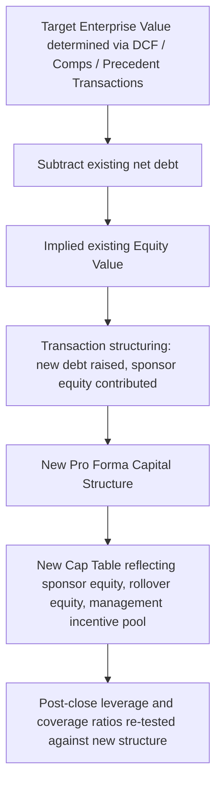

## Enterprise Value, Equity Value, and Capitalization Tables

### Overview

Enterprise Value (EV) and Equity Value are the two central valuation metrics that anchor virtually every capital structuring decision — sizing debt capacity, negotiating purchase price allocation, and determining sponsor equity check size in a leveraged transaction. The capitalization table ("cap table") translates equity value into a precise, instrument-by-instrument allocation among common shareholders, preferred holders, option holders, and convertible security holders. Together, these concepts form the bridge between a business's total operating value and the specific claims each capital provider holds against it.

### Enterprise Value: Definition and Formula

Enterprise Value represents the total value of a company's core operating business, independent of how that business is financed — it is the value available to *all* capital providers (debt and equity holders) collectively.

$$EV = Equity\ Value + Total\ Debt + Preferred\ Stock + Minority\ Interest - Cash\ \&\ Cash\ Equivalents$$

**Rationale for each adjustment:**

- **Add total debt**: debt holders have a claim on enterprise value ahead of equity, so EV must capture the full capital structure, not just the equity slice
- **Add preferred stock**: preferred holders similarly hold a claim senior to common equity that must be captured in the total enterprise claim
- **Add minority (non-controlling) interest**: when a company's financials are consolidated but a subsidiary is not 100% owned, minority interest represents a real claim on consolidated assets that must be added back to avoid understating EV
- **Subtract cash and equivalents**: cash is a non-operating asset that could theoretically be used to immediately retire debt or be distributed to equity holders; netting it out isolates the value of the *operating* business itself

**Why EV matters in structuring**: because EV is capital-structure-neutral, it is the correct basis for comparing companies with different leverage levels (via multiples like EV/EBITDA) and is the natural "sizing pool" against which a syndicate determines what proportion can be safely allocated to debt versus what must be funded with equity.

### Equity Value: Definition and Formula

Equity Value (also called market capitalization for public companies) represents the value attributable specifically to common equity holders — the residual claim after all senior claims are notionally satisfied.

**Rearranging the EV formula:**

$$Equity\ Value = EV - Total\ Debt - Preferred\ Stock - Minority\ Interest + Cash\ \&\ Cash\ Equivalents$$

**For public companies:**

$$Equity\ Value = Share\ Price \times Fully\ Diluted\ Shares\ Outstanding$$

**Fully diluted share count** must incorporate the dilutive effect of options, warrants, and convertible securities — typically via the **Treasury Stock Method (TSM)** for options/warrants:

$$Net\ New\ Shares = Options\ Outstanding \times \left(1 - \frac{Strike\ Price}{Current\ Share\ Price}\right)$$

This formula assumes option proceeds are used to repurchase shares at the current market price, so only the "net" incremental shares are added to the diluted count — applicable only when the strike price is below the current share price (in-the-money options); out-of-the-money options are excluded from dilution.

### Worked Example: Bridging EV to Equity Value

**Scenario**: A target company has an EV of $850MM, established via a DCF/comparable companies analysis.

| Item | Amount ($MM) |
| --- | --- |
| Enterprise Value | 850 |
| Less: Total Debt | (300) |
| Less: Preferred Stock | (40) |
| Less: Minority Interest | (15) |
| Plus: Cash & Equivalents | +25 |
| **Equity Value** | **520** |

$$Equity\ Value = 850 - 300 - 40 - 15 + 25 = 520\ MM$$

This $520MM equity value figure is the pool that must then be allocated across the specific classes of equity claims documented in the capitalization table — and, in an LBO/recapitalization context, is the figure that determines the sponsor's required equity check after accounting for the new debt being raised.

### The Capitalization Table: Structure and Components

A capitalization table is a detailed ledger of every equity and equity-linked security a company has issued, showing ownership percentages, share counts, and (in priced rounds) valuation per share.

**Standard cap table components:**

| Security Class | Description |
| --- | --- |
| Common Stock | Founders', employees', and early investors' ordinary shares |
| Preferred Stock (by series, e.g., Series A, B, C) | Priced financing rounds, each with distinct liquidation preferences and rights |
| Stock Options / RSUs (Employee Pool) | Equity incentive compensation, typically reflected on a fully diluted basis |
| Warrants | Rights to purchase shares at a fixed strike, often attached to debt/mezzanine financings |
| Convertible Notes / SAFEs | Debt or debt-like instruments that convert to equity, typically at a future priced round, at a discount and/or valuation cap |

**Illustrative simplified cap table (pre-transaction):**

| Holder Class | Shares (Fully Diluted) | % Ownership | Liquidation Preference |
| --- | --- | --- | --- |
| Founders (Common) | 4,000,000 | 40.0% | None |
| Series A Preferred | 2,500,000 | 25.0% | 1x non-participating |
| Series B Preferred | 2,000,000 | 20.0% | 1x participating |
| Employee Option Pool | 1,000,000 | 10.0% | None (common upon exercise) |
| Warrants (mezz lender) | 500,000 | 5.0% | None (common upon exercise) |
| **Total Fully Diluted** | **10,000,000** | **100.0%** |  |

### Liquidation Preferences and Waterfall Mechanics

Preferred stock liquidation preferences directly determine how proceeds from a sale, dividend, or liquidity event are allocated — a critical structuring consideration whenever preferred equity sits in the capital stack.

**Non-participating preferred**: holder receives the *greater of* (a) their stated liquidation preference, or (b) their as-converted common equity share — but not both.

$$Payout_{non\text{-}participating} = \max(Liquidation\ Preference, \ \%\ Ownership \times Total\ Proceeds)$$

**Participating preferred**: holder receives their stated liquidation preference *plus* their pro-rata share of remaining proceeds alongside common — economically more favorable to the preferred holder, at the direct expense of common/junior holders.

$$Payout_{participating} = Liquidation\ Preference + (\%\ Ownership \times Remaining\ Proceeds\ After\ All\ Preferences)$$

**Stacked/multiple liquidation preferences**: when multiple preferred series exist, the waterfall typically pays senior-most series first (often the most recently issued round, per standard "last money in, first money out" convention), then junior preferred, then common — mirroring the debt seniority concepts but applied within the equity layer itself.

### Waterfall Example

**Scenario**: Using the cap table above, a $60MM exit occurs.

**Step 1 — Series B (participating, 1x preference, most senior):**

Assume Series B invested $10MM for its 2,000,000 shares (1x preference = $10MM).

$$Series\ B\ Preference = 10MM$$

Remaining proceeds after Series B preference: $50MM

**Step 2 — Series A (non-participating, 1x preference):**

Assume Series A invested $5MM for its 2,500,000 shares.

Compare: Series A liquidation preference ($5MM) vs. as-converted value at $50MM remaining pool × 25%/(75% remaining ownership among non-Series-B holders, illustratively) — Series A will elect whichever is greater. [Inference: exact remaining-pool percentage calculations depend on the specific as-converted share math and waterfall documentation in the governing certificate of incorporation.]

**Step 3 — Series B participation** (since participating): Series B also shares pro-rata in the remaining proceeds alongside common and Series A (if Series A converts), on top of its $10MM preference already received.

**Step 4 — Common and Option Pool**: receive their pro-rata share of whatever proceeds remain after all preferred claims (preference amounts plus any participation) are satisfied.

This layered mechanic is precisely why cap table structuring — deciding whether new preferred is participating vs. non-participating, and where it stacks relative to existing series — is a heavily negotiated point in any financing round, since it directly redistributes exit proceeds among existing and new investors.

### EV/Equity Value Bridge in an LBO/Recapitalization Context

**LBO sources and uses illustration:**

| Sources ($MM) |  | Uses ($MM) |  |
| --- | --- | --- | --- |
| Senior Secured Debt | 300 | Purchase of Target Equity | 520 |
| Mezzanine Debt | 100 | Refinance Existing Debt | 300 |
| Sponsor Equity | 250 | Transaction Fees | 30 |
| **Total Sources** | **650** | **Total Uses** | **850** |

*(Note: figures illustrative; Enterprise Value of $850MM funded via $300MM new debt refinancing existing $300MM debt, $520MM equity purchase price, and $30MM fees — with sponsor equity of $250MM plus $400MM new debt covering the $650MM net financing need beyond rolled/existing arrangements. Actual sources/uses reconcile precisely to total EV plus fees in a real transaction model.)*

### Multiples and Valuation Cross-Checks

EV and equity value each pair with different financial metrics to form valuation multiples appropriate to each:

| Multiple Type | Numerator | Denominator | Notes |
| --- | --- | --- | --- |
| EV/EBITDA | Enterprise Value | EBITDA | Capital-structure-neutral; most common in leveraged finance |
| EV/Revenue | Enterprise Value | Revenue | Used for early-stage/low-margin businesses without meaningful EBITDA |
| P/E (Price/Earnings) | Equity Value (per share) | Net Income (per share) | Equity-specific; affected by capital structure via interest expense |
| P/B (Price/Book) | Equity Value | Book Value of Equity | Common in financial institution valuation |

Because EV/EBITDA excludes the effect of financing decisions, it is the standard multiple used when comparing leverage capacity across companies with different existing capital structures — directly feeding into the debt sizing exercise central to capital structuring.

### Fully Diluted Ownership and Down-Round/Anti-Dilution Considerations

**Anti-dilution provisions** protect existing preferred holders if a company later raises capital at a lower valuation than a prior round (a "down round"):

- **Full ratchet**: existing preferred's conversion price is reset to match the new, lower round price — maximally protective of the existing preferred holder, maximally dilutive to common/founders
- **Weighted-average (broad-based or narrow-based)**: conversion price adjustment is moderated by the relative size of the new issuance compared to existing shares outstanding — a market-standard, less punitive alternative to full ratchet

$$New\ Conversion\ Price_{weighted\text{-}average} = Old\ Price \times \frac{A + B}{A + C}$$

Where $A$ = shares outstanding before the new issuance, $B$ = shares that would have been issued at the old price for the new money raised, and $C$ = shares actually issued in the new round.

**Structuring relevance**: anti-dilution mechanics directly affect the fully diluted cap table and therefore the effective ownership/proceeds allocation in any subsequent liquidity event — a material consideration when structuring new preferred or convertible instruments into an existing capital structure.

### Practical Application to Capital Structuring and Syndication

**Key Points**

- **Debt capacity sizing**: EV (via EV/EBITDA multiples) establishes the total value pool against which leverage ratios and debt capacity are assessed
- **Sponsor equity check sizing**: in an LBO, the gap between total sources needed (purchase price plus fees plus refinanced debt) and the debt raised directly determines required sponsor equity contribution
- **Waterfall and exit modeling**: cap table structure and liquidation preference stacking determine how proceeds from an eventual exit or recapitalization will actually be distributed among existing equity holders — essential for sponsor return (IRR/MOIC) modeling
- **New security structuring**: when structuring new preferred, convertible, or warrant instruments, understanding the existing cap table's liquidation preference stack and anti-dilution provisions is essential to correctly position and price the new instrument
- **Cross-check valuation consistency**: reconciling EV/EBITDA-based valuation against DCF-derived EV provides a sanity check on the reasonableness of assumptions feeding into the capital structuring decision

### Practical Pitfalls

- Confusing EV and Equity Value when discussing "the value" of a company without specifying which metric is meant, leading to systematic sizing errors in debt capacity or purchase price discussions
- Omitting minority interest or preferred stock from the EV build, understating true enterprise value and therefore mispricing leverage multiples
- Using basic (non-diluted) share count instead of fully diluted shares when calculating equity value, understating true equity value and overstating per-share metrics
- Failing to model participating vs. non-participating preferred correctly in waterfall analysis, materially misstating expected proceeds to common/junior holders
- Ignoring anti-dilution ratchet mechanics when a new financing round is priced below a prior round, understating the dilutive impact on existing common/founder ownership

**Next Steps**

- Financial Statement Analysis for Capital Structuring Decisions
- Leveraged Buyout (LBO) Sources and Uses Modeling
- Liquidation Preference Structuring and Waterfall Modeling
- Anti-Dilution Provisions and Down-Round Mechanics
- Comparable Company and Precedent Transaction Valuation Methods
- Convertible Notes, SAFEs, and Priced Round Conversion Mechanics
- Sponsor Return Modeling: IRR, MOIC, and Exit Scenario Analysis
- Management Incentive Plans and Option Pool Structuring