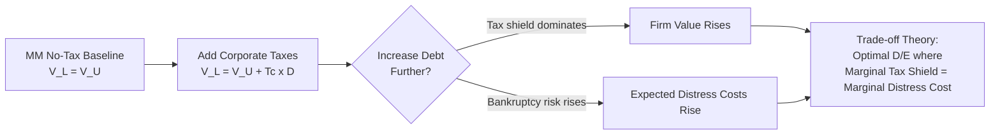

## The Modigliani-Miller Irrelevance Theorem

### Overview

The Modigliani-Miller (MM) Irrelevance Theorem, introduced by Franco Modigliani and Merton Miller in 1958, states that under a specific set of idealized market conditions, the value of a firm is unaffected by how that firm is financed. Whether a company funds its operations through debt, equity, or some combination of the two, its total enterprise value remains constant. The theorem also asserts, as a corollary, that dividend policy is similarly irrelevant to firm value under these same conditions.

The theorem's real contribution is not a claim that capital structure *never* matters in practice, but rather a demonstration of exactly which frictions (taxes, bankruptcy costs, agency costs, information asymmetry) must be introduced before capital structure choices start to affect value. It functions as a baseline "irrelevance" result against which every subsequent capital structure theory (trade-off theory, pecking order theory, agency cost models) is measured.

### The Assumptions (Perfect Capital Markets)

The theorem holds only under a restrictive set of conditions:

- **No taxes** — no corporate or personal income taxes on interest, dividends, or capital gains
- **No transaction costs** — issuing or trading securities is costless
- **No bankruptcy costs** — financial distress and liquidation are costless
- **Symmetric information** — investors and managers have identical information about the firm's cash flows
- **No agency costs** — managers act purely in shareholders' interests
- **Homogeneous expectations** — all investors have identical expectations about a firm's future cash flows
- **Perfect capital markets** — investors can borrow and lend at the same risk-free rate as the firm; no arbitrage opportunities persist
- **Investment policy is fixed** — financing decisions do not affect the firm's operating cash flows or investment decisions

### Proposition I (No Taxes): Capital Structure Irrelevance

**Key Points**

The value of a levered firm ($V_L$) equals the value of an otherwise identical unlevered firm ($V_U$):

$$V_L = V_U$$

This holds regardless of the debt-to-equity ratio chosen. The firm's total value is determined solely by the cash flows generated by its assets and the risk of those cash flows — not by how the claims on those cash flows are sliced between debtholders and shareholders.

**The Arbitrage Proof (Homemade Leverage)**

MM's proof rests on an arbitrage argument. If a levered firm were priced differently from an unlevered firm with identical operating cash flows, investors could exploit the mispricing:

1. If $V_L > V_U$: an investor sells (short) a proportional share of the levered firm's equity, and simultaneously buys a proportional share of the unlevered firm's equity plus borrows personally to replicate the leverage. This "homemade leverage" produces an identical cash flow stream at a lower cost, generating a risk-free arbitrage profit.
2. If $V_L < V_U$: an investor sells a share of the unlevered firm and buys a proportional share of both the levered firm's equity and its debt ("homemade unleveraging"), again capturing an arbitrage profit.

Because rational investors will act on this until prices converge, the arbitrage forces $V_L = V_U$ in equilibrium. This is the theorem's central insight: **investors can replicate corporate leverage with personal leverage**, so corporate financing decisions add no value on their own.

**Example**

Consider two firms with identical assets generating $1,000,000 in annual operating income in perpetuity:

- **Firm U (Unlevered):** financed entirely by equity, no debt.
- **Firm L (Levered):** has $4,000,000 of debt at 5% interest, plus equity.

Suppose the market values Firm U at $10,000,000 and Firm L at $11,000,000 (i.e., the market is pricing leverage as value-additive). An investor holding 10% of Firm L's equity has a claim on:

$$0.10 \times (\$1{,}000{,}000 - 0.05 \times \$4{,}000{,}000) = 0.10 \times \$800{,}000 = \$80{,}000$$

That investor can instead sell their 10% stake in Firm L (worth $0.10 \times (\$11{,}000{,}000 - \$4{,}000{,}000) = \$700{,}000$ of equity), borrow $400,000 personally at 5%, and buy 10% of Firm U's equity for $1,000,000 total outlay of $1,000,000, but funded with only $\$700{,}000 + \$400{,}000 = \$1{,}100{,}000$...

More precisely: the investor sells their Firm L equity stake for $700,000, borrows an additional $400,000 on personal account, and uses the combined $1,100,000 to buy 11% of Firm U (since Firm U is worth $10,000,000). This 11% stake pays:

$$0.11 \times \$1{,}000{,}000 = \$110{,}000 \text{ gross}, \text{ minus personal interest of } 0.05 \times \$400{,}000 = \$20{,}000$$

Net income: $90,000 — greater than the $80,000 from holding Firm L directly, for the same net cash outlay. This arbitrage opportunity persists until $V_L$ falls (or $V_U$ rises) to eliminate the price discrepancy, confirming Proposition I.

### Proposition II (No Taxes): Cost of Equity and Leverage

**Key Points**

While total firm value is unaffected by leverage, the *cost of equity* rises linearly with leverage to exactly offset any apparent benefit of "cheaper" debt financing:

$$r_E = r_U + \frac{D}{E}(r_U - r_D)$$

Where:

- $r_E$ = required return (cost) of levered equity
- $r_U$ = cost of capital for an all-equity (unlevered) firm
- $r_D$ = cost of debt
- $D/E$ = debt-to-equity ratio (at market values)

**Explanation**

As a firm adds debt, financial risk borne by equity holders increases (debt holders have a prior claim on cash flows), so shareholders demand a higher return to compensate. This increase in $r_E$ exactly cancels out the effect of substituting "cheap" debt for "expensive" equity in the weighted average cost of capital (WACC), leaving WACC constant regardless of capital structure:

$$WACC = \frac{E}{V}r_E + \frac{D}{V}r_D = r_U \quad \text{(constant, independent of } D/E\text{)}$$

This is the direct mechanism behind Proposition I: it is not that leverage has no effect on any single component of the capital structure, but that the effects on $r_E$ and the weighting exactly offset one another.

**Example**

A firm has $r_U = 10\%$ (unlevered cost of capital) and can borrow at $r_D = 6\%$. At a debt-to-equity ratio of $D/E = 1.0$:

$$r_E = 10\% + 1.0 \times (10\% - 6\%) = 14\%$$

Check the WACC (assuming $D/V = E/V = 0.5$):

$$WACC = 0.5(14\%) + 0.5(6\%) = 7\% + 3\% = 10\%$$

WACC remains at 10%, identical to the unlevered cost of capital, confirming that increasing leverage did not lower the overall cost of capital — the rise in $r_E$ absorbed the entire benefit of cheaper debt.

### Diagram: Relationship Between Cost of Capital and Leverage (No Taxes)

<svg xmlns="http://www.w3.org/2000/svg" viewBox="0 0 700 420">
\<style\>
.axis{stroke:#333;stroke-width:2;}
.gridline{stroke:#ddd;stroke-width:1;}
.re-line{stroke:#c0392b;stroke-width:2.5;fill:none;}
.wacc-line{stroke:#2980b9;stroke-width:2.5;fill:none;}
.rd-line{stroke:#27ae60;stroke-width:2.5;fill:none;}
.label{font-family:sans-serif;font-size:13px;fill:#333;}
.title{font-family:sans-serif;font-size:16px;fill:#111;font-weight:bold;}
\</style\>
<text x="350" y="25" text-anchor="middle" class="title">Cost of Capital vs. Leverage (D/E) — MM Proposition II (svg_diagram)</text>
<line x1="70" y1="360" x2="650" y2="360" class="axis" />
<line x1="70" y1="360" x2="70" y2="50" class="axis" />
<text x="360" y="400" text-anchor="middle" class="label">Debt-to-Equity Ratio (D/E)</text>
<text x="30" y="200" text-anchor="middle" class="label" transform="rotate(-90 30 200)">Cost of Capital (%)</text>
<line x1="70" y1="220" x2="650" y2="220" class="gridline" />
<text x="55" y="224" text-anchor="end" class="label">rU</text>
<path class="re-line" d="M 70 220 L 650 100" />
<text x="600" y="95" class="label" fill="#c0392b">rE (Cost of Equity)</text>
<path class="wacc-line" d="M 70 220 L 650 220" />
<text x="600" y="235" class="label" fill="#2980b9">WACC</text>
<path class="rd-line" d="M 70 220 L 650 240" />
<text x="600" y="255" class="label" fill="#27ae60">rD (Cost of Debt)</text>
</svg>

### Proposition I (With Corporate Taxes): The Tax Shield

**Key Points**

MM's 1963 correction relaxes the no-tax assumption. Because interest payments are tax-deductible while dividend payments are not, debt financing creates a tax shield that adds value to the firm:

$$V_L = V_U + T_C \times D$$

Where:

- $T_C$ = corporate tax rate
- $D$ = market value of debt
- $T_C \times D$ = present value of the interest tax shield (assuming perpetual, constant debt)

**Explanation**

This result reverses the "irrelevance" conclusion in one specific dimension: firm value now *increases* monotonically with leverage, implying (in this simplified model) that a firm should be financed with as close to 100% debt as possible to maximize the tax shield. This unrealistic implication is precisely why later theories (trade-off theory) introduce bankruptcy and financial distress costs to counterbalance the tax shield and produce an interior optimal capital structure.

**Example**

An unlevered firm is valued at $V_U = \$50{,}000{,}000$. The corporate tax rate is $T_C = 25\%$. The firm takes on $20,000,000 in permanent debt.

$$V_L = \$50{,}000{,}000 + (0.25 \times \$20{,}000{,}000) = \$50{,}000{,}000 + \$5{,}000{,}000 = \$55{,}000{,}000$$

The $5,000,000 increase represents the present value of tax savings from deducting interest expense in perpetuity.

### Proposition II (With Corporate Taxes)

The cost of equity formula adjusts to account for the tax shield:

$$r_E = r_U + \frac{D}{E}(1 - T_C)(r_U - r_D)$$

The $(1-T_C)$ term dampens the rate at which $r_E$ rises with leverage compared to the no-tax case, because part of the added financial risk is offset by the government effectively subsidizing debt through the tax deduction.

### Dividend Irrelevance Corollary

**Key Points**

MM extended the same logic to dividend policy (1961): under the same perfect-market assumptions, a firm's value is unaffected by whether it distributes earnings as dividends or retains them for reinvestment, because:

- Investors can replicate any desired dividend stream by selling shares ("homemade dividends") if actual dividends are lower than desired.
- Investors can reinvest unwanted dividends themselves if actual dividends exceed their preference.
- Since investment policy is held fixed, dividends paid out must be financed by issuing new equity, which dilutes existing shareholders by exactly the amount distributed — a value-neutral transfer.

### Why the Theorem Matters (Interpretation)

**Key Points**

The theorem is frequently misunderstood as claiming "capital structure doesn't matter in the real world." Its actual significance is the opposite: it isolates the *specific market imperfections* that must exist for capital structure to matter at all. Every major subsequent theory of capital structure is essentially "MM plus one relaxed assumption":

| Relaxed Assumption | Resulting Theory |
| --- | --- |
| Add corporate taxes | MM with taxes → debt tax shield |
| Add bankruptcy/distress costs | Trade-off theory (optimal capital structure) |
| Add information asymmetry | Pecking order theory (Myers-Majluf) |
| Add agency costs | Jensen & Meckling agency cost theory |
| Add signaling effects | Signaling models of capital structure |

### Diagram: Trade-off Between Tax Shield and Distress Costs

### Common Criticisms and Limitations

**Key Points**

- **Unrealistic assumptions** — real markets have taxes, bankruptcy costs, and information asymmetry, so the pure irrelevance result rarely holds exactly.
- **Personal vs. corporate borrowing rates differ** — individual investors typically cannot borrow at the same rate as corporations, weakening the homemade leverage arbitrage. [Inference: the magnitude of this friction varies by investor and market, and is not precisely quantified by the theorem itself.]
- **Ignores agency costs and signaling** — the model assumes managers act purely in shareholder interest and that capital structure conveys no information, both of which are frequently violated in practice.
- **The extreme "100% debt" implication under Proposition I with taxes** is not observed empirically, which is itself evidence that omitted costs (distress, agency) are economically significant. [Inference: this is an interpretation of observed capital structure patterns, not a directly measured quantity.]

### Practical Application in Capital Structuring & Syndication

**Key Points**

In real-world capital structuring and loan syndication work, MM serves as the theoretical anchor for cost-of-capital analysis even though its strict assumptions never hold exactly:

- **WACC modeling** — Proposition II's framework underlies how arrangers and treasury teams model the sensitivity of a firm's blended cost of capital to different debt/equity mixes when structuring a syndicated facility.
- **Tax shield valuation in LBOs and leveraged syndications** — the $T_C \times D$ tax shield term is a direct input into adjusted present value (APV) valuation models used to price highly levered transactions, such as leveraged buyouts financed through syndicated term loans.
- **Benchmark for optimal leverage discussions** — when a syndicate of lenders and an arranger negotiate the appropriate leverage multiple (e.g., Debt/EBITDA) for a deal, the trade-off theory extension of MM (tax shield vs. expected distress cost) provides the conceptual basis for that negotiation.
- **Covenant design** — because MM assumes no agency costs, real-world syndications add financial covenants specifically to control the agency costs the theorem assumes away, aligning borrower and lender incentives.

### Related Topics

- Modigliani-Miller Proposition II derivation and full mathematical proof
- Trade-off Theory of Capital Structure (static and dynamic versions)
- Pecking Order Theory (Myers & Majluf, 1984)
- Agency Costs of Debt and Equity (Jensen & Meckling, 1976)
- Weighted Average Cost of Capital (WACC) estimation methodology
- Adjusted Present Value (APV) vs. WACC valuation approaches
- Cost of Financial Distress and Bankruptcy Cost Estimation
- Signaling Theory in Capital Structure Decisions
- Optimal Capital Structure in Leveraged Buyouts (LBOs)
- Debt Capacity Analysis in Syndicated Lending