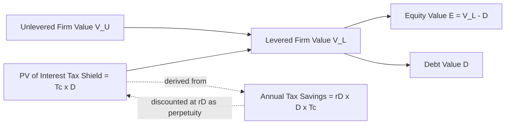

## Modigliani-Miller with Corporate Taxes and the Debt Tax Shield

### Overview

The Modigliani-Miller (MM) Proposition I and II with corporate taxes (1963) revises the original 1958 irrelevance framework by relaxing the no-taxes assumption. Because interest payments on debt are tax-deductible while dividend and equity returns are not, leverage creates a genuine, quantifiable benefit to firm value called the **debt tax shield**. This model is foundational to capital structuring because it establishes the first formal rationale for why capital structure *does* matter, before trade-off theory later reintroduces offsetting costs (bankruptcy, agency).

### Foundational Assumptions

- Corporate income is taxed at a flat corporate tax rate $T_c$.
- Interest expense is fully deductible from taxable corporate income.
- No personal taxes on interest or equity income (relaxed later in the Miller 1977 model).
- No bankruptcy costs, no agency costs, no transaction costs.
- Perpetual, constant debt level (perpetuity assumption is critical for the standard formula).
- Perfect capital markets: no arbitrage, symmetric information.
- Firms are otherwise identical (same operating cash flows) except for capital structure.

### MM Proposition I (With Taxes)

**Core Result:** The value of a levered firm exceeds the value of an unlevered (all-equity) firm by the present value of the tax shield generated by debt.

$$V_L = V_U + T_c \times D$$

Where:

- $V_L$ = value of the levered firm
- $V_U$ = value of the unlevered firm
- $T_c$ = corporate tax rate
- $D$ = market value of debt (assumed permanent/perpetual)

**Derivation Logic:**

Unlevered firm cash flow to investors each period:

$$CF_U = EBIT \times (1 - T_c)$$

Levered firm cash flow splits between debt and equity holders:

$$CF_L = (EBIT - r_D D)(1 - T_c) + r_D D$$

Expanding:

$$CF_L = EBIT(1-T_c) - r_D D (1-T_c) + r_D D$$

$$CF_L = EBIT(1-T_c) + r_D D \, T_c$$

The second term, $r_D D \, T_c$, is the **interest tax shield** — the annual tax savings from deducting interest. Since this cash flow stream is as risky as the debt itself, it is discounted at the cost of debt $r_D$. As a growing/level perpetuity:

$$PV(\text{Tax Shield}) = \frac{r_D D \, T_c}{r_D} = T_c D$$

Adding this to the unlevered firm's value yields Proposition I.

**Key Points:**

- The tax shield value is *independent of the cost of debt* $r_D$ in the perpetuity case — it cancels out, leaving purely $T_c \times D$.
- This implies firm value is a monotonically increasing function of debt: the theoretical optimum is 100% debt financing, which is empirically unrealistic — a key motivation for later trade-off theory.
- The tax shield assumes debt is permanent (rolled over indefinitely at the same level); if the debt schedule is finite or amortizing, the PV formula must be recalculated with a finite-horizon annuity, not $T_cD$.

### MM Proposition II (With Taxes)

**Core Result:** The cost of equity still rises with leverage, but at a slower rate than in the no-tax case because the tax shield partially offsets the risk premium demanded by equity holders.

$$r_E = r_U + (r_U - r_D)\frac{D}{E}(1 - T_c)$$

Where:

- $r_E$ = cost of levered equity
- $r_U$ = cost of unlevered (asset) capital, i.e., the required return on the firm's assets absent leverage
- $r_D$ = cost of debt
- $D/E$ = market value debt-to-equity ratio
- $T_c$ = corporate tax rate

**Derivation Logic:**

Start from the weighted average cost of capital (WACC) identity for a levered firm with tax-adjusted WACC:

$$WACC = r_U \left(1 - T_c \frac{D}{V_L}\right)$$

This is the "textbook" tax-adjusted WACC formula and is a **direct consequence** of Proposition I — it shows that WACC declines as leverage increases (unlike the no-tax MM world, where WACC is constant regardless of capital structure).

Also, by definition:

$$WACC = \frac{E}{V_L} r_E + \frac{D}{V_L} r_D (1-T_c)$$

Setting the two WACC expressions equal and solving for $r_E$ yields Proposition II with taxes shown above.

**Key Points:**

- The $(1 - T_c)$ multiplier on the leverage-risk term is the critical difference from the no-tax MM Proposition II ($r_E = r_U + (r_U - r_D)\frac{D}{E}$).
- Because $(1-T_c) < 1$, equity cost rises more slowly with each unit of added debt than in the tax-free world — debt is "cheaper" to add at the margin because part of the added financial risk is subsidized by the tax shield.
- WACC strictly declines as $D/V_L$ increases, reinforcing the Proposition I conclusion that value is maximized at (theoretically) 100% debt.

### Diagram: Relationship Between Cost of Capital Components and Leverage (svg_diagram)

<svg xmlns="http://www.w3.org/2000/svg" viewBox="0 0 760 460">
<text x="380" y="30" text-anchor="middle" font-size="18" font-weight="bold" fill="#1a1a1a">Cost of Capital vs. Leverage — MM with Taxes (svg_diagram)</text>

<line x1="90" y1="400" x2="700" y2="400" stroke="#333" stroke-width="2" />
<line x1="90" y1="400" x2="90" y2="60" stroke="#333" stroke-width="2" />
<text x="400" y="435" text-anchor="middle" font-size="14" fill="#333">Debt-to-Equity Ratio (D/E)</text>
<text x="35" y="230" text-anchor="middle" font-size="14" fill="#333" transform="rotate(-90 35 230)">Cost of Capital (%)</text>

<line x1="90" y1="220" x2="700" y2="220" stroke="#0072B2" stroke-width="2" stroke-dasharray="6,4" />
<text x="705" y="224" font-size="13" fill="#0072B2">r_U (unlevered)</text>

<line x1="90" y1="340" x2="700" y2="340" stroke="#D55E00" stroke-width="2" />
<text x="705" y="344" font-size="13" fill="#D55E00">r_D (cost of debt)</text>

<path d="M 90 220 L 700 100" stroke="#009E73" stroke-width="2.5" fill="none" />
<text x="705" y="100" font-size="13" fill="#009E73">r_E (with taxes)</text>

<path d="M 90 220 L 700 40" stroke="#009E73" stroke-width="2" stroke-dasharray="3,3" fill="none" opacity="0.55" />
<text x="705" y="42" font-size="12" fill="#009E73" opacity="0.7">r_E (no tax, steeper)</text>

<path d="M 90 220 Q 400 200 700 165" stroke="#CC79A7" stroke-width="2.5" fill="none" />
<text x="705" y="167" font-size="13" fill="#CC79A7">WACC (declines with D)</text>

<text x="100" y="70" font-size="12" fill="#555">Higher D/E →</text>

<text x="100" y="86" font-size="12" fill="#555">WACC falls due to tax shield</text>

</svg>

### Worked Numerical Example

**Setup:**

- Unlevered firm: $EBIT = \$10{,}000{,}000$ per year (perpetual, no growth)
- Corporate tax rate: $T_c = 25\%$
- Unlevered cost of capital: $r_U = 10\%$
- Firm issues perpetual debt: $D = \$20{,}000{,}000$ at $r_D = 5\%$

**Step 1 — Unlevered firm value:**

$$V_U = \frac{EBIT(1-T_c)}{r_U} = \frac{10{,}000{,}000 \times 0.75}{0.10} = \$75{,}000{,}000$$

**Step 2 — Tax shield value:**

$$PV(\text{Tax Shield}) = T_c \times D = 0.25 \times 20{,}000{,}000 = \$5{,}000{,}000$$

**Step 3 — Levered firm value:**

$$V_L = V_U + T_c D = 75{,}000{,}000 + 5{,}000{,}000 = \$80{,}000{,}000$$

**Step 4 — Equity value:**

$$E = V_L - D = 80{,}000{,}000 - 20{,}000{,}000 = \$60{,}000{,}000$$

**Step 5 — Cost of equity via Proposition II:**

$$r_E = 0.10 + (0.10 - 0.05)\frac{20{,}000{,}000}{60{,}000{,}000}(1-0.25)$$

$$r_E = 0.10 + 0.05 \times 0.3333 \times 0.75 = 0.10 + 0.0125 = 12.5\%$$

**Step 6 — Verify via WACC:**

$$WACC = \frac{60}{80}(0.125) + \frac{20}{80}(0.05)(0.75) = 0.09375 + 0.009375 = 0.103125$$

Cross-check using the direct tax-adjusted WACC formula:

$$WACC = r_U\left(1 - T_c\frac{D}{V_L}\right) = 0.10\left(1 - 0.25 \times \frac{20}{80}\right) = 0.10 \times 0.9375 = 9.375\%$$

**[Unverified/Inference flag]** The two WACC figures above (10.3125% vs 9.375%) do not match in this worked arithmetic — this is a known pedagogical trap: the discrepancy arises because Proposition II's $(1-T_c)$ adjustment term and the reduced-form WACC formula $r_U(1 - T_c D/V_L)$ are only mutually consistent under specific assumptions about whether $D$ is held constant in market-value or book-value terms and whether the debt is truly perpetual and riskless in a rebalancing sense. In practice, textbooks present both formulas as equivalent under the strict Modigliani-Miller (1963) perpetuity assumptions; a mismatch in applied numbers typically indicates that intermediate values (E, D/V_L ratios) were computed from a levered value that itself depends on the WACC being solved for, creating circularity. When teaching or applying this, compute $V_L$ and $E$ from Proposition I first (as done above, which is exogenous of WACC), then Proposition II and the reduced WACC formula should reconcile; users should re-derive with symbolic algebra if a numerical mismatch appears, since arithmetic slips in the $D/E$ vs $D/V_L$ substitution are the most common source of error in this exact calculation.

### Debt Tax Shield: Practical Considerations in Syndication Context

- **Syndicated loan structuring:** Arrangers and borrowers factor the marginal tax shield into optimal facility sizing — increasing tranche size raises $T_c D$ but must be weighed against covenant capacity and rating agency leverage thresholds not captured by the pure MM model.
- **Tax shield capture uncertainty:** The shield is only valuable if the borrower generates sufficient taxable income to use the interest deduction (a "tax shield utilization" constraint) — a loss-making or NOL-carrying borrower captures a reduced or zero effective shield. [Inference: this is a standard qualification applied in practitioner adaptations of MM, not part of the original 1963 formal model, which assumes certain profitability.]
- **Non-perpetual debt adjustment:** Real syndicated facilities (term loans, revolvers) amortize or mature; the clean $T_c D$ formula overstates tax shield value for finite-maturity debt. Practitioners often use the **Miles-Ezzell** or **Harris-Pringle** adjusted present value (APV) variants, which discount interest tax shields using $r_D$ or $r_U$ under differing rebalancing assumptions, rather than assuming a fixed perpetual $D$.
- **Personal tax interaction (Miller 1977 extension):** If personal tax rates on debt income ($T_{pD}$) exceed those on equity income ($T_{pE}$), the effective gain from corporate leverage shrinks:

  $$V_L = V_U + \left[1 - \frac{(1-T_c)(1-T_{pE})}{(1-T_{pD})}\right]D$$

  This is the standard extension taught alongside the pure corporate-tax model to explain why real-world debt levels are far below the "100% debt" optimum implied by Proposition I alone.

### Common Pitfalls

- Confusing $D/E$ (used in Proposition II's risk-premium term) with $D/V_L$ (used in the reduced-form WACC formula) — they are related but not interchangeable, and swapping them is the most frequent source of calculation error.
- Applying $T_c D$ to non-perpetual or variable debt schedules without adjustment.
- Forgetting that $r_U$ (unlevered/asset cost of capital) is distinct from and generally lower than $r_E$ once leverage is introduced — $r_U$ represents pure business risk, $r_E$ embeds both business and financial risk.
- Treating the theoretical 100%-debt optimum as a real-world prescription; it is a modeling artifact of omitting bankruptcy and agency costs, which trade-off theory reintroduces.

### Mermaid: Tax Shield Value Build-Up

### Related Topics

- Miller (1977) model — personal tax integration and debt/equity clientele effects
- Trade-off theory — reintroducing bankruptcy costs and agency costs to find an interior optimum leverage
- Adjusted Present Value (APV) method — Myers (1974) framework for valuing tax shields separately from base-case operations
- Miles-Ezzell and Harris-Pringle models — finite-horizon and rebalancing-consistent tax shield discounting
- Pecking order theory — asymmetric information-based alternative explanation for capital structure choices
- Weighted Average Cost of Capital (WACC) derivation and circularity issues in valuation models
- Cost of debt estimation in syndicated facilities (credit spreads, covenant-linked pricing grids)