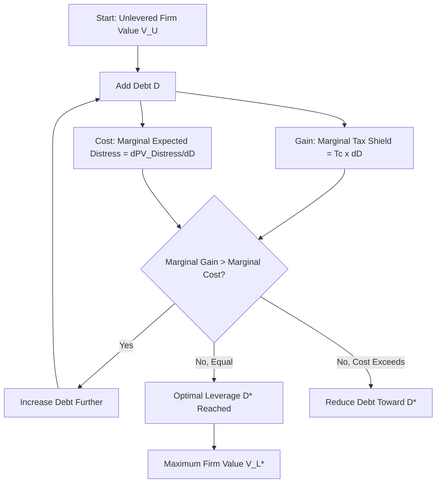

## Trade-Off Theory and Costs of Financial Distress

### Overview

Trade-off theory resolves the unrealistic "100% debt" conclusion of the Modigliani-Miller model with corporate taxes by reintroducing a cost that rises with leverage: **expected costs of financial distress**. The theory posits that firms select a capital structure that balances the marginal tax benefit of debt (the interest tax shield) against the marginal expected cost of financial distress, producing an interior optimum leverage ratio rather than a corner solution.

### Core Framework

**Static Trade-Off Value Equation:**

$$V_L = V_U + PV(\text{Tax Shield}) - PV(\text{Expected Financial Distress Costs})$$

Expanding the tax shield term (from the MM 1963 model):

$$V_L = V_U + T_c D - PV(\text{Financial Distress Costs})$$

**Key Points:**

- Firm value is maximized at the debt level $D^*$ where the *marginal* tax shield benefit equals the *marginal* expected distress cost — not where total tax shield is maximized.
- This is fundamentally a **marginal analysis**, not a total-value comparison: firms keep adding debt as long as $\frac{\partial (T_c D)}{\partial D} > \frac{\partial PV(\text{Distress})}{\partial D}$.
- The optimal capital structure is firm-specific, varying with asset tangibility, earnings volatility, and industry.

### Components of Financial Distress Costs

Financial distress costs are conventionally decomposed into two broad categories:

**1. Direct (Bankruptcy) Costs**

- Legal and administrative fees (attorneys, court costs, trustee fees)
- Accounting and advisory fees during restructuring or Chapter 11/equivalent proceedings
- **[Unverified]** Empirical estimates of direct bankruptcy costs vary widely across studies and jurisdictions, generally cited in a low-single-digit-percent range of pre-distress firm value, but exact figures depend heavily on firm size, industry, and legal regime — treat any specific point estimate as study-specific rather than universal.
- Direct costs tend to exhibit **economies of scale**: they consume a proportionally larger share of value for smaller firms than for large firms, since many costs (legal fees, court costs) are relatively fixed rather than scaling with firm size.

**2. Indirect Costs**

Indirect costs are typically larger in magnitude than direct costs and are harder to quantify because they manifest as foregone value rather than explicit cash outlays:

- **Loss of customer confidence:** Customers avoid firms perceived as likely to fail, especially where product warranties, long-term service, or spare parts matter (e.g., airlines, automakers, enterprise software vendors).
- **Loss of supplier trust:** Suppliers tighten credit terms or demand cash-on-delivery, straining working capital further.
- **Employee departures:** Key talent exits pre-emptively, anticipating instability, degrading firm operating capacity.
- **Forgone investment opportunities:** Distressed firms often underinvest in positive-NPV projects because available cash is directed toward debt service (this connects directly to the underinvestment/debt overhang problem below).
- **Fire-sale asset liquidation:** Assets sold under distress conditions typically fetch below fair market value due to a thin buyer pool and urgency.
- **Management distraction:** Time and resources diverted from operations to renegotiating with creditors.

### Agency Costs of Debt (Distress-Adjacent)

Trade-off theory is often presented alongside agency-cost frictions that amplify as leverage rises, since they are triggered by the same underlying probability of distress:

**Asset Substitution (Risk-Shifting) Problem**

- Equity holders, holding a call-option-like claim on firm value, have an incentive to shift into riskier projects once leverage is high, since equity captures the upside while debt holders bear the downside.
- This is a manifestation of the option-theoretic view of levered equity: $E = \max(V - D, 0)$, which behaves like a call option on firm assets with strike price $D$; option value (and thus equity value under this framing) increases with asset volatility, creating an incentive misalignment.

**Underinvestment (Debt Overhang) Problem**

- Myers (1977): equity holders may reject positive-NPV projects if the bulk of the project's payoff would flow to existing debt holders rather than to equity, particularly near distress.
- This is a primary driver of why highly levered firms cut capital expenditure and R&D during downturns beyond what operating conditions alone would justify.

### Determinants of Optimal Leverage Under Trade-Off Theory

| Firm Characteristic | Effect on Optimal Leverage | Rationale |
| --- | --- | --- |
| High asset tangibility | Higher | Tangible assets retain more value in liquidation; lower distress costs |
| High earnings volatility | Lower | Higher probability of hitting distress trigger points |
| High profitability (stable) | Higher (static trade-off) / Lower (observed, pecking-order tension) | Static theory predicts more debt to shield stable taxable income; empirically profitable firms often use less debt — a documented tension addressed further under Pecking Order Theory |
| High growth opportunities (intangible-asset-heavy) | Lower | Underinvestment/debt overhang costs are more severe when value resides in growth options rather than assets-in-place |
| Large firm size | Higher | Direct bankruptcy costs scale sub-proportionally with size (economies of scale in distress costs) |
| High effective tax rate | Higher | Larger absolute tax shield benefit per dollar of debt |

**[Inference]** The row noting the profitability tension is a widely cited empirical anomaly relative to static trade-off predictions and is the central motivating contrast used when this chapter's material is later compared against pecking order theory; it is presented here as context for that comparison, not as a flaw unique to any specific textbook's exposition.

### Diagram: Static Trade-Off — Optimal Capital Structure (svg_diagram)

<svg xmlns="http://www.w3.org/2000/svg" viewBox="0 0 760 480">
<text x="380" y="30" text-anchor="middle" font-size="18" font-weight="bold" fill="#1a1a1a">Static Trade-Off Theory: Optimal Leverage (svg_diagram)</text>
<line x1="90" y1="420" x2="700" y2="420" stroke="#333" stroke-width="2" />
<line x1="90" y1="420" x2="90" y2="60" stroke="#333" stroke-width="2" />
<text x="400" y="455" text-anchor="middle" font-size="14" fill="#333">Debt Level (D)</text>
<text x="35" y="240" text-anchor="middle" font-size="14" fill="#333" transform="rotate(-90 35 240)">Firm Value</text>

<line x1="90" y1="380" x2="700" y2="380" stroke="#999" stroke-width="1.5" stroke-dasharray="4,4" />
<text x="705" y="384" font-size="12" fill="#999">V_U</text>

<path d="M 90 380 L 700 100" stroke="#0072B2" stroke-width="2" stroke-dasharray="5,3" fill="none" />
<text x="705" y="104" font-size="12" fill="#0072B2">V_L = V_U + TcD (no distress)</text>

<path d="M 90 380 C 250 260, 350 175, 430 165 C 520 175, 620 260, 690 340" stroke="#009E73" stroke-width="3" fill="none" />
<text x="500" y="145" font-size="13" fill="#009E73" font-weight="bold">V_L with distress costs</text>

<circle cx="430" cy="165" r="5" fill="#D55E00" />
<line x1="430" y1="165" x2="430" y2="420" stroke="#D55E00" stroke-width="1.5" stroke-dasharray="3,3" />
<text x="430" y="440" text-anchor="middle" font-size="13" fill="#D55E00" font-weight="bold">D*</text>
<text x="440" y="155" font-size="12" fill="#D55E00">Optimal leverage (max V_L)</text>

<text x="200" y="330" font-size="11" fill="`#0072B2`" opacity="0.8">Gain: tax shield</text>

<text x="580" y="300" font-size="11" fill="`#CC0000`" opacity="0.85">Loss: expected distress costs dominate</text>

</svg>

### Worked Numerical Example

**Setup:**

- $V_U = \$75{,}000{,}000$, $T_c = 25\%$
- Firm evaluates three debt levels: $D_1 = \$20M$, $D_2 = \$40M$, $D_3 = \$60M$
- Estimated present value of expected distress costs (probability-weighted, increasing convexly with leverage): $PV(\text{Distress})$ at each level: $\$0.5M$, $\$4M$, $\$18M$ respectively (illustrative, convex escalation)

**Calculation:**

| Debt Level | Tax Shield $T_c D$ | PV(Distress) | Net Effect | $V_L$ |
| --- | --- | --- | --- | --- |
| $D_1 = \$20M$ | $\$5.0M$ | $\$0.5M$ | +$4.5M | $\$79.5M$ |
| $D_2 = \$40M$ | $\$10.0M$ | $\$4.0M$ | +$6.0M | $\$81.0M$ |
| $D_3 = \$60M$ | $\$15.0M$ | $\$18.0M$ | −$3.0M | $\$72.0M$ |

**Interpretation:** Firm value peaks at $D_2 = \$40M$ ($V_L = \$81.0M$), not at the highest debt level. Beyond this point, the marginal increase in expected distress cost outweighs the marginal tax shield gain, and firm value declines — illustrating the interior optimum that static trade-off theory predicts, in contrast to the monotonic increase implied by the pure MM-with-taxes model.

### Application to Syndicated Loan Structuring

- **Covenant design as a distress-cost mitigant:** Financial covenants (leverage ratios, interest coverage tests, minimum liquidity) in syndicated credit agreements function as *early-warning* and *control-transfer* mechanisms that reduce the expected cost component of trade-off theory by triggering renegotiation before value-destructive formal bankruptcy.
- **Credit rating thresholds:** Rating agencies effectively price in expected distress costs through rating notches; syndication pricing grids (margin ratchets tied to leverage) reflect the market's real-time estimate of where a borrower sits relative to its trade-off optimum.
- **Security and seniority structuring:** Senior secured tranches in a syndicate reduce the direct-cost component (asset recovery is faster and cleaner with clear collateral packages), effectively shifting the trade-off curve's inflection point rightward (supporting higher leverage before distress costs dominate) relative to unsecured structures.
- **Intangible-asset-heavy borrowers** (tech, services, IP-driven businesses) are structurally disadvantaged in trade-off terms since — per the determinants table above — such firms face higher underinvestment costs, which is a documented reason syndicate arrangers apply lower leverage multiples to asset-light sectors regardless of stable cash flow, all else equal.

### Common Pitfalls

- Treating trade-off theory as prescribing a single "correct" leverage ratio universally — the model is explicitly firm-specific and depends on parameters (volatility, tangibility, tax rate) that shift the curve.
- Conflating direct bankruptcy costs (small, cash-cost items) with indirect costs (large, opportunity-cost items) when estimating $PV(\text{Distress})$ — indirect costs are the dominant term in most empirical treatments and are the harder component to model.
- Assuming distress costs only matter in formal bankruptcy — costs from customer/supplier/employee behavior begin accruing well before any legal insolvency event, once the *probability* of distress becomes non-trivial to counterparties.
- Ignoring that observed firm behavior (profitable firms often carrying less debt than static trade-off predicts) is a known empirical tension addressed by pecking order theory, not evidence that trade-off theory is invalidated outright — the two frameworks are generally treated as complementary rather than mutually exclusive in the literature.

### Mermaid: Trade-Off Theory Decision Logic

### Related Topics

- Modigliani-Miller with Corporate Taxes and the Debt Tax Shield (prerequisite model)
- Pecking Order Theory — asymmetric information as an alternative/complementary explanation for observed leverage patterns
- Agency Theory of Capital Structure (Jensen & Meckling 1976) — free cash flow hypothesis and agency costs of equity vs. debt
- Myers (1977) underinvestment / debt overhang problem in depth
- Bankruptcy prediction models (Altman Z-score, Merton distance-to-default)
- Covenant structuring in syndicated credit facilities
- Credit rating methodology and leverage thresholds
- Option-theoretic (contingent claims) view of corporate securities