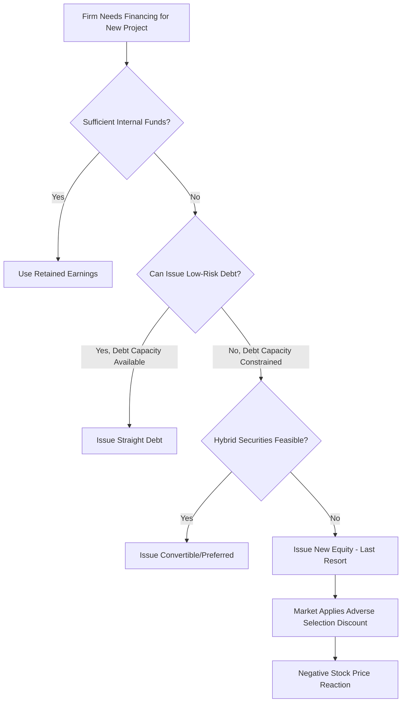

## Pecking Order Theory and Information Asymmetry

### Overview

Pecking order theory, formalized by Myers (1984) and Myers & Majluf (1984), explains observed corporate financing behavior not as the pursuit of an optimal target leverage ratio (as in trade-off theory), but as a hierarchical preference ordering driven by **information asymmetry** between managers/insiders and outside investors. Firms are theorized to prefer internal financing first, debt second, and external equity last — not because of tax shields or distress costs, but because each financing source carries a different signaling cost tied to how mispricing risk falls on existing shareholders.

### Core Hierarchy

The theory prescribes a strict preference ordering for financing new investment:

1. **Internal funds (retained earnings)** — no information asymmetry cost; no external party needs to be convinced of firm value.
2. **Debt** — lowest information-sensitivity among external sources; a fixed claim whose value is relatively insensitive to private information about firm quality.
3. **Hybrid securities (convertible debt, preferred stock)** — intermediate sensitivity.
4. **External equity (new share issuance)** — highest information-sensitivity; last resort.

**Key Points:**

- This is **not** a target-ratio theory. There is no optimal $D/E$ that firms aim for; observed leverage is simply the *cumulative result* of historical financing deficits being plugged in this preferred order.
- Firms with large, stable internal cash flows should exhibit *low* observed debt — not because they don't value the tax shield, but because they simply never need to tap external markets.
- This directly explains the empirical anomaly noted under trade-off theory: highly profitable firms often carry *less* debt than static trade-off theory predicts, because they fund investment internally rather than optimizing toward a target leverage ratio.

### The Myers-Majluf (1984) Adverse Selection Model

**Setup:**

- A firm has assets-in-place and a new positive-NPV investment opportunity requiring external financing.
- Managers possess private information about the true value of assets-in-place that outside investors do not have.
- Managers act in the interest of *existing* shareholders (not new shareholders being brought in).

**Core Mechanism:**

If a firm issues new equity to fund a project, outside investors cannot distinguish whether the firm is issuing because:

(a) the investment opportunity is genuinely attractive and needs funding, or

(b) management believes the firm's existing assets are *overvalued* by the market and is opportunistically raising cheap capital.

Rational investors, unable to distinguish these cases, apply a **discount** to any equity issuance announcement — inferring that management is more likely to issue when insiders believe shares are overpriced. This is the foundation of the well-documented **negative stock price reaction to seasoned equity offering (SEO) announcements**.

**Formal Intuition (Signaling Cost):**

Let $V$ = true (insider-known) value of the firm's existing assets, and $I$ = investment required for the new project with NPV $= N > 0$.

If the firm issues equity worth $I$ to outside investors at the *market's* (uninformed) valuation $\hat{V}$, and $\hat{V} < V$ (market undervalues the firm relative to insider information), then:

- New shareholders receive a claim worth more than what they paid in real terms (since they're buying into a firm truly worth $V$, not $\hat{V}$).
- This constitutes a wealth transfer from existing shareholders to new shareholders.
- If this transfer exceeds the NPV of the new project ($N$), rational managers **reject the positive-NPV project rather than issue undervalued equity** — a direct underinvestment result, distinct from (but related to) the debt-overhang underinvestment problem in trade-off theory.

Managers will only issue equity when they believe the firm is fairly valued or overvalued by the market — which is precisely the signal outside investors rationally anticipate and price in.

**Why Debt Mitigates This Problem:**

Debt's value is far less sensitive to private information about firm quality than equity's value, because debt holders have a fixed, senior claim. The valuation gap between $\hat{V}$ (market-perceived) and $V$ (true) matters much less for a bond's price than for a stock's price, since a moderately-undervalued firm can still service fixed debt obligations without transferring as much hidden value to the new claimholder. This is why debt sits above equity in the pecking order — it minimizes the adverse-selection discount.

### Diagram: Information Sensitivity and Financing Order (svg_diagram)

<svg xmlns="http://www.w3.org/2000/svg" viewBox="0 0 760 420">
<text x="380" y="30" text-anchor="middle" font-size="18" font-weight="bold" fill="#1a1a1a">Pecking Order: Information Sensitivity by Security Type (svg_diagram)</text>
<line x1="90" y1="360" x2="700" y2="360" stroke="#333" stroke-width="2" />
<line x1="90" y1="360" x2="90" y2="60" stroke="#333" stroke-width="2" />
<text x="400" y="395" text-anchor="middle" font-size="14" fill="#333">Financing Source (preference order →)</text>
<text x="35" y="220" text-anchor="middle" font-size="14" fill="#333" transform="rotate(-90 35 220)">Info. Asymmetry Cost</text>

<rect x="130" y="330" width="90" height="30" fill="#009E73" />
<text x="175" y="380" text-anchor="middle" font-size="12" fill="#333">Internal Funds</text>
<rect x="270" y="290" width="90" height="70" fill="#0072B2" />
<text x="315" y="380" text-anchor="middle" font-size="12" fill="#333">Straight Debt</text>
<rect x="410" y="220" width="90" height="140" fill="#E69F00" />
<text x="455" y="380" text-anchor="middle" font-size="12" fill="#333">Convertible/Hybrid</text>
<rect x="550" y="90" width="90" height="270" fill="#D55E00" />
<text x="595" y="380" text-anchor="middle" font-size="12" fill="#333">New Equity</text>

<text x="175" y="320" text-anchor="middle" font-size="11" fill="#555">~none</text>

<text x="315" y="280" text-anchor="middle" font-size="11" fill="#555">low</text>

<text x="455" y="210" text-anchor="middle" font-size="11" fill="#555">moderate</text>

<text x="595" y="80" text-anchor="middle" font-size="11" fill="#555">highest</text>

</svg>

### Empirical Signaling Predictions

Pecking order theory generates specific, testable market-reaction predictions that distinguish it from trade-off theory:

| Announcement Type | Predicted Stock Price Reaction | Rationale |
| --- | --- | --- |
| New equity issuance (SEO) | Negative | Signals management believes shares are overvalued |
| New straight debt issuance | Near-zero / slightly negative | Low information sensitivity; minimal adverse selection |
| Convertible debt issuance | Negative, intermediate magnitude | Partial equity-like sensitivity |
| Share buyback / debt-funded repurchase | Positive | Signals management believes shares are undervalued |
| Dividend increase | Positive | Signals confidence in sustained future cash flows |
| Dividend cut | Negative | Signals deteriorating expected future cash flows |

**[Unverified]** Exact magnitudes of these price reactions vary considerably across empirical studies, time periods, and markets; the *direction* of each predicted effect is the well-established, broadly replicated finding, while precise abnormal-return percentages should not be treated as universal constants.

### Financing Deficit and the "Pecking Order" Regression

A common empirical test (Shyam-Sunder & Myers, 1999) regresses net debt issuance against the firm's **financing deficit**:

$$\Delta D_t = a + b \cdot DEF_t + \epsilon_t$$

Where $DEF_t$ = financing deficit = (dividends + capex + working capital change) − (internal cash flow).

Under strict pecking order behavior, the coefficient $b$ should be close to $1$ — meaning essentially all of the financing deficit is plugged with debt, since equity is a last resort. Deviations from $b \approx 1$ (particularly at high leverage levels, where firms shift toward equity due to debt capacity constraints) have been documented and are used to argue for a **modified** or **constrained** pecking order, sometimes reconciled with trade-off theory as complementary rather than competing frameworks.

### Pecking Order vs. Trade-Off Theory — Key Contrasts

| Dimension | Trade-Off Theory | Pecking Order Theory |
| --- | --- | --- |
| Driving mechanism | Tax shield vs. distress cost balance | Information asymmetry / adverse selection |
| Target leverage | Yes — firm-specific optimum $D^*$ | No — leverage is a residual outcome |
| Profitable firms' leverage | Predicted higher (more taxable income to shield) | Predicted lower (fund internally, avoid external issuance) |
| Equity issuance | Neutral/routine rebalancing tool | Last resort, negative signaling event |
| Explains SEO price drops | Not directly | Central, well-documented prediction |
| Explains cross-sectional profitability-leverage anomaly | Poorly (empirical tension) | Well |

### Application to Capital Structuring and Syndication

- **Loan-vs-bond-vs-equity sequencing in deal structuring:** Advisors structuring a financing package for a client with an information-sensitive story (e.g., a growth-stage or turnaround borrower) will often default to syndicated debt/leveraged loan structures over equity precisely because debt minimizes the adverse-selection discount the market would apply to a new share issuance.
- **Private placement and club syndication:** Bringing in a small, informed syndicate of relationship lenders (versus a widely distributed public bond or equity offering) can further reduce information asymmetry costs, since sophisticated lenders can perform deeper due diligence than dispersed public market participants — effectively moving the financing "down" the information-sensitivity curve even within the debt category.
- **Rights issues and pre-emption structures:** When equity issuance becomes unavoidable, structuring it as a rights issue (offered first to existing shareholders) mitigates some of the Myers-Majluf wealth-transfer concern, since existing shareholders — who share the manager's information set to a greater degree — have the first opportunity to participate before external dilution occurs.
- **Debt capacity constraints and forced equity:** Highly levered borrowers who exhaust senior/subordinated debt capacity in a syndication and are pushed toward equity or equity-linked instruments (converts, PIK toggle notes) as a "last resort" is a direct real-world manifestation of the pecking order breaking down at high leverage — connecting to the "constrained pecking order" empirical literature.

### Common Pitfalls

- Treating pecking order theory as claiming firms never issue equity — it predicts equity is a *last resort*, not that it never occurs; high-growth firms with large financing deficits and exhausted debt capacity are a documented exception.
- Confusing pecking order's information-asymmetry cost with trade-off theory's distress cost — they are different frictions and lead to different predictions about which firms should carry more debt.
- Assuming the theory implies a normative "should" — pecking order is primarily a *positive* (descriptive) theory explaining observed financing patterns, not a prescriptive optimization framework like static trade-off theory.
- Over-generalizing SEO announcement effects to all equity-related events; buybacks and dividend changes carry opposite-signed signals and should not be conflated with new issuance signaling.

### Mermaid: Pecking Order Decision Sequence

### Related Topics

- Modigliani-Miller with Corporate Taxes and the Debt Tax Shield
- Trade-Off Theory and Costs of Financial Distress
- Signaling Theory in Corporate Finance (dividend signaling, Ross 1977 debt signaling model)
- Myers-Majluf (1984) formal adverse selection model in depth
- Agency Theory of Capital Structure and free cash flow hypothesis
- Seasoned Equity Offering (SEO) announcement effects — empirical event studies
- Rights issues vs. public offerings in equity syndication
- Debt capacity constraints and constrained pecking order literature
- Market timing theory of capital structure (Baker & Wurgler)