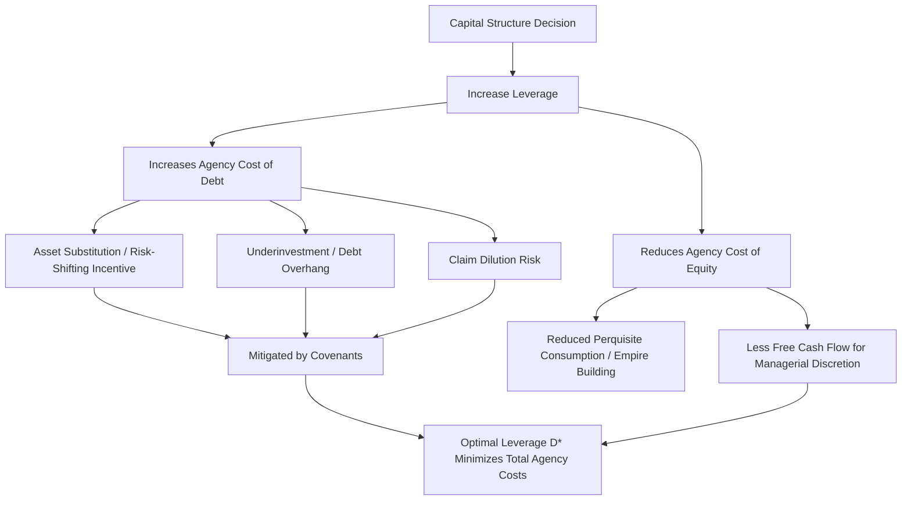

## Agency Cost Theory of Capital Structure

### Overview

Agency cost theory, most formally articulated by Jensen & Meckling (1976), explains capital structure choice as a mechanism for managing conflicts of interest among three parties: managers, shareholders, and debt holders. Unlike trade-off theory (which balances tax shields against distress costs) or pecking order theory (which is driven by information asymmetry), agency theory frames leverage as a tool that simultaneously creates *and* mitigates agency conflicts, with the optimal capital structure minimizing the **total agency costs** across both debt and equity.

### Two Core Agency Conflicts

**1. Agency Costs of Equity — Manager vs. Shareholder Conflict**

When managers hold less than 100% of the firm's equity, they bear only a fraction of the cost of value-destroying behavior while capturing private benefits in full. This misalignment produces:

- **Perquisite consumption:** Excess spending on corporate jets, lavish offices, empire-building acquisitions that boost managerial prestige/compensation rather than shareholder value.
- **Free cash flow problem (Jensen, 1986):** Managers of firms with substantial free cash flow (cash beyond what is needed to fund all positive-NPV projects) have an incentive to retain and misallocate it (e.g., value-destroying diversification, overpayment in M&A) rather than distribute it to shareholders.
- **Shirking:** Reduced managerial effort since the manager does not capture the full marginal benefit of effort.

**Debt as a Disciplining Mechanism:**

Increasing leverage reduces the free cash flow available for managerial discretion by committing the firm to fixed interest and principal payments. This is Jensen's **"control hypothesis"** of debt: debt functions as a bonding mechanism that forces managers to generate cash to service obligations, reducing the pool of discretionary free cash flow available for empire-building or perquisite consumption.

$$\text{Agency Cost of Equity} \downarrow \text{ as Leverage} \uparrow$$

**2. Agency Costs of Debt — Shareholder vs. Debt Holder Conflict**

Once debt is issued, equity holders (via the managers acting on their behalf) have incentives to expropriate value from debt holders. This conflict *increases* with leverage — the opposite direction of the equity agency conflict above:

- **Asset Substitution (Risk-Shifting):** As previously noted in trade-off theory, levered equity resembles a call option on firm value ($E = \max(V-D,0)$); equity holders benefit from increasing asset volatility post-issuance since option value rises with volatility, while debt holders bear the downside without commensurate compensation for the added risk.
- **Underinvestment (Debt Overhang), Myers (1977):** Equity holders may reject positive-NPV projects when project payoffs would predominantly benefit debt holders (i.e., a large share of value flows to satisfying existing debt claims rather than to equity), because the private return to equity holders from a marginal dollar invested is diluted by the value transfer to debt.
- **Claim Dilution:** Issuing additional debt (of equal or higher priority) after existing debt is outstanding transfers value from existing debt holders to shareholders, since new debt holders share in firm assets alongside — or ahead of — old debt holders without proportionally compensating them.
- **Milking the Property (Excessive Dividends):** Paying out unusually large dividends or engaging in aggressive share buybacks funded by asset liquidation strips value that debt holders had implicitly counted on for repayment.

$$\text{Agency Cost of Debt} \uparrow \text{ as Leverage} \uparrow$$

**Key Points:**

- Rational debt holders anticipate these behaviors *ex ante* and price the risk into the required yield or embed protective covenants at issuance — meaning agency costs of debt are ultimately borne by *shareholders* in the form of a higher cost of debt capital, not passed costlessly onto lenders.
- This creates the theory's central trade-off: increasing leverage reduces the agency cost of equity (via the free cash flow / discipline channel) but increases the agency cost of debt (via risk-shifting and underinvestment channels).

### Total Agency Cost Minimization

**Core Optimization Logic:**

$$\text{Total Agency Costs} = \text{Agency Costs of Equity}(D) + \text{Agency Costs of Debt}(D)$$

The theory posits an optimal leverage ratio $D^*$ that minimizes this sum — structurally parallel to trade-off theory's tax-shield-vs-distress-cost optimization, but driven by a different underlying mechanism (behavioral/contracting conflicts rather than tax and bankruptcy frictions).

### Diagram: Agency Cost Trade-Off Curve (svg_diagram)

<svg xmlns="http://www.w3.org/2000/svg" viewBox="0 0 760 460">
<text x="380" y="30" text-anchor="middle" font-size="18" font-weight="bold" fill="#1a1a1a">Agency Cost Theory: Optimal Leverage (svg_diagram)</text>
<line x1="90" y1="400" x2="700" y2="400" stroke="#333" stroke-width="2" />
<line x1="90" y1="400" x2="90" y2="60" stroke="#333" stroke-width="2" />
<text x="400" y="435" text-anchor="middle" font-size="14" fill="#333">Leverage (D/V)</text>
<text x="35" y="230" text-anchor="middle" font-size="14" fill="#333" transform="rotate(-90 35 230)">Agency Costs</text>

<path d="M 90 100 C 250 180, 400 300, 690 380" stroke="#0072B2" stroke-width="2.5" fill="none" />
<text x="120" y="90" font-size="12" fill="#0072B2">Agency Cost of Equity (declining)</text>

<path d="M 90 380 C 300 350, 500 220, 690 90" stroke="#D55E00" stroke-width="2.5" fill="none" />
<text x="480" y="95" font-size="12" fill="#D55E00">Agency Cost of Debt (rising)</text>

<path d="M 90 240 C 250 180, 350 160, 430 165 C 520 172, 620 230, 690 260" stroke="#009E73" stroke-width="3" fill="none" />
<text x="440" y="150" font-size="13" fill="#009E73" font-weight="bold">Total Agency Costs</text>

<circle cx="430" cy="165" r="5" fill="#000" />
<line x1="430" y1="165" x2="430" y2="400" stroke="#000" stroke-width="1.5" stroke-dasharray="3,3" />
<text x="430" y="420" text-anchor="middle" font-size="13" fill="#000" font-weight="bold">D* (min total agency cost)</text>
</svg>

### Covenants as Agency Cost Mitigants

Debt covenants exist specifically to reduce the agency costs of debt identified above by contractually restricting the risk-shifting and value-expropriation behaviors that debt holders anticipate:

| Covenant Type | Agency Problem Addressed |
| --- | --- |
| Restrictions on additional debt issuance / leverage ratio caps | Claim dilution |
| Minimum net worth / dividend payout restrictions | Milking the property (excessive dividends) |
| Restrictions on asset sales or capex outside ordinary course | Asset substitution / risk-shifting |
| Cross-default and negative pledge clauses | Protects relative priority against opportunistic behavior |
| Maintenance covenants (interest coverage, leverage tests) | Early warning / control-transfer mechanism, reducing both debt agency costs and financial distress costs |
| Minimum investment / capex requirements (less common) | Underinvestment / debt overhang |

**Key Points:**

- Covenants themselves are not costless — they impose monitoring costs on lenders (typically passed to borrowers via fees or spread) and reduce managerial flexibility, which is itself a friction, so covenant intensity is also subject to an optimization trade-off rather than being maximized without limit.
- Tighter covenant packages are generally associated with lower agency costs of debt (and thus can support somewhat higher leverage or lower pricing at a given leverage level), which is a key mechanism syndicate arrangers use when structuring credit agreements for borrowers with elevated agency-conflict risk (e.g., high insider ownership concentration, weak external monitoring, opaque asset bases).

### Worked Illustration: Free Cash Flow Discipline Effect

**Setup:**

- Firm generates $50M in annual operating cash flow.
- All positive-NPV investment opportunities require only $30M annually.
- Free cash flow = $20M/year in "discretionary" cash with no positive-NPV use.

**Scenario A — Low Leverage (no discipline):**

Manager retains discretion over the $20M free cash flow; empirically and theoretically, a portion is predicted to be misallocated (e.g., value-destroying acquisitions, excess perquisites) rather than returned to shareholders.

**Scenario B — Higher Leverage (debt discipline applied):**

Firm commits to $20M/year in interest and scheduled principal payments (via, e.g., a syndicated term loan). This fully absorbs the discretionary free cash flow, leaving the manager with no surplus to misallocate — the "control hypothesis" mechanism in direct effect. The firm must generate operating cash flow reliably to service this obligation, which also functions as a costly, credible signal of expected future cash flow stability to the market.

**Trade-off introduced:** This same $20M/year commitment increases the firm's probability of distress in a downturn, since the interest/principal obligation is fixed regardless of realized cash flow — connecting the free cash flow discipline benefit directly back to the financial distress cost machinery from trade-off theory. **[Inference]** The two theories (agency cost and trade-off) are frequently presented as complementary lenses on the same underlying leverage decision rather than as competing, mutually exclusive frameworks, since both ultimately identify a cost that rises with leverage to counterbalance a benefit that also rises with leverage — trade-off theory frames the rising cost as bankruptcy/distress-related, while agency theory frames a portion of it as the debt-holder expropriation risk described above.

### Application to Syndicated Loan Structuring

- **Covenant-heavy vs. covenant-lite structures:** The rise of "covenant-lite" syndicated leveraged loans represents a market-level shift in how agency costs of debt are priced and allocated — lenders accepting looser covenants typically demand higher spreads or stronger collateral/security packages to compensate for the reduced contractual protection against the agency conflicts described above.
- **Sponsor-backed leveraged buyouts (LBOs):** Private equity-sponsored syndications are a canonical real-world application of the free cash flow discipline hypothesis — high leverage is deliberately used post-buyout to constrain management's discretionary cash flow and align incentives, with the syndicate's covenant package serving as the primary agency-cost-of-debt mitigant given the typically high leverage multiples involved.
- **Monitoring role of lead arrangers:** In a syndicated structure, the lead arranger/agent bank typically retains an ongoing monitoring relationship (covenant compliance certificates, financial reporting requirements) that functions as a delegated monitoring mechanism reducing agency costs relative to a purely public, widely dispersed bondholder base — this delegated monitoring function is a documented rationale in the literature for why bank debt and public debt carry different covenant intensities and agency-cost profiles for otherwise similar borrowers.
- **Management equity co-investment requirements:** Sponsors and syndicate lenders alike often require management to hold meaningful equity stakes post-transaction specifically to reduce the manager-shareholder agency conflict (aligning managerial and equity-holder interests), which is a direct structural response to the Jensen-Meckling agency-of-equity conflict rather than the debt-side conflict.

### Common Pitfalls

- Confusing agency costs of equity (declining with leverage) with agency costs of debt (rising with leverage) — they move in opposite directions with respect to leverage, and the theory's central insight is precisely this offsetting relationship.
- Treating the free cash flow hypothesis as applicable to all firms uniformly — it is most relevant to firms with substantial cash generation and limited growth/reinvestment opportunities; high-growth firms with genuine capital needs face a different (and often opposite) set of agency dynamics.
- Assuming covenants eliminate agency costs of debt entirely — covenants reduce but do not eliminate these costs, and covenant monitoring/enforcement itself carries a cost that must be weighed in the total optimization.
- Overlooking that agency theory and trade-off theory are frequently blended in practice (and in most modern textbook treatments) rather than treated as fully independent, competing explanations of capital structure.

### Mermaid: Agency Conflict and Mitigation Pathways

### Related Topics

- Trade-Off Theory and Costs of Financial Distress (complementary distress-cost framework)
- Pecking Order Theory and Information Asymmetry (alternative information-driven framework)
- Jensen (1986) Free Cash Flow Hypothesis in depth
- Myers (1977) Underinvestment / Debt Overhang Problem
- Covenant design and negotiation in syndicated leveraged loans
- Leveraged buyout (LBO) capital structuring and sponsor equity requirements
- Delegated monitoring theory of financial intermediation (Diamond, 1984)
- Corporate governance mechanisms and managerial incentive alignment (equity compensation, co-investment)