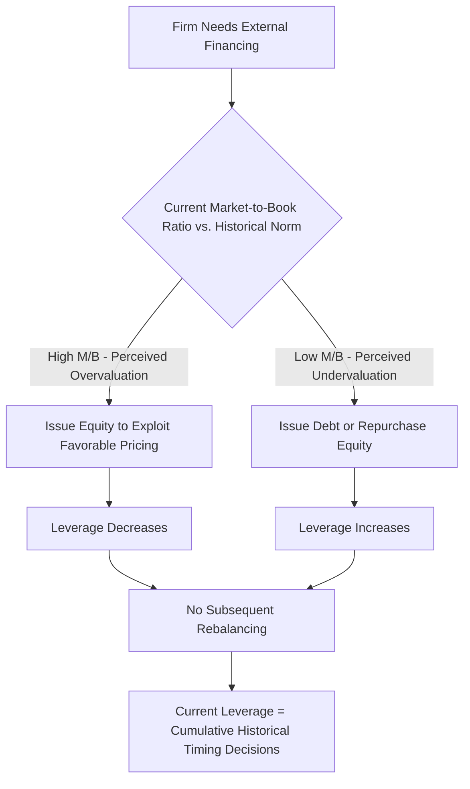

## Market Timing Theory of Capital Structure

### Overview

Market timing theory, most closely associated with Baker & Wurgler (2002), proposes that observed capital structure is not the outcome of optimizing toward a target leverage ratio (trade-off theory) or a strict financing hierarchy (pecking order theory), but rather the **cumulative outcome of past attempts by managers to time equity markets** — issuing equity when it is perceived to be overvalued (low cost of equity capital) and repurchasing or issuing debt when equity is perceived undervalued. Under this view, current capital structure is best understood as the running sum of historical market timing decisions rather than a deliberate target.

### Core Thesis

**Central Claim (Baker & Wurgler, 2002):**

$$\text{Leverage}_t = f(\text{Historical Market-to-Book Ratios at Financing Dates})$$

Firms are hypothesized to issue equity disproportionately when their market valuation (measured via market-to-book ratio, M/B) is high relative to book or historical valuation, and to issue debt or repurchase equity when M/B is low. Critically, Baker & Wurgler's key empirical claim is that these financing decisions have a **persistent, long-lasting impact** on capital structure — there is no subsequent rebalancing back toward a target ratio. Low leverage firms are simply those that raised equity when valuations were historically high; high leverage firms are those that did not (or that raised debt when valuations were low).

**Key Points:**

- This is fundamentally an **anti-target** theory: unlike trade-off theory's interior optimum $D^*$, market timing theory holds that there is no target leverage ratio being pursued at all — current leverage is a historical accident of past market conditions at financing dates.
- The theory is empirically grounded in the observation that the **historical, external-finance-weighted average market-to-book ratio** at the time of past financing events is a statistically significant predictor of current leverage, even after controlling for standard trade-off and pecking-order variables (profitability, tangibility, size).
- Distinguishes itself from pecking order theory: pecking order predicts equity is a last resort *regardless* of valuation level, driven by adverse selection costs; market timing predicts managers *actively exploit* valuation windows, issuing equity opportunistically even when other financing might be available.

### Mechanisms Underlying Market Timing Behavior

**1. Rational Managers, Irrational (or Asymmetrically Informed) Markets**

- Managers possess superior information about firm value (consistent with the adverse-selection framework in pecking order theory) and rationally issue equity when they believe the market is overvaluing the firm's shares relative to true fundamental value.
- This overlaps conceptually with the Myers-Majluf mechanism but reframes the emphasis: rather than viewing equity issuance purely as a costly last resort, market timing theory views it as an *opportunistically exploited* financing channel whenever the valuation window is favorable.

**2. Windows of Opportunity**

- Equity issuance activity in aggregate markets is empirically observed to cluster during periods of high market valuations (e.g., "hot" IPO and SEO markets), consistent with issuers collectively exploiting favorable windows rather than issuing steadily in proportion to financing needs.
- **[Unverified]** The precise degree to which aggregate issuance clustering reflects genuine mispricing exploitation versus simply lower cost of capital during periods of strong fundamentals (which could be consistent with rational, efficient-market financing rather than timing of *mispricing* per se) remains a debated point in the academic literature; this distinction is a recognized identification challenge, not a settled matter.

**3. No Rebalancing Assumption**

- The theory's most distinctive and most-tested claim is the *absence* of subsequent capital structure rebalancing: once a firm issues equity during a high-valuation window, it does not systematically re-lever back toward a prior target over time.
- This contrasts sharply with dynamic trade-off theory, which explicitly predicts firms adjust back toward a target leverage ratio over time (subject to adjustment costs), and represents the theory's most falsifiable and most contested proposition.

### Diagram: Market Timing Mechanism (svg_diagram)

<svg xmlns="http://www.w3.org/2000/svg" viewBox="0 0 760 440">
<text x="380" y="30" text-anchor="middle" font-size="18" font-weight="bold" fill="#1a1a1a">Market Timing Theory: Financing Choice vs. Valuation (svg_diagram)</text>
<line x1="90" y1="380" x2="700" y2="380" stroke="#333" stroke-width="2" />
<line x1="90" y1="380" x2="90" y2="60" stroke="#333" stroke-width="2" />
<text x="400" y="415" text-anchor="middle" font-size="14" fill="#333">Time</text>
<text x="35" y="220" text-anchor="middle" font-size="14" fill="#333" transform="rotate(-90 35 220)">Market-to-Book Ratio</text>

<path d="M 90 260 C 150 150, 220 150, 280 260 C 340 350, 400 350, 460 220 C 520 120, 580 120, 640 240 C 670 290, 690 300, 700 290" stroke="`#0072B2`" stroke-width="2.5" fill="none" />

<circle cx="250" cy="175" r="7" fill="#009E73" />
<text x="250" y="150" text-anchor="middle" font-size="11" fill="#009E73">Issue Equity</text>
<circle cx="560" cy="140" r="7" fill="#009E73" />
<text x="560" y="115" text-anchor="middle" font-size="11" fill="#009E73">Issue Equity</text>

<circle cx="370" cy="345" r="7" fill="#D55E00" />
<text x="370" y="365" text-anchor="middle" font-size="11" fill="#D55E00">Debt / Buyback</text>

<text x="120" y="80" font-size="12" fill="#555">High M/B → perceived overvaluation window</text>

<text x="120" y="98" font-size="12" fill="#555">Low M/B → perceived undervaluation, avoid equity</text>

</svg>

### Empirical Measurement: The External Finance Weighted Average M/B

Baker & Wurgler's key regressor, used to test persistence of timing effects on leverage, is typically constructed as:

$$\left(\frac{M}{B}\right)_{efwa,t} = \sum_{s=0}^{t-1} \frac{e_s + d_s}{\sum_{r=0}^{t-1}(e_r + d_r)} \left(\frac{M}{B}\right)_s$$

Where:

- $e_s$ = equity issued in year $s$
- $d_s$ = debt issued in year $s$
- $(M/B)_s$ = market-to-book ratio in year $s$

This variable weights each historical period's valuation ratio by how much external financing occurred in that period — periods with heavy equity issuance at high M/B contribute more heavily to the running average, capturing the theory's core prediction that historically high-valuation financing events leave a lasting imprint on current capital structure.

**Key Points:**

- A positive, statistically significant coefficient on this variable when regressed against current leverage (controlling for standard trade-off/pecking-order variables) is interpreted as evidence for market timing persistence.
- **[Unverified]** Subsequent empirical literature has produced mixed results on the *persistence* of this effect over multi-year horizons — some follow-up studies find the timing effect decays over 3-5 year periods (implying partial rebalancing consistent with dynamic trade-off theory), while others find longer persistence; treat the durability of the effect as an actively contested empirical question rather than a settled finding.

### Market Timing vs. Trade-Off vs. Pecking Order — Comparative Summary

| Dimension | Trade-Off Theory | Pecking Order Theory | Market Timing Theory |
| --- | --- | --- | --- |
| Target leverage exists? | Yes, firm-specific $D^*$ | No — residual outcome | No — historical accident |
| Rebalancing behavior | Active, toward $D^*$ | N/A (no target) | None (persistent) |
| Equity issuance driver | Rebalancing toward target | Last resort (info asymmetry) | Opportunistic (perceived overvaluation) |
| Role of valuation levels | Indirect (via cost of capital) | Not central | Central, direct driver |
| Primary testable implication | Mean reversion in leverage | Financing deficit fully absorbed by debt | Historical M/B predicts current leverage persistently |

### Application to Syndicated Loan Structuring and Capital Markets Advisory

- **Sequencing debt and equity capital markets execution:** Advisors managing a company's broader capital plan (e.g., a leveraged issuer planning both a syndicated term loan and a future equity raise) may factor market timing considerations into sequencing — favoring debt syndication during periods of depressed equity valuations and reserving equity issuance (or equity-linked instruments) for higher-valuation windows, consistent with the theory's opportunistic issuance logic.
- **Refinancing and take-out strategy:** Bridge financing structures in syndicated deals (e.g., acquisition bridge loans intended to be refinanced with a permanent capital markets take-out) implicitly embed market timing logic — the bridge is structured with flex/toggle features allowing the borrower to time the eventual bond or equity take-out to prevailing market windows rather than being forced to execute at a fixed date regardless of valuation conditions.
- **Convertible and equity-linked syndications:** Structuring convertible note or equity-linked syndications allows issuers to partially participate in market timing benefits (lower coupon in exchange for equity optionality) without fully committing to a pure equity issuance at potentially unfavorable relative valuation, a hybrid approach that sits between the pure debt and pure equity ends of the pecking order while incorporating timing considerations.
- **Caution for lenders/underwriters:** Because market timing theory implies leverage levels may reflect stale historical valuation windows rather than a deliberate, sustainable target, credit analysts assessing a syndication candidate's leverage trajectory should consider whether current leverage reflects a genuine strategic target or simply the residue of past opportunistic financing decisions — relevant when forecasting whether the borrower is likely to actively delever or maintain current leverage going forward.

### Common Pitfalls

- Treating market timing theory as claiming markets are inefficient in an unqualified sense — the theory is compatible with managers possessing superior private information (a rational-asymmetric-information framing) rather than requiring market irrationality per se, though behavioral finance interpretations of the theory do lean on investor sentiment/mispricing.
- Conflating market timing theory with pecking order theory simply because both feature equity as an information-sensitive financing choice — the two make different predictions: pecking order says equity is avoided *regardless* of valuation level when possible, while market timing says equity is actively *sought* when overvaluation is perceived.
- Overstating the "no rebalancing" finding as universally settled — this is the theory's most contested empirical claim, and later literature has documented conditions under which capital structure does mean-revert over time, in tension with the original Baker-Wurgler persistence finding.
- Assuming the theory implies short-term stock-picking-style market timing skill on the part of corporate managers — the relevant "timing" is typically measured over the multi-year horizon of financing decisions, not short-run market movements.

### Mermaid: Market Timing Financing Decision Flow

### Related Topics

- Pecking Order Theory and Information Asymmetry (contrast: last-resort vs. opportunistic equity issuance)
- Trade-Off Theory and Costs of Financial Distress (contrast: target leverage vs. no-target)
- Agency Cost Theory of Capital Structure
- Behavioral Corporate Finance and managerial market-timing incentives
- IPO and SEO "hot markets" / issuance clustering literature
- Dynamic capital structure adjustment and speed-of-adjustment models
- Convertible bond and equity-linked security structuring
- Bridge financing and permanent capital markets take-out strategy