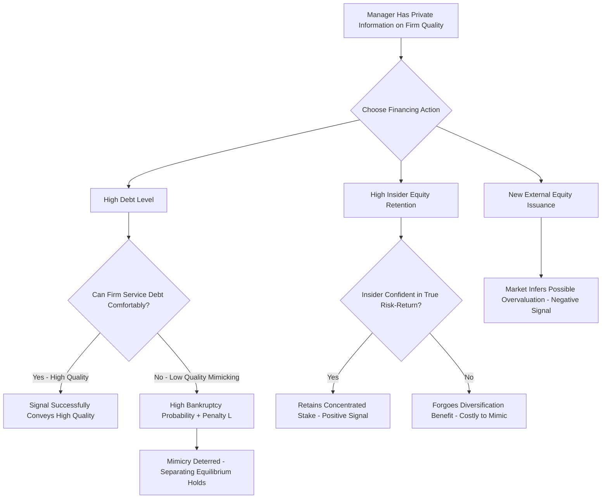

## Signaling Theory and Capital Structure Decisions

### Overview

Signaling theory in capital structure, pioneered by Ross (1977) and extended by Leland & Pyle (1977), models financing choices as **credible signals** that managers use to convey private information about firm quality to outside investors under conditions of information asymmetry. Unlike pecking order theory (which emphasizes the *cost* of adverse selection in constraining financing choice) or market timing theory (which emphasizes *opportunistic exploitation* of valuation windows), signaling theory focuses on how specific financing instruments and actions function as costly, and therefore credible, signals precisely because low-quality firms cannot profitably mimic them.

### Core Signaling Logic

**The Fundamental Requirement for a Credible Signal:**

For a financing action to function as a credible signal of firm quality, it must satisfy a **single-crossing property**: the action must be more costly (or riskier) for a low-quality firm to take than for a high-quality firm, such that low-quality firms are rationally deterred from mimicking high-quality firms' signals.

$$\text{Cost of Signal to Low-Quality Firm} > \text{Cost of Signal to High-Quality Firm}$$

If this condition fails, all firms (regardless of quality) would find it optimal to send the same signal, and the signal would carry no information — a "pooling equilibrium" rather than a "separating equilibrium."

### The Ross (1977) Debt Signaling Model

**Core Mechanism:**

Ross models managers as possessing private information about the firm's future cash flow distribution. Managers are assumed to be compensated in a manner tied to firm value (post-bankruptcy-cost-adjusted), and increasing leverage functions as a signal of confidence in future cash flows because:

- High debt levels increase the probability of financial distress/bankruptcy if future cash flows disappoint.
- Managers of genuinely high-quality (high expected cash flow) firms can take on higher debt levels while confidently expecting to avoid the distress-related penalty, since they anticipate sufficient cash flow to service the obligation.
- Managers of low-quality firms who attempted to mimic this behavior (issuing high debt they don't expect to service comfortably) would face a higher expected probability of triggering the distress penalty, making the mimicry strategy costly and unattractive.

**Formal Intuition:**

Let managerial compensation include a penalty $L$ imposed in the event of bankruptcy (reputational cost, personal liability, loss of control benefits). A manager chooses debt level $D$ to maximize expected compensation:

$$E[\text{Manager Payoff}] = (1-p(D, \theta)) \cdot W_1 + p(D,\theta) \cdot (W_0 - L)$$

Where $p(D,\theta)$ = probability of bankruptcy given debt level $D$ and firm quality $\theta$, $W_1$ = payoff if solvent, $W_0$ = payoff if insolvent (before penalty).

Since $p(D,\theta)$ is decreasing in $\theta$ (higher quality firms are less likely to default at any given debt level) and increasing in $D$, the manager's optimal choice of $D^*(\theta)$ is **increasing in $\theta$** in equilibrium — meaning higher firm quality is associated with higher optimal signaling debt levels, and outside investors can rationally infer quality from observed leverage.

**Key Result:** In the Ross framework, **higher leverage signals higher firm quality** — the opposite intuition from what a naive reading of default risk might suggest, because the model isolates the signaling channel specifically through the bankruptcy penalty mechanism facing managers, not through the direct cash-flow risk borne by outside claimholders.

### The Leland-Pyle (1977) Ownership Retention Model

**Core Mechanism:**

Leland & Pyle model an entrepreneur/insider taking a firm to external financing (conceptually an IPO or private placement context) who has private information about the true riskiness/quality of the firm's projects. The entrepreneur's **willingness to retain a large equity stake** in the firm (rather than diversifying by selling down their ownership) functions as the costly signal.

- A high-quality-informed insider retains more equity because they know the true (favorable) risk-return profile and are willing to bear the associated (actually lower) idiosyncratic risk.
- A low-quality-informed insider, knowing the true risk is higher/unfavorable, would find retaining a large stake personally costly (since they bear undiversified risk in a project they know to be poor), and thus is deterred from mimicking the high retention signal.
- The cost of the signal is the entrepreneur's **forgone diversification benefit** — retaining concentrated equity exposure rather than selling down and diversifying into a market portfolio.

**Key Points:**

- This model explains empirical patterns such as IPO underpricing and the common practice of founders/sponsors retaining significant post-IPO or post-buyout equity stakes as a quality signal to outside investors.
- Directly relevant to private equity syndication structures, where sponsor equity co-investment (retained "skin in the game") functions analogously as a signal to syndicate lenders and co-investors of the sponsor's confidence in the deal.

### Diagram: Separating Equilibrium in Debt Signaling (svg_diagram)

<svg xmlns="http://www.w3.org/2000/svg" viewBox="0 0 760 440">
<text x="380" y="30" text-anchor="middle" font-size="18" font-weight="bold" fill="#1a1a1a">Ross (1977): Debt Level as Quality Signal (svg_diagram)</text>
<line x1="90" y1="380" x2="700" y2="380" stroke="#333" stroke-width="2" />
<line x1="90" y1="380" x2="90" y2="60" stroke="#333" stroke-width="2" />
<text x="400" y="415" text-anchor="middle" font-size="14" fill="#333">Firm Quality (θ)</text>
<text x="35" y="220" text-anchor="middle" font-size="14" fill="#333" transform="rotate(-90 35 220)">Optimal Debt Level D*(θ)</text>

<path d="M 130 340 L 660 100" stroke="#009E73" stroke-width="3" fill="none" />
<text x="500" y="150" font-size="13" fill="#009E73" font-weight="bold">D*(θ) — increasing in quality</text>

<circle cx="200" cy="320" r="6" fill="#D55E00" />
<text x="200" y="345" text-anchor="middle" font-size="11" fill="#D55E00">Low-quality firm</text>
<text x="200" y="300" text-anchor="middle" font-size="11" fill="#555">chooses low D</text>

<path d="M 200 320 L 560 130" stroke="#D55E00" stroke-width="1.5" stroke-dasharray="4,4" opacity="0.6" />
<text x="440" y="230" font-size="11" fill="#D55E00" opacity="0.8">Mimicry → high bankruptcy risk / penalty L</text>

<circle cx="560" cy="130" r="6" fill="#0072B2" />
<text x="560" y="115" text-anchor="middle" font-size="11" fill="#0072B2">High-quality firm</text>
<text x="560" y="155" text-anchor="middle" font-size="11" fill="#555">chooses high D safely</text>
</svg>

### Signaling Predictions Summary Table

| Financing Action | Signal Conveyed (Under Signaling Theory) | Underlying Model |
| --- | --- | --- |
| Increase in leverage | Positive (confidence in future cash flow) | Ross (1977) |
| High insider equity retention post-IPO/LBO | Positive (insider confidence in true quality) | Leland-Pyle (1977) |
| New equity issuance | Negative (possible overvaluation belief) | Myers-Majluf (1984), adjacent to pecking order |
| Dividend increase | Positive (confidence in sustained cash flow) | Bhattacharya (1979) dividend signaling |
| Dividend cut/omission | Negative (deteriorating outlook) | Bhattacharya (1979) |
| Share buyback (especially debt-funded) | Positive (undervaluation belief) | Consistent with Ross-type debt signaling logic |

**Key Points:**

- Note the apparent tension between Ross's debt-signaling prediction (more debt = positive signal) and trade-off/distress-cost intuition (more debt = higher distress risk, often viewed negatively by the market in extreme cases) — these are not strictly contradictory but operate over different ranges and through different mechanisms; Ross's model isolates a *managerial confidence* signal at moderate debt-increase margins, whereas trade-off and distress-cost effects dominate market reaction at excessive leverage levels approaching or exceeding sustainable capacity.
- **[Unverified]** The precise leverage range over which the "positive signal" effect dominates versus the range where distress-cost concerns dominate is not sharply defined by a single universal threshold in the literature; this should be treated as a qualitative, context-dependent boundary rather than a fixed numerical cutoff.

### Signaling Theory vs. Other Capital Structure Theories

| Dimension | Pecking Order | Market Timing | Signaling (Ross/Leland-Pyle) |
| --- | --- | --- | --- |
| Core mechanism | Avoiding adverse selection cost | Exploiting valuation windows | Deliberately conveying credible information |
| Manager's stance toward information asymmetry | Passive avoidance (choose least-sensitive source) | Active exploitation (issue when overvalued) | Active signaling (choose costly action to reveal type) |
| Equity issuance interpretation | Last resort due to cost | Opportunistic when M/B high | Negative signal (Myers-Majluf channel) |
| Debt issuance interpretation | Preferred (low info sensitivity) | Preferred when M/B low | Positive signal of quality (Ross) |
| Testable via separating equilibrium? | Not primarily | Not primarily | Yes — central to the model's structure |

### Application to Syndicated Loan Structuring

- **Sponsor equity co-investment as signal to syndicate lenders:** In leveraged buyout and acquisition financing syndications, the private equity sponsor's retained equity check size functions directly as a Leland-Pyle-style signal to the lending syndicate — a larger sponsor equity commitment (relative to enterprise value) is interpreted by lenders as a credible signal of the sponsor's confidence in the underlying business plan, and is frequently a factor in credit committee assessments and pricing negotiations.
- **Willingness to accept higher leverage as a confidence signal:** Consistent with Ross's model, a borrower's willingness to take on aggressive leverage multiples in a syndicated term loan can be read by the arranging bank and syndicate participants as a signal of managerial confidence in projected cash flow generation — though this must be weighed against the offsetting distress-cost concerns from trade-off theory when the arranging bank sets leverage covenants and pricing.
- **Management rollover equity in take-private transactions:** Requiring or observing management's voluntary rollover of a portion of their equity stake into the post-transaction capital structure functions as a signaling device analogous to Leland-Pyle, frequently referenced in transaction due diligence and by syndicate members assessing alignment of interest.
- **Use of first-loss or subordinated tranches by sponsors:** A sponsor's willingness to hold first-loss (most subordinated, highest-risk) capital in a structured syndication is a particularly strong-form signal under the single-crossing logic, since a low-confidence sponsor would be especially reluctant to hold the tranche most exposed to downside risk.

### Common Pitfalls

- Assuming higher leverage is *always* interpreted as a positive signal in every context — Ross's result depends on specific model assumptions (a managerial bankruptcy penalty, a well-defined separating equilibrium) and can be overwhelmed by distress-cost or agency-cost concerns at high leverage levels, as noted in the tension discussed above.
- Confusing signaling theory's active, deliberate conveyance of information with pecking order theory's passive avoidance of information-sensitive securities — the two theories share information asymmetry as a root cause but model fundamentally different managerial behavior (signal-sending vs. cost-minimizing choice).
- Treating dividend signaling (Bhattacharya) and debt signaling (Ross) as interchangeable — they operate through different cost mechanisms (dividend tax/transaction cost disadvantage vs. bankruptcy penalty) even though both produce a "commitment as credibility" logic.
- Overlooking that for a signal to be credible, the single-crossing/cost-asymmetry condition must genuinely hold — simply asserting that "more debt signals confidence" without the underlying cost-asymmetry mechanism is an incomplete application of the theory.

### Mermaid: Signaling Equilibrium Logic

### Related Topics

- Pecking Order Theory and Information Asymmetry (Myers-Majluf equity issuance signal)
- Market Timing Theory of Capital Structure
- Trade-Off Theory and Costs of Financial Distress (interaction with debt-signaling range)
- Agency Cost Theory of Capital Structure
- Bhattacharya (1979) Dividend Signaling Model in depth
- IPO underpricing and ownership retention empirical literature
- Sponsor equity structuring in leveraged buyouts and take-private transactions
- Separating vs. pooling equilibrium concepts in information economics