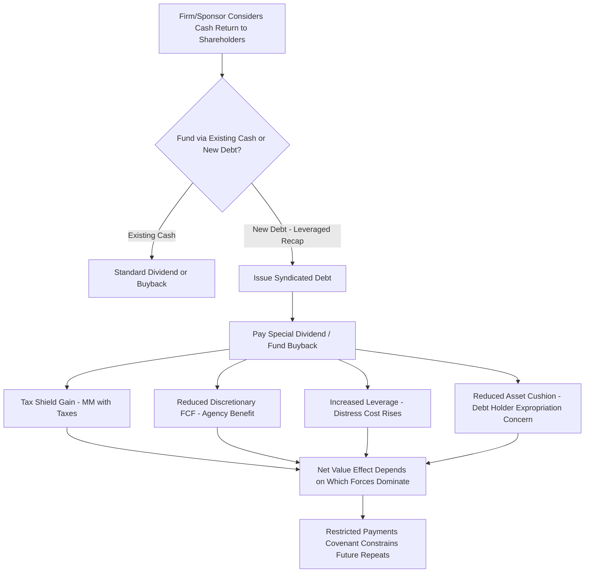

## Payout Policy: Dividends, Buybacks, and Capital Structure Interaction

### Overview

Payout policy — the decision of how much cash to return to shareholders, and through which mechanism (dividends versus share repurchases) — is theoretically and empirically intertwined with capital structure decisions. Both are outcomes of the same underlying frictions covered elsewhere in this chapter: taxes, agency costs, information asymmetry, and signaling. This topic synthesizes those frameworks specifically around the payout decision and its two-way interaction with leverage.

### Modigliani-Miller Dividend Irrelevance (Baseline)

**Core Result (Miller & Modigliani, 1961):**

In a frictionless world (no taxes, no transaction costs, no information asymmetry, no agency costs), the choice between paying dividends and retaining earnings (or equivalently, dividends versus buybacks) does not affect firm value. Shareholders can synthesize their own preferred payout stream by selling shares (a "homemade dividend") if the firm's actual policy doesn't match their preference.

$$V_{firm} = f(\text{Investment Decisions Only}) \neq f(\text{Payout Policy})$$

**Key Points:**

- This is the payout-policy analog of the original 1958 MM capital structure irrelevance proposition, and rests on the same idealized-market assumptions.
- Just as with capital structure, real-world frictions (taxes, signaling, agency costs) reintroduce a rationale for payout policy to matter — the remainder of this topic covers those frictions.

### Dividends vs. Buybacks: Mechanical and Tax Differences

| Dimension | Cash Dividends | Share Buybacks |
| --- | --- | --- |
| Shareholder participation | All shareholders receive pro-rata cash | Only selling shareholders receive cash; non-sellers gain from increased ownership percentage |
| Tax treatment (typical) | Often taxed as ordinary/dividend income upon receipt | Often taxed as capital gains, and only realized if shareholder chooses to sell |
| Flexibility | Market expects consistency; cuts are heavily penalized (signaling cost) | More flexible; can be paused without the same signaling stigma as a dividend cut |
| Effect on share count | No change | Reduces shares outstanding, mechanically raising EPS |
| Commitment signal strength | Strong (implicit ongoing commitment) | Weaker/more discretionary commitment signal |
| Leverage effect if debt-funded | Same as buyback — increases leverage if funded by new debt rather than existing cash | Increases leverage if debt-funded; a common LBO/recapitalization mechanism |

**[Unverified]** Precise tax treatment of dividends versus capital gains varies substantially by jurisdiction, shareholder type (individual vs. institutional vs. tax-exempt), and holding period, and has changed over time within jurisdictions as well; the general *directional* tax-preference logic described in signaling and clientele discussions below should not be read as a specific claim about current tax rates in any particular jurisdiction.

### Signaling Theory Applied to Payout Policy

**Dividend Signaling (Bhattacharya, 1979):**

Extending the general signaling framework, dividend payments (and especially dividend *changes*) function as a costly signal of management's confidence in sustained future cash flow:

- **Dividend increases** signal confidence that the higher payout level is sustainable, since cutting a dividend later carries a significant negative signaling cost (a "dividend cut" is read by markets as a strong negative indicator of deteriorating prospects).
- **Dividend cuts/omissions** are interpreted as strong negative signals precisely because managers are known to resist cutting dividends except when genuinely necessary — this asymmetric reluctance is what gives the signal its credibility (the single-crossing property discussed under signaling theory: firms with poor prospects find maintaining a dividend too costly to sustain, while firms with strong prospects do not).
- The cost underlying the dividend signal in Bhattacharya's model relates to the transaction costs of external financing that a firm might need to tap if it pays out cash it cannot truly sustain from operations — a firm that overcommits to a dividend it cannot support faces higher expected future external financing costs.

**Buyback Signaling:**

- Share buybacks, particularly when announced during periods of perceived undervaluation, function as an undervaluation signal (management believes shares are cheap and worth reinvesting corporate cash into, relative to alternative uses).
- Buybacks generally carry a **weaker commitment signal** than dividends because they lack the implicit "we will maintain this" expectation that a regular dividend program carries — this asymmetry is why dividend cuts are punished more severely by markets than buyback program reductions, even though both represent reduced cash return to shareholders.

### Agency Cost Theory Applied to Payout Policy

**Free Cash Flow Discipline (Jensen, 1986) — Direct Application:**

As covered under agency cost theory, distributing cash via dividends or buybacks reduces the pool of discretionary free cash flow available for managerial empire-building, perquisite consumption, or value-destroying acquisitions.

$$\text{Agency Cost of Equity} \downarrow \text{ as Payout} \uparrow$$

**Key Points:**

- This creates a direct structural link to capital structure: a firm can achieve similar free-cash-flow discipline either by (a) increasing leverage (fixed debt service obligations absorb discretionary cash) or (b) increasing payout via dividends/buybacks. Both are substitute disciplining mechanisms under agency theory.
- **Debt-funded buybacks** (increasing leverage specifically to fund a repurchase) combine both mechanisms simultaneously — this is a common feature of shareholder-activist-driven capital structure changes and of leveraged recapitalizations, where a firm intentionally re-levers to return capital to shareholders.

### Interaction with Trade-Off Theory: Leverage-Increasing Payout Actions

**"Milking the Property" Concern (Debt Holder Perspective):**

As introduced under agency cost theory, excessive payout — particularly a large, debt-funded buyback or special dividend — can constitute value expropriation from existing debt holders, since it reduces the asset base and cash cushion available to service pre-existing debt obligations without proportional compensation to those debt holders.

**Leveraged Recapitalization Mechanics:**

A leveraged recapitalization is the clearest real-world fusion of payout policy and capital structure theory: a firm issues new debt (often via syndicated term loan) specifically to fund a large special dividend or accelerated buyback program, deliberately re-levering the balance sheet.

**Worked Illustration:**

- Pre-recap: $V = \$200M$, $D = \$20M$, $E = \$180M$, $D/V = 10\%$
- Firm issues $\$60M$ in new syndicated term loan debt to fund a special dividend of $\$60M$ to shareholders.
- Post-recap (assuming, per MM Proposition I with taxes, some value increase from the incremental tax shield, and ignoring distress cost changes for this illustration): $D = \$80M$

$$\Delta V \approx T_c \times \Delta D = 0.25 \times 60M = \$15M \text{ (tax shield gain)}$$

- Simplified post-recap enterprise value: $V \approx 200M + 15M = \$215M$
- Post-recap equity value: $E = V - D - \text{Dividend Paid} = 215M - 80M = \$135M$ *(the $60M cash paid out reduces firm value dollar-for-dollar independent of the tax shield mechanics, since the cash has left the firm)*
- Post-recap $D/V \approx 80/215 \approx 37\%$ — a substantial leverage increase in a single transaction.

**[Inference]** This type of transaction sits precisely at the intersection of the tax shield benefit (MM with taxes), the free cash flow discipline benefit (agency theory), and the elevated distress-cost and debt-holder-expropriation concern (trade-off and agency-of-debt theory) — the net desirability of a leveraged recap from a total-firm-value perspective depends on which of these offsetting effects dominates for the specific firm, and is not resolved by any single theory in isolation.

### Diagram: Payout Policy Interaction Map (svg_diagram)

<svg xmlns="http://www.w3.org/2000/svg" viewBox="0 0 780 480">
<text x="390" y="30" text-anchor="middle" font-size="18" font-weight="bold" fill="#1a1a1a">Payout Policy: Theoretical Interaction Map (svg_diagram)</text>
<rect x="300" y="60" width="180" height="50" rx="8" fill="#EEE" stroke="#333" stroke-width="1.5" />
<text x="390" y="90" text-anchor="middle" font-size="13" font-weight="bold">Payout Decision</text>
<rect x="60" y="180" width="170" height="60" rx="8" fill="#D6EAF8" stroke="#0072B2" stroke-width="1.5" />
<text x="145" y="205" text-anchor="middle" font-size="12" font-weight="bold">Signaling Theory</text>
<text x="145" y="222" text-anchor="middle" font-size="10">Dividend cuts = strong</text>
<text x="145" y="235" text-anchor="middle" font-size="10">negative signal</text>
<rect x="305" y="180" width="170" height="60" rx="8" fill="#D5F5E3" stroke="#009E73" stroke-width="1.5" />
<text x="390" y="205" text-anchor="middle" font-size="12" font-weight="bold">Agency Cost Theory</text>
<text x="390" y="222" text-anchor="middle" font-size="10">Reduces discretionary</text>
<text x="390" y="235" text-anchor="middle" font-size="10">free cash flow</text>
<rect x="550" y="180" width="170" height="60" rx="8" fill="#FCF3CF" stroke="#E69F00" stroke-width="1.5" />
<text x="635" y="205" text-anchor="middle" font-size="12" font-weight="bold">Trade-Off Theory</text>
<text x="635" y="222" text-anchor="middle" font-size="10">Debt-funded payout</text>
<text x="635" y="235" text-anchor="middle" font-size="10">raises distress risk</text>
<line x1="390" y1="110" x2="145" y2="180" stroke="#333" stroke-width="1.5" />
<line x1="390" y1="110" x2="390" y2="180" stroke="#333" stroke-width="1.5" />
<line x1="390" y1="110" x2="635" y2="180" stroke="#333" stroke-width="1.5" />
<rect x="220" y="340" width="340" height="80" rx="8" fill="#F4ECF7" stroke="#8E44AD" stroke-width="1.5" />
<text x="390" y="365" text-anchor="middle" font-size="13" font-weight="bold">Leveraged Recapitalization</text>
<text x="390" y="385" text-anchor="middle" font-size="11">Fuses debt-funded payout with all three</text>
<text x="390" y="400" text-anchor="middle" font-size="11">theoretical channels simultaneously</text>
<line x1="145" y1="240" x2="300" y2="340" stroke="#666" stroke-width="1" stroke-dasharray="3,3" />
<line x1="390" y1="240" x2="390" y2="340" stroke="#666" stroke-width="1" stroke-dasharray="3,3" />
<line x1="635" y1="240" x2="480" y2="340" stroke="#666" stroke-width="1" stroke-dasharray="3,3" />
</svg>

### Dividend Clientele Effects

- Different investor groups (tax-exempt institutions, high-income individuals, retirees seeking income) have systematically different preferences for dividend versus capital-gain-oriented payout, driven primarily by differential tax treatment and cash flow needs.
- The **clientele hypothesis** suggests firms attract a shareholder base whose preferences match the firm's established payout policy, and that changing payout policy substantially can trigger costly clientele rebalancing (existing shareholders who preferred the old policy sell, new shareholders who prefer the new policy buy in) — an implicit friction that contributes to observed dividend stability ("stickiness") independent of pure signaling considerations.

### Application to Capital Structuring and Syndication

- **Dividend recapitalizations in sponsor-owned portfolio companies:** A common private equity strategy where a portfolio company raises new syndicated debt specifically to fund a dividend to the sponsor, extracting value ahead of an eventual exit — directly combining the leveraged recapitalization mechanics above with sponsor return optimization; syndicate lenders assess these deals with particular attention to post-dividend leverage and remaining covenant headroom.
- **Restricted payments covenants:** Nearly all syndicated credit agreements include a "restricted payments" covenant explicitly limiting the borrower's ability to pay dividends or conduct buybacks above specified baskets/thresholds — this is a direct contractual response to the "milking the property" agency-of-debt concern discussed above, and is one of the most heavily negotiated covenant categories in leveraged loan documentation.
- **Excess cash flow sweep provisions:** Many syndicated term loans include mandatory prepayment provisions tied to "excess cash flow," which function as an alternative, lender-mandated free cash flow discipline mechanism — directing surplus cash to debt paydown rather than leaving it available for either managerial discretion or shareholder payout, addressing the same underlying agency concern from the lender's side of the conflict.
- **Payout capacity as a credit metric:** Credit analysts structuring or rating a syndicated facility assess a borrower's capacity to sustain existing payout commitments alongside debt service, since an over-committed payout policy (dividends the firm cannot truly sustain) raises the same signaling and distress-cost concerns discussed above from a creditor risk perspective.

### Common Pitfalls

- Treating dividends and buybacks as economically equivalent in all respects — while both return cash to shareholders and can substitute for each other under Miller-Modigliani's frictionless baseline, real-world differences in signaling strength, tax treatment, and flexibility mean they are not interchangeable in practice.
- Assuming any increase in leverage used to fund payout is automatically value-destructive — per MM with taxes and agency theory, there can be a genuine tax shield and free-cash-flow-discipline benefit; the net effect depends on the offsetting distress-cost and debt-expropriation concerns from trade-off/agency-of-debt theory, not on a blanket rule.
- Overlooking that dividend cuts and buyback reductions are not symmetrically penalized by markets — the weaker implicit commitment associated with buybacks generally makes their reduction less costly from a signaling perspective than an equivalent-sized dividend cut.
- Ignoring restricted payments covenants when assessing a borrower's flexibility to pursue payout policy changes — actual payout capacity in a levered firm is frequently constrained contractually, not just by free cash flow availability.

### Mermaid: Leveraged Recapitalization Decision Flow

### Related Topics

- Modigliani-Miller with Corporate Taxes and the Debt Tax Shield
- Trade-Off Theory and Costs of Financial Distress
- Agency Cost Theory of Capital Structure
- Signaling Theory and Capital Structure Decisions
- Bhattacharya (1979) Dividend Signaling Model in depth
- Dividend clientele effects and tax-driven investor segmentation
- Leveraged recapitalization structuring and sponsor dividend strategies
- Restricted payments and excess cash flow sweep covenant drafting in syndicated loans
- Share buyback mechanics: open market repurchase, tender offer, and accelerated share repurchase (ASR) structures