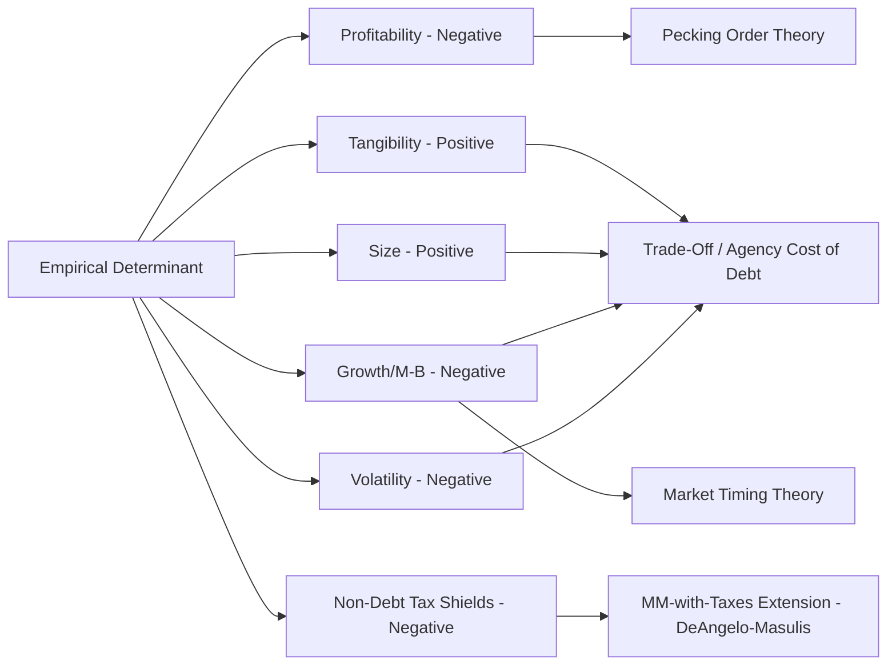

## Empirical Determinants of Capital Structure Choice

### Overview

This topic synthesizes the theoretical frameworks covered throughout this chapter — MM with taxes, trade-off theory, pecking order theory, agency cost theory, market timing theory, and signaling theory — into the empirical firm-level and macro-level factors that have been documented to correlate with observed capital structure choices. The canonical reference point for this literature is Rajan & Zingales (1995) and the subsequent large empirical corporate finance literature testing which theoretical predictions hold up cross-sectionally and across time.

### Canonical Firm-Level Determinants

**1. Profitability**

- **Empirical finding:** Profitability is consistently found to be *negatively* correlated with leverage across firms and countries.
- **Theoretical tension:** This is the central anomaly discussed earlier in this chapter — static trade-off theory predicts profitable firms should carry *more* debt (more stable taxable income to shield, lower expected distress probability), while pecking order theory predicts profitable firms carry *less* debt (sufficient internal funds reduce the need to tap external financing at all).
- **Resolution in the literature:** The negative profitability-leverage relationship is generally regarded as one of the strongest pieces of evidence favoring pecking order theory's descriptive power over static trade-off theory, though modern dynamic trade-off models (incorporating adjustment costs and target leverage ranges rather than point targets) have also been developed to partially reconcile this finding.

**2. Asset Tangibility**

- **Empirical finding:** Tangibility (proportion of fixed/tangible assets to total assets) is consistently *positively* correlated with leverage.
- **Theoretical rationale:** Tangible assets serve as effective collateral, are more standardized and liquid in liquidation, and retain more value in financial distress — reducing both direct bankruptcy costs (easier, faster asset disposition) and agency costs of debt (collateral constrains asset substitution/risk-shifting behavior, since pledged assets cannot be easily swapped for riskier alternatives).
- **Consistency across theories:** This is one of the more theoretically uncontested determinants — trade-off theory, agency cost theory, and even pecking order-adjacent debt capacity arguments all point in the same directional prediction.

**3. Firm Size**

- **Empirical finding:** Size is generally *positively* correlated with leverage, though the relationship is less universally robust across studies than tangibility or profitability.
- **Theoretical rationale:** Larger firms tend to be more diversified (lower earnings volatility, lower probability of distress at a given leverage level), benefit from economies of scale in direct bankruptcy costs (as discussed under trade-off theory), and typically have greater access to public debt markets and syndicated credit facilities, reducing the information-asymmetry-driven cost of external debt financing (a size-related bridge to pecking order and agency-of-debt considerations).

**4. Growth Opportunities / Market-to-Book Ratio**

- **Empirical finding:** Growth opportunities (commonly proxied by market-to-book ratio, or by R&D intensity) are consistently *negatively* correlated with leverage.
- **Theoretical rationale (multiple channels converge):**
  - **Trade-off/agency-of-debt channel:** High-growth firms derive more value from intangible growth options rather than assets-in-place, making them more susceptible to the underinvestment/debt overhang problem (Myers, 1977) discussed under both trade-off and agency cost theory.
  - **Distress cost channel:** Growth options are more likely to be permanently lost (rather than merely postponed) in a distress scenario, raising the effective indirect distress cost for high-growth firms.
  - **Market timing channel:** High market-to-book ratios are the very trigger condition market timing theory identifies for opportunistic equity issuance, mechanically producing lower observed leverage for high-M/B firms.

**5. Earnings Volatility / Business Risk**

- **Empirical finding:** Higher earnings volatility is generally *negatively* correlated with leverage.
- **Theoretical rationale:** Higher volatility raises the probability of hitting a distress trigger at any given debt level (direct trade-off theory channel), and independently raises the value of the risk-shifting option embedded in levered equity, exacerbating agency costs of debt at a given leverage level.

**6. Non-Debt Tax Shields**

- **Empirical finding:** Firms with substantial non-debt tax shields (e.g., high depreciation, tax loss carryforwards, investment tax credits) tend to exhibit *lower* leverage.
- **Theoretical rationale (DeAngelo & Masulis, 1980 extension of MM-with-taxes):** If a firm already shields a substantial portion of taxable income through non-debt means, the *marginal* value of the interest tax shield is reduced — directly extending the MM-with-taxes framework by relaxing the assumption that all firms fully utilize the debt tax shield regardless of other tax attributes.

**7. Industry Classification**

- **Empirical finding:** Leverage ratios exhibit strong industry clustering — firms within the same industry tend to have more similar leverage ratios than firms across industries, and industry median leverage is a strong predictor of individual firm leverage.
- **Theoretical rationale:** Industry membership proxies for several of the above factors simultaneously (typical asset tangibility, typical growth opportunity profile, typical business risk) and may also reflect industry-specific practitioner/lender norms and comparable-based benchmarking common in syndicated loan pricing and structuring.

### Summary Table of Determinants and Theoretical Alignment

| Determinant | Empirical Direction (vs. Leverage) | Best-Aligned Theory |
| --- | --- | --- |
| Profitability | Negative | Pecking order (contradicts static trade-off) |
| Asset tangibility | Positive | Trade-off / agency cost of debt |
| Firm size | Positive (moderate robustness) | Trade-off (distress cost economies of scale) / reduced info asymmetry |
| Growth opportunities (M/B) | Negative | Trade-off (underinvestment) / market timing |
| Earnings volatility | Negative | Trade-off (distress probability) / agency cost of debt |
| Non-debt tax shields | Negative | MM-with-taxes extension (DeAngelo-Masulis) |
| Industry membership | Strong clustering | Composite of tangibility, risk, growth profile |

### Diagram: Determinant Influence Map (svg_diagram)

<svg xmlns="http://www.w3.org/2000/svg" viewBox="0 0 780 480">
<text x="390" y="30" text-anchor="middle" font-size="18" font-weight="bold" fill="#1a1a1a">Empirical Determinants of Leverage — Direction of Effect (svg_diagram)</text>
<line x1="390" y1="60" x2="390" y2="420" stroke="#999" stroke-width="1" stroke-dasharray="4,4" />
<text x="200" y="55" text-anchor="middle" font-size="13" fill="#009E73" font-weight="bold">↑ Increases Leverage</text>
<text x="580" y="55" text-anchor="middle" font-size="13" fill="#D55E00" font-weight="bold">↓ Decreases Leverage</text>
<rect x="70" y="90" width="240" height="40" rx="6" fill="#D5F5E3" stroke="#009E73" />
<text x="190" y="115" text-anchor="middle" font-size="12">Asset Tangibility</text>
<rect x="70" y="150" width="240" height="40" rx="6" fill="#D5F5E3" stroke="#009E73" />
<text x="190" y="175" text-anchor="middle" font-size="12">Firm Size</text>
<rect x="470" y="90" width="240" height="40" rx="6" fill="#FADBD8" stroke="#D55E00" />
<text x="590" y="115" text-anchor="middle" font-size="12">Profitability</text>
<rect x="470" y="150" width="240" height="40" rx="6" fill="#FADBD8" stroke="#D55E00" />
<text x="590" y="175" text-anchor="middle" font-size="12">Growth Opportunities (M/B)</text>
<rect x="470" y="210" width="240" height="40" rx="6" fill="#FADBD8" stroke="#D55E00" />
<text x="590" y="235" text-anchor="middle" font-size="12">Earnings Volatility</text>
<rect x="470" y="270" width="240" height="40" rx="6" fill="#FADBD8" stroke="#D55E00" />
<text x="590" y="295" text-anchor="middle" font-size="12">Non-Debt Tax Shields</text>
<rect x="200" y="360" width="380" height="50" rx="8" fill="#EBDEF0" stroke="#8E44AD" />
<text x="390" y="390" text-anchor="middle" font-size="12" font-weight="bold">Industry Membership (composite clustering effect)</text>
</svg>

### Empirical Testing Methodology Notes

**Standard Regression Specification:**

$$\text{Leverage}_{i,t} = \beta_0 + \beta_1 \text{Profitability}_{i,t} + \beta_2 \text{Tangibility}_{i,t} + \beta_3 \text{Size}_{i,t} + \beta_4 \text{M/B}_{i,t} + \beta_5 \text{Volatility}_{i,t} + \gamma_j + \epsilon_{i,t}$$

Where $\gamma_j$ typically represents industry or firm fixed effects, and leverage may be measured as book leverage ($D/(D+\text{Book Equity})$) or market leverage ($D/(D+\text{Market Equity})$) — a methodological choice that itself affects empirical results, since market leverage mechanically incorporates market timing-related valuation effects that book leverage does not.

**Key Points:**

- **[Unverified]** The choice between book and market leverage as the dependent variable is a genuine, unresolved methodological debate in the empirical literature — some researchers argue book leverage better reflects the actual contractual debt burden relevant to distress-cost analysis, while others argue market leverage better reflects the economically relevant capital structure given that market values represent forward-looking claims; results and coefficient magnitudes can differ meaningfully depending on this choice, and neither convention should be treated as unambiguously "correct."
- Fixed-effects specifications (controlling for unobserved firm-specific or industry-specific heterogeneity) are standard in modern treatments of this literature, since simple cross-sectional regressions can conflate genuine causal determinants with omitted, time-invariant firm characteristics.

### Speed of Adjustment and Dynamic Trade-Off Models

Beyond static determinants, a distinct empirical literature examines how quickly firms adjust *toward* a target leverage ratio after being perturbed away from it (e.g., by a market timing-driven equity issuance, an earnings shock, or an acquisition):

$$\text{Leverage}_{i,t} - \text{Leverage}_{i,t-1} = \lambda(\text{Target Leverage}_{i,t} - \text{Leverage}_{i,t-1}) + \epsilon_{i,t}$$

Where $\lambda$ (the speed-of-adjustment coefficient) measures how much of the gap toward the target is closed within a given period. **[Unverified]** Estimated adjustment speeds vary considerably across studies, methodologies, and time periods; the general finding of only *partial* adjustment (i.e., $\lambda$ is estimated to be well below 1, indicating firms do not immediately re-lever to target) is broadly consistent across the literature, but specific numerical adjustment-speed estimates should not be treated as precise, stable constants across contexts.

### Application to Syndicated Loan Structuring and Credit Analysis

- **Comparable company leverage benchmarking:** Arranging banks and credit analysts routinely benchmark a prospective borrower's leverage multiple against industry peer medians, directly operationalizing the empirical industry-clustering finding — deviations from industry norms typically require additional credit committee justification.
- **Tangibility-based structuring:** The strong empirical link between tangibility and sustainable leverage directly informs asset-based lending (ABL) facility structuring within a broader syndication, where borrowing base formulas explicitly tie available credit to the value of tangible collateral (receivables, inventory, PP&E) rather than to enterprise value or cash flow multiples alone.
- **Growth-stage and technology borrower leverage caps:** The negative empirical relationship between growth opportunities/intangibility and sustainable leverage is reflected in syndicate lenders' typically more conservative leverage multiples for asset-light, high-growth, or R&D-intensive borrowers relative to mature, tangible-asset-heavy borrowers with comparable cash flow, consistent with the underinvestment and distress-cost channels discussed above.
- **Cash flow volatility in covenant calibration:** Earnings/cash flow volatility assessment (often via historical EBITDA variability analysis) directly informs covenant headroom calibration in syndicated facilities — more volatile borrowers are typically structured with wider covenant cushions or more conservative initial leverage to compensate for the empirically higher distress probability at any given leverage level.
- **Non-debt tax shield consideration in tax-efficient structuring:** Cross-border or asset-heavy syndications with substantial existing depreciation shields or NOL carryforwards may see reduced marginal tax benefit from additional debt, a consideration directly relevant to optimal tranche sizing discussions between borrowers, arrangers, and tax advisors.

### Common Pitfalls

- Treating any single determinant (e.g., profitability) as decisively validating one theory over all others — the empirical literature generally supports a view where multiple theoretical mechanisms operate simultaneously and with varying relative importance across firms, rather than a single theory dominating universally.
- Assuming the documented correlations imply strict causality in a specific direction — much of this literature (particularly older cross-sectional studies) faces standard endogeneity concerns (e.g., leverage and profitability may be jointly determined by unobserved firm quality), and more recent work using fixed effects, instrumental variables, or natural experiments should generally be weighed more heavily than simple correlational findings.
- Conflating book leverage and market leverage results without noting the methodological distinction — as discussed above, this choice is not innocuous and can affect which theoretical predictions appear best supported.
- Assuming the "speed of adjustment" literature settles the trade-off-vs-pecking-order-vs-market-timing debate — partial adjustment findings are consistent with (and have been used to support) multiple competing theoretical interpretations, including dynamic trade-off models, constrained pecking order models, and hybrid frameworks.

### Mermaid: Determinant-to-Theory Mapping

### Related Topics

- Modigliani-Miller with Corporate Taxes and the Debt Tax Shield
- Trade-Off Theory and Costs of Financial Distress
- Pecking Order Theory and Information Asymmetry
- Agency Cost Theory of Capital Structure
- Market Timing Theory of Capital Structure
- Rajan & Zingales (1995) cross-country capital structure study in depth
- DeAngelo & Masulis (1980) non-debt tax shields model
- Dynamic capital structure and speed-of-adjustment models
- Asset-based lending (ABL) borrowing base structuring
- Comparable company and industry benchmarking in credit analysis