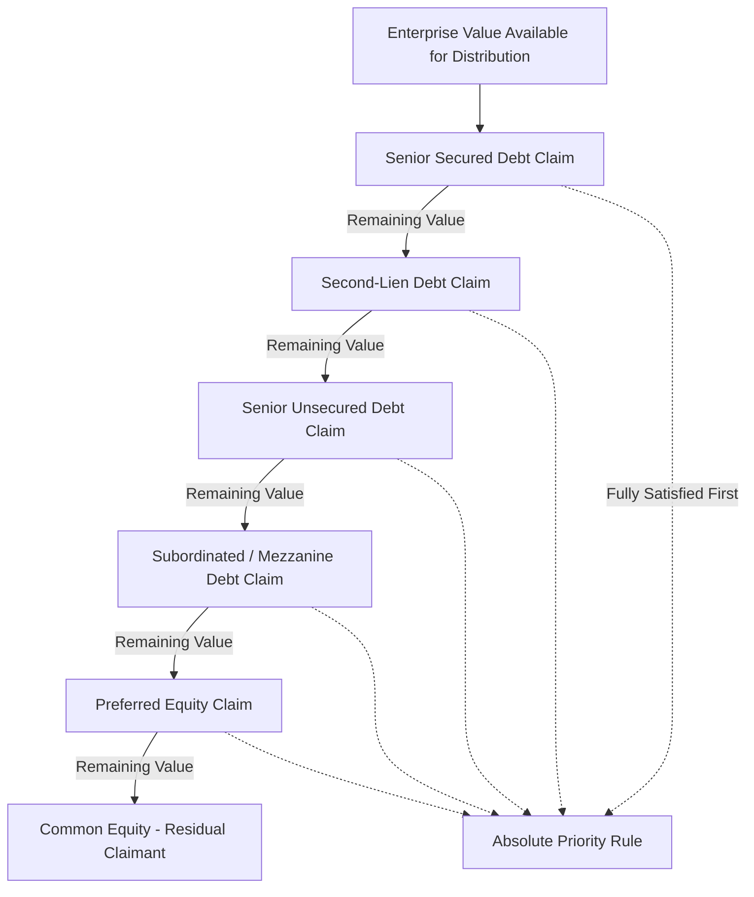

## Anatomy of the Capital Stack from Senior to Junior Claims

### Overview

The capital stack (or capital structure hierarchy) represents the layered arrangement of financing instruments used to fund a company or transaction, ordered by their relative priority of claim on assets, cash flow, and collateral in both ordinary operation and liquidation/distress scenarios. Understanding this hierarchy is foundational to structuring, pricing, and syndicating any financing package, since each layer's risk-return profile is directly determined by its position relative to the layers above and below it.

### The Core Priority Principle

**Absolute Priority Rule (Foundational Concept):**

In a liquidation or reorganization scenario, claims are theoretically satisfied in strict descending order of seniority — each class must be paid in full before any value flows to the next junior class.

$$\text{Recovery}_{\text{Senior}} \rightarrow \text{Recovery}_{\text{Junior}} \rightarrow \text{Recovery}_{\text{Equity}}$$

**Key Points:**

- **[Unverified]** In practice, particularly in negotiated Chapter 11-style reorganizations (as opposed to a straight liquidation), the absolute priority rule is frequently deviated from through negotiated settlements between creditor classes — this is a well-documented feature of real-world restructuring practice, and the strict theoretical ordering should be understood as a baseline/default rule rather than a description of universal actual outcomes.
- The priority ordering governs both **cash flow priority** (who gets paid first from ongoing operating cash flow, e.g., interest payment waterfalls) and **liquidation priority** (who gets paid first from asset sale proceeds in insolvency) — these two orderings are typically, but not always, identical for a given instrument.

### The Capital Stack, Layer by Layer (Senior to Junior)

**1. Senior Secured Debt**

- Highest priority claim; typically secured by specific collateral (real property, equipment, receivables, inventory, or a blanket lien over substantially all assets).
- In syndicated finance, this layer typically comprises the **senior secured term loan (Term Loan A/B)** and **revolving credit facility (RCF)**, usually arranged and distributed to a syndicate of banks and/or institutional investors.
- Often further sub-divided by lien priority: **first-lien** debt has the primary claim on pledged collateral; **second-lien** debt (see below) sits behind first-lien within the secured category.
- Lowest cost of capital in the stack (lowest required yield) due to lowest risk, reflecting both seniority and collateral protection.

**2. Second-Lien Debt**

- Secured by the same collateral pool as senior secured debt, but subordinated in lien priority — second-lien holders are paid from collateral proceeds only after first-lien claims are fully satisfied.
- Bridges the risk-return gap between senior secured and unsecured/subordinated debt; commonly used in leveraged buyout financings to extend total leverage capacity beyond what senior lenders alone would provide.
- Governed by an **intercreditor agreement** with the first-lien lenders, which specifies standstill periods, payment blockage provisions, and voting/enforcement rights allocation between the two secured classes.

**3. Senior Unsecured Debt**

- Ranks behind all secured claims (since secured creditors have a specific claim on pledged collateral ahead of general unsecured recovery), but ahead of subordinated debt among unsecured claims.
- Typically comprises senior unsecured notes/bonds; relies on the general creditworthiness and unencumbered asset base of the issuer rather than specific collateral.
- Common in investment-grade issuers and in the unsecured layer of leveraged capital structures above the secured term loan/second-lien tranches.

**4. Subordinated Debt (Mezzanine Debt)**

- Contractually subordinated to senior unsecured (and all secured) debt via subordination provisions in the debt agreement itself, not merely by absence of collateral.
- **Mezzanine debt** typically combines a cash-pay coupon with additional yield enhancement mechanisms — payment-in-kind (PIK) interest (accruing rather than cash-paid, compounding the principal balance) and/or attached equity warrants — to compensate for the elevated risk position.
- Frequently unsecured or, if secured, holds a lien subordinated even to second-lien holders (a "third-lien" or similarly deeply subordinated structure).
- Bridges the gap between debt and equity in both risk-return terms and often in instrument design (convertible or warrant-attached features blur the debt/equity line).

**5. Preferred Equity**

- Ranks ahead of common equity but behind all debt claims (secured and unsecured, senior and subordinated) in both liquidation priority and typically in ongoing distribution priority (preferred dividends must be paid, or accrued if cumulative, before any common dividend).
- May carry fixed dividend rates (analogous to a coupon), liquidation preferences (a multiple of invested capital returned before common equity participates), and sometimes conversion rights into common equity.
- Common in private equity and venture capital structures, and increasingly used as a flexible, less-dilutive alternative to additional debt in leveraged transactions where debt capacity is constrained.

**6. Common Equity**

- Most junior claim in the capital stack; residual claimant on both cash flow (dividends only after all senior obligations and preferred distributions are satisfied) and liquidation proceeds (receives value only after every senior class, including preferred equity, is fully satisfied).
- Highest expected return to compensate for bearing first-loss risk and having no fixed claim — the "equity cushion" that absorbs value declines before any debt class is impaired.
- In leveraged transactions, common equity (typically sponsor equity in a private equity context) represents the "cushion" whose size directly determines the loan-to-value or leverage multiple the debt syndicate is willing to extend.

### Diagram: Capital Stack Hierarchy (svg_diagram)

<svg xmlns="http://www.w3.org/2000/svg" viewBox="0 0 700 560">
<text x="350" y="30" text-anchor="middle" font-size="18" font-weight="bold" fill="#1a1a1a">Capital Stack: Seniority and Risk-Return Gradient (svg_diagram)</text>
<rect x="150" y="60" width="400" height="60" fill="#08519c" stroke="#333" />
<text x="350" y="95" text-anchor="middle" font-size="13" fill="#fff" font-weight="bold">Senior Secured Debt (Term Loan / RCF)</text>
<rect x="150" y="120" width="400" height="55" fill="#3182bd" stroke="#333" />
<text x="350" y="152" text-anchor="middle" font-size="13" fill="#fff" font-weight="bold">Second-Lien Debt</text>
<rect x="150" y="175" width="400" height="55" fill="#6baed6" stroke="#333" />
<text x="350" y="207" text-anchor="middle" font-size="13" fill="#fff" font-weight="bold">Senior Unsecured Debt</text>
<rect x="150" y="230" width="400" height="55" fill="#9ecae1" stroke="#333" />
<text x="350" y="262" text-anchor="middle" font-size="13" fill="#08306b" font-weight="bold">Subordinated / Mezzanine Debt</text>
<rect x="150" y="285" width="400" height="55" fill="#fdae6b" stroke="#333" />
<text x="350" y="317" text-anchor="middle" font-size="13" fill="#7f2704" font-weight="bold">Preferred Equity</text>
<rect x="150" y="340" width="400" height="60" fill="#d94801" stroke="#333" />
<text x="350" y="375" text-anchor="middle" font-size="13" fill="#fff" font-weight="bold">Common Equity</text>

<line x1="70" y1="90" x2="70" y2="370" stroke="#000" stroke-width="1.5" marker-end="url(#arrow1)" />
<text x="45" y="230" text-anchor="middle" font-size="12" fill="#000" transform="rotate(-90 45 230)">Increasing Risk / Return</text>
<line x1="620" y1="90" x2="620" y2="370" stroke="#000" stroke-width="1.5" marker-end="url(#arrow2)" />
<text x="655" y="230" text-anchor="middle" font-size="12" fill="#000" transform="rotate(90 655 230)">Decreasing Priority</text>
<text x="350" y="430" text-anchor="middle" font-size="12" fill="#555">Liquidation proceeds fill from the top down —</text>

<text x="350" y="448" text-anchor="middle" font-size="12" fill="#555">each layer paid in full before the next junior layer receives any recovery</text>

</svg>

### Key Structural Mechanics Across the Stack

**Intercreditor Agreements:**

Govern the relative rights of different secured creditor classes (e.g., first-lien vs. second-lien holders) — covering payment subordination (whether junior secured lenders can receive payments while senior obligations are current), standstill periods (restricting junior lenders from independently enforcing remedies for a defined period after default), and lien subordination/collateral-sharing mechanics.

**Subordination Agreements:**

Distinct from intercreditor agreements, these govern the relationship between secured and unsecured/subordinated *unsecured* creditors, typically through **contractual subordination** (explicit agreement that one class's claims are subordinate) as opposed to **structural subordination** (subordination arising because a claim sits at a holding company level structurally junior to operating company-level debt, discussed further below).

**Structural Subordination:**

- Arises in multi-entity corporate structures where debt issued at a holding company level is effectively subordinated to all debt at operating subsidiary levels, because operating company creditors have first claim on operating company assets and cash flow before any residual value flows up to the holding company to service holdco-level debt.
- Common in leveraged buyout structures where a holdco issues subordinated notes or PIK debt structurally junior to the opco-level syndicated term loan, even without explicit contractual subordination language.

### Waterfall Mechanics: Cash Flow vs. Liquidation Priority

| Waterfall Type | Governs | Typical Trigger |
| --- | --- | --- |
| Interest/Debt Service Waterfall | Order of periodic cash interest and principal payments | Every payment period, in the ordinary course |
| Liquidation/Enforcement Waterfall | Order of distribution of asset sale or enforcement proceeds | Default, insolvency, or wind-down |
| Excess Cash Flow Sweep Waterfall | Order of application of surplus cash to mandatory prepayments across debt tranches | Periodically per credit agreement terms (often annual) |

**Key Points:**

- The cash flow (interest/principal) waterfall and the liquidation waterfall are governed by the same underlying seniority principle but are documented and triggered separately — a facility can be senior in the cash flow waterfall (paid first from operating cash) while the liquidation waterfall becomes the operative mechanism only upon default/enforcement.
- In syndicated structures, cash flow waterfalls are frequently formalized in an **agency and payments** section of the credit agreement, specifying the precise order in which the administrative agent applies received funds (fees, expenses, interest, scheduled principal, in that order, typically) before any residual flows to the borrower.

### Worked Illustration: Recovery Analysis Across a Capital Stack

**Setup:** A company in distress has $120M in total enterprise value available for distribution, with the following capital stack (face value of claims):

| Layer | Face Value | Cumulative Claim |
| --- | --- | --- |
| Senior Secured Debt | $60M | $60M |
| Second-Lien Debt | $30M | $90M |
| Senior Unsecured Debt | $25M | $115M |
| Subordinated Debt | $20M | $135M |
| Preferred Equity | $15M | $150M |
| Common Equity | (residual) | — |

**Waterfall Application of $120M Enterprise Value:**

1. Senior Secured Debt: $60M claim → **fully recovered ($60M)**. Remaining value: $120M − $60M = $60M
2. Second-Lien Debt: $30M claim → **fully recovered ($30M)**. Remaining value: $60M − $30M = $30M
3. Senior Unsecured Debt: $25M claim → **fully recovered ($25M)**. Remaining value: $30M − $25M = $5M
4. Subordinated Debt: $20M claim, only $5M remaining → **partial recovery: $5M of $20M (25% recovery)**. Remaining value: $0
5. Preferred Equity: **$0 recovery (0%)**
6. Common Equity: **$0 recovery (0%)** — wiped out

**Interpretation:** This illustrates the "fulcrum security" concept — the subordinated debt tranche in this scenario is the **fulcrum security**, the class at which value runs out and where restructuring negotiation leverage typically concentrates, since this class stands to gain the most (in equity conversion or negotiated recovery improvement) from a successful reorganization, while all junior classes (preferred and common equity) are economically wiped out under strict absolute priority.

### Application to Syndicated Loan Structuring

- **Tranche design as capital stack engineering:** Arranging banks structure syndicated financing packages by deliberately layering tranches (senior secured TLA/TLB, second-lien if needed, unsecured bonds) to match the risk appetite of different investor bases (banks for senior secured, CLOs and institutional investors for second-lien/unsecured, high-yield investors for subordinated layers) while optimizing overall blended cost of capital for the borrower.
- **Collateral package negotiation:** The scope of the collateral package (all-asset lien vs. specific asset classes) pledged to senior secured syndicate lenders directly determines how much capacity remains for subsequent second-lien or unsecured layers, since later layers can only be secured by collateral not already fully pledged (or must accept unsecured/structurally subordinated status).
- **Intercreditor negotiation as a syndication workstream:** In deals involving multiple secured tranches (first-lien term loan plus a second-lien facility, potentially from a different lender group), negotiating the intercreditor agreement is frequently one of the most heavily negotiated and time-consuming workstreams in syndication execution, since it directly allocates enforcement rights and recovery priority between lender groups.
- **Recovery rate assumptions in pricing:** Credit spread and pricing determination for each tranche in a syndicated deal is directly informed by expected recovery rates given the tranche's position in the capital stack — this is precisely the waterfall logic illustrated above, formalized through rating agency recovery rating methodologies and lender internal credit models.

### Common Pitfalls

- Assuming collateral security alone determines seniority — priority is a function of both lien status (secured vs. unsecured) *and* contractual/structural subordination; a secured second-lien claim can still rank behind an unsecured senior claim of a different, more senior-ranking legal entity in a structurally subordinated group structure.
- Treating the absolute priority rule as a strict, universally observed outcome — as noted above, negotiated restructurings frequently produce deviations from strict priority, particularly to secure the cooperation of classes that would otherwise receive zero recovery.
- Confusing intercreditor agreements (governing secured-vs-secured creditor relationships) with subordination agreements (governing secured/senior-vs-subordinated unsecured creditor relationships) — they serve related but distinct legal and economic functions.
- Overlooking structural subordination in multi-entity/holdco-opco structures — a debt instrument can be economically deeply subordinated even without any explicit contractual subordination language, purely due to its position in the corporate structure.

### Mermaid: Liquidation Waterfall Logic

### Related Topics

- Intercreditor Agreements: First-Lien / Second-Lien Mechanics
- Structural Subordination and Holdco/Opco Financing Structures
- Fulcrum Security Analysis and Restructuring Negotiation Dynamics
- Mezzanine Debt Structuring: PIK Interest and Warrant Coverage
- Collateral and Security Package Design in Syndicated Lending
- Recovery Rate Analysis and Rating Agency Methodology
- Excess Cash Flow Sweep Mechanics in Credit Agreements
- Trade-Off Theory and Costs of Financial Distress (prerequisite context on distress-cost drivers)