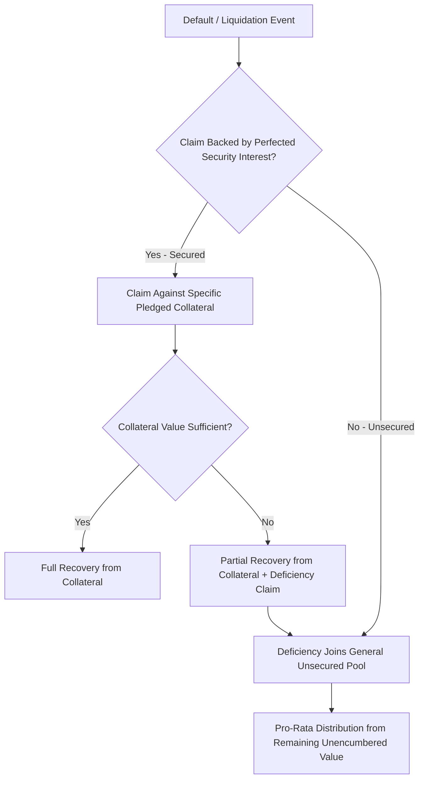

## Secured versus Unsecured Debt

### Overview

The secured/unsecured distinction is the primary structural fault line within the debt layers of the capital stack, determining whether a creditor's claim is backed by a specific, identifiable pool of collateral or relies solely on the general creditworthiness and unencumbered assets of the borrower. This distinction drives pricing, covenant intensity, recovery expectations, and negotiating leverage across virtually every syndicated financing structure.

### Defining the Distinction

**Secured Debt:**

- Backed by a **lien** — a legal claim granted to the lender over specific assets or asset categories (real property, equipment, inventory, receivables, intellectual property, equity interests in subsidiaries, or a blanket "all-asset" lien).
- In the event of default, the secured lender has the contractual right to seize, foreclose upon, or direct the sale of the pledged collateral to satisfy the outstanding claim, generally **ahead of unsecured creditors** with respect to that specific collateral pool.
- Perfection of the security interest (the legal process of establishing the lien's enforceability against third parties, typically via filings such as UCC-1 financing statements in U.S. practice) is essential — an unperfected security interest may not hold priority against competing claims even if a security agreement exists.

**Unsecured Debt:**

- No specific collateral pledge; relies on the borrower's general credit and the residual, unencumbered asset pool.
- In liquidation, unsecured creditors share pro-rata in whatever value remains after all secured claims are satisfied from their respective collateral (and after any deficiency claims — the unsatisfied portion of a secured claim if collateral value is insufficient — are added to the general unsecured pool).
- Compensates for this subordinate liquidation position with covenants, higher pricing, and (in bond structures) sometimes stronger negative pledge and event-of-default protections relative to secured facilities.

### Key Mechanics Distinguishing the Two

**1. Lien Perfection and Priority**

- A security interest must generally be both **attached** (the borrower has rights in the collateral, value has been given, and a security agreement exists) and **perfected** (the appropriate public filing or possession requirement is satisfied) to be fully enforceable against third parties, including a bankruptcy trustee or competing creditors.
- Priority among multiple secured creditors claiming the same collateral is typically determined by the "first to file or perfect" rule in most common law jurisdictions, absent an intercreditor agreement establishing a different negotiated priority (as discussed under first-lien/second-lien structures).

**2. Collateral Scope and Type**

| Collateral Type | Typical Use Case |
| --- | --- |
| Real property (mortgages/deeds of trust) | Real estate-heavy borrowers, project finance |
| Equipment and fixed assets | Manufacturing, industrial borrowers |
| Accounts receivable and inventory | Asset-based lending (ABL) facilities, working capital revolvers |
| Intellectual property | Technology, pharmaceutical, media borrowers |
| Equity interests in subsidiaries | Holding company-level facilities, LBO structures (pledge of opco shares) |
| Blanket/all-asset lien | Standard in most cash-flow-based syndicated term loans and revolvers |

**3. Covenant Intensity and Monitoring**

- Secured lenders, despite (or partly because of) their stronger liquidation position, frequently negotiate more extensive **maintenance covenants** (financial ratio tests reviewed periodically regardless of specific triggering events) compared to unsecured bondholders, who more commonly rely on **incurrence covenants** (tested only upon specific actions like new debt issuance or asset sales) — a structural pattern rooted partly in the bank-loan-market convention of ongoing relationship monitoring versus the more hands-off, dispersed-holder nature of public bond markets.
- This produces a sometimes counterintuitive result: secured facilities, despite lower pricing, often carry *tighter* ongoing covenant discipline than unsecured facilities, reflecting the different monitoring and enforcement models embedded in bank versus public debt market conventions.

### Diagram: Secured vs. Unsecured Recovery Mechanics (svg_diagram)

<svg xmlns="http://www.w3.org/2000/svg" viewBox="0 0 760 460">
<text x="380" y="30" text-anchor="middle" font-size="18" font-weight="bold" fill="#1a1a1a">Secured vs. Unsecured Claims in Liquidation (svg_diagram)</text>
<rect x="60" y="70" width="300" height="330" rx="8" fill="#EBF5FB" stroke="#0072B2" stroke-width="1.5" />
<text x="210" y="100" text-anchor="middle" font-size="14" font-weight="bold" fill="#0072B2">Secured Creditor</text>
<rect x="90" y="130" width="240" height="70" fill="#0072B2" opacity="0.85" />
<text x="210" y="160" text-anchor="middle" font-size="12" fill="#fff">Claim on Specific</text>
<text x="210" y="178" text-anchor="middle" font-size="12" fill="#fff">Pledged Collateral</text>
<text x="210" y="230" text-anchor="middle" font-size="12" fill="#333">Satisfied first from</text>
<text x="210" y="248" text-anchor="middle" font-size="12" fill="#333">collateral sale proceeds</text>
<text x="210" y="280" text-anchor="middle" font-size="12" fill="#333">Deficiency (if any) becomes</text>
<text x="210" y="298" text-anchor="middle" font-size="12" fill="#333">unsecured claim</text>
<rect x="420" y="70" width="300" height="330" rx="8" fill="#FDF2E9" stroke="#D55E00" stroke-width="1.5" />
<text x="570" y="100" text-anchor="middle" font-size="14" font-weight="bold" fill="#D55E00">Unsecured Creditor</text>
<rect x="450" y="130" width="240" height="70" fill="#D55E00" opacity="0.85" />
<text x="570" y="160" text-anchor="middle" font-size="12" fill="#fff">Claim on General</text>
<text x="570" y="178" text-anchor="middle" font-size="12" fill="#fff">Unencumbered Assets</text>
<text x="570" y="230" text-anchor="middle" font-size="12" fill="#333">Shares pro-rata with</text>
<text x="570" y="248" text-anchor="middle" font-size="12" fill="#333">other unsecured claims</text>
<text x="570" y="280" text-anchor="middle" font-size="12" fill="#333">Paid only after all</text>
<text x="570" y="298" text-anchor="middle" font-size="12" fill="#333">secured claims satisfied</text>

<text x="380" y="420" text-anchor="middle" font-size="12" fill="#555">Both classes rank ahead of preferred and common equity</text>

</svg>

### Pricing Differential and Recovery Expectations

**[Unverified]** Precise pricing spread differentials between secured and unsecured tranches of the same issuer vary considerably by market conditions, credit quality, and time period, and should not be treated as a fixed universal spread; the directional relationship (secured debt priced tighter than unsecured debt of the same issuer, all else equal) is, however, a well-established and consistently observed market convention.

**Recovery Rate Convention (Rating Agency Practice):**

Rating agencies (Moody's, S&P) typically assign **recovery ratings** or notch adjustments to individual debt instruments within a capital structure based on their secured/unsecured status and position, reflecting expected recovery in a default scenario:

- Secured debt: Higher expected recovery rate, often resulting in an issue-level rating *above* the issuer's overall corporate/family rating (a positive notching adjustment).
- Unsecured debt: Recovery rate more closely tied to overall enterprise value and the amount of secured debt ranking ahead of it; often notched *below* the issuer's overall corporate rating, particularly in capital structures with substantial secured debt ahead of the unsecured layer (reflecting **structural and contractual subordination** effects discussed under capital stack anatomy).

### Worked Illustration: Pricing and Recovery Comparison

**Setup:** A borrower with $150M enterprise value in a distress scenario has:

- $70M Senior Secured Term Loan (blanket lien on all assets)
- $50M Senior Unsecured Notes

**Recovery Analysis:**

1. Senior Secured Term Loan: $70M claim → collateral value (assume approximates full enterprise value available to secured claim) is sufficient → **100% recovery ($70M)**
2. Remaining value: $150M − $70M = $80M
3. Senior Unsecured Notes: $50M claim against $80M remaining value → **100% recovery ($50M)** in this scenario, since remaining value exceeds the unsecured claim

**Contrast Scenario (Lower Enterprise Value = $90M):**

1. Senior Secured Term Loan: $70M claim → **100% recovery ($70M)** (still fully covered, secured claims are satisfied first)
2. Remaining value: $90M − $70M = $20M
3. Senior Unsecured Notes: $50M claim against only $20M remaining → **40% recovery ($20M of $50M)**

**Interpretation:** This illustrates why unsecured recovery is disproportionately sensitive to changes in overall enterprise value once a substantial secured layer exists ahead of it — the unsecured tranche effectively absorbs a magnified share of any value decline once the (fixed) secured claim is satisfied first, which is precisely why unsecured pricing/spread is materially wider than secured pricing on the same underlying credit.

### Negative Pledge Clauses

- A **negative pledge** is a covenant (found in both unsecured bond indentures and unsecured loan agreements) restricting the borrower from granting new liens to other creditors without providing equivalent security to the negative-pledge-protected creditor (an "equal and ratable" sharing provision) — functioning as unsecured creditors' primary structural protection against being structurally or contractually subordinated by future secured financings.
- **Key Points:** Negative pledge provisions are a critical negotiating point precisely because they constrain a borrower's future flexibility to raise secured debt — a borrower with an existing unsecured bond negative pledge may need bondholder consent or must offer equal ranking security before layering in new secured syndicated debt, a common friction point in refinancing and recapitalization transactions.

### Application to Syndicated Loan Structuring

- **Facility type selection based on collateral availability:** Whether a syndicated facility is structured as secured or unsecured is frequently driven by the borrower's existing capital structure (e.g., pre-existing unsecured bond negative pledge constraints) as much as by pure credit risk considerations — arrangers must assess the full existing debt stack, not just the credit quality of the borrower in isolation.
- **Borrowing base mechanics in secured ABL facilities:** Asset-based lending syndications directly operationalize the secured-debt collateral concept, with availability under the facility tied to a formula-driven "borrowing base" calculated from eligible receivables and inventory, adjusted by advance rates reflecting the lender's assessed liquidation value of that specific collateral pool.
- **Split-lien and unitranche structures:** Increasingly common syndicated structures (particularly in the direct lending/private credit market) blend the secured/unsecured distinction into a single "unitranche" facility with a blended interest rate reflecting a composite of what would otherwise be separate first-lien and subordinated/unsecured tranches, typically documented with an internal "agreement among lenders" (AAL) allocating risk and recovery internally among syndicate participants even though the borrower faces a single facility.
- **Cross-border collateral perfection complexity:** In multi-jurisdictional syndications, perfecting security interests across different legal systems (varying lien filing, foreclosure, and priority rules by country) is a significant structuring and legal workstream, often requiring parallel local-law security documents alongside the primary credit agreement.

### Common Pitfalls

- Assuming unsecured debt is always riskier or more expensive than secured debt in every conceivable structure — while true as a general rule for the same issuer's instruments, cross-issuer comparisons must account for overall credit quality; a well-capitalized issuer's unsecured debt can carry lower risk than a distressed issuer's secured debt.
- Overlooking the importance of lien **perfection**, not just the existence of a security agreement — an unperfected security interest may be treated as effectively unsecured in a bankruptcy or competing-claim scenario, a critical legal distinction beyond the pure economic/contractual structure.
- Ignoring negative pledge covenants when planning future secured financing — a borrower may face significant friction (consent solicitation, equal-and-ratable security requirements) when attempting to add secured debt on top of an existing unsecured capital structure with negative pledge protection.
- Conflating "secured" status with "senior" status in absolute terms — a secured claim is senior *with respect to its specific pledged collateral*, but if that collateral value is insufficient, the resulting deficiency claim ranks alongside general unsecured creditors, not ahead of them.

### Mermaid: Secured vs. Unsecured Claim Resolution

### Related Topics

- Anatomy of the Capital Stack from Senior to Junior Claims
- Intercreditor Agreements: First-Lien / Second-Lien Mechanics
- Negative Pledge Clauses and Equal-and-Ratable Security Provisions
- Asset-Based Lending (ABL) Borrowing Base Mechanics
- Unitranche and Agreement Among Lenders (AAL) Structures
- UCC Filing and Lien Perfection Procedures (U.S. practice)
- Rating Agency Recovery Rating Methodology
- Structural Subordination and Holdco/Opco Financing Structures