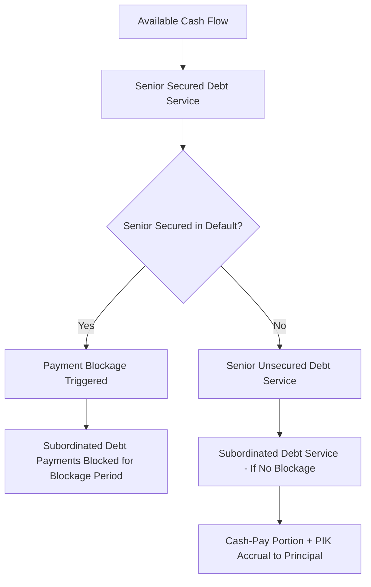

## Senior Secured, Senior Unsecured, and Subordinated Debt Layers

### Overview

This topic examines the three primary debt-only layers of the capital stack in depth — senior secured, senior unsecured, and subordinated debt — focusing on the specific contractual, structural, and market mechanisms that differentiate them beyond the basic secured/unsecured split. These three layers together form the debt "spine" of most syndicated and capital markets financing structures, sitting above preferred and common equity but internally differentiated by lien status, contractual subordination, and structural position.

### Senior Secured Debt: Structural Characteristics

**Defining Features:**

- Highest-priority claim in the capital stack, secured by a perfected lien over some or all of the borrower's assets.
- In syndicated leveraged finance, typically structured as one or more of: **Revolving Credit Facility (RCF)** for working capital needs, **Term Loan A (TLA)** typically held by banks with amortization and shorter tenor, and **Term Loan B (TLB)** typically held by institutional investors (CLOs, credit funds) with minimal amortization ("bullet-like" repayment profile) and longer tenor.
- Usually governed by a single **credit agreement** with a syndicate of lenders represented by an **administrative agent** who manages payment mechanics, collateral administration, and lender communications on behalf of the syndicate.

**Maintenance vs. Incurrence Covenants:**

- Senior secured facilities (particularly bank-held TLA/RCF tranches) conventionally carry **maintenance covenants** — financial ratio tests (leverage ratio, interest coverage ratio, fixed charge coverage) tested on a recurring basis (typically quarterly) regardless of whether the borrower takes any specific action.
- **[Unverified]** The prevalence of maintenance covenants in TLB tranches specifically has declined substantially in the broadly syndicated leveraged loan market over recent years (the "covenant-lite" trend), though the degree of prevalence fluctuates with credit market conditions and investor demand cycles; current market convention should be verified against up-to-date market data rather than assumed static.

### Senior Unsecured Debt: Structural Characteristics

**Defining Features:**

- Ranks behind secured claims with respect to pledged collateral, but ahead of subordinated debt among the general unsecured creditor pool.
- Commonly issued as **senior unsecured notes/bonds** in the public or private capital markets, though senior unsecured syndicated loan tranches also exist, particularly for higher-grade, less asset-intensive borrowers.
- Typically governed by an **indenture** (for bonds) rather than a bank-style credit agreement, with a **trustee** representing bondholder interests rather than an administrative agent — a structurally distinct governance model from the syndicated bank loan market.
- Conventionally relies on **incurrence covenants** rather than maintenance covenants — tested only upon specific triggering actions (incurring additional debt, making a restricted payment, undertaking an asset sale) rather than on a recurring calendar basis.

**Key Points:**

- This incurrence-vs-maintenance distinction is one of the most consequential practical differences between the bank loan market and the public/private bond market layers of the capital stack, directly affecting how much ongoing flexibility a borrower retains and how quickly lenders/bondholders can identify and respond to credit deterioration.
- Senior unsecured notes frequently include a **negative pledge covenant** (as discussed under secured vs. unsecured debt) as their primary structural protection against future subordination by newly issued secured debt.

### Subordinated Debt: Structural Characteristics

**Defining Features:**

- Explicitly and contractually subordinated in right of payment to senior debt (both secured and senior unsecured) via specific subordination provisions embedded in the subordinated instrument's governing documents.
- **Payment subordination** typically includes a **payment blockage** mechanism: upon a payment default (or sometimes a covenant default) under senior debt, senior lenders can block scheduled payments (interest and/or principal) to subordinated debt holders for a specified period (a "blockage period"), redirecting available cash to service senior obligations first.
- Frequently structured as **mezzanine debt**, combining:
  - **Cash-pay coupon:** a portion of the yield paid in cash on a current basis.
  - **PIK (Payment-in-Kind) interest:** a portion of the yield accrues and compounds into the principal balance rather than being paid in cash, reducing near-term cash flow burden on the borrower in exchange for higher effective yield to the lender over the life of the instrument.
  - **Equity warrants or conversion features:** attached equity upside to compensate mezzanine lenders for bearing elevated risk, blurring the line between debt and equity in the instrument's total return profile.

### Diagram: Three-Layer Debt Comparison (svg_diagram)

<svg xmlns="http://www.w3.org/2000/svg" viewBox="0 0 780 500">
<text x="390" y="30" text-anchor="middle" font-size="18" font-weight="bold" fill="#1a1a1a">Senior Secured vs. Senior Unsecured vs. Subordinated Debt (svg_diagram)</text>
<rect x="30" y="70" width="230" height="380" rx="8" fill="#EBF5FB" stroke="#0072B2" stroke-width="1.5" />
<text x="145" y="100" text-anchor="middle" font-size="14" font-weight="bold" fill="#0072B2">Senior Secured</text>
<text x="145" y="130" text-anchor="middle" font-size="11">Perfected lien on assets</text>
<text x="145" y="150" text-anchor="middle" font-size="11">Credit agreement + agent</text>
<text x="145" y="170" text-anchor="middle" font-size="11">Maintenance covenants</text>
<text x="145" y="190" text-anchor="middle" font-size="11">(historically)</text>
<text x="145" y="220" text-anchor="middle" font-size="11">TLA / TLB / RCF</text>
<text x="145" y="250" text-anchor="middle" font-size="11" font-weight="bold" fill="#0072B2">Lowest cost of capital</text>
<text x="145" y="270" text-anchor="middle" font-size="11" font-weight="bold" fill="#0072B2">Highest recovery expectation</text>
<rect x="275" y="70" width="230" height="380" rx="8" fill="#FEF9E7" stroke="#B7950B" stroke-width="1.5" />
<text x="390" y="100" text-anchor="middle" font-size="14" font-weight="bold" fill="#B7950B">Senior Unsecured</text>
<text x="390" y="130" text-anchor="middle" font-size="11">No specific collateral</text>
<text x="390" y="150" text-anchor="middle" font-size="11">Indenture + trustee</text>
<text x="390" y="170" text-anchor="middle" font-size="11">Incurrence covenants</text>
<text x="390" y="190" text-anchor="middle" font-size="11">Negative pledge protection</text>
<text x="390" y="220" text-anchor="middle" font-size="11">Senior Notes / Bonds</text>
<text x="390" y="250" text-anchor="middle" font-size="11" font-weight="bold" fill="#B7950B">Intermediate pricing</text>
<text x="390" y="270" text-anchor="middle" font-size="11" font-weight="bold" fill="#B7950B">Intermediate recovery</text>
<rect x="520" y="70" width="230" height="380" rx="8" fill="#FDEDEC" stroke="#C0392B" stroke-width="1.5" />
<text x="635" y="100" text-anchor="middle" font-size="14" font-weight="bold" fill="#C0392B">Subordinated / Mezzanine</text>
<text x="635" y="130" text-anchor="middle" font-size="11">Contractually subordinated</text>
<text x="635" y="150" text-anchor="middle" font-size="11">Payment blockage provisions</text>
<text x="635" y="170" text-anchor="middle" font-size="11">Cash-pay + PIK coupon</text>
<text x="635" y="190" text-anchor="middle" font-size="11">Warrants / equity kicker</text>
<text x="635" y="220" text-anchor="middle" font-size="11">Mezzanine Notes</text>
<text x="635" y="250" text-anchor="middle" font-size="11" font-weight="bold" fill="#C0392B">Highest cost of capital</text>
<text x="635" y="270" text-anchor="middle" font-size="11" font-weight="bold" fill="#C0392B">Lowest recovery expectation</text>
</svg>

### Comparative Summary Table

| Feature | Senior Secured | Senior Unsecured | Subordinated / Mezzanine |
| --- | --- | --- | --- |
| Collateral | Perfected lien (specific or blanket) | None (general credit) | Typically none, or deeply subordinated lien |
| Governing document | Credit agreement | Indenture | Subordinated note/credit agreement with payment subordination provisions |
| Representative | Administrative agent | Trustee | Varies (agent or trustee depending on syndication vs. bond structure) |
| Typical covenant style | Maintenance (traditionally) / incurrence (cov-lite) | Incurrence | Incurrence, often lighter than senior unsecured |
| Coupon structure | Floating rate, cash-pay | Fixed or floating, cash-pay | Cash-pay + PIK, often with warrants |
| Typical holder base | Banks (TLA/RCF), CLOs/institutional (TLB) | Institutional bond investors, high-yield funds | Private credit funds, mezzanine funds, insurance companies |
| Payment blockage risk | N/A (most senior) | Generally not subject to blockage by more senior unsecured debt | Subject to blockage upon senior debt default |

### Worked Illustration: Blended Cost of Capital Across the Three Layers

**Setup:** A leveraged transaction is financed with:

- $200M Senior Secured Term Loan at 7.5% cash coupon
- $100M Senior Unsecured Notes at 9.5% cash coupon
- $50M Subordinated Mezzanine Notes at 8% cash-pay + 5% PIK (13% total yield)

**Blended Debt Cost Calculation:**

$$\text{Blended Cost} = \frac{(200 \times 7.5\%) + (100 \times 9.5\%) + (50 \times 13\%)}{350}$$

$$= \frac{15.0M + 9.5M + 6.5M}{350M} = \frac{31.0M}{350M} \approx 8.86\%$$

**Interpretation:** The blended cost of 8.86% sits between the senior secured rate (7.5%) and the subordinated rate (13%), weighted by relative tranche size — illustrating the direct pricing mechanics of capital stack layering: adding more subordinated capacity raises the blended cost of the overall debt package but may allow the sponsor to reduce senior secured leverage (improving senior lenders' relative comfort and potentially their pricing) or to reduce the total equity check required for the transaction.

### Application to Syndicated Loan Structuring

- **Syndicate composition by layer:** The senior secured layer's syndicate composition (banks for amortizing TLA/RCF tranches, institutional CLO/credit-fund investors for bullet TLB tranches) reflects differing risk appetite and regulatory capital treatment across lender types — a structuring consideration that directly shapes how arrangers market and allocate each tranche during syndication.
- **Cross-tranche intercreditor and subordination documentation:** When a transaction includes all three layers simultaneously, the legal documentation must carefully coordinate the intercreditor agreement (governing secured-vs-secured priority, if applicable) with the subordination provisions in the mezzanine documentation (governing payment blockage and standstill vis-à-vis senior secured and senior unsecured debt) — a significant legal workstream in complex leveraged financings.
- **Sizing decisions and leverage multiple allocation:** Arrangers and sponsors jointly determine how much of total transaction leverage sits in each layer based on relative cost, covenant flexibility desired, and market appetite at the time of syndication — a senior secured-heavy structure minimizes blended cost but maximizes maintenance covenant exposure and refinancing risk concentration, while a mezzanine-heavier structure increases blended cost but provides more covenant flexibility and reduces near-term cash interest burden via PIK features.
- **Refinancing and capital structure evolution:** As a borrower's credit profile improves post-transaction, a common capital structure evolution path is refinancing subordinated/mezzanine debt with additional senior secured or senior unsecured capacity at lower blended cost — directly reflecting the pricing hierarchy illustrated above and a routine feature of leveraged issuer capital structure management over a credit cycle.

### Common Pitfalls

- Assuming all senior secured debt carries maintenance covenants and all senior unsecured/subordinated debt carries only incurrence covenants — while this reflects traditional/historical market convention, covenant structure is negotiated and market-cycle-dependent (the "covenant-lite" trend in the broadly syndicated loan market is a documented departure from this traditional pattern) and should be verified against the specific instrument's documentation rather than assumed by instrument type alone.
- Confusing PIK interest with a lower-cost financing feature from the borrower's perspective — while PIK reduces near-term cash interest burden, it compounds principal and generally reflects a *higher* total yield to the lender (as in the worked example above) compensating for the deferred cash payment and elevated risk position, not a cheaper financing form overall.
- Overlooking payment blockage mechanics when assessing subordinated debt risk — the practical impact of subordination is not merely lower liquidation priority but also the contractual ability of senior lenders to interrupt current cash payments to subordinated holders even while the subordinated debt is not itself in default.
- Treating the administrative agent (bank loan structures) and trustee (bond/indenture structures) roles as interchangeable — they operate under different legal frameworks, duties, and typical levels of lender/holder engagement, which affects amendment and waiver dynamics differently across the two structures.

### Mermaid: Three-Layer Payment Priority and Blockage Logic

### Related Topics

- Anatomy of the Capital Stack from Senior to Junior Claims
- Secured versus Unsecured Debt
- Intercreditor Agreements: First-Lien / Second-Lien Mechanics
- Mezzanine Debt Structuring: PIK Interest and Warrant Coverage
- Covenant-Lite Structures and the Evolution of Leveraged Loan Terms
- Term Loan A vs. Term Loan B: Structural and Investor Base Differences
- Bond Indenture Mechanics and the Role of the Trustee
- Blended Cost of Capital and Optimal Tranche Sizing in Leveraged Transactions