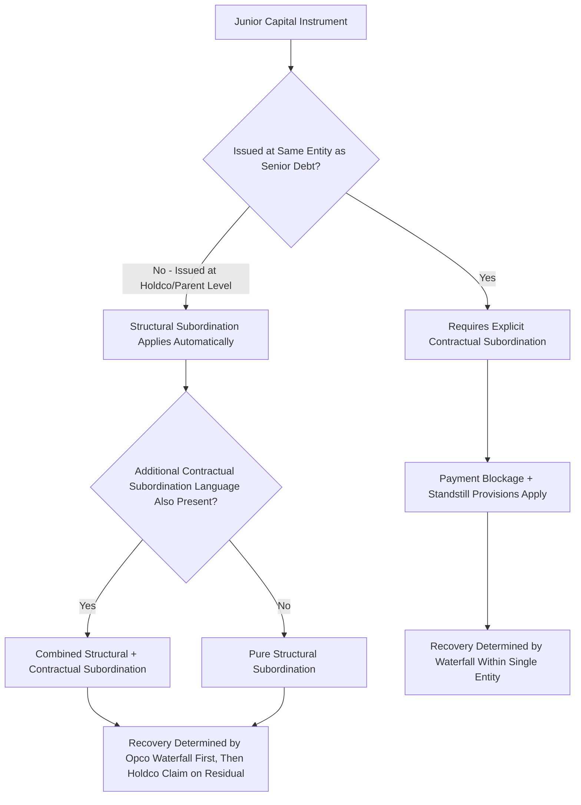

## Mezzanine Debt and Structural Subordination

### Overview

This topic examines two related but distinct subordination mechanisms in depth: **mezzanine debt** as an instrument class combining debt and equity-like features, and **structural subordination** as a positional phenomenon arising from corporate group architecture rather than explicit contractual language. Both concepts govern how junior capital providers are subordinated to senior claims, but through fundamentally different legal and economic mechanisms — a distinction critical to accurately assessing risk in multi-entity leveraged financing structures.

### Mezzanine Debt: Instrument Characteristics

**Defining Features:**

Mezzanine debt occupies the layer between senior/subordinated straight debt and equity in the capital stack, typically combining several yield and structural features to compensate lenders for elevated risk:

- **Blended coupon structure:** Commonly a cash-pay component (paid currently, reducing near-term lender risk) plus a PIK (payment-in-kind) component (accruing to principal, compounding over the instrument's life, preserving borrower cash flow in the near term).
- **Equity kicker (warrants):** Attached warrants or conversion rights granting the mezzanine lender the option to acquire equity (typically 1-10% of fully diluted equity, though this varies significantly by transaction) at a nominal or discounted strike price, providing meaningful upside participation if the underlying business performs well.
- **Call protection:** Non-call periods and prepayment premiums (often structured as a declining scale, e.g., a "make-whole" premium or a stepped call schedule) to protect the lender's expected total return given the instrument's typically longer expected holding period relative to senior debt.
- **Board observation or minority governance rights:** Larger mezzanine investments sometimes include board observer rights or specific consent rights over major corporate actions, reflecting the instrument's closer alignment with an equity-like monitoring relationship than typical senior debt.

**Contractual Subordination Mechanics:**

Mezzanine debt is typically **contractually subordinated** to senior debt via an explicit subordination agreement or subordination provisions embedded in the mezzanine note documentation itself, including:

- **Payment subordination:** Scheduled cash payments to mezzanine holders can be blocked during a **payment blockage period** triggered by a payment default (and sometimes a broader covenant default) under senior debt.
- **Standstill provisions:** Mezzanine lenders are typically restricted from independently pursuing enforcement remedies (acceleration, foreclosure) for a specified period following a default, allowing senior lenders the first opportunity to negotiate a resolution or pursue remedies.
- **Turnover provisions:** If a mezzanine lender receives any payment in violation of the subordination terms (e.g., during an active blockage period), that payment must typically be turned over to the senior lenders.

### Structural Subordination: The Positional Mechanism

**Defining the Concept:**

Structural subordination arises not from any explicit contractual subordination language, but from the **legal separateness of corporate entities** within a multi-tier organizational structure. A creditor of a parent/holding company is structurally subordinated to creditors of operating subsidiaries because:

- Operating subsidiary assets and cash flow are legally owned by the subsidiary, not the parent.
- Operating subsidiary creditors have a direct claim on subsidiary assets and cash flow.
- The parent/holding company only has a claim on the *residual* value of the subsidiary (via its equity ownership) — meaning holdco creditors can only reach value that flows up to the parent *after* all opco-level creditors (both secured and unsecured) have been satisfied.

**Key Points:**

- This subordination exists **even in the complete absence of any contractual subordination agreement** — it is a structural consequence of corporate separateness and limited liability, not a negotiated term.
- Structural subordination is functionally similar in economic effect to contractual subordination (holdco creditors recover only residual value after opco creditors are satisfied) but arises through an entirely different legal mechanism, which has important practical implications for enforcement rights, bankruptcy proceedings (which entity files, and under which jurisdiction), and creditor remedies.

### Diagram: Structural Subordination in a Holdco/Opco Structure (svg_diagram)

<svg xmlns="http://www.w3.org/2000/svg" viewBox="0 0 700 520">
<text x="350" y="30" text-anchor="middle" font-size="18" font-weight="bold" fill="#1a1a1a">Structural Subordination: Holdco vs. Opco Creditors (svg_diagram)</text>
<rect x="220" y="60" width="260" height="90" rx="8" fill="#F4ECF7" stroke="#8E44AD" stroke-width="2" />
<text x="350" y="90" text-anchor="middle" font-size="14" font-weight="bold" fill="#8E44AD">Holding Company (Holdco)</text>
<text x="350" y="112" text-anchor="middle" font-size="11">Issues Subordinated / PIK Notes</text>
<text x="350" y="130" text-anchor="middle" font-size="11">No direct claim on Opco assets</text>
<line x1="350" y1="150" x2="350" y2="210" stroke="#333" stroke-width="2" />
<text x="380" y="185" font-size="11" fill="#333">Equity ownership</text>
<text x="380" y="200" font-size="11" fill="#333">(residual claim only)</text>
<rect x="160" y="210" width="380" height="90" rx="8" fill="#EBF5FB" stroke="#0072B2" stroke-width="2" />
<text x="350" y="240" text-anchor="middle" font-size="14" font-weight="bold" fill="#0072B2">Operating Company (Opco)</text>
<text x="350" y="262" text-anchor="middle" font-size="11">Issues Senior Secured Term Loan / RCF</text>
<text x="350" y="280" text-anchor="middle" font-size="11">Direct claim on Opco assets and cash flow</text>
<rect x="60" y="340" width="580" height="130" rx="8" fill="#FEF9E7" stroke="#B7950B" stroke-width="1.5" />
<text x="350" y="365" text-anchor="middle" font-size="13" font-weight="bold">Value Flow in Liquidation</text>
<text x="350" y="390" text-anchor="middle" font-size="12">1. Opco assets first satisfy Opco-level senior secured creditors</text>
<text x="350" y="410" text-anchor="middle" font-size="12">2. Any residual value flows up to Holdco via equity ownership</text>
<text x="350" y="430" text-anchor="middle" font-size="12">3. Holdco creditors (subordinated notes) paid only from this residual</text>
<text x="350" y="450" text-anchor="middle" font-size="12" font-weight="bold" fill="#B7950B">No contractual subordination language required</text>
</svg>

### Comparing Contractual and Structural Subordination

| Dimension | Contractual Subordination (Mezzanine) | Structural Subordination (Holdco/Opco) |
| --- | --- | --- |
| Legal source | Explicit subordination agreement/provisions | Corporate entity separateness and limited liability |
| Requires specific language? | Yes | No — arises automatically from group structure |
| Typical instrument | Mezzanine notes, subordinated debt at same entity level as senior debt | Holdco notes, PIK notes issued above an opco credit facility |
| Payment blockage mechanism | Explicit, negotiated blockage period and triggers | No direct blockage mechanism — holdco simply has no claim until opco obligations are satisfied and value distributed up |
| Bankruptcy proceeding implications | Same entity's bankruptcy; subordination provisions enforced within that single proceeding | Potentially separate bankruptcy proceedings for holdco and opco entities, each with its own creditor body |
| Can be layered/combined? | Yes — a holdco note can be both structurally subordinated (by entity position) AND contractually subordinated (if additional explicit subordination language is also included) | N/A — structural subordination is the baseline against which contractual subordination may be layered |

### Worked Illustration: Combined Structural and Contractual Subordination

**Setup:** A leveraged buyout structure includes:

- **Opco:** $150M Senior Secured Term Loan (syndicated, blanket lien on Opco assets)
- **Holdco:** $60M PIK Toggle Notes (issued at the holding company level, structurally subordinated to all Opco debt by virtue of entity position)

**Scenario:** Opco generates enterprise value of $130M in a distress scenario.

1. Opco Senior Secured Term Loan claim: $150M against $130M Opco enterprise value → **86.7% recovery** ($130M of $150M), Opco creditors take a haircut but there is no residual value to flow up to Holdco.
2. Holdco PIK Notes: **0% recovery** — since Opco enterprise value was insufficient to fully satisfy even the Opco-level senior secured claim, there is no residual value at all to flow up to Holdco via its equity ownership in Opco, regardless of whether the Holdco notes contained any additional explicit subordination language.

**Interpretation:** This illustrates the "structural" mechanism in its purest form — the Holdco noteholders are wiped out entirely not because of any specific contractual subordination clause in their own notes, but purely because Opco-level value was insufficient to leave any residual for the parent entity to pass through. This is a critical distinction from a scenario where the same $60M in subordinated notes had instead been issued *at the Opco level itself* with contractual subordination — in that alternative scenario, the Opco-level subordinated notes would at least sit within the same waterfall as the senior secured debt (receiving $0 in this specific example since Opco value doesn't even cover the senior claim, but the analytical framework and negotiating dynamics, e.g., around a potential debt-for-equity exchange, can differ meaningfully between the two structures).

### Rating Agency and Market Treatment

- Rating agencies typically apply **explicit notching** to reflect structural subordination — a holdco-level instrument in a leveraged capital structure with substantial opco-level secured debt ahead of it is commonly rated multiple notches below the family/corporate rating, distinct from and often in addition to any notching applied for purely contractual subordination at a given entity level.
- **[Unverified]** The magnitude of typical notching for structural subordination varies by rating agency methodology and by the specific amount of debt ahead of the structurally subordinated layer relative to overall enterprise value; specific notch-count conventions should be verified against current rating agency methodology documents rather than assumed to be fixed.

### Application to Syndicated Loan Structuring

- **PIK toggle notes in LBO structures:** A common sponsor-driven structure issues **holdco PIK toggle notes** (where the borrower/parent can elect to pay interest in cash or let it accrue as PIK) specifically to raise additional acquisition or dividend recapitalization proceeds without adding leverage or covenant constraints at the Opco level where the syndicated term loan and its lender group reside — leveraging structural subordination deliberately as a structuring tool to keep senior secured syndicate lenders "structurally insulated" from the additional holdco leverage.
- **Restricted subsidiary / unrestricted subsidiary designations:** Syndicated credit agreements typically define which subsidiaries are "restricted" (subject to the credit agreement's covenants and part of the collateral/guarantee package) versus "unrestricted" (outside the credit group) — unrestricted subsidiaries create a structural subordination dynamic relative to the restricted group's creditors, and sponsors have at times used unrestricted subsidiary designations controversially to move valuable assets outside the reach of existing senior lenders (a well-documented source of contentious lender litigation in several notable market episodes).
- **Guarantee structures as a structural subordination mitigant:** Senior secured syndicated facilities typically require upstream guarantees from material operating subsidiaries specifically to counteract structural subordination that would otherwise exist between a parent-level borrower and subsidiary-level assets — extending the lender's effective claim down to the operating subsidiary level rather than relying solely on the parent's residual equity claim.
- **Cross-guarantee and co-borrower structures in multi-entity syndications:** Complex corporate groups with multiple operating entities often use co-borrower or cross-guarantee structures specifically to flatten structural subordination across the group, giving the syndicate a more direct claim across multiple entities rather than relying purely on a single-entity credit agreement with structurally subordinated affiliates.

### Common Pitfalls

- Assuming mezzanine debt is always contractually subordinated at the *same* legal entity as the senior debt — mezzanine/PIK instruments are frequently issued at a structurally separate (typically holdco) entity, meaning the instrument can be simultaneously structurally *and* contractually subordinated, or structurally subordinated *without* additional explicit contractual subordination language, depending on the specific transaction structure.
- Treating structural subordination as a lesser or more easily circumvented form of subordination compared to contractual subordination — in practice, structural subordination can be equally or more severe in its economic effect, precisely because it requires no explicit negotiated blockage mechanism; the holdco creditor simply has no claim at all until opco obligations are satisfied.
- Overlooking restricted/unrestricted subsidiary designation mechanics when assessing structural subordination risk in a syndicated credit — the scope of the "restricted group" directly determines which assets and cash flows are structurally accessible to the senior lender syndicate versus effectively structurally subordinated (or entirely outside the credit group) via unrestricted subsidiary designations.
- Confusing PIK "toggle" (borrower election between cash and PIK payment) with mandatory PIK structures (no cash-pay option) — the toggle feature specifically gives the borrower financial flexibility during periods of cash flow stress, an important structuring distinction when assessing covenant and liquidity implications.

### Mermaid: Mezzanine and Structural Subordination Decision Logic

### Related Topics

- Anatomy of the Capital Stack from Senior to Junior Claims
- Senior Secured, Senior Unsecured, and Subordinated Debt Layers
- Secured versus Unsecured Debt
- PIK Toggle Notes and Holdco Financing Structures in LBOs
- Restricted vs. Unrestricted Subsidiary Designations in Credit Agreements
- Upstream Guarantee Structures and Subsidiary Guarantee Packages
- Rating Agency Notching Methodology for Subordinated and Structurally Subordinated Debt
- Intercreditor Agreements: First-Lien / Second-Lien Mechanics