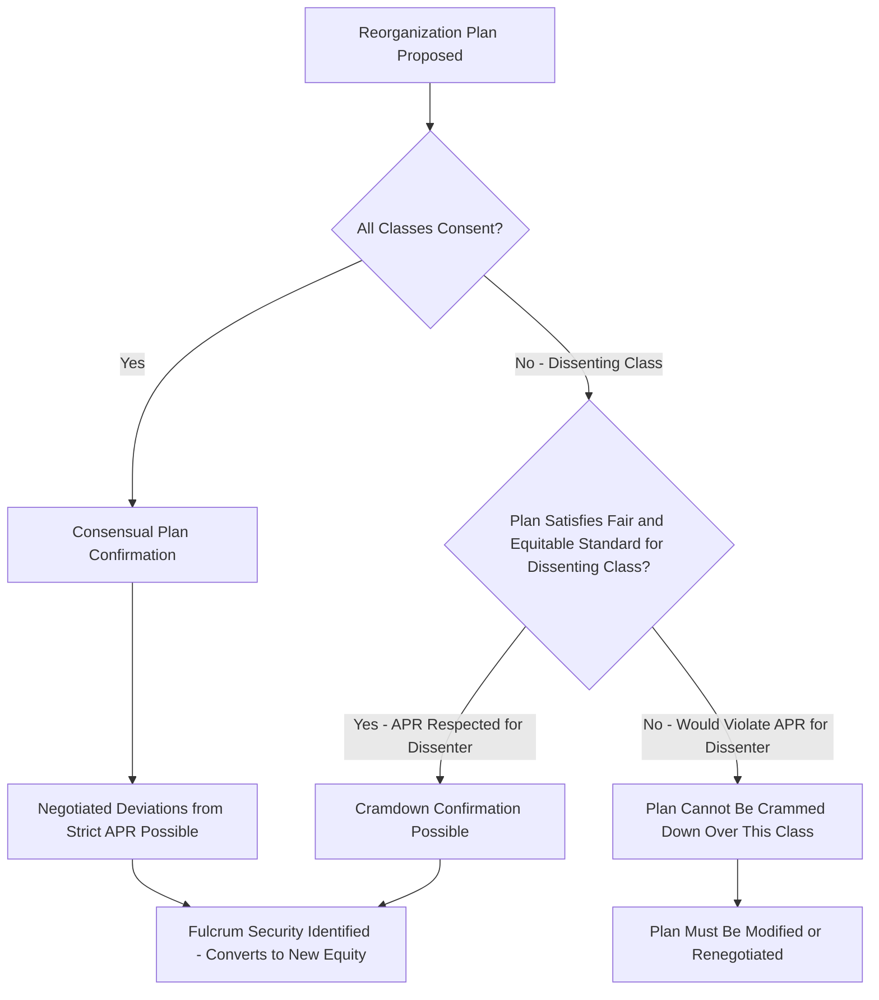

## Priority of Claims in Bankruptcy and the Absolute Priority Rule

### Overview

This topic examines the formal legal priority scheme governing distribution of value in bankruptcy proceedings, centered on the **absolute priority rule (APR)** — the doctrine requiring that senior classes of claims be paid in full before any junior class (including equity) receives any distribution. While previously introduced as a foundational concept under capital stack anatomy, this topic provides deeper treatment of the rule's legal basis, statutory priority scheme, common deviations in practice, and its central role in reorganization negotiation dynamics.

### The Absolute Priority Rule: Legal Foundation

**Core Doctrine:**

$$\text{Senior Class Paid in Full} \rightarrow \text{Next Junior Class Eligible for Distribution}$$

The rule requires strict waterfall satisfaction: no class may receive or retain any property under a reorganization plan on account of its junior claim or interest unless every senior class either (a) is paid in full, or (b) consents to the plan (typically via the requisite voting majority under the applicable bankruptcy code framework).

**[Unverified]** The absolute priority rule as codified varies in its precise statutory formulation and application across jurisdictions (e.g., U.S. Chapter 11 under the Bankruptcy Code versus insolvency regimes in other countries); the general APR concept described here reflects the widely-referenced U.S. Chapter 11 framework commonly used as the reference case in corporate finance and capital structuring literature, and jurisdiction-specific statutory detail should be verified against current legal counsel or primary legal sources for any actual transaction.

### Statutory Priority Scheme (General Structure)

Beyond the basic secured/unsecured/equity hierarchy, formal bankruptcy proceedings typically recognize additional priority sub-categories:

**1. Secured Claims**

- Satisfied first, up to the value of the pledged collateral, as discussed under secured vs. unsecured debt.
- Any shortfall (deficiency claim) if collateral value is insufficient becomes a general unsecured claim.

**2. Administrative and Priority Unsecured Claims**

- Certain categories of unsecured claims are typically granted statutory priority *ahead* of general unsecured creditors, even though technically unsecured — commonly including:
  - Costs of administering the bankruptcy estate (professional fees, trustee fees)
  - Certain employee wage and benefit claims (up to statutory caps)
  - Certain tax claims
- **Key Points:** This means the simple secured-unsecured-equity hierarchy from the basic capital stack model is, in a formal bankruptcy proceeding, further refined by these statutory priority carve-outs, which can meaningfully affect recovery available to general unsecured creditors (including senior unsecured bondholders) even though those priority claims are not part of the negotiated capital structure at all.

**3. General Unsecured Claims**

- Includes senior unsecured debt, trade payables, and any deficiency claims from undersecured secured creditors.
- Shares pro-rata in remaining value after secured and priority claims are satisfied.

**4. Subordinated Claims**

- Includes contractually subordinated debt (mezzanine, subordinated notes) and, in certain jurisdictions, specific statutorily subordinated claims (e.g., certain claims related to securities fraud litigation against the debtor, or claims by insiders in some circumstances).

**5. Preferred Equity**

- Ranks ahead of common equity per its liquidation preference terms, but behind all debt classes (secured, priority, general unsecured, subordinated).

**6. Common Equity**

- Residual claimant; receives value only if all senior classes are paid in full.

### Diagram: Formal Bankruptcy Priority Waterfall (svg_diagram)

<svg xmlns="http://www.w3.org/2000/svg" viewBox="0 0 700 620">
<text x="350" y="30" text-anchor="middle" font-size="17" font-weight="bold" fill="#1a1a1a">Formal Bankruptcy Priority Waterfall (svg_diagram)</text>
<rect x="150" y="60" width="400" height="55" fill="#08519c" stroke="#333" />
<text x="350" y="92" text-anchor="middle" font-size="12" fill="#fff" font-weight="bold">1. Secured Claims (up to collateral value)</text>
<rect x="150" y="115" width="400" height="55" fill="#2171b5" stroke="#333" />
<text x="350" y="140" text-anchor="middle" font-size="12" fill="#fff" font-weight="bold">2. Administrative / Priority Unsecured</text>
<text x="350" y="157" text-anchor="middle" font-size="11" fill="#fff">(fees, certain wages, certain taxes)</text>
<rect x="150" y="170" width="400" height="55" fill="#6baed6" stroke="#333" />
<text x="350" y="202" text-anchor="middle" font-size="12" fill="#08306b" font-weight="bold">3. General Unsecured Claims</text>
<rect x="150" y="225" width="400" height="55" fill="#9ecae1" stroke="#333" />
<text x="350" y="257" text-anchor="middle" font-size="12" fill="#08306b" font-weight="bold">4. Subordinated Claims</text>
<rect x="150" y="280" width="400" height="55" fill="#fdae6b" stroke="#333" />
<text x="350" y="312" text-anchor="middle" font-size="12" fill="#7f2704" font-weight="bold">5. Preferred Equity</text>
<rect x="150" y="335" width="400" height="55" fill="#d94801" stroke="#333" />
<text x="350" y="367" text-anchor="middle" font-size="12" fill="#fff" font-weight="bold">6. Common Equity (residual)</text>

<text x="350" y="420" text-anchor="middle" font-size="12" fill="#555">Strict APR: each tier fully satisfied before next tier participates</text>

<text x="350" y="440" text-anchor="middle" font-size="12" fill="#555">Deviations occur via negotiated plan consent (see below)</text>

</svg>

### Deviations from Strict Absolute Priority: The Negotiated Reality

**Why Deviations Occur:**

Despite APR's formal statutory force, actual reorganization outcomes frequently deviate from strict priority ordering, primarily because:

- **Consensual plan confirmation** is generally faster, cheaper, and less risky than a contested "cramdown" confirmation, incentivizing senior classes to voluntarily allow some recovery to nominally out-of-the-money junior classes in exchange for their vote and cooperation (avoiding costly, protracted litigation and appeals).
- Junior classes (particularly existing equity/management) may possess **information, operational continuity value, or litigation leverage** (e.g., claims of breach of fiduciary duty, preference/fraudulent transfer litigation threats, or simply the practical value of existing management's cooperation during the reorganization process) that senior creditors are willing to "pay" for via a negotiated recovery, even though strict APR would give them nothing.
- **[Unverified]** The empirical frequency and typical magnitude of APR deviations documented in the academic and practitioner literature varies across studies, industries, and time periods; the general finding that *some* deviation from strict priority is common in negotiated Chapter 11 reorganizations (as opposed to straight liquidations) is well-established, but specific frequency/magnitude statistics should not be treated as fixed, current figures without verification against recent data.

### The Fulcrum Security and Negotiation Dynamics

**Core Concept (Building on Capital Stack Anatomy):**

The **fulcrum security** is the most senior class of claims that is not paid in full under strict APR — i.e., the class where enterprise value "runs out." This class typically has the strongest negotiating position in a reorganization because:

- It stands to receive the primary equity distribution (or negotiated recovery enhancement) in a successful reorganization, converting from a debt claim into the new post-reorganization equity ownership.
- It has strong incentive to support a plan that maximizes and correctly identifies enterprise value (since its recovery is directly tied to that valuation), often putting it in an adversarial valuation dispute with both more senior classes (who may prefer a lower valuation, supporting a smaller pie needed to pay them in full and leaving less for the fulcrum class) and more junior classes (who argue for a higher valuation to preserve their own out-of-the-money claims' negotiating leverage).

**Cramdown Mechanics:**

- If not all classes consent to a proposed reorganization plan, the plan proponent can seek to have the plan approved over a dissenting class's objection via a **"cramdown"** — provided statutory requirements are met, including that the plan does not discriminate unfairly and is "fair and equitable" with respect to the dissenting class.
- The "fair and equitable" standard for a dissenting class of secured or unsecured creditors generally *incorporates* the absolute priority rule directly — a plan cannot be crammed down over a dissenting unsecured class's objection if a junior class (including equity) retains value under the plan while the dissenting senior class is not paid in full, absent that senior class's consent.
- **Key Points:** This is precisely why negotiated consensual deviations from strict APR (discussed above) typically require the *affected senior class's own consent* — a senior class can voluntarily agree to let junior classes receive value even though strict APR would not require it, but a dissenting senior class generally cannot be crammed down in a way that violates APR with respect to its own claim.

### Worked Illustration: APR Application with Negotiated Deviation

**Setup:** Building on the capital stack recovery analysis introduced earlier in this chapter — $120M enterprise value against:

| Layer | Face Value | Strict APR Recovery |
| --- | --- | --- |
| Senior Secured Debt | $60M | 100% ($60M) |
| Second-Lien Debt | $30M | 100% ($30M) |
| Senior Unsecured Debt | $25M | 100% ($25M) |
| Subordinated Debt (Fulcrum) | $20M | 25% ($5M) |
| Preferred Equity | $15M | 0% |
| Common Equity | — | 0% |

**Negotiated Deviation Scenario:**

Existing common equity holders (management/sponsor) possess operational continuity value and threaten protracted litigation over asset valuation, which could delay the reorganization and impose significant administrative costs on all classes. The subordinated debt holders (the fulcrum class, who would receive 100% of new equity under strict APR) negotiate to grant existing common equity holders a small **equity "gift"** — e.g., 3-5% of new post-reorganization common equity — in exchange for their cooperation, expedited plan support, and waiver of litigation claims, even though strict APR would technically entitle common equity to $0.

**Interpretation:** This is a canonical example of a **negotiated APR deviation** — the fulcrum class (subordinated debt, converting to the bulk of new equity) voluntarily consents to share a small sliver of value with a class that would otherwise receive nothing under strict priority, motivated by the practical benefits of a faster, less contentious, and less costly confirmation process. This type of arrangement would generally require the consent of the affected senior classes (here, the fulcrum subordinated class making the concession) precisely because a court-imposed cramdown over an objecting senior class's dissent could not achieve the same outcome under the "fair and equitable" / APR-consistent cramdown standard.

### Application to Syndicated Loan Structuring and Credit Analysis

- **Pre-restructuring recovery modeling:** Credit analysts and distressed debt investors assessing a syndicated loan position in a potentially distressed credit build detailed APR-based recovery waterfalls (as illustrated above) as a baseline case, then separately model likely negotiated deviations based on situation-specific factors (litigation risk, operational continuity value, relative negotiating leverage of each class) — the baseline APR case and the negotiated-outcome case can differ meaningfully and both are relevant to investment/lending decisions.
- **Syndicate steering committee dynamics:** In a distressed syndicated credit, the lender syndicate frequently forms or participates in an **ad hoc committee** or **steering committee** to coordinate negotiating positions during a restructuring — understanding where the syndicate's claim sits relative to the likely fulcrum security is central to determining the syndicate's negotiating leverage and expected strategy (e.g., whether to push for a quick consensual resolution or to litigate for strict APR application).
- **Documentation provisions anticipating restructuring:** Syndicated credit agreements increasingly include specific provisions (e.g., restrictions on "uptiering" transactions, protections against asset-stripping via unrestricted subsidiary designations as discussed under structural subordination) specifically motivated by lenders' experience with situations where the practical, negotiated outcome of a restructuring diverged materially from what strict contractual priority would suggest.
- **Loan trading and secondary market pricing:** Distressed syndicated loan positions are frequently traded in the secondary market at prices reflecting expected recovery under a blend of strict APR and anticipated negotiated outcomes, rather than a pure strict-APR calculation alone — market participants price in the practical dynamics of reorganization negotiation described above, not merely the formal legal waterfall.

### Common Pitfalls

- Treating the absolute priority rule as a rule that is mechanically applied without negotiation in most real-world reorganizations — as discussed above, negotiated consensual deviations are a well-documented and common feature of actual Chapter 11 practice, distinct from the formal statutory baseline.
- Confusing a "cramdown" with a violation of APR — a properly executed cramdown over a dissenting class's objection must still satisfy the "fair and equitable" standard, which itself incorporates APR; cramdown is a mechanism for overriding a dissenting class's *vote*, not a mechanism for overriding APR's substantive priority protections for that same dissenting class.
- Overlooking statutory priority unsecured claims (administrative expenses, certain wage/tax claims) that sit ahead of general unsecured creditors in a formal bankruptcy — these can meaningfully reduce recovery available to senior unsecured bondholders even though such priority claims are not typically a negotiated part of the pre-bankruptcy capital structure.
- Assuming the fulcrum security is always easy to identify in advance — enterprise valuation in a distressed scenario is itself often contested and uncertain, meaning different parties may have genuinely different, defensible views on which class constitutes the fulcrum security, driving much of the negotiation dynamic described above.

### Mermaid: APR Application and Cramdown Decision Logic

### Related Topics

- Anatomy of the Capital Stack from Senior to Junior Claims
- Senior Secured, Senior Unsecured, and Subordinated Debt Layers
- Mezzanine Debt and Structural Subordination
- Fulcrum Security Analysis and Restructuring Negotiation Dynamics
- Chapter 11 Reorganization Process and Cramdown Standards
- Distressed Debt Investing and Secondary Loan Market Pricing
- Ad Hoc and Steering Committee Formation in Syndicated Loan Restructurings
- Uptiering Transactions and Recent Lender Liability Litigation Trends