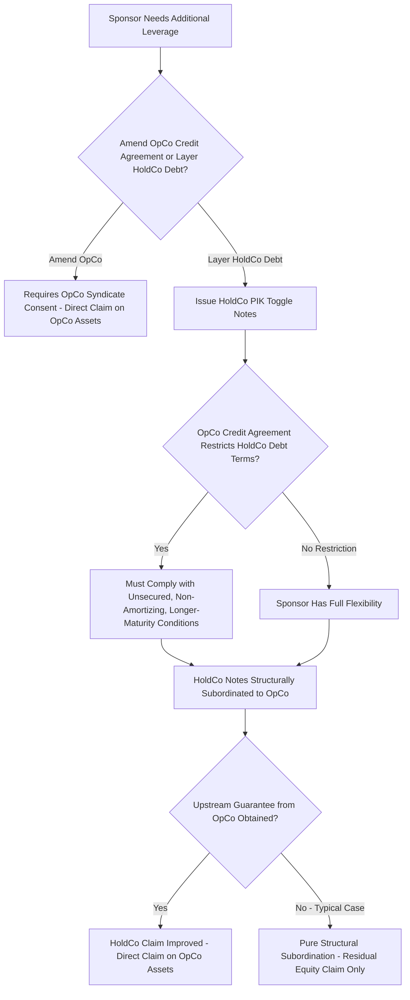

## HoldCo versus OpCo Structures and Structural Subordination

### Overview

This topic examines holding company (HoldCo) versus operating company (OpCo) capital structuring as a deliberate architectural choice in leveraged finance, extending the structural subordination concept introduced under mezzanine debt into a dedicated treatment of multi-entity structuring mechanics, guarantee architecture, restricted/unrestricted subsidiary frameworks, and the specific tools sponsors and arrangers use to allocate structural subordination risk across a syndicate.

### The Corporate Architecture: Why Multi-Entity Structures Exist

**Common Rationales for HoldCo/OpCo Separation:**

- **Liability isolation:** Legal separateness of entities can insulate the parent (and its other assets/subsidiaries) from liabilities specific to a given operating business.
- **Tax efficiency:** Certain tax planning structures (particularly in cross-border contexts) rely on strategic placement of debt and equity at specific entity levels to optimize interest deductibility and repatriation of cash across jurisdictions.
- **Financing flexibility:** Separating HoldCo and OpCo capital structures allows a sponsor to layer additional leverage (via HoldCo notes, PIK toggle instruments) without directly amending or renegotiating the OpCo-level syndicated credit agreement — often used to fund acquisitions, dividend recapitalizations, or additional growth capital while the OpCo lender syndicate's terms remain undisturbed.
- **Regulatory considerations:** In certain regulated industries (financial services, utilities, insurance), regulatory capital or licensing requirements may necessitate maintaining specific entities with constrained leverage or ownership structures, with additional leverage layered at a HoldCo level outside the regulated perimeter.

### Structural Subordination Mechanics Recap and Extension

As established under mezzanine debt and structural subordination, a HoldCo creditor's claim is structurally junior to OpCo creditors because the HoldCo's only claim on OpCo value runs through its **equity ownership** — a residual claim by definition. This section extends that foundational concept into the specific structuring tools used to manage, mitigate, or deliberately exploit this positional subordination.

**Key Points:**

- The degree of structural subordination is directly proportional to the amount of debt at the OpCo level relative to OpCo enterprise value — a HoldCo creditor behind a lightly levered OpCo faces materially less structural subordination risk than one behind a heavily levered OpCo, even without any change to the HoldCo instrument's own terms.
- This means HoldCo debt pricing and structuring terms are highly sensitive to OpCo-level leverage decisions made independently (and potentially subsequently) by OpCo management/sponsors — a dynamic that HoldCo lenders typically address through **restrictive covenants limiting future OpCo-level debt incurrence**, even though the HoldCo lender has no direct claim on OpCo assets.

### Guarantee Structures as Structural Subordination Mitigants

**Upstream Guarantees:**

- OpCo-level syndicated credit agreements typically require **upstream guarantees** from material subsidiaries of the OpCo borrower (if the OpCo itself has further sub-subsidiaries) to extend the lender syndicate's effective claim down through the operating group, preventing the OpCo lenders themselves from facing structural subordination relative to value held at a lower-tier operating subsidiary.
- This guarantee logic can, in principle, also run in the other direction: a HoldCo lender group may negotiate for an **upstream guarantee from OpCo** to the HoldCo notes, which — if obtained — would convert what would otherwise be pure structural subordination into a direct (though likely still contractually and/or structurally junior, depending on lien and payment subordination terms) claim against OpCo assets, materially improving the HoldCo lender's position relative to the pure "residual equity claim only" baseline.
- **[Unverified]** In practice, sponsors and OpCo lender syndicates frequently resist granting OpCo-level guarantees to HoldCo debt specifically because doing so would erode the structural subordination "insulation" that OpCo lenders value; whether such guarantees are obtained is highly deal-specific and subject to negotiation leverage at the time of the HoldCo financing, and no universal market convention should be assumed.

### Restricted vs. Unrestricted Subsidiary Designations

**Restricted Subsidiaries:**

- Subsidiaries that are subject to the OpCo credit agreement's covenant package, typically required to provide guarantees and collateral, and whose financial results are consolidated for covenant compliance testing purposes (leverage ratios, EBITDA calculations, etc.).

**Unrestricted Subsidiaries:**

- Subsidiaries explicitly designated as falling *outside* the credit agreement's covenant package and collateral/guarantee requirements — often used for joint ventures, non-core business lines, or entities holding assets the sponsor wishes to keep flexible for future financing or disposition without OpCo lender consent.
- **Key Points:** Because unrestricted subsidiaries are not part of the "restricted group," they represent a structural subordination pocket *relative to the restricted group's creditors* — value or assets moved into an unrestricted subsidiary become structurally distanced from the OpCo lender syndicate's effective reach, similar in economic effect to the HoldCo/OpCo dynamic but occurring "sideways" or "downward" within the broader corporate group rather than strictly upward.
- This mechanism has been the center of several well-publicized, contentious situations in recent leveraged finance markets where sponsors transferred valuable intellectual property or other assets into unrestricted subsidiaries and then used those assets to raise new, structurally senior financing from a different lender group — a maneuver that existing lenders often argue violates the spirit, if not always the strict letter, of their original credit agreement's protections, and that has driven meaningfully tighter drafting of restricted payment, investment, and subsidiary designation covenants in subsequent market documentation.

### Diagram: HoldCo/OpCo Structure with Guarantee and Unrestricted Subsidiary Mechanics (svg_diagram)

<svg xmlns="http://www.w3.org/2000/svg" viewBox="0 0 760 600">
<text x="380" y="30" text-anchor="middle" font-size="17" font-weight="bold" fill="#1a1a1a">HoldCo/OpCo Architecture and Subordination Mitigants (svg_diagram)</text>
<rect x="270" y="60" width="240" height="80" rx="8" fill="#F4ECF7" stroke="#8E44AD" stroke-width="2" />
<text x="390" y="90" text-anchor="middle" font-size="13" font-weight="bold" fill="#8E44AD">HoldCo</text>
<text x="390" y="110" text-anchor="middle" font-size="11">PIK Toggle Notes</text>
<text x="390" y="128" text-anchor="middle" font-size="11">Structurally subordinated</text>
<line x1="390" y1="140" x2="390" y2="190" stroke="#333" stroke-width="2" />
<text x="430" y="170" font-size="10" fill="#333">Equity + optional</text>
<text x="430" y="183" font-size="10" fill="#333">upstream guarantee</text>
<rect x="220" y="190" width="340" height="80" rx="8" fill="#EBF5FB" stroke="#0072B2" stroke-width="2" />
<text x="390" y="220" text-anchor="middle" font-size="13" font-weight="bold" fill="#0072B2">OpCo (Restricted Group Parent)</text>
<text x="390" y="240" text-anchor="middle" font-size="11">Senior Secured Term Loan / RCF</text>
<text x="390" y="258" text-anchor="middle" font-size="11">Blanket lien on restricted group assets</text>
<line x1="330" y1="270" x2="240" y2="320" stroke="#333" stroke-width="1.5" />
<line x1="450" y1="270" x2="540" y2="320" stroke="#333" stroke-width="1.5" />
<rect x="140" y="320" width="200" height="70" rx="8" fill="#D5F5E3" stroke="#009E73" stroke-width="1.5" />
<text x="240" y="350" text-anchor="middle" font-size="12" font-weight="bold" fill="#009E73">Restricted Subsidiary</text>
<text x="240" y="368" text-anchor="middle" font-size="10">Guarantees OpCo debt</text>
<text x="240" y="382" text-anchor="middle" font-size="10">Pledges collateral</text>
<rect x="440" y="320" width="200" height="70" rx="8" fill="#FDEDEC" stroke="#C0392B" stroke-width="1.5" />
<text x="540" y="350" text-anchor="middle" font-size="12" font-weight="bold" fill="#C0392B">Unrestricted Subsidiary</text>
<text x="540" y="368" text-anchor="middle" font-size="10">Outside covenant package</text>
<text x="540" y="382" text-anchor="middle" font-size="10">Structurally distanced</text>

<text x="380" y="440" text-anchor="middle" font-size="12" fill="#555">Assets moved to unrestricted subsidiaries become structurally</text>

<text x="380" y="458" text-anchor="middle" font-size="12" fill="#555">distanced from the OpCo lender syndicate's effective claim</text>

</svg>

### Worked Illustration: Impact of Guarantee Structure on HoldCo Recovery

**Setup:** OpCo generates $180M enterprise value in distress. Capital structure:

- OpCo: $100M Senior Secured Term Loan
- HoldCo: $50M PIK Toggle Notes

**Scenario A — No OpCo Guarantee to HoldCo (Pure Structural Subordination):**

1. OpCo claim: $100M against $180M → **100% recovery ($100M)**
2. Residual OpCo value flowing to HoldCo via equity: $180M − $100M = $80M
3. HoldCo claim: $50M against $80M residual → **100% recovery ($50M)** in this scenario, since sufficient residual value exists

**Scenario B — Same Facts, Lower OpCo Enterprise Value ($120M):**

1. OpCo claim: $100M against $120M → **100% recovery ($100M)**
2. Residual OpCo value flowing to HoldCo: $120M − $100M = $20M
3. HoldCo claim: $50M against $20M residual → **40% recovery ($20M of $50M)**

**Interpretation:** This illustrates the same "magnified sensitivity" dynamic previously noted for unsecured debt relative to secured debt, but now operating through the structural (rather than purely contractual) subordination channel — HoldCo recovery is disproportionately sensitive to declines in OpCo enterprise value once the fixed OpCo senior secured claim must be satisfied first, and this sensitivity exists purely due to entity structure, independent of any explicit contractual subordination terms in the HoldCo notes themselves.

### Application to Syndicated Loan Structuring

- **OpCo syndicate comfort with HoldCo leverage:** OpCo lender syndicates generally view structurally subordinated HoldCo debt more favorably than they would view an equivalent amount of additional OpCo-level debt, since the OpCo syndicate's own collateral and covenant package remains undisturbed — this is a primary reason sponsors favor HoldCo PIK/toggle structures for incremental leverage (dividend recaps, bolt-on acquisitions) rather than seeking to amend the OpCo credit agreement directly.
- **Covenant restrictions on HoldCo debt within the OpCo credit agreement:** Despite the structural insulation described above, OpCo credit agreements frequently still include specific restrictions or conditions on the sponsor's ability to incur HoldCo-level debt (e.g., requiring the HoldCo debt to be "unsecured, non-amortizing, with no OpCo guarantee, and with maturity beyond the OpCo facility's maturity") — reflecting OpCo lenders' awareness that excessive HoldCo leverage can still indirectly pressure the overall enterprise (e.g., via cash needed to service HoldCo PIK-to-cash-pay toggles, or reputational/refinancing risk considerations) even without any direct legal claim on OpCo assets.
- **Unrestricted subsidiary covenant tightening post-market episodes:** Following well-publicized situations where sponsors used unrestricted subsidiary designations to transfer valuable assets and raise new senior-priority financing against them, syndicated credit agreement drafting has evolved to include tighter restrictions on investment capacity into unrestricted subsidiaries, more restrictive designation conditions, and enhanced reporting requirements — a direct market response to the structural subordination risk this mechanism can create for existing OpCo lenders.
- **Rating and pricing differentiation across the HoldCo/OpCo structure:** Rating agencies and syndicate participants price HoldCo debt with explicit reference to the structural subordination discount relative to OpCo debt, generally requiring materially wider spreads and/or PIK features to compensate HoldCo lenders for the "double jeopardy" of both structural subordination and typically weaker covenant protection relative to the OpCo facility.

### Common Pitfalls

- Assuming HoldCo/OpCo separation automatically implies weak HoldCo creditor protection in all cases — the degree of actual risk depends heavily on OpCo-level leverage, whether any upstream guarantee exists, and the specific covenant restrictions negotiated in the HoldCo documentation limiting future OpCo leverage increases.
- Confusing unrestricted subsidiary structural subordination (a "sideways/downward" mechanism within the broader corporate group) with the classic HoldCo/OpCo "upward" structural subordination — both share the same underlying legal logic (entity separateness limiting creditor reach) but arise in different structural configurations and are addressed by different covenant tools (subsidiary designation conditions versus HoldCo debt incurrence restrictions).
- Overlooking that OpCo credit agreements often retain some degree of indirect influence over HoldCo leverage capacity (via HoldCo debt incurrence conditions negotiated into the OpCo documentation itself) — structural subordination does not mean the two capital structures are entirely independent from a documentation perspective, even though they are legally separate claims.
- Treating all instances of "moving assets to an unrestricted subsidiary" as inherently improper or a documentation loophole — unrestricted subsidiary designations serve legitimate structuring purposes in many transactions; the controversial episodes referenced above involved specific patterns of asset transfer and subsequent structurally senior refinancing that existing lenders viewed as circumventing the original credit agreement's protective intent, not the mere existence of unrestricted subsidiaries as a concept.

### Mermaid: HoldCo/OpCo Structuring Decision Logic

### Related Topics

- Mezzanine Debt and Structural Subordination
- Anatomy of the Capital Stack from Senior to Junior Claims
- Priority of Claims in Bankruptcy and the Absolute Priority Rule
- PIK Toggle Notes and Holdco Financing Structures in LBOs
- Restricted vs. Unrestricted Subsidiary Designations in Credit Agreements
- Upstream Guarantee Structures and Subsidiary Guarantee Packages
- Uptiering Transactions and Recent Lender Liability Litigation Trends
- Leveraged Buyout Capital Structure Design and Sponsor Equity Requirements