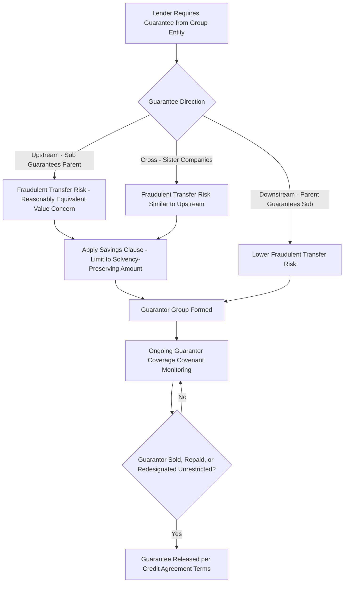

## Guarantee Structures and Cross-Guarantees

### Overview

Guarantee structures are the primary contractual mechanism by which lenders extend their effective claim beyond a single borrowing entity across a corporate group, directly counteracting the structural subordination dynamics examined throughout this chapter. This topic details the mechanics, types, and legal considerations of upstream, downstream, and cross-guarantees, and their central role in syndicated loan documentation.

### The Fundamental Purpose of Guarantees

**Core Function:**

A guarantee is a contractual undertaking by one entity (the guarantor) to be liable for the debt or obligations of another entity (the primary obligor) if the primary obligor fails to perform. In syndicated lending, guarantees serve to:

- Extend the lender syndicate's effective recourse beyond the named borrower to other entities within the corporate group that hold valuable assets or generate meaningful cash flow.
- Directly counteract structural subordination that would otherwise exist between the lender (whose direct contractual relationship is with a single borrowing entity) and value held at other entities within the same corporate family.
- Provide additional credit support without requiring the guarantor entity to become a co-borrower with independent drawdown rights, simplifying administration while still extending recourse.

### Types of Guarantee Structures

**1. Upstream Guarantees**

- A subsidiary guarantees the debt of its parent (the borrower).
- Common structure: an operating subsidiary with valuable assets or cash flow guarantees a holding company-level borrowing, giving lenders a direct claim against the subsidiary rather than relying solely on the parent's residual equity interest in that subsidiary.
- **Key legal consideration:** Upstream guarantees can raise **fraudulent transfer/conveyance** concerns in many jurisdictions if the subsidiary does not receive "reasonably equivalent value" in exchange for guaranteeing debt that primarily benefits the parent or other affiliates — a risk lenders typically mitigate through **guarantee limitation ("savings") clauses** that cap the guarantor's liability at an amount intended to avoid rendering the guarantor insolvent or leaving it with unreasonably small capital.

**2. Downstream Guarantees**

- A parent guarantees the debt of its subsidiary (the borrower).
- Common structure: a parent holding company guarantees a syndicated facility borrowed by an operating subsidiary, providing lenders additional comfort from the parent's broader asset base or the value of its other subsidiary holdings, beyond the specific borrowing entity alone.
- Generally raises fewer fraudulent transfer concerns than upstream guarantees, since the parent's guarantee of its own subsidiary's debt is more readily characterized as supporting an asset (the subsidiary equity) already owned by the guarantor, though this varies by specific facts and jurisdiction.

**3. Cross-Guarantees (Sister-Company Guarantees)**

- Multiple subsidiaries under common ownership (sister companies, with no direct parent-subsidiary relationship between them) mutually guarantee each other's obligations, or jointly and severally guarantee a shared credit facility.
- Common in **co-borrower** or **joint and several obligor** structures where multiple operating entities within a group all draw upon and are collectively liable for the same syndicated facility, giving lenders access to the combined asset and cash flow base of the entire guarantor group regardless of which specific entity within the group actually incurred a particular obligation or holds a particular asset.
- **Key legal consideration:** Cross-guarantees between sister companies raise similar fraudulent transfer concerns as upstream guarantees, since a given sister company guaranteeing another's debt may not receive direct value in exchange — savings clauses and contribution rights among guarantors (discussed below) are standard mitigants.

### Diagram: Guarantee Structure Types (svg_diagram)

<svg xmlns="http://www.w3.org/2000/svg" viewBox="0 0 760 560">
<text x="380" y="30" text-anchor="middle" font-size="17" font-weight="bold" fill="#1a1a1a">Guarantee Structure Types (svg_diagram)</text>

<text x="150" y="65" text-anchor="middle" font-size="13" font-weight="bold" fill="`#0072B2`">Upstream Guarantee</text>

<rect x="60" y="80" width="180" height="50" rx="6" fill="`#F4ECF7`" stroke="`#8E44AD`" />

<text x="150" y="110" text-anchor="middle" font-size="11">Parent (Borrower)</text>

<rect x="60" y="160" width="180" height="50" rx="6" fill="`#EBF5FB`" stroke="`#0072B2`" />

<text x="150" y="190" text-anchor="middle" font-size="11">Subsidiary (Guarantor)</text>

<line x1="150" y1="160" x2="150" y2="130" stroke="#333" stroke-width="1.5" marker-end="url(#arrowUp)" />

<text x="180" y="145" font-size="10">guarantees</text>

<text x="390" y="65" text-anchor="middle" font-size="13" font-weight="bold" fill="`#009E73`">Downstream Guarantee</text>

<rect x="300" y="80" width="180" height="50" rx="6" fill="`#F4ECF7`" stroke="`#8E44AD`" />

<text x="390" y="110" text-anchor="middle" font-size="11">Parent (Guarantor)</text>

<rect x="300" y="160" width="180" height="50" rx="6" fill="`#D5F5E3`" stroke="`#009E73`" />

<text x="390" y="190" text-anchor="middle" font-size="11">Subsidiary (Borrower)</text>

<line x1="390" y1="130" x2="390" y2="160" stroke="#333" stroke-width="1.5" marker-end="url(#arrowDown)" />

<text x="420" y="148" font-size="10">guarantees</text>

<text x="630" y="65" text-anchor="middle" font-size="13" font-weight="bold" fill="`#D55E00`">Cross-Guarantee</text>

<rect x="540" y="90" width="90" height="50" rx="6" fill="`#FDEDEC`" stroke="`#C0392B`" />

<text x="585" y="120" text-anchor="middle" font-size="10">Sister Co. A</text>

<rect x="640" y="90" width="90" height="50" rx="6" fill="`#FDEDEC`" stroke="`#C0392B`" />

<text x="685" y="120" text-anchor="middle" font-size="10">Sister Co. B</text>

<line x1="630" y1="105" x2="640" y2="105" stroke="#333" stroke-width="1.5" marker-end="url(#arrowDown)" />

<line x1="640" y1="130" x2="630" y2="130" stroke="#333" stroke-width="1.5" marker-end="url(#arrowDown)" />

<text x="635" y="90" text-anchor="middle" font-size="9">mutual guarantee</text>

<rect x="60" y="270" width="640" height="240" rx="8" fill="#FEF9E7" stroke="#B7950B" stroke-width="1.5" />
<text x="380" y="300" text-anchor="middle" font-size="13" font-weight="bold">Common Syndicated Structure: Guarantor Group</text>
<text x="380" y="330" text-anchor="middle" font-size="11">Borrower + all "restricted subsidiaries" above a materiality threshold</text>
<text x="380" y="352" text-anchor="middle" font-size="11">jointly and severally guarantee the syndicated facility</text>
<text x="380" y="384" text-anchor="middle" font-size="11">Lender syndicate gains recourse to combined guarantor</text>
<text x="380" y="406" text-anchor="middle" font-size="11">group asset base, not just the named borrower</text>
<text x="380" y="438" text-anchor="middle" font-size="11">Savings clauses limit each guarantor's liability to avoid</text>
<text x="380" y="460" text-anchor="middle" font-size="11">fraudulent transfer/insolvency exposure</text>
</svg>

### Guarantor Group Composition in Syndicated Credit Agreements

**Materiality Thresholds:**

Syndicated credit agreements typically require guarantees from "material" subsidiaries, defined via negotiated financial thresholds (e.g., subsidiaries representing more than a specified percentage of consolidated total assets, revenue, or EBITDA), rather than requiring every single subsidiary in a corporate group — balancing lender credit support against the administrative burden of an unwieldy guarantor group.

**"Guarantor Coverage" Covenant:**

Many credit agreements include an ongoing covenant requiring the borrower to ensure that guarantor subsidiaries collectively represent at least a specified percentage of consolidated assets/EBITDA at all times, with a mechanism requiring the borrower to add new guarantors if the existing guarantor group's relative contribution falls below the threshold (e.g., due to organic growth of non-guarantor subsidiaries or a permitted investment/acquisition made outside the guarantor group).

### Guarantee Limitation ("Savings") Clauses

**Purpose and Mechanics:**

To mitigate fraudulent transfer risk (particularly for upstream and cross-guarantees), guarantee documentation typically includes a savings clause limiting each guarantor's liability under the guarantee to the maximum amount that would not:

- Render the guarantor insolvent (on a balance sheet or cash flow basis, depending on jurisdiction-specific insolvency tests)
- Leave the guarantor with unreasonably small capital for its business
- Cause the guarantor to incur debts beyond its ability to pay as they mature

**[Unverified]** The precise legal formulation and enforceability of savings clauses vary meaningfully by jurisdiction and by the specific insolvency/fraudulent transfer statutory framework applicable to the guarantor entity; this is a specialized area of insolvency and corporate law where transaction-specific legal advice is standard practice, and the general concept described here should not be treated as a substitute for jurisdiction-specific legal analysis in any actual transaction.

### Contribution Rights Among Co-Guarantors

- When multiple guarantors are jointly and severally liable under a cross-guarantee or shared guarantor group structure, and one guarantor is called upon to pay more than its proportionate share of the guaranteed obligation, that guarantor typically has a **contribution right** against the other guarantors to recover their proportionate share.
- This internal contribution mechanic is distinct from and does not affect the lender syndicate's rights — from the lender's perspective, any guarantor in the group can generally be pursued for the full guaranteed amount (subject to the savings clause limitation applicable to that guarantor); contribution rights are a matter for resolution among the guarantors themselves after the lender has been satisfied.

### Guarantee Release Provisions

- Credit agreements typically specify circumstances under which a guarantee is automatically released, most commonly:
  - **Sale or disposition** of the guarantor subsidiary in a permitted asset sale (the guarantee naturally falls away since the entity is no longer part of the consolidated group)
  - **Designation as an unrestricted subsidiary** (as discussed under HoldCo/OpCo structures) — a mechanism that has drawn particular scrutiny in recent market episodes, since releasing a guarantee via unrestricted subsidiary redesignation can be used as a step in the broader asset-transfer/structural subordination maneuvers previously discussed.
  - **Full repayment/refinancing** of the underlying guaranteed facility.

### Application to Syndicated Loan Structuring

- **Guarantor group due diligence in syndication:** Arranging banks conduct detailed diligence on proposed guarantor group composition during syndication structuring, including corporate structure charts, jurisdiction-specific fraudulent transfer risk assessment for each material guarantor, and confirmation that the aggregate guarantor group satisfies any minimum coverage thresholds being marketed to prospective syndicate participants.
- **Cross-border guarantee complexity:** Multi-jurisdictional syndications frequently face materially different guarantee enforceability, fraudulent transfer, and corporate benefit requirements across jurisdictions (e.g., "financial assistance" restrictions in certain jurisdictions that limit a target company's ability to guarantee acquisition debt used to buy its own shares) — requiring jurisdiction-specific local counsel opinions as a standard closing condition in cross-border syndicated facilities.
- **Guarantee and collateral coordination with intercreditor arrangements:** In structures with multiple debt layers (senior secured, second-lien, HoldCo PIK notes), the guarantee package for each layer must be coordinated with the applicable intercreditor or subordination arrangements to ensure guarantee claims rank consistently with the intended lien and payment priority across the capital stack.
- **Post-closing guarantor compliance monitoring:** Administrative agents in syndicated facilities typically monitor ongoing compliance with guarantor coverage covenants and review any proposed guarantee releases (e.g., in connection with asset sales or subsidiary reorganizations) against the credit agreement's specific release conditions, given the heightened lender sensitivity to guarantee erosion following recent market episodes involving contentious guarantee release and unrestricted subsidiary maneuvers.

### Common Pitfalls

- Assuming a guarantee provides unlimited recourse against the guarantor — savings clauses are standard and can materially limit actual recoverable amounts, particularly for upstream and cross-guarantees where fraudulent transfer risk is most pronounced.
- Overlooking jurisdiction-specific restrictions on guarantees (such as financial assistance rules) in cross-border syndications — a guarantee structure that is straightforward in one jurisdiction may be unenforceable or require specific corporate approvals/whitewash procedures in another.
- Confusing contribution rights among co-guarantors with the lender's direct rights against any single guarantor — these are separate legal relationships, and contribution disputes among guarantors do not affect the lender's ability to pursue any guarantor for the full guaranteed amount (subject to that guarantor's own savings clause limitation).
- Treating guarantee release provisions as a purely mechanical, low-risk feature of credit agreement documentation — as demonstrated by recent contentious market episodes, guarantee release mechanics (particularly via unrestricted subsidiary redesignation) can be a significant vector for value transfer away from an existing lender syndicate if not carefully drafted and monitored.

### Mermaid: Guarantee Structure and Fraudulent Transfer Mitigation Logic

### Related Topics

- HoldCo versus OpCo Structures and Structural Subordination
- Mezzanine Debt and Structural Subordination
- Restricted vs. Unrestricted Subsidiary Designations in Credit Agreements
- Priority of Claims in Bankruptcy and the Absolute Priority Rule
- Fraudulent Transfer and Fraudulent Conveyance Doctrine in Guarantee Structuring
- Cross-Border Syndicated Lending: Financial Assistance and Local Law Considerations
- Intercreditor Agreements: First-Lien / Second-Lien Mechanics
- Uptiering Transactions and Recent Lender Liability Litigation Trends