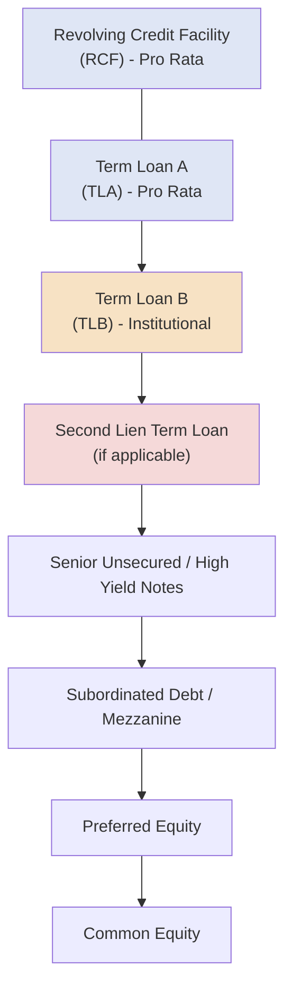

## Bank Term Loans: Term Loan A versus Term Loan B

### Overview

Term Loan A (TLA) and Term Loan B (TLB) are the two dominant structures for senior secured term debt in syndicated lending markets. Both represent amortizing or bullet-repayment credit facilities secured against a borrower's assets, but they differ fundamentally in lender base, pricing, amortization profile, tenor, and covenant structure. The choice between TLA and TLB (or a "unitranche" hybrid, or a combination of both) is one of the most consequential decisions in structuring a leveraged financing, since it directly shapes the deal's cost of capital, cash flow flexibility, and syndication strategy.

### Term Loan A (TLA)

**Key Points**

- **Lender base:** Primarily commercial/relationship banks — the same institutions that typically hold the revolving credit facility (RCF).
- **Amortization:** Front-loaded, straight-line amortization, typically 5–15% per year over the life of the loan, often structured on a quarterly repayment schedule.
- **Tenor:** Shorter maturity, typically 3–5 years, usually matched to or slightly longer than the accompanying revolver.
- **Pricing:** Priced tighter (lower spread) than TLB because banks demand a lower return in exchange for higher-priority amortizing repayment and a stronger credit profile expectation.
- **Covenants:** Typically carries full maintenance financial covenants (tested quarterly regardless of usage), consistent with a traditional "pro rata" bank facility.
- **Syndication:** Distributed in the "pro rata" market alongside the revolver, to relationship banks that value the ongoing banking relationship (cross-sell of cash management, FX, treasury services) as much as the loan yield itself.
- **Prepayment:** Generally prepayable at par at any time (no call protection), reflecting the bank lenders' priority on capital preservation and relationship continuity over yield maximization.

### Term Loan B (TLB)

**Key Points**

- **Lender base:** Institutional investors — collateralized loan obligation (CLO) vehicles, loan mutual funds, hedge funds, business development companies (BDCs), and other non-bank institutional lenders.
- **Amortization:** Minimal, typically 1% per annum (quarterly installments of 0.25%), with the substantial majority of principal repaid as a bullet at maturity.
- **Tenor:** Longer maturity, typically 6–8 years (frequently structured one year longer than the accompanying revolver/TLA to avoid triggering "springing maturity" provisions on other instruments).
- **Pricing:** Priced wider (higher spread) than TLA, reflecting the longer duration, bullet repayment risk, and the different return requirements of institutional investors relative to relationship banks.
- **Covenants:** Frequently "covenant-lite" (cov-lite) — financial maintenance covenants are stripped out or replaced with incurrence-based covenants only tested when the borrower takes a specific action (e.g., issuing additional debt, making a restricted payment).
- **Syndication:** Distributed in the "institutional" loan market via a broadly syndicated loan (BSL) process, often rated by agencies (Moody's/S&P) to facilitate CLO purchase eligibility.
- **Prepayment:** Frequently carries **soft call protection** — typically 101 soft call for the first 6–12 months, meaning voluntary repricing/refinancing within that window requires payment of a 1% premium, while par prepayment is otherwise generally permitted (in contrast to the make-whole or hard-call structures seen in high-yield bonds).

### Comparative Summary Table

| Feature | Term Loan A (TLA) | Term Loan B (TLB) |
| --- | --- | --- |
| Primary lender base | Commercial/relationship banks | Institutional investors (CLOs, funds) |
| Amortization | 5–15% per year, straight-line | ~1% per year, bullet at maturity |
| Tenor | 3–5 years | 6–8 years |
| Pricing (spread over benchmark) | Lower | Higher |
| Covenant structure | Full maintenance covenants (quarterly) | Cov-lite (incurrence-based) |
| Market | Pro rata / relationship bank market | Broadly syndicated / institutional market |
| Prepayment terms | Freely prepayable at par | Soft call protection (commonly 101) |
| Rated by agencies | Rare | Common (facilitates CLO eligibility) |
| Typical use case | Middle-market, relationship-driven deals | Large-cap leveraged buyouts, sponsor-backed issuers |

### Pricing Mechanics

**Key Points**

Both TLA and TLB are typically priced as a floating-rate spread over a reference benchmark, historically LIBOR and now predominantly Term SOFR (Secured Overnight Financing Rate) following the LIBOR transition:

$$\text{All-in Rate} = \text{Term SOFR} + \text{Credit Spread Adjustment (if applicable)} + \text{Applicable Margin}$$

Many facilities also include a **SOFR floor** (commonly 0.00%–1.00%), which sets a minimum reference rate regardless of where the benchmark actually trades, protecting lender yield in low-rate environments.

**Example**

A borrower's TLA might price at Term SOFR + 250 bps with a 0.00% floor, while the TLB on the same capital structure prices at Term SOFR + 425 bps with a 0.50% floor. If Term SOFR is trading at 4.30%:

- TLA all-in rate: $4.30\% + 2.50\% = 6.80\%$
- TLB all-in rate: $\max(4.30\%, 0.50\%) + 4.25\% = 4.30\% + 4.25\% = 8.55\%$

The pricing differential (roughly 175 bps in this example) compensates TLB lenders for the longer duration, bullet repayment structure, and typically weaker covenant protection.

### Original Issue Discount (OID)

**Key Points**

TLB tranches are frequently issued at a discount to par (e.g., 99.0 or 99.5), known as Original Issue Discount, which increases the effective yield to institutional lenders beyond the stated spread. TLA facilities are far less likely to carry OID, as relationship banks generally price purely through the margin rather than through discounted issuance.

$$\text{Effective Yield} \approx \text{Stated Spread} + \frac{100 - \text{OID Price}}{\text{Weighted Average Life (years)}}$$

### Structural Position in the Capital Stack

TLA and TLB are typically **pari passu** in right of payment and share the same first-lien security package, but differ in the *market* they are sold into, their repayment profile, and (in some structures) a distinct intercreditor "waterfall" priority for proceeds upon enforcement, depending on the specific intercreditor agreement negotiated.

### The "TLB Loophole" and Cov-Lite Trend

**Key Points**

The near-disappearance of maintenance covenants in the TLB market since the mid-2010s has been a defining structural trend. [Inference: the precise proportion of cov-lite issuance fluctuates meaningfully with credit cycle conditions and is best confirmed against current league table data (e.g., LCD/PitchBook, LSTA) rather than treated as a fixed statistic.] This shift transferred negotiating leverage toward borrowers/sponsors during periods of strong investor demand for floating-rate institutional loan product, and is a key point of divergence from TLA structures, which have largely retained traditional maintenance covenant packages due to the ongoing banking relationship dynamics involved.

### Why Companies Use Both (TLA/TLB Combination Structures)

**Key Points**

Many large leveraged financings use a "TLA/TLB" or "split-tranche" structure to optimize the overall cost of capital and syndication efficiency:

- **TLA** is sized to be attractive to relationship banks (often the same banks providing the revolver), keeping those lenders comfortable with a shorter maturity and amortizing profile.
- **TLB** is sized to capture the deep institutional demand for floating-rate paper, extending duration and increasing overall debt capacity without over-relying on the smaller bank market.
- This combination allows an issuer to raise a larger total quantum of senior secured debt than either market could support alone, while managing average cost of capital and refinancing risk across a laddered maturity profile.

**Example**

A $1 billion leveraged buyout might be structured as:

- $150 million TLA (5-year, amortizing, priced at SOFR + 275bps, held by 8 relationship banks)
- $650 million TLB (7-year, 1% annual amortization, priced at SOFR + 400bps, syndicated to 40+ CLOs and institutional funds)
- $200 million RCF (5-year, undrawn at close, held pro rata with the TLA banks)

### Syndication Process Differences

**Key Points**

- **TLA syndication** more closely resembles a traditional relationship bank underwriting process: a small club of banks negotiates terms directly with the borrower/sponsor, often with limited or no external "market flex" provisions, since pricing is set based on relationship economics rather than pure market clearing.
- **TLB syndication** follows a broadly marketed process: arrangers distribute a confidential information memorandum (CIM) to a wide institutional investor base, hold a lender call/roadshow, and use **market flex** provisions (pre-agreed rights to adjust pricing, OID, or terms based on investor demand) to clear the market at the tightest sustainable spread.

### Practical Application in Capital Structuring & Syndication

**Key Points**

- **Tranche sizing decisions** hinge on this TLA/TLB distinction: arrangers assess relationship bank capacity (TLA ceiling) against institutional demand (TLB depth via CLO formation activity and fund flows) to determine total debt capacity for a transaction.
- **Covenant negotiation leverage** for a sponsor is materially affected by which tranche represents the majority of the debt stack — a TLB-heavy structure with cov-lite terms provides significantly more operational flexibility (for acquisitions, restricted payments, and additional debt incurrence) than a TLA-heavy structure with full maintenance covenants.
- **Refinancing and repricing strategy**: understanding TLB soft-call mechanics is essential when advising a borrower on the optimal timing to reprice debt in a declining-rate or tightening-spread environment, since repricing within the soft-call window triggers a premium payment that must be weighed against the interest savings achieved.
- **Credit rating strategy**: because TLB is frequently sold into rated CLO vehicles, arrangers often coordinate a facility rating (even for an otherwise unrated borrower) specifically to maximize the addressable TLB investor base.

### Related Topics

- Revolving Credit Facilities (RCF) structuring and undrawn fee mechanics
- Second Lien Term Loans and intercreditor agreements
- Collateralized Loan Obligations (CLOs) as end-buyers of TLB paper
- Covenant-Lite vs. Covenant-Heavy Loan Structures
- Market Flex Provisions in Syndicated Loan Underwriting
- SOFR Transition and Credit Spread Adjustments in Loan Pricing
- Original Issue Discount (OID) and Effective Yield Calculations
- Intercreditor Agreements and Payment Waterfall Priority
- Leveraged Buyout (LBO) Capital Structure Design
- Unitranche Debt Structures as a TLA/TLB Alternative