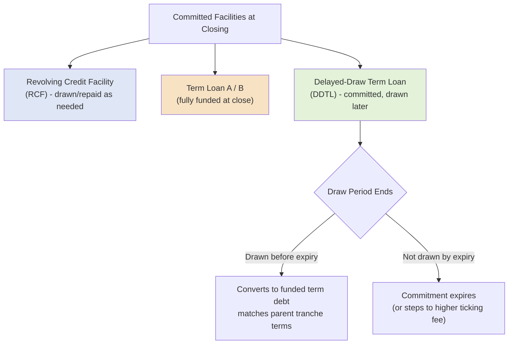

## Revolving Credit Facilities and Delayed-Draw Term Loans

### Overview

Revolving Credit Facilities (RCFs) and Delayed-Draw Term Loans (DDTLs) are both flexible-drawdown debt instruments that sit alongside fully-funded term loans (TLA/TLB) in a syndicated capital structure. Unlike a term loan, which is drawn in full at closing, both instruments allow a borrower to access capital on an as-needed basis over time. They serve fundamentally different purposes, however: the RCF is designed for recurring, revolving liquidity management, while the DDTL is designed for financing known, discrete future capital needs (most commonly acquisitions or capital expenditures) on a one-time or limited-draw basis.

### Revolving Credit Facilities (RCF)

**Key Points**

- **Purpose:** General corporate purposes, seasonal working capital fluctuations, backstop liquidity, and short-term bridge funding for opportunistic needs.
- **Revolving mechanic:** Borrower can draw, repay, and redraw funds repeatedly up to the committed facility limit throughout the availability period, similar in mechanic to a corporate credit card.
- **Tenor:** Typically matches or is shorter than the term loan tranches in the same capital structure, commonly 3–5 years.
- **Commitment fee:** Lenders charge an undrawn commitment fee (typically 0.25%–0.50% per annum) on the unused portion of the facility, compensating them for standing ready to fund on demand.
- **Pricing:** Usually priced with a **pricing grid** tied to a leverage-based or ratings-based test, so the applicable margin steps up or down as the borrower's credit metrics change over time.
- **Springing covenants:** Many RCFs include a **springing financial maintenance covenant** (typically a maximum net leverage ratio) that is only tested when utilization exceeds a specified threshold (commonly 35–40% of the facility), protecting lenders from covenant risk on an undrawn or lightly drawn facility while giving the borrower cov-lite-like flexibility in normal operations.
- **Letters of credit (LC) sub-facility:** RCFs commonly include a sublimit for issuing standby or trade letters of credit, which reduce available revolver capacity without representing a cash draw.
- **Swingline sub-facility:** A smaller same-day-funding sublimit within the RCF used for urgent, short-term liquidity needs, avoiding the multi-day notice period of a standard RCF draw.

### Delayed-Draw Term Loans (DDTL)

**Key Points**

- **Purpose:** Pre-committed financing for a specific, anticipated future use — most commonly to fund a known acquisition pipeline, capital expenditure program, or an already-identified M&A transaction that has not yet closed at the time the facility is arranged.
- **Draw mechanic:** Unlike an RCF, once drawn a DDTL is generally **not revolving** — amounts repaid typically cannot be re-borrowed (though some structures include a "delayed-draw revolving" hybrid feature, which is comparatively rare).
- **Availability period:** DDTLs have a defined **draw period** (commonly 6–24 months from closing) after which any undrawn commitment automatically expires or is subject to a "ticking fee" step-up designed to discourage indefinite non-use.
- **Ticking fee:** Because lenders commit capital that may sit unused for an extended period, DDTLs typically carry a **ticking fee** (also called a "delayed draw fee" or "unused fee") on undrawn commitments, which is often structured to increase over time or after a set number of months to compensate lenders for extended commitment risk.
- **Amortization:** Once drawn, a DDTL typically amortizes on the same schedule as its corresponding parent term loan tranche (i.e., a DDTL alongside a TLB will generally carry a TLB-like ~1% annual amortization/bullet profile).
- **Pricing:** Generally priced identically (same spread and floor) to the corresponding fully-funded term loan tranche issued at the same time, since it is legally part of the same tranche merely funded on a delayed basis.
- **Conditionality:** Draw conditions are typically limited to customary bring-down conditions (no default, accuracy of representations) rather than a full re-underwriting, distinguishing a committed DDTL from a discretionary "accordion" or incremental facility.

### Comparative Summary Table

| Feature | Revolving Credit Facility (RCF) | Delayed-Draw Term Loan (DDTL) |
| --- | --- | --- |
| Primary purpose | Working capital, general liquidity | Financing a known future use (M&A, capex) |
| Draw/repay mechanic | Revolving (draw, repay, redraw) | Generally one-way (draw once, no re-borrowing) |
| Typical fee on unused portion | Commitment fee (0.25%–0.50%) | Ticking fee (often escalating) |
| Availability period | Entire facility tenor | Defined draw period (6–24 months), then expires |
| Financial covenant | Often springing (utilization-triggered) | Typically matches the parent term loan's covenant package |
| Amortization once drawn | N/A (revolving balance) | Matches parent term loan tranche |
| Common sublimits | Letters of credit, swingline | None typically |
| Lender base | Usually pro rata / relationship banks | Can be pro rata (TLA-style) or institutional (TLB-style) |

### Fee Mechanics: Illustrative Cost Comparison

**Example**

A borrower arranges a $300 million RCF (undrawn commitment fee 0.375%) and a $200 million DDTL (ticking fee starting at 0.50%, stepping up to the full margin after 6 months, spread of SOFR + 350bps once drawn).

If the RCF sits undrawn for the full year:

$$\text{Annual RCF Cost} = \$300{,}000{,}000 \times 0.375\% = \$1{,}125{,}000$$

If the DDTL remains undrawn for 6 months at the 0.50% ticking fee, then is drawn in full:

$$\text{Ticking Fee Cost (6 months)} = \$200{,}000{,}000 \times 0.50\% \times \frac{6}{12} = \$500{,}000$$

Once drawn, the DDTL then accrues interest at the full SOFR + 350bps rate on the outstanding balance, in addition to any amortization payments required under its schedule.

### Structural Placement in the Capital Stack

### Springing Covenant Mechanics (RCF)

**Key Points**

The springing covenant is a defining structural feature that differentiates a modern cov-lite-adjacent RCF from a traditional fully-covenanted bank facility:

$$\text{Covenant Tested} \iff \text{RCF Utilization} > \text{Threshold (commonly 35\%–40\%)}$$

**Example**

An RCF has a $100 million commitment with a springing net leverage covenant of 6.0x, triggered at 35% utilization (i.e., $35 million drawn, including LC usage). If the borrower draws $30 million, the covenant is not tested that quarter. If the borrower draws $40 million (or uses $40 million combined cash draw and LC issuance), the covenant springs into effect and the borrower must demonstrate compliance with the 6.0x net leverage test as of that quarter-end.

### Accordion / Incremental Facilities vs. DDTL (Distinction)

**Key Points**

DDTLs are frequently confused with **incremental facilities** ("accordions"), but they are structurally distinct:

- A **DDTL** is a firmly committed tranche at closing — lenders are contractually obligated to fund upon satisfaction of customary conditions, and pricing/terms are fixed at close.
- An **incremental facility (accordion)** is merely a contractual *right* for the borrower to seek additional debt in the future, up to a specified cap, but requires finding willing lenders (existing or new) at the time of the request, and pricing is typically negotiated at that future date (subject to a "MFN" — most favored nation — pricing protection for existing lenders in many agreements).

### Practical Application in Capital Structuring & Syndication

**Key Points**

- **M&A financing certainty**: arrangers structure DDTLs specifically to give a borrower/sponsor **committed financing certainty** for an announced-but-not-yet-closed acquisition, which is often a critical requirement in competitive M&A processes (particularly public company acquisitions requiring a fully committed financing package under merger agreement terms).
- **Liquidity backstop sizing**: RCF sizing in a new syndication is typically benchmarked against the borrower's peak seasonal working capital swing plus a liquidity cushion, informed by historical cash flow analysis and stress scenarios.
- **Fee structuring negotiation**: the ticking fee schedule on a DDTL is a frequent negotiation point between borrower and arranger — sponsors seek to minimize the cost of "committed but unused" capital, while lenders seek compensation for capital held in reserve against balance sheet capacity.
- **Springing covenant threshold negotiation**: setting the RCF utilization trigger threshold is a key point of leverage in sponsor-led deals, as a higher trigger threshold provides more headroom before the company faces financial covenant testing.
- **Rating agency and CLO eligibility**: because DDTLs (particularly TLB-style ones) may need to be sold into the institutional/CLO market, arrangers must consider how CLO documentation tests (e.g., diversity, weighted average life tests) treat unfunded delayed-draw commitments differently from funded term loans.

### Related Topics

- Term Loan A versus Term Loan B structural distinctions
- Springing Financial Covenants and Covenant-Lite Structures
- Incremental Facilities ("Accordions") and Most-Favored-Nation (MFN) Pricing Protection
- Letters of Credit and Swingline Sub-facility Mechanics
- Committed vs. Best-Efforts Financing in M&A Transactions
- Ticking Fee Structures and Escalation Schedules
- Pricing Grids Tied to Leverage or Ratings
- Working Capital Facility Sizing and Liquidity Stress Testing
- CLO Documentation Tests (Weighted Average Life, Diversity Score)
- Bridge Loan Facilities as an Alternative to Committed DDTLs