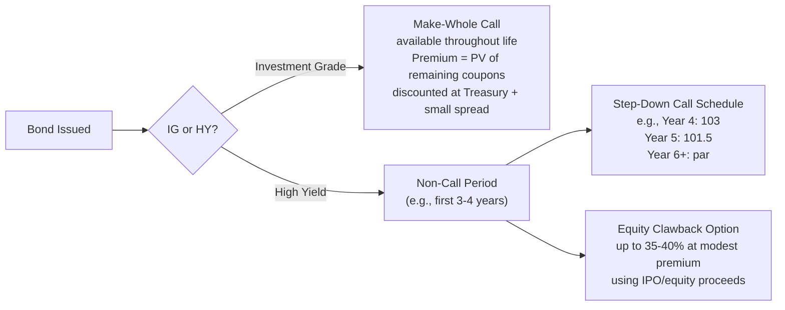

## Corporate Bonds and Notes: Investment Grade versus High Yield

### Overview

Corporate bonds and notes represent fixed-income debt securities issued directly into the capital markets, as distinct from bilaterally or syndicate-negotiated bank loans. The market bifurcates sharply into two segments — **Investment Grade (IG)** and **High Yield (HY)**, also called "junk bonds" or "leveraged finance" — based primarily on credit rating, but the distinction cascades into nearly every structural, pricing, and covenant feature of the instrument. Understanding this divide is central to capital structuring, since the rating threshold determines which investor base a company can access, what covenant protections lenders will demand, and what all-in cost of capital the issuer will bear.

### The Rating Threshold

**Key Points**

The IG/HY boundary is defined by credit rating agency classifications:

| Rating Agency | Investment Grade Threshold | High Yield (Below Threshold) |
| --- | --- | --- |
| S&P / Fitch | BBB- and above | BB+ and below |
| Moody's | Baa3 and above | Ba1 and below |

A bond rated at the boundary (BBB-/Baa3) is often called "crossover" credit, and issuers near this line are closely watched, since a downgrade below investment grade (a "fallen angel") or an upgrade into investment grade (a "rising star") triggers material shifts in the addressable investor base and can force forced selling/buying by rating-constrained institutional mandates.

### Investment Grade (IG) Bonds

**Key Points**

- **Issuer profile:** Large, stable companies with strong, diversified cash flows, typically lower leverage (often below 3.0x–3.5x net debt/EBITDA, though this varies significantly by industry).
- **Investor base:** Insurance companies, pension funds, and other institutional investors with rating-constrained mandates (many are prohibited by internal policy or regulation from holding sub-investment-grade paper).
- **Covenant package:** Minimal — IG bonds typically carry only a small set of "incurrence" covenants (limitation on liens, limitation on sale-leaseback transactions, merger restrictions) and **no financial maintenance covenants**.
- **Pricing:** Quoted as a spread over a Treasury benchmark of matching tenor (e.g., "+120 bps over the 10-year Treasury"), reflecting the relatively low credit risk priced into the instrument.
- **Change of control:** Typically does **not** include a Change of Control put option, since IG issuers are viewed as unlikely to undergo the kind of leveraged transaction that would trigger such protection.
- **Call protection:** Commonly includes a **"make-whole call"** for the life of the bond, allowing the issuer to redeem early only by paying a premium calculated to compensate bondholders for lost interest (discounted at a small spread over the relevant Treasury rate), rather than a fixed step-down call schedule.
- **Typical tenor:** Broad range, commonly 5, 10, or 30 years, with some issuers accessing 40- or 100-year tenors.

### High Yield (HY) Bonds

**Key Points**

- **Issuer profile:** Higher-leverage companies, frequently sponsor-owned (private equity-backed) issuers financing leveraged buyouts, or companies with more cyclical or less-diversified cash flows.
- **Investor base:** High yield mutual funds, hedge funds, CLOs (to a limited extent, for certain structures), and other credit-focused institutional investors comfortable with sub-investment-grade risk.
- **Covenant package:** Substantially more restrictive incurrence covenant package than IG, typically including:
  - Limitation on additional indebtedness (often via a fixed charge coverage ratio test)
  - Limitation on restricted payments (dividends, share buybacks) via a "restricted payments basket" formula
  - Limitation on liens
  - Limitation on asset sales (requiring proceeds to be reinvested or used to repay debt)
  - Change of Control put (typically requiring the issuer to offer to repurchase bonds at 101% of par upon a defined change of control event)
- **Pricing:** Quoted as a yield-to-worst or spread over Treasuries, but at materially wider spreads than IG to compensate for higher default risk; often also priced with an OID (original issue discount).
- **Call protection:** Standard **"non-call" period** (commonly non-callable for the first half of the bond's life, e.g., NC-3 on an 8-year bond or NC-2.5 on a 5-year bond), followed by a **fixed step-down call schedule** (e.g., callable at 103, then 101.5, then par as maturity approaches) — a structurally different call mechanic from the IG make-whole approach.
- **Equity clawback:** Many HY bonds include an "equity clawback" provision allowing the issuer to redeem up to 35–40% of the bonds using proceeds from an equity offering during the non-call period, at a modest premium.
- **Typical tenor:** Shorter than IG, commonly 5–8 years, aligning roughly with the tenor of an accompanying TLB tranche.

### Comparative Summary Table

| Feature | Investment Grade (IG) | High Yield (HY) |
| --- | --- | --- |
| Rating | BBB-/Baa3 or above | BB+/Ba1 or below |
| Leverage profile | Lower (issuer-dependent) | Higher |
| Financial maintenance covenants | None | None (incurrence-based only) |
| Change of Control put | Rare | Standard (typically 101% of par) |
| Call structure | Make-whole call throughout life | Non-call period, then step-down call schedule |
| Equity clawback | N/A | Common (35–40% during non-call period) |
| Pricing benchmark | Spread over Treasury | Yield-to-worst / spread over Treasury, often with OID |
| Typical investor base | Insurance, pension funds | HY mutual funds, hedge funds, credit funds |
| Typical tenor | 5–30+ years | 5–8 years |

### Pricing and Yield Mechanics

**Key Points**

Both IG and HY bonds are priced relative to a risk-free benchmark, with the spread representing the market's compensation for credit risk, liquidity, and structural subordination:

$$\text{Bond Yield} = \text{Risk-Free Rate (Treasury)} + \text{Credit Spread}$$

**Example**

A 10-year Treasury yields 4.20%. An IG-rated issuer (BBB) issues a 10-year note at a spread of +150 bps:

$$\text{IG Bond Yield} = 4.20\% + 1.50\% = 5.70\%$$

A HY-rated issuer (B+) issues a 7-year note at a spread of +425 bps over the comparable Treasury, plus an OID of 98.5:

$$\text{HY Bond Coupon Yield} = 4.20\% + 4.25\% = 8.45\%$$

The OID further increases the effective yield-to-maturity above the stated coupon, since investors pay less than par to receive full principal at maturity.

### Make-Whole Call vs. Step-Down Call Structures

### Fixed Charge Coverage Ratio (Incurrence Covenant Example)

**Key Points**

A common HY incurrence covenant restricts the issuer from incurring additional debt unless a pro forma fixed charge coverage ratio (FCCR) test is satisfied:

$$FCCR = \frac{EBITDA}{\text{Fixed Charges (Interest Expense + Preferred Dividends + Capital Lease Payments)}}$$

**Example**

An HY indenture requires a minimum pro forma FCCR of 2.0x to incur additional debt. The issuer has trailing EBITDA of $100 million and current fixed charges of $40 million:

$$FCCR = \frac{\$100{,}000{,}000}{\$40{,}000{,}000} = 2.5x$$

Since 2.5x exceeds the 2.0x minimum, the issuer has covenant capacity to incur additional debt (subject to any resulting increase in fixed charges still satisfying the test on a pro forma basis), even without relying on any specific carve-out basket.

### Underwriting and Distribution Process

**Key Points**

- **IG bonds** are typically issued via a **registered offering** (shelf registration under Rule 415) or occasionally Rule 144A, distributed by investment bank underwriters to a broad institutional base through a bookbuilding process, often executed within a single day ("drive-by" issuance) given the depth of IG investor demand.
- **HY bonds** are almost always issued via **Rule 144A with registration rights** (an exemption from full SEC registration, later exchanged for registered notes with substantially identical terms), reflecting the more limited, sophisticated institutional investor base and the desire for execution speed alongside a private-placement-style process.

### Practical Application in Capital Structuring & Syndication

**Key Points**

- **Capital structure sequencing**: bond tranches are frequently layered alongside syndicated term loans in a leveraged financing (e.g., TLB + Senior Secured Notes + Senior Unsecured Notes), with relative pricing and covenant flexibility across tranches driving the optimal allocation between loan and bond markets.
- **Ratings advisory**: arrangers and issuers actively manage the rating agency relationship, since crossing the IG/HY threshold in either direction materially changes the achievable pricing and the size of the addressable investor base — a key consideration when structuring a transaction intended to preserve or achieve an investment-grade rating.
- **Bridge-to-bond structures**: in M&A financing, arrangers frequently provide a **bridge loan** commitment (structured to convert into HY notes if a permanent bond financing cannot be completed by closing), giving the borrower financing certainty while preserving optionality to access the bond market under more favorable conditions post-closing.
- **Covenant harmonization**: when both loans and bonds exist in the same capital structure, arrangers and counsel must reconcile the (typically tighter) incurrence covenants of any HY notes against the (potentially cov-lite) covenants of the accompanying term loan to ensure consistent restricted payment and debt incurrence capacity across instruments.
- **Refinancing strategy around call protection**: understanding the step-down call schedule is essential when advising an issuer on optimal timing to refinance HY debt, since redeeming before the call price steps down (or outside an equity clawback window) can impose a material premium cost.

### Related Topics

- Bridge Loan Facilities and Bridge-to-Bond Financing Structures
- Rule 144A versus Registered Bond Offerings
- Incurrence Covenants versus Maintenance Covenants
- Change of Control Put Options and Poison Put Provisions
- Restricted Payments Baskets and Covenant Basket Mechanics
- Credit Rating Agency Methodology (S&P, Moody's, Fitch)
- Fallen Angels and Rising Stars in Credit Markets
- Yield-to-Worst and Yield-to-Maturity Calculation Methodology
- Second Lien and Senior Unsecured Notes in the Capital Stack
- Leveraged Buyout Financing: Loan/Bond Mix Optimization