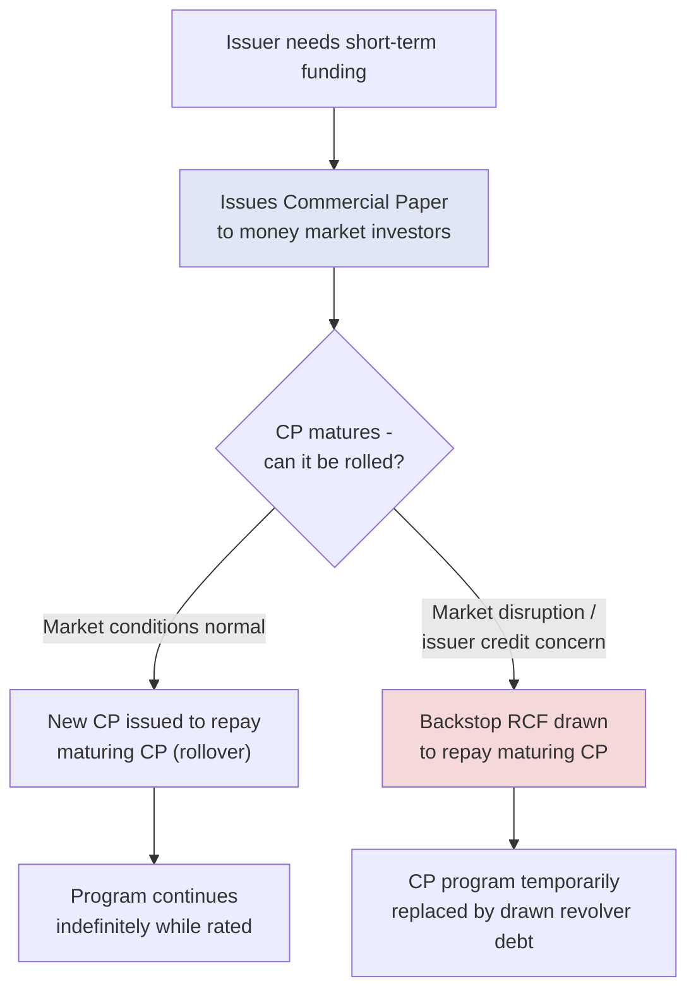

## Commercial Paper and Short-Term Funding Instruments

### Overview

Commercial paper (CP) and related short-term funding instruments form the money-market layer of a corporate capital structure — unsecured, short-maturity debt used primarily to finance working capital, bridge timing mismatches in cash flow, and provide low-cost liquidity for companies with strong credit profiles. These instruments sit apart from the term loan and bond markets covered elsewhere in this chapter, both in tenor (typically under 397 days, and often under 90 days) and in their reliance on a backstop liquidity facility rather than traditional covenant protection.

### Commercial Paper (CP)

**Key Points**

- **Structure:** Unsecured, short-term promissory notes issued at a discount to face value (no periodic coupon), with the investor's return derived entirely from the difference between the discounted purchase price and the face value paid at maturity.
- **Tenor:** Typically 1 to 270 days in the U.S. market, with most issuance concentrated in the overnight to 90-day range; U.S. issuers commonly cap tenor at 270 days specifically to fall within a Securities Act exemption from SEC registration requirements.
- **Issuer profile:** Large, highly-rated corporations (typically A-1/P-1 or better short-term ratings from S&P/Moody's), since CP relies almost entirely on investor confidence in the issuer's near-term creditworthiness rather than collateral or covenant protection.
- **Investor base:** Money market mutual funds, corporate treasuries, and other institutional cash investors seeking a safe, liquid, short-duration place to park cash.
- **Backstop requirement:** Because CP must be continually "rolled" (refinanced) as it matures, issuers are effectively required by rating agencies and the market to maintain a committed backstop liquidity facility (typically an RCF) sized to cover 100% of outstanding CP, protecting against the risk of being unable to roll maturing paper in a market disruption.
- **Pricing:** Quoted on a **discount rate** basis (in the U.S. market convention), distinct from a bond-equivalent yield calculation.

### CP Pricing Mechanics

**Key Points**

U.S. commercial paper is conventionally quoted using a discount-rate basis rather than an interest-bearing yield:

$$\text{Discount} = \text{Face Value} \times \text{Discount Rate} \times \frac{\text{Days to Maturity}}{360}$$

$$\text{Purchase Price} = \text{Face Value} - \text{Discount}$$

The **bond-equivalent yield (BEY)**, which allows comparison to interest-bearing instruments, is calculated separately:

$$BEY = \frac{\text{Face Value} - \text{Purchase Price}}{\text{Purchase Price}} \times \frac{365}{\text{Days to Maturity}}$$

**Example**

A company issues $10,000,000 face value of 90-day commercial paper at a discount rate of 5.20%:

$$\text{Discount} = \$10{,}000{,}000 \times 0.052 \times \frac{90}{360} = \$130{,}000$$

$$\text{Purchase Price} = \$10{,}000{,}000 - \$130{,}000 = \$9{,}870{,}000$$

$$BEY = \frac{\$130{,}000}{\$9{,}870{,}000} \times \frac{365}{90} = 1.317\% \times 4.056 = 5.34\%$$

The bond-equivalent yield (5.34%) is higher than the quoted discount rate (5.20%) because the discount rate is calculated on face value using a 360-day year, while the BEY is calculated on the smaller purchase price using a 365-day year.

### Types of Commercial Paper

**Key Points**

- **Unsecured CP:** The standard form, backed solely by the issuer's general creditworthiness and the backstop facility.
- **Asset-Backed Commercial Paper (ABCP):** Issued by a special purpose entity (conduit) and collateralized by a pool of underlying financial assets (trade receivables, auto loans, credit card receivables), rather than relying on general corporate credit — a distinct market primarily used for structured/securitized financing rather than direct corporate funding.
- **Extendible/Puttable CP:** Variants with embedded options allowing maturity extension (extendible) or early investor redemption (puttable), used to manage rollover risk or investor liquidity preferences respectively.

### Other Short-Term Funding Instruments

**Key Points**

- **Bankers' Acceptances (BAs):** A time draft drawn on and accepted by a bank, historically used to finance specific international trade transactions; the bank's acceptance substitutes its own credit for the drawer's, making the instrument readily tradable in the secondary market. [Inference: usage of BAs has declined substantially relative to other trade finance instruments in most modern markets, though the instrument still exists in certain jurisdictions and trade finance contexts.]
- **Repurchase Agreements (Repos):** A short-term (often overnight) secured financing transaction in which one party sells a security with an agreement to repurchase it at a slightly higher price at a specified future date — economically equivalent to a collateralized short-term loan, widely used by financial institutions and increasingly by corporates for treasury cash management.
- **Money Market Deposit Facilities / Time Deposits:** Short-term deposits with a fixed maturity and interest rate, used by corporate treasury functions to invest excess cash rather than to raise financing.
- **Bridge-to-CP or CP Backstop Term-Out:** A structural feature (rather than a separate instrument) in which the RCF backstop facility can be drawn to refinance maturing CP if the issuer cannot roll it in the market, effectively converting the short-term CP exposure into drawn revolver debt on a temporary basis.

### The CP Backstop Relationship

### CP Program Sizing and Backstop Ratio

**Key Points**

Rating agencies typically expect a CP program to be substantially or fully backstopped by committed bank facility capacity, since an unbacked or under-backstopped CP program is viewed as materially increasing rollover/refinancing risk:

$$\text{Backstop Coverage Ratio} = \frac{\text{Committed Backstop Facility Capacity}}{\text{Maximum CP Program Size}}$$

**Example**

A company establishes a $500 million CP program and maintains a $500 million committed RCF specifically designated (in whole or in part) as backstop capacity:

$$\text{Backstop Coverage Ratio} = \frac{\$500{,}000{,}000}{\$500{,}000{,}000} = 1.0x \text{ (fully backstopped)}$$

A ratio below 1.0x (partial backstop) may still be acceptable to rating agencies depending on the issuer's overall liquidity profile and credit strength, but a materially under-backstopped program is more likely to draw rating agency scrutiny or constrain the program's effective usable capacity. [Inference: the precise threshold rating agencies apply varies by issuer and by agency methodology, and should be confirmed against current published criteria rather than treated as a fixed universal rule.]

### Comparative Summary Table

| Feature | Commercial Paper | Bankers' Acceptance | Repurchase Agreement |
| --- | --- | --- | --- |
| Security | Unsecured | Bank credit substitution | Secured (collateralized) |
| Typical tenor | 1–270 days | Historically ~30–180 days | Overnight to short-term |
| Primary use | General working capital | Trade finance | Treasury cash management / financing |
| Requires backstop facility | Yes (market expectation) | No | No |
| Pricing convention | Discount rate | Discount rate | Repo rate (interest-bearing) |

### Practical Application in Capital Structuring & Syndication

**Key Points**

- **RCF sizing linkage**: when a company maintains or plans to establish a CP program, the RCF sizing exercise in a syndicated financing must explicitly account for the backstop requirement, since rating agencies and lenders will expect the revolver to be sized (in whole or meaningful part) to cover outstanding CP in a rollover-failure scenario.
- **Cost-of-funds optimization**: for highly-rated issuers, CP typically represents one of the cheapest sources of short-term financing available, and arrangers/treasury teams weigh CP program capacity against drawn RCF usage as part of an overall liquidity and cost-of-funds strategy.
- **Rating dependency risk**: because CP market access depends heavily on maintaining a strong short-term rating, a rating downgrade can abruptly and materially reduce or eliminate an issuer's ability to roll CP, making the backstop facility's committed (rather than discretionary) nature critical to overall liquidity risk management.
- **Multi-instrument liquidity stack design**: sophisticated treasury and capital structuring teams often layer CP, RCF availability, and committed term facilities together to create a liquidity waterfall that balances cost efficiency (CP being cheapest) against certainty of access (committed facilities being more expensive but contractually guaranteed).

### Related Topics

- Revolving Credit Facilities as CP Backstop Structures
- Short-Term Credit Ratings (A-1/P-1) and Their Determinants
- Asset-Backed Commercial Paper (ABCP) Conduit Structures
- Liquidity Risk Management and Corporate Treasury Cash Strategy
- Repurchase Agreements and the Overnight Funding Market
- Money Market Fund Regulation and CP Investor Demand
- Rating Agency Methodology for Short-Term Debt
- Trade Finance Instruments (Letters of Credit, Bankers' Acceptances)
- Working Capital Financing Strategy Across the Capital Stack
- Securities Act Section 3(a)(3) Exemption for Commercial Paper