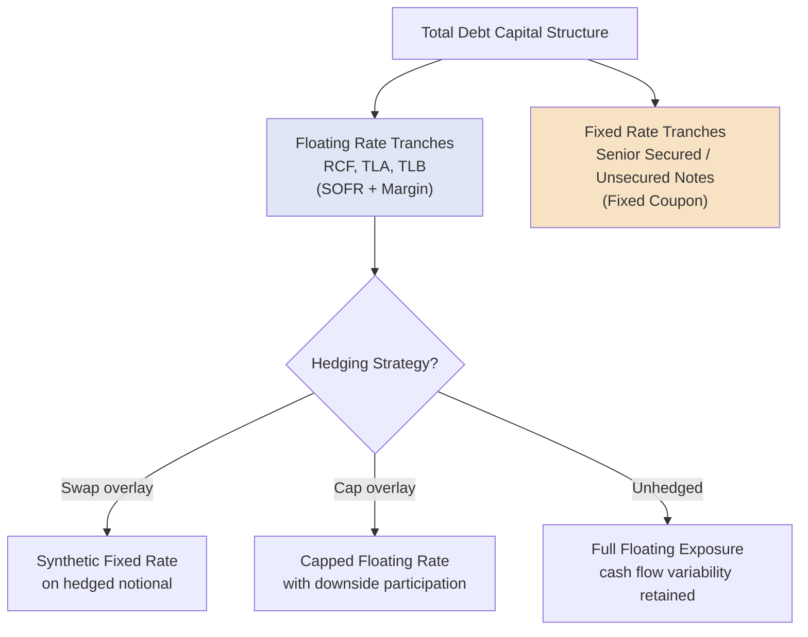

## Fixed Rate versus Floating Rate Debt Structuring

### Overview

The choice between fixed-rate and floating-rate debt is a core structuring decision that determines how a borrower's interest expense responds to changes in benchmark interest rates over the life of a facility. This decision affects cash flow predictability, interest rate risk exposure, and the pool of investors/lenders willing to hold the instrument. In practice, most leveraged capital structures blend both — floating-rate bank debt at the senior secured level and fixed-rate bonds further down the stack — and sophisticated borrowers use derivative overlays to actively manage the resulting net rate exposure.

### Fixed Rate Debt

**Key Points**

- **Structure:** Coupon or interest rate is set at issuance and remains constant for the life of the instrument (or until a defined reset date, in the case of certain hybrid structures).
- **Typical instruments:** Investment grade and high yield corporate bonds/notes are almost universally fixed rate; some term loans can be structured as fixed rate, though this is comparatively less common in the syndicated bank/institutional loan market.
- **Cash flow predictability:** Interest expense is fully known and budgetable for the life of the instrument, simplifying financial planning and covenant compliance forecasting.
- **Interest rate risk:** Borne entirely by the borrower in terms of opportunity cost — if market rates fall after issuance, the borrower continues paying the higher original fixed rate unless the debt is refinanced or called (subject to any prepayment premium).
- **Valuation sensitivity:** Fixed-rate instrument prices move inversely with market interest rates (duration risk) — when rates rise, the market value of existing fixed-rate debt falls, and vice versa, a dynamic relevant to bondholders trading in secondary markets even though it does not directly affect the issuer's contractual cash obligations.

### Floating Rate Debt

**Key Points**

- **Structure:** Interest rate resets periodically (commonly monthly or quarterly) based on a reference benchmark plus a fixed credit spread that does not change absent a repricing event.
- **Typical instruments:** Syndicated bank term loans (TLA, TLB), revolving credit facilities, and delayed-draw term loans are almost universally floating rate in the current market.
- **Benchmark:** Predominantly **Term SOFR** (Secured Overnight Financing Rate) following the industry-wide LIBOR transition (LIBOR ceased for most tenors by mid-2023). Some facilities may reference alternative benchmarks depending on jurisdiction (e.g., SONIA in the UK, €STR in the Eurozone).
- **Rate reset formula:**

$$\text{Periodic Interest Rate} = \max(\text{Term SOFR}, \text{SOFR Floor}) + \text{Applicable Margin}$$

- **Cash flow variability:** Interest expense fluctuates with each reset period based on prevailing benchmark rates, introducing budgeting and covenant compliance uncertainty that must be actively managed.
- **SOFR floor:** Most floating-rate loan facilities include a floor (commonly 0.00%–1.00%) establishing a minimum reference rate, protecting lender yield during periods when the benchmark trades at very low levels.
- **Interest rate risk:** Borne by the borrower in the form of cash flow volatility rather than opportunity cost — if benchmark rates rise, actual cash interest payments increase immediately at the next reset date.

### Comparative Summary Table

| Feature | Fixed Rate Debt | Floating Rate Debt |
| --- | --- | --- |
| Typical instrument | Bonds/notes (IG and HY) | Bank term loans, RCF, DDTL |
| Rate reset frequency | None (fixed for life or until call/maturity) | Periodic (commonly monthly/quarterly) |
| Cash flow predictability | High | Lower (varies with benchmark) |
| Benchmark exposure | None post-issuance | Term SOFR (or equivalent) + margin |
| Interest rate risk type | Opportunity cost / market value risk | Cash flow volatility risk |
| Prepayment structure | Make-whole (IG) or step-down call (HY) | Generally freely prepayable, or soft call (TLB) |
| Typical hedging need | Low (embedded fixed rate) | Higher (often hedged via swaps/caps) |

### Interest Rate Swaps as a Conversion Mechanism

**Key Points**

Borrowers frequently use **interest rate swaps** to convert floating-rate loan exposure into a synthetic fixed rate (or vice versa), without altering the underlying legal terms of the debt instrument itself:

$$\text{Net Effective Rate (Payer Swap)} = \text{Fixed Swap Rate} + \text{Loan Credit Spread}$$

In a standard "pay-fixed, receive-floating" swap overlay on a floating-rate term loan, the borrower pays a fixed rate to the swap counterparty and receives a floating payment that offsets the floating leg of the loan, leaving the borrower with a net fixed cost of the swap rate plus the loan's credit spread.

**Example**

A borrower has a $100 million TLB priced at Term SOFR + 350bps. The borrower enters a 5-year pay-fixed interest rate swap at a fixed swap rate of 3.80% (receiving Term SOFR in return):

$$\text{Net Effective Fixed Rate} = 3.80\% + 3.50\% = 7.30\%$$

Regardless of how Term SOFR moves over the swap's life, the borrower's net effective cost is fixed at 7.30%, since increases (or decreases) in the floating loan payment are offset by the corresponding floating receipt from the swap counterparty.

### Interest Rate Caps as a Partial Hedge

**Key Points**

An alternative to a full swap is an **interest rate cap**, which sets a maximum benchmark rate the borrower will effectively pay, in exchange for an upfront premium, while still allowing the borrower to benefit if rates fall below the cap level:

$$\text{Borrower's Effective Rate} = \min(\text{Actual Term SOFR}, \text{Cap Strike Rate}) + \text{Applicable Margin}$$

Many credit agreements for highly leveraged borrowers **require** the purchase of an interest rate cap (rather than leaving hedging optional) as a condition of closing, specifically to limit the borrower's floating-rate exposure to a level consistent with the lenders' credit underwriting assumptions.

### Fixed/Floating Structure in a Blended Capital Stack

### Hedge Ratio and Percentage of Debt Hedged

**Key Points**

Credit agreements frequently include a covenant or requirement specifying a minimum percentage of floating-rate debt that must be hedged (via swap or cap) for a defined period, expressed as a hedge ratio:

$$\text{Hedge Ratio} = \frac{\text{Notional Amount Hedged}}{\text{Total Floating Rate Debt Outstanding}}$$

**Example**

A borrower has $500 million of floating-rate TLB outstanding and a credit agreement requirement to hedge at least 50% of floating-rate exposure for the first three years. The borrower enters a $250 million notional interest rate cap:

$$\text{Hedge Ratio} = \frac{\$250{,}000{,}000}{\$500{,}000{,}000} = 50\%$$

This satisfies the minimum requirement, leaving the remaining $250 million exposed to unhedged floating-rate movements.

### Basis Risk and Hedge Ineffectiveness

**Key Points**

[Inference: the degree of basis risk in any specific hedging program depends on the precise index, reset dates, and notional amortization profile involved, and should be assessed against the specific instruments in question rather than assumed to be immaterial.] Basis risk can arise when the benchmark referenced in a swap or cap does not perfectly match the benchmark, reset dates, or amortization profile of the underlying loan (for example, a swap referencing 3-month Term SOFR hedging a loan that resets on 1-month Term SOFR periods), potentially leaving a borrower imperfectly hedged even with a nominally matched notional amount.

### Practical Application in Capital Structuring & Syndication

**Key Points**

- **Blended cost of capital modeling**: arrangers build combined fixed/floating capital structures to balance the cash flow predictability benefits of fixed-rate bonds against the potentially lower initial cost and prepayment flexibility of floating-rate bank debt, particularly relevant when modeling debt service coverage under multiple interest rate scenarios.
- **Credit agreement hedging covenants**: structuring a mandatory hedging requirement (minimum hedge ratio, minimum tenor) is a standard feature in highly leveraged financings, and arrangers must negotiate the specific hedge percentage, instrument type (swap vs. cap), and hedge counterparty credit requirements as part of the credit agreement.
- **Rate environment timing decisions**: the fixed/floating mix decision is directly informed by the prevailing and expected future interest rate environment — issuers and their advisors weigh locking in fixed-rate financing during periods of anticipated rate increases against the flexibility (and typically lower starting cost) of floating-rate debt.
- **Refinancing and repricing interaction**: floating-rate TLB debt's soft-call structure interacts directly with hedging strategy — a borrower repricing a TLB tranche must also consider whether existing swap or cap hedges need to be amended, terminated (potentially at a mark-to-market cost or gain), or re-struck to match new loan terms.
- **Derivative counterparty and ISDA documentation**: hedging overlays require separate ISDA Master Agreement and Schedule documentation between the borrower and swap/cap counterparty (often, but not always, one of the syndicate lenders), introducing an additional layer of legal and credit documentation alongside the core credit agreement or indenture.

### Related Topics

- Term SOFR Benchmark Mechanics and the LIBOR Transition
- Interest Rate Swap and Cap Structuring (ISDA Documentation)
- Mandatory Hedging Covenants in Leveraged Credit Agreements
- Debt Service Coverage Ratio Analysis Under Rate Scenarios
- Term Loan A versus Term Loan B Structural Distinctions
- Corporate Bonds and Notes: Investment Grade versus High Yield
- Basis Risk Management in Hedged Capital Structures
- Prepayment and Call Premium Mechanics Across Instrument Types
- Duration and Interest Rate Sensitivity of Fixed-Income Instruments
- Interest Rate Risk Management in Corporate Treasury