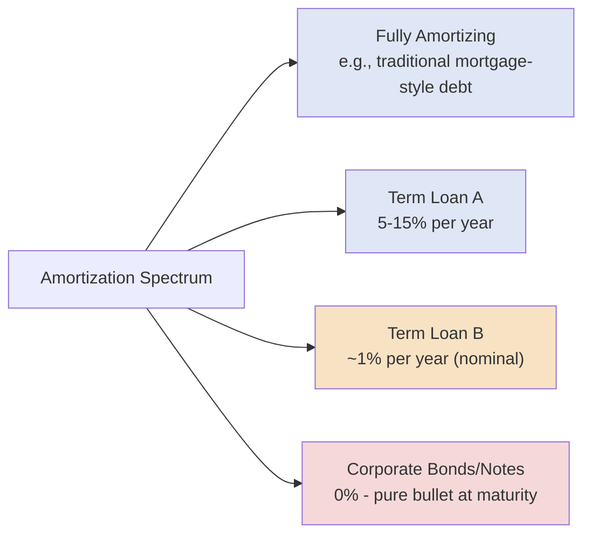

## Amortizing versus Bullet Repayment Structures

### Overview

The principal repayment schedule of a debt instrument — whether it amortizes gradually over its life or repays in a single lump sum at maturity — is a fundamental structuring lever that directly shapes a borrower's cash flow profile, refinancing risk, and effective cost of capital. Nearly every debt instrument covered elsewhere in this chapter sits somewhere on the spectrum between fully amortizing and pure bullet repayment, and the choice reflects a negotiated balance between lender risk appetite and borrower cash flow flexibility.

### Amortizing Structures

**Key Points**

- **Mechanic:** Principal is repaid in scheduled installments over the life of the loan, alongside (or combined with) periodic interest payments, progressively reducing the outstanding balance.
- **Common forms:**
  - **Straight-line (level principal) amortization:** Equal principal payments each period, with total payments (principal + interest) declining over time as the interest component shrinks.
  - **Level payment (mortgage-style) amortization:** Equal total payments each period, with the principal/interest mix shifting over time (more interest early, more principal later).
  - **Percentage-based schedules:** Common in syndicated loans, expressed as an annual percentage of original principal (e.g., "1% per annum," "5% per annum"), often stepping up in later years.
- **Typical instruments:** Term Loan A facilities (5–15% annual amortization), and, to a minimal degree, Term Loan B facilities (typically 1% annual amortization, often called "nominal" or "cosmetic" amortization since it barely reduces the principal balance).
- **Lender benefit:** Progressive de-risking — the outstanding exposure declines over time, reducing loss-given-default and providing early confirmation of the borrower's ongoing debt service capacity.
- **Borrower consideration:** Requires consistent free cash flow generation to service both interest and scheduled principal, which reduces refinancing risk at maturity but increases near-term cash flow demands.

### Bullet Repayment Structures

**Key Points**

- **Mechanic:** The full (or substantially full) principal balance is repaid in a single payment at maturity, with only interest paid during the loan's life.
- **Typical instruments:** Corporate bonds and notes (both investment grade and high yield) are almost universally bullet-structured; Term Loan B facilities are economically bullet-like given their minimal (~1%) annual amortization.
- **Lender/investor consideration:** Concentrates repayment (and therefore refinancing) risk entirely at the maturity date — investors are relying on the borrower's ability to either generate sufficient cash flow, refinance in the capital markets, or complete an asset sale/equity event to repay the full balance at once.
- **Borrower benefit:** Maximizes cash flow available for reinvestment, deleveraging by choice (rather than mandatory schedule), shareholder distributions, or acquisitions during the loan's life, since only interest (not principal) is a mandatory periodic cash outflow.
- **Refinancing risk concentration:** Because the full balance comes due at once, bullet structures create a single, large refinancing event, making the borrower's capital markets access and credit condition at that future date critical to successful repayment — this is a central driver of "maturity wall" risk analysis in credit structuring.

### Amortization Schedule Comparison

**Example**

Consider a $100 million, 5-year term loan at a 7% interest rate, compared under three repayment structures:

| Year | Straight-Line Amort. (5%/yr) Principal Due | TLB-Style (1%/yr) Principal Due | Bullet Principal Due |
| --- | --- | --- | --- |
| 1 | $5,000,000 | $1,000,000 | $0 |
| 2 | $5,000,000 | $1,000,000 | $0 |
| 3 | $5,000,000 | $1,000,000 | $0 |
| 4 | $5,000,000 | $1,000,000 | $0 |
| 5 (maturity) | $5,000,000 + remaining balance* | $1,000,000 + remaining balance* | $100,000,000 |

*Note: this simplified example assumes only the stated percentage amortizes annually with any remaining unamortized balance due at final maturity — actual facilities typically specify the exact final maturity payment amount in the credit agreement.

At maturity, the bullet structure requires refinancing or repaying the entire $100 million at once, while the straight-line amortizing structure requires refinancing only the remaining unamortized balance — a materially smaller refinancing event.

### Weighted Average Life (WAL) Calculation

**Key Points**

Weighted Average Life is a standard metric used to compare the effective duration of principal repayment across different amortization structures, weighting each repayment by the time until it occurs:

$$WAL = \sum_{i=1}^{n} \frac{P_i \times t_i}{P_{total}}$$

Where $P_i$ is the principal repaid at time $t_i$, and $P_{total}$ is total original principal.

**Example**

Using the straight-line 5%/year amortization schedule above (assuming, for simplicity, the final year payment equals the remaining $80 million balance):

$$WAL = \frac{(5 \times 1) + (5 \times 2) + (5 \times 3) + (5 \times 4) + (80 \times 5)}{100}$$

$$WAL = \frac{5 + 10 + 15 + 20 + 400}{100} = \frac{450}{100} = 4.5 \text{ years}$$

Compare this to a pure bullet structure with the same 5-year final maturity:

$$WAL_{bullet} = \frac{100 \times 5}{100} = 5.0 \text{ years}$$

The amortizing structure's WAL (4.5 years) is shorter than its stated final maturity (5 years) because a portion of principal is returned to lenders earlier; a bullet structure's WAL always equals its final maturity exactly, since 100% of principal is outstanding until that single repayment date.

### Structural Position Across Instrument Types

### Mandatory Prepayments as Quasi-Amortization

**Key Points**

Beyond scheduled amortization, many credit agreements include **mandatory prepayment provisions** that function as a supplementary, event-driven form of principal reduction:

- **Excess Cash Flow (ECF) sweep:** Requires the borrower to apply a percentage (commonly 50%, often stepping down as leverage declines) of a defined "excess cash flow" calculation to prepay term debt annually.
- **Asset sale proceeds:** Requires net proceeds from asset dispositions above a threshold to be applied to debt repayment (or reinvested within a specified period under a "reinvestment right").
- **Debt/equity issuance proceeds:** Requires net proceeds from certain new debt or equity issuances to prepay existing term debt, subject to negotiated exceptions.
- **Insurance/casualty proceeds:** Requires net proceeds from insurance claims (property damage, condemnation) above a threshold to be applied to debt repayment if not reinvested.

These provisions mean that even a "bullet-like" TLB with only 1% scheduled amortization may in practice experience meaningfully faster actual principal reduction, depending on the borrower's cash flow generation, asset sale activity, and capital markets access during the loan's life. [Inference: the actual pace of paydown under these sweeps is highly borrower- and cycle-specific and cannot be predicted from the stated schedule alone.]

### Maturity Wall Risk

**Key Points**

A "maturity wall" refers to a concentration of bullet or near-bullet debt maturities occurring within the same period, creating elevated refinancing risk if capital market conditions deteriorate as that date approaches. Structuring teams actively manage maturity wall risk by:

- **Laddering maturities** across different tranches (e.g., staggering TLA, TLB, and bond maturities across different years rather than aligning them to a single date).
- **Proactive refinancing/repricing** well ahead of maturity, particularly for TLB tranches with soft-call protection that expires after a defined period.
- **Liability management exercises** (exchange offers, amend-and-extend transactions) to push out maturities before they become a near-term refinancing cliff.

### Practical Application in Capital Structuring & Syndication

**Key Points**

- **Amortization schedule negotiation**: the specific percentage and step-up profile of scheduled amortization is a heavily negotiated term in any syndicated term loan, directly trading off lender de-risking preferences against borrower free cash flow availability for growth, dividends, or deleveraging flexibility.
- **WAL-driven investor targeting**: institutional investors (particularly CLOs) often have specific weighted average life tests and portfolio construction constraints, making WAL a key metric arrangers calculate and market when syndicating a TLB tranche.
- **Maturity laddering in capital structure design**: arrangers deliberately stagger the final maturities of TLA, TLB, and any bond tranches within a capital structure specifically to avoid concentrating refinancing risk in any single future period.
- **Cash flow sweep negotiation**: the size and step-down schedule of an excess cash flow sweep is a central negotiation point in leveraged loan documentation, since it functions as a de facto accelerated amortization mechanism layered on top of scheduled amortization.
- **Credit analysis and stress testing**: lenders and rating agencies model a borrower's ability to refinance bullet maturities under stressed capital markets scenarios as a core part of credit underwriting, distinct from (and in addition to) the borrower's ability to service scheduled amortizing payments from operating cash flow.

### Related Topics

- Term Loan A versus Term Loan B Structural Distinctions
- Excess Cash Flow Sweep Mechanics and Step-Down Schedules
- Weighted Average Life (WAL) in CLO Portfolio Construction
- Maturity Wall Risk and Liability Management Exercises
- Corporate Bonds and Notes: Investment Grade versus High Yield
- Amend-and-Extend Transactions in Syndicated Loans
- Mandatory Prepayment Provisions in Credit Agreements
- Debt Service Coverage Ratio Analysis
- Asset Sale Covenants and Reinvestment Rights
- Refinancing Risk Analysis in Credit Structuring