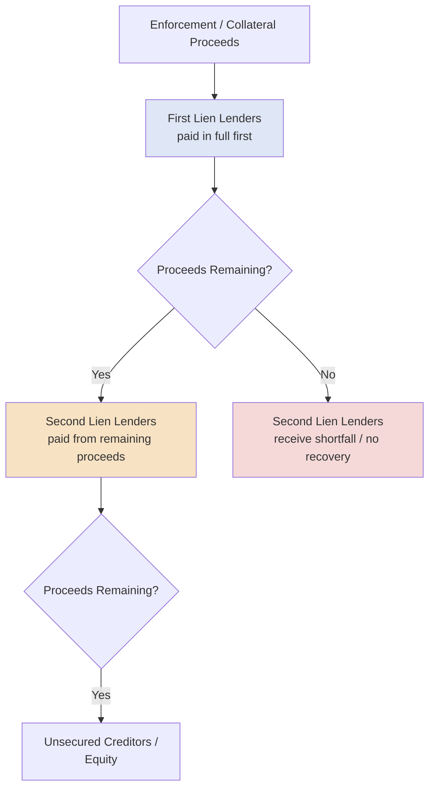
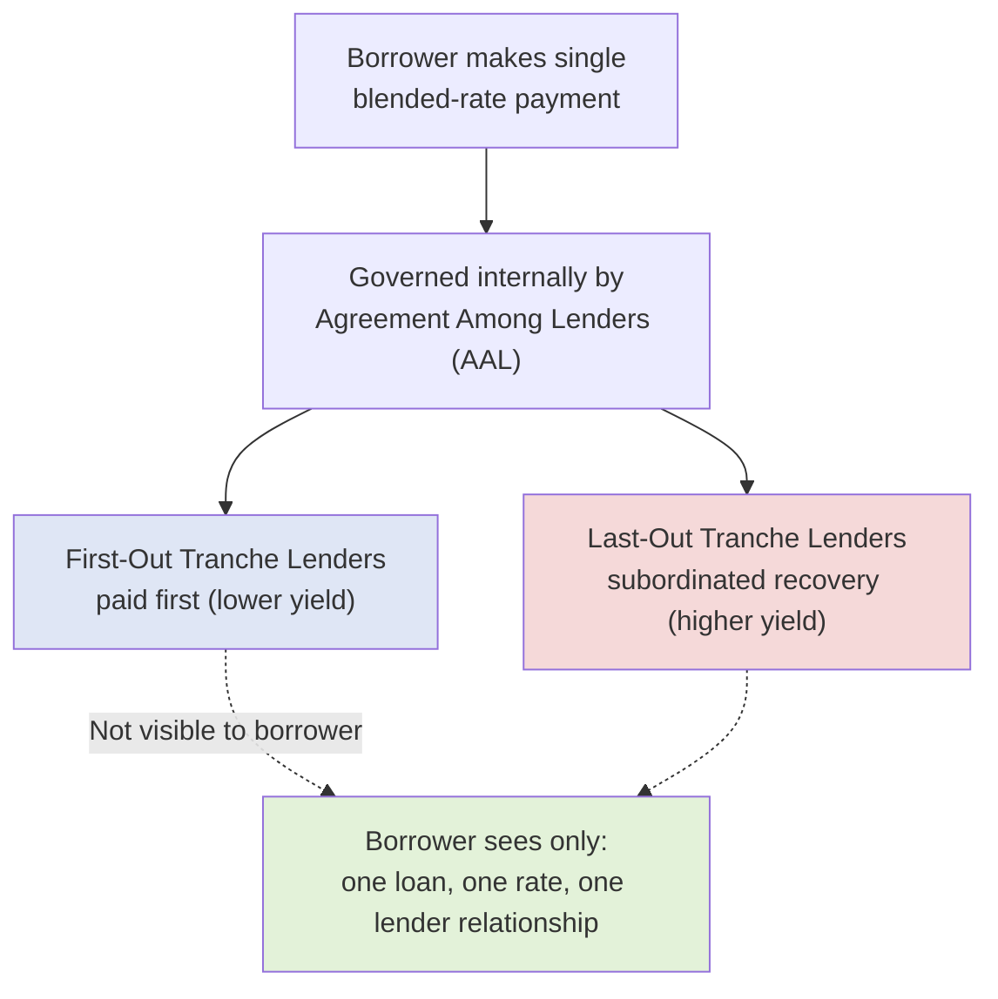

## Second Lien and Unitranche Facilities

### Overview

Second lien and unitranche facilities represent two distinct approaches to filling the capital structure gap between senior secured first-lien debt and unsecured/subordinated debt or equity. A **second lien facility** is a traditional layered structure with a junior secured claim behind a separate first-lien tranche, governed by an intercreditor agreement. A **unitranche facility** instead blends senior and subordinated risk into a single loan with one blended interest rate and one set of documentation, with the risk-sharing arrangement typically handled privately between lenders via an "agreement among lenders" (AAL) rather than disclosed to the borrower. Both structures have grown substantially in the private credit and middle-market segments as alternatives to a traditional multi-tranche syndicated structure.

### Second Lien Facilities

**Key Points**

- **Security position:** Secured by the same collateral pool as the first-lien facility, but with a contractually subordinated priority of payment from collateral proceeds — the second lien lender is repaid from collateral only after the first-lien lender is repaid in full.
- **Governing document:** An **intercreditor agreement** between first-lien and second-lien lenders governs payment priority (the "waterfall"), enforcement rights, standstill periods (during which second-lien lenders are restricted from taking enforcement action while first-lien lenders act), and voting/amendment rights over shared collateral.
- **Pricing:** Priced meaningfully wider than the first-lien tranche (often 300–600+ bps higher spread, depending on market conditions and relative leverage), reflecting the subordinated recovery position.
- **Typical lender base:** Institutional investors, credit funds, and specialty second-lien-focused funds rather than traditional relationship banks.
- **Use case:** Frequently used to extend total leverage capacity beyond what a first-lien-only structure would support, without diluting existing equity or resorting to unsecured/high yield bond issuance, particularly useful for issuers whose size or credit profile makes a public bond issuance impractical.
- **Amortization/tenor:** Typically bullet or near-bullet repayment, with a maturity date structured to fall after the first-lien facility's maturity (to avoid triggering cross-default or refinancing complications ahead of the senior tranche).

### Unitranche Facilities

**Key Points**

- **Structure:** A single loan facility, with a single credit agreement, a single blended interest rate, and a single lender of record (from the borrower's perspective) — even though the underlying economics may be split among multiple participating lenders with different risk/return profiles.
- **Blended pricing:** The single stated rate reflects a weighted-average economic return across the underlying "first-out" and "last-out" tranches (see below), positioned between where a standalone first-lien and second-lien facility would separately price.
- **First-out / Last-out (FOLO) structure:** Internally, unitranche facilities are frequently split among participating lenders into:
  - **First-out tranche:** Receives priority repayment and a lower yield, economically similar to a first-lien position.
  - **Last-out tranche:** Subordinated to the first-out tranche in the repayment waterfall, receiving a higher yield to compensate for the increased risk, economically similar to a second-lien or mezzanine position.
- **Agreement Among Lenders (AAL):** The FOLO split and associated payment waterfall, voting rights, and buy-out mechanics are governed by a private **Agreement Among Lenders**, which — critically — is typically **not shared with or visible to the borrower**, preserving the appearance of a single, simple lender relationship from the borrower's perspective.
- **Typical issuer profile:** Predominantly used in **middle-market and private credit transactions**, where a single direct lender (often a business development company (BDC) or private credit fund) can underwrite the full facility size without needing a broad syndication process.
- **Speed and simplicity:** Because there is a single credit agreement and typically a single lead lender relationship (even if risk is later syndicated among co-lenders under the AAL), unitranche facilities are often executed faster and with less documentation complexity than a traditional multi-tranche first-lien/second-lien structure.

### Comparative Summary Table

| Feature | Second Lien Facility | Unitranche Facility |
| --- | --- | --- |
| Documentation | Separate credit agreement from first lien; intercreditor agreement governs both | Single credit agreement for entire facility |
| Borrower visibility into internal risk-sharing | Full (intercreditor agreement terms are known) | Limited (AAL typically not shared with borrower) |
| Governing inter-lender document | Intercreditor Agreement | Agreement Among Lenders (AAL) |
| Pricing | Distinct, wider spread than first lien | Single blended rate |
| Typical market | Broadly syndicated / institutional | Middle-market / private credit |
| Typical lead arranger | Bank or institutional arranger | Private credit fund / BDC |
| Internal tranching | Separate first lien / second lien facilities | Often internally split first-out/last-out |
| Execution speed | Standard syndicated process | Often faster (single-lender underwrite) |

### Payment Waterfall: Second Lien Structure

### Payment Waterfall: Unitranche First-Out/Last-Out Structure

### Blended Rate Calculation Example

**Example**

A $100 million unitranche facility is internally structured as $60 million first-out (priced at SOFR + 450bps) and $40 million last-out (priced at SOFR + 750bps). The blended rate charged to the borrower is calculated as a weighted average:

$$\text{Blended Spread} = \left(\frac{\$60M}{\$100M} \times 450\text{bps}\right) + \left(\frac{\$40M}{\$100M} \times 750\text{bps}\right)$$

$$\text{Blended Spread} = (0.60 \times 450) + (0.40 \times 750) = 270 + 300 = 570 \text{ bps}$$

The borrower sees and pays a single rate of Term SOFR + 570bps, unaware of (or at least contractually insulated from needing to manage) the underlying first-out/last-out economic split between the participating lenders.

### Why Borrowers/Sponsors Choose Each Structure

**Key Points**

- **Second lien** is typically chosen when a borrower already has (or is separately arranging) a syndicated first-lien facility and needs incremental leverage capacity, and is comfortable with the added complexity of a formal intercreditor relationship between two distinct lender groups.
- **Unitranche** is typically chosen by middle-market borrowers/sponsors prioritizing **speed, certainty of execution, and simplicity of the borrower-facing lender relationship**, often in a competitive M&A process where a single private credit fund can commit to and fund the entire facility quickly without a broad syndication timeline.

### Practical Application in Capital Structuring & Syndication

**Key Points**

- **Total leverage capacity optimization**: second lien facilities are structured specifically to extend a borrower's total secured leverage beyond what first-lien lenders alone would underwrite, without triggering the higher execution complexity or minimum scale requirements of a public high yield bond issuance.
- **Intercreditor negotiation**: structuring a second lien facility requires careful negotiation of standstill periods, cure rights, and collateral enforcement/release provisions in the intercreditor agreement — a critical area of legal and structuring work distinct from the economic loan terms themselves.
- **Private credit market access**: unitranche structures have become a primary vehicle through which direct lending funds and BDCs compete with traditional syndicated bank/institutional markets for middle-market leveraged buyout financing, particularly valued by sponsors for speed and reduced execution risk in competitive auction processes.
- **AAL structuring for co-lender syndicates**: even within a "single lender" unitranche facility, the lead arranger/agent must structure the underlying Agreement Among Lenders carefully to allocate risk, define buy-out/step-in rights if a last-out lender wants to exit, and establish voting thresholds for amendments — all while preserving the borrower-facing simplicity that is the structure's key selling point.
- **Refinancing/exit strategy**: because unitranche facilities are less standardized and less liquid in a secondary trading sense than broadly syndicated TLB paper, structuring teams must consider refinancing optionality (e.g., transitioning to a traditional syndicated first-lien/second-lien or bond structure) as the borrower scales or seeks to reduce its cost of capital over time.

### Related Topics

- Intercreditor Agreements and Standstill Period Mechanics
- Agreement Among Lenders (AAL) Structuring in Private Credit
- Private Credit and Direct Lending Market Overview
- Business Development Companies (BDCs) as Unitranche Lenders
- Term Loan A versus Term Loan B Structural Distinctions
- Mezzanine Debt and Subordinated Financing Structures
- Middle-Market Leveraged Buyout Financing Strategy
- Payment Waterfall and Collateral Enforcement Mechanics
- Corporate Bonds and Notes: Investment Grade versus High Yield
- Total Leverage Optimization Across the Capital Stack