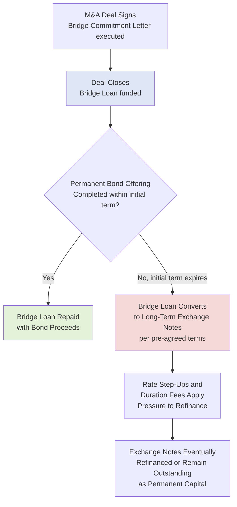

## Bridge Loans and Bridge-to-Bond Structures

### Overview

A bridge loan is a short-term financing commitment designed to "bridge" the gap between a borrower's immediate funding need — most commonly to close an announced M&A transaction — and the completion of the borrower's intended permanent, long-term financing (typically a bond issuance or syndicated term loan). Bridge loans give a borrower and its financial sponsor **committed financing certainty** at signing, without requiring the full permanent capital markets execution to be completed before closing. Bridge-to-bond structures specifically embed contractual mechanics that convert the bridge loan into long-term notes if a bond takeout cannot be completed in time, ensuring lenders and borrowers both have a defined path to permanent capital.

### Why Bridge Loans Exist

**Key Points**

- **Timing mismatch:** M&A transactions, particularly competitive auctions and public company acquisitions, often require the acquirer to demonstrate fully committed financing at signing, while completing a bond offering or syndicated loan process typically takes weeks to months and depends on capital markets conditions that cannot be perfectly timed to a deal's signing date.
- **Certainty of funds:** Sellers (particularly in public company mergers, where financing contingencies are typically unacceptable) require buyers to have binding, unconditional financing commitments — a bridge commitment letter provides this certainty even before the permanent financing is actually placed with investors.
- **Market timing flexibility:** A bridge loan allows the borrower to defer the actual bond issuance to a more favorable point in the interest rate or credit spread cycle, rather than being forced to price permanent debt under time pressure to meet a signing deadline.

### Bridge Loan Structure

**Key Points**

- **Commitment mechanics:** Investment banks (typically the same institutions acting as M&A and financing advisors) provide a **committed bridge facility** via a bridge commitment letter, obligating them to fund the bridge loan at closing if the permanent financing has not yet been placed.
- **Tenor:** Short initial term, typically 364 days, reflecting its intended nature as genuinely temporary financing rather than a long-term capital solution.
- **Conversion feature:** If the bridge loan is not repaid (via a completed bond offering, term loan, or other refinancing) by the end of the initial short-term period, it typically **automatically converts** into a longer-term instrument — most commonly a set of "exchange notes" with an extended maturity (often 7–8 years) — under pre-negotiated terms set at the outset.
- **Pricing structure with "flex":** Bridge loan pricing includes escalating features specifically designed to pressure the borrower/arranger to complete the permanent takeout financing quickly rather than let the bridge convert or remain outstanding:
  - **Duration fees:** Additional fees payable to bridge lenders at set intervals (e.g., every 90 days) the bridge loan remains outstanding.
  - **Rate step-ups:** The interest rate/spread increases at defined intervals the longer the bridge remains unrefinanced.
  - **Market flex provisions:** Arrangers typically retain the right to adjust the terms of the *permanent* takeout financing (pricing, structure, OID) within pre-agreed parameters to ensure it can be successfully placed with investors, without needing to return to the borrower for renegotiation.

### Bridge-to-Bond Conversion Mechanics

### Rate Step-Up Mechanics

**Key Points**

A typical bridge facility might specify that the interest rate increases by a fixed increment (e.g., 50 bps) at each successive interval the loan remains unrefinanced, up to a specified cap:

$$\text{Rate at Period } n = \text{Initial Spread} + (n \times \text{Step-Up Increment}), \quad \text{capped at Maximum Rate}$$

**Example**

A bridge loan is initially priced at Term SOFR + 500bps, with a 50bps step-up every 90 days, capped at Term SOFR + 900bps:

| Period | Days Outstanding | Spread |
| --- | --- | --- |
| Initial | 0–90 | 500 bps |
| Step 1 | 91–180 | 550 bps |
| Step 2 | 181–270 | 600 bps |
| Step 3 | 271–360 | 650 bps |
| Step 4+ | 361+ | Continues stepping up to 900bps cap |

This escalating structure creates strong economic pressure on both the arranger (who typically earns fees tied to successful permanent placement) and the borrower to complete the bond takeout as quickly as market conditions reasonably allow.

### Exchange Notes: The Permanent Fallback Instrument

**Key Points**

- If the bridge converts, it typically becomes **exchange notes** — a debt instrument with terms largely mirroring what the intended permanent high yield bond would have contained (covenant package, call protection, maturity), pre-negotiated at the outset specifically to ensure the fallback instrument is a viable, market-standard security.
- Exchange notes are typically initially held by the bridge lenders themselves, who often intend to (or are permitted to) sell down their exposure to institutional investors over time, effectively becoming a delayed, privately-placed version of the originally intended public bond offering.
- Because exchange notes are structured to closely resemble a standard high yield bond, they generally carry similar structural features: non-call periods, step-down call schedules, change of control puts, and incurrence-based covenants (see the High Yield Bonds discussion elsewhere in this chapter).

### Bridge Facility Fee Structure

**Key Points**

Bridge financings typically carry multiple layers of fees compensating the arranging banks for underwriting risk and the ongoing "backstop" nature of the commitment:

- **Commitment fee:** Paid at signing for the bridge commitment itself, regardless of whether the bridge is ultimately funded.
- **Funding fee:** Paid if and when the bridge loan is actually drawn at closing.
- **Duration fee:** Paid periodically if the bridge remains outstanding beyond the initial term, as described above.
- **Takeout/placement fee:** Often embedded within the overall financing fee structure, compensating the arranger for successfully placing the permanent bond or loan that repays the bridge.

### Comparative Summary: Bridge Loan vs. Committed DDTL

**Key Points**

Bridge loans are sometimes confused with delayed-draw term loans (DDTLs), but serve distinct structural purposes:

| Feature | Bridge Loan | Delayed-Draw Term Loan (DDTL) |
| --- | --- | --- |
| Purpose | Temporary financing pending permanent takeout | Committed financing intended to remain outstanding |
| Intended duration | Short (364 days), designed to be refinanced quickly | Full term loan tenor once drawn (matches parent tranche) |
| Conversion feature | Converts to exchange notes if not refinanced | No conversion — remains a term loan |
| Fee structure | Escalating (duration fees, rate step-ups) to pressure refinancing | Ticking fee on unused commitment, no escalation pressure to repay once drawn |
| Typical use case | M&A acquisition financing certainty | Pre-committed acquisition or capex financing intended as permanent capital |

### Practical Application in Capital Structuring & Syndication

**Key Points**

- **M&A financing certainty for competitive processes**: bridge commitment letters are a standard requirement in public company M&A and competitive private auction processes, where sellers require binding financing certainty from the buyer well before permanent capital markets execution can realistically be completed.
- **Fee and flex negotiation**: structuring the specific duration fee schedule, rate step-up cadence, and market flex parameters is a heavily negotiated component of the bridge commitment letter, balancing the arranging banks' desire for strong economic incentives to place the permanent takeout against the borrower's desire to limit escalating costs if market timing proves unfavorable.
- **Underwriting risk management for arrangers**: banks providing bridge commitments bear meaningful underwriting risk (the risk of holding or syndicating the bridge/exchange notes if market conditions deteriorate between signing and closing), which is directly reflected in the fee economics charged for the commitment.
- **Capital structure sequencing decisions**: bridge-to-bond structures allow a sponsor to sequence a leveraged buyout's permanent capital structure (e.g., TLB plus HY notes) to be finalized and marketed closer to or after closing, rather than being forced to lock in bond pricing under the time pressure of a signing deadline.
- **Rating agency and investor communication**: because a bridge facility (and any subsequent exchange notes) can materially affect a borrower's pro forma capital structure and credit profile, arrangers and issuers must coordinate closely with rating agencies and prospective bond investors on the anticipated permanent capital structure, even while the bridge remains technically outstanding.

### Related Topics

- Corporate Bonds and Notes: Investment Grade versus High Yield
- Market Flex Provisions in Syndicated Loan and Bond Underwriting
- Committed Financing Letters in M&A Transaction Structuring
- Delayed-Draw Term Loans and Committed Acquisition Financing
- Leveraged Buyout Capital Structure Sequencing
- Underwriting Risk and Fee Economics for Arranging Banks
- Rule 144A Bond Offerings and Registration Rights Agreements
- Rating Agency Coordination in Pending M&A Financings
- Exchange Offers and Liability Management Transactions
- Term Loan B Syndication Process and Institutional Distribution