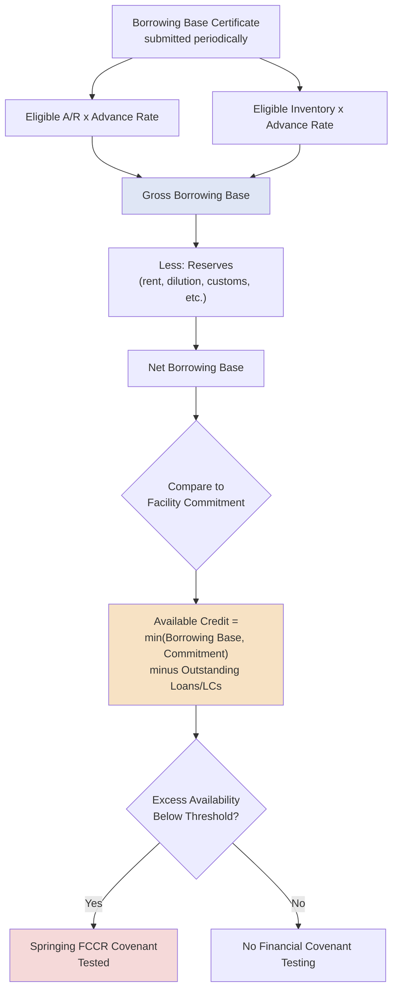

## Asset-Based Lending Facilities

### Overview

Asset-Based Lending (ABL) facilities are revolving credit structures in which the amount a borrower can draw is determined not by a fixed commitment tied to enterprise value or cash flow multiples, but by a formula-driven **borrowing base** calculated against specific, identifiable collateral — primarily accounts receivable, inventory, and sometimes equipment or real estate. ABL is a fundamentally collateral-first lending discipline, distinct from cash-flow-based lending (traditional TLA/TLB/RCF structures), and is particularly well-suited to borrowers with substantial working capital assets, cyclical earnings, or credit profiles that would not support a large cash-flow-based facility on their own.

### Core ABL Mechanics

**Key Points**

- **Borrowing base formula:** Availability under an ABL facility is not a fixed dollar commitment alone — it is capped by a dynamically recalculated borrowing base, typically certified by the borrower on a periodic (often weekly or monthly) basis.
- **Advance rates:** Each eligible collateral category is subject to a specific **advance rate** (a percentage of the collateral's value that lenders will lend against), reflecting the lender's assessment of that collateral type's liquidation value and ease of monetization.
- **Eligible collateral:** Not all receivables or inventory qualify — credit agreements specify detailed **eligibility criteria** and exclude ineligible categories (e.g., receivables over 90 days past due, receivables from affiliates, obsolete or slow-moving inventory, in-transit inventory in certain cases).
- **Reserves:** Lenders apply additional **reserves** against the calculated borrowing base to protect against specific risks (rent/landlord lien reserves, customs reserves for imported inventory, dilution reserves for receivables, credit card chargeback reserves), further reducing net availability below the gross formula amount.

### Borrowing Base Formula

**Key Points**

The standard ABL borrowing base formula combines advance rates applied to eligible collateral categories, net of reserves:

$$\text{Borrowing Base} = (\text{Advance Rate}_{AR} \times \text{Eligible A/R}) + (\text{Advance Rate}_{Inv} \times \text{Eligible Inventory}) - \text{Reserves}$$

$$\text{Available Credit} = \min(\text{Borrowing Base}, \text{Total Facility Commitment}) - \text{Outstanding Loans and LCs}$$

**Example**

A borrower has $40 million of eligible accounts receivable and $60 million of eligible inventory (at the lower of cost or market). The credit agreement specifies an 85% advance rate on eligible A/R and a 50% advance rate on eligible inventory, with a combined $2 million reserve for rent and dilution:

$$\text{Borrowing Base} = (0.85 \times \$40{,}000{,}000) + (0.50 \times \$60{,}000{,}000) - \$2{,}000{,}000$$

$$\text{Borrowing Base} = \$34{,}000{,}000 + \$30{,}000{,}000 - \$2{,}000{,}000 = \$62{,}000{,}000$$

If the total facility commitment is $75 million and the borrower currently has $45 million drawn plus $5 million in outstanding letters of credit:

$$\text{Available Credit} = \min(\$62{,}000{,}000, \$75{,}000{,}000) - (\$45{,}000{,}000 + \$5{,}000{,}000) = \$62{,}000{,}000 - \$50{,}000{,}000 = \$12{,}000{,}000$$

The borrower can draw an additional $12 million, even though the stated facility commitment is $75 million, because actual availability is capped by the calculated borrowing base rather than the nominal commitment alone.

### Typical Advance Rates by Collateral Type

**Key Points**

[Inference: specific advance rates vary meaningfully by industry, collateral quality, and prevailing market/lender risk appetite; the ranges below reflect commonly observed market conventions rather than fixed universal figures.]

| Collateral Type | Typical Advance Rate Range |
| --- | --- |
| Eligible Accounts Receivable | 80%–90% |
| Eligible Inventory (raw materials/finished goods) | 50%–65% |
| Eligible Inventory (at NOLV — Net Orderly Liquidation Value) | Often higher, sometimes 80%–85% of NOLV |
| Machinery & Equipment (M&E) | 50%–80% of appraised value |
| Real Estate | 50%–75% of appraised value |

### Field Examinations and Appraisals

**Key Points**

- **Field examinations ("field exams"):** Periodic on-site or desk reviews conducted by the lender (or a third-party firm engaged by the lender) to verify the accuracy of the borrower's receivables aging, inventory records, and eligibility certifications underlying the borrowing base calculation.
- **Inventory appraisals:** Independent third-party appraisals (often using Net Orderly Liquidation Value, or NOLV, methodology) to establish the liquidation-adjusted value of inventory collateral, which frequently differs materially from the inventory's book or cost value.
- **Frequency:** Field exam and appraisal frequency is often tied to a **springing covenant/trigger structure** similar in concept to RCF springing covenants — for example, quarterly field exams when availability is healthy, stepping up to monthly if availability falls below a specified threshold.

### Availability-Based Covenant Structure (Springing FCCR)

**Key Points**

A distinguishing feature of ABL facilities is that financial maintenance covenants are typically **springing and tied to availability** rather than tested unconditionally each quarter:

$$\text{Covenant Springs} \iff \text{Excess Availability} < \text{Threshold (commonly the greater of a \% of the facility or a fixed \$ amount)}$$

**Example**

An ABL facility has a springing fixed charge coverage ratio (FCCR) covenant of 1.0x, triggered when excess availability falls below the greater of 10% of the total facility or $7.5 million. On a $75 million facility, the covenant springs if availability drops below $7.5 million (since 10% of $75 million equals $7.5 million). If availability remains above this threshold, the borrower faces no financial covenant testing at all that period — a materially more flexible structure than a traditional cash-flow revolver's unconditional (or lower-threshold springing) covenant.

### ABL Structure Diagram

### ABL vs. Cash-Flow Revolver Comparison

**Key Points**

| Feature | Asset-Based Lending (ABL) Revolver | Cash-Flow Revolving Credit Facility |
| --- | --- | --- |
| Availability basis | Formula-driven borrowing base | Fixed committed amount |
| Primary underwriting focus | Collateral value and liquidity | Enterprise value / EBITDA-based leverage |
| Financial covenant structure | Springing FCCR (availability-triggered) | Springing leverage covenant (utilization-triggered) or full maintenance |
| Pricing | Generally tighter (lower spread) given strong collateral coverage | Generally wider, reflecting less directly collateralized structure |
| Reporting requirements | Frequent (often weekly/monthly borrowing base certificates, periodic field exams) | Less frequent (typically quarterly compliance certificates) |
| Best suited for | Working-capital-intensive, asset-rich, or cyclical borrowers | Stable cash-flow-generative borrowers with less physical collateral |

### Collateral Priority and Intercreditor Considerations

**Key Points**

In capital structures combining an ABL facility with a separate cash-flow-based term loan (a common "ABL/Term Loan" split structure), the two facilities typically split collateral priority via an intercreditor agreement:

- The **ABL lender** typically takes a **first-priority lien on current assets** (receivables, inventory, deposit accounts) and a **second-priority lien** on fixed assets/intellectual property.
- The **term loan lender(s)** typically take the reverse: **first-priority lien on fixed assets and intellectual property**, and a **second-priority lien on current assets**.

This "first-lien flip" structure allows each lender to have priority claim on the collateral type it is best positioned to underwrite and, if necessary, liquidate — working capital assets for the ABL lender, and fixed/enterprise-value assets for the term lender.

### Practical Application in Capital Structuring & Syndication

**Key Points**

- **Liquidity solution for asset-rich, cash-flow-constrained borrowers**: ABL structures are frequently the preferred (or only viable) financing solution for borrowers in cyclical, working-capital-intensive industries (retail, distribution, manufacturing) where cash flow-based leverage multiples would not support an adequately-sized revolver, but the underlying receivables/inventory provide strong collateral coverage.
- **Split ABL/term loan structuring**: arrangers structuring a combined ABL revolver plus term loan facility must carefully negotiate the intercreditor "first-lien flip" arrangement, ensuring each lender group has priority over the collateral type most relevant and recoverable to their underwriting.
- **Distressed and turnaround financing**: ABL facilities are commonly used (or specifically arranged) for borrowers undergoing operational turnarounds or facing covenant stress under a cash-flow facility, since the availability-based lending discipline can provide committed liquidity even when EBITDA-based metrics are temporarily depressed.
- **Seasonal working capital management**: retailers and other seasonal businesses frequently size and structure ABL facilities specifically around peak seasonal borrowing base needs (e.g., holiday inventory build), with availability naturally expanding and contracting alongside the underlying collateral base throughout the year.
- **Refinancing and exit strategy considerations**: because ABL availability is directly tied to the borrowing base rather than a fixed commitment, structuring teams must model how availability would contract under stress scenarios (declining sales, rising receivables aging, inventory write-downs) as part of assessing overall liquidity risk in the capital structure.

### Related Topics

- Revolving Credit Facilities and Delayed-Draw Term Loans
- Intercreditor Agreements and Collateral Priority ("First-Lien Flip") Structures
- Springing Financial Covenants Across Facility Types
- Net Orderly Liquidation Value (NOLV) Appraisal Methodology
- Distressed Debt and Turnaround Financing Structures
- Term Loan A versus Term Loan B Structural Distinctions
- Working Capital Management and Seasonal Liquidity Planning
- Field Examination and Collateral Monitoring Practices
- Second Lien and Unitranche Facilities
- Deposit Account Control Agreements (DACAs) in Secured Lending