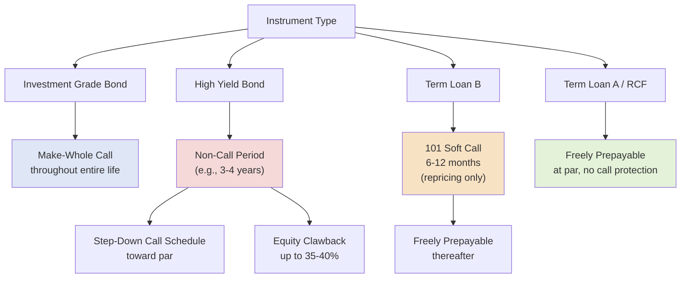

## Call Protection, Make-Whole Premiums, and Prepayment Structuring

### Overview

Call protection provisions govern a borrower's right to repay debt before scheduled maturity and, critically, what premium (if any) it must pay to do so. These provisions exist to protect lenders and bondholders against **reinvestment risk** — the risk that a borrower refinances at a lower cost as soon as market conditions or its own credit improve, leaving the original lender to reinvest the returned principal at a lower prevailing rate. The specific mechanics differ substantially across instrument types, and understanding these differences is essential to modeling refinancing economics and negotiating optimal prepayment flexibility during original structuring.

### Why Call Protection Exists

**Key Points**

- **Reinvestment risk:** Lenders price debt based on an expected yield over a defined holding period; if the borrower can repay early without penalty whenever rates fall or its credit improves, the lender is asymmetrically exposed — retaining the downside risk of the original commitment while losing the upside of the return actually priced in at issuance.
- **Yield protection:** Call protection provisions compensate lenders for this asymmetry, either by prohibiting prepayment entirely for a period (a "non-call" period) or by requiring a premium payment calibrated to replace some or all of the lender's foregone future interest income.
- **Negotiation leverage:** The strength of call protection a borrower can negotiate away (or a lender can insist upon) is directly tied to relative market conditions, the borrower's credit quality, and which market (bank loan vs. bond) the instrument is placed into.

### Make-Whole Call Premiums

**Key Points**

- **Typical instruments:** Investment grade corporate bonds, and occasionally certain term loan or private placement structures, particularly those with longer tenors and price-sensitive institutional investor bases.
- **Mechanic:** A make-whole premium is calculated to compensate the investor for the full present value of all remaining scheduled coupon payments (plus principal) that would have been received through maturity, discounted at a small spread over a comparable-maturity Treasury rate — effectively neutralizing the investor's economic loss from early repayment.
- **Formula:**

$$\text{Make-Whole Price} = \max\left(\text{Par}, \; \sum_{i=1}^{n} \frac{C_i}{(1+r)^{t_i}} + \frac{\text{Par}}{(1+r)^{t_n}}\right)$$

Where $C_i$ is each remaining coupon payment, $t_i$ is the time to each payment, and $r$ is the discount rate (Treasury yield + make-whole spread, e.g., "T+50bps").

**Example**

A bond has $10 million face value outstanding, a 6% annual coupon, and 3 years remaining to maturity. The comparable Treasury yield is 4.00%, and the indenture specifies a make-whole spread of 50bps (discount rate = 4.50%):

$$\text{PV} = \frac{\$600{,}000}{1.045^1} + \frac{\$600{,}000}{1.045^2} + \frac{\$600{,}000 + \$10{,}000{,}000}{1.045^3}$$

$$\text{PV} = \$574{,}163 + \$549{,}439 + \$9{,}286{,}164 = \$10{,}409{,}766$$

The issuer must pay approximately $10,409,766 (a premium of roughly $409,766 over the $10,000,000 par value) to redeem the bond early — because the discount rate (4.50%) is lower than the bond's coupon (6%), the make-whole calculation produces a premium above par, precisely compensating the investor for the lost above-market coupon income.

### Step-Down Call Schedules (High Yield Convention)

**Key Points**

- **Typical instruments:** High yield corporate bonds and notes almost universally use this structure rather than a make-whole calculation for the post-non-call period of the bond's life.
- **Mechanic:** The bond is structured with a **non-call period** (commonly the first 40–50% of its life) during which no voluntary redemption is permitted at all (subject to limited exceptions such as the equity clawback, described below), followed by a **fixed, pre-scheduled call price schedule** that steps down toward par as the bond approaches maturity.
- **Typical schedule shape:** For an 8-year non-call-3 (NC-3) bond with a coupon of $C\%$, a standard step-down schedule might specify:

| Call Period | Call Price (% of Par) |
| --- | --- |
| Years 1–3 (Non-Call) | Not callable (except equity clawback) |
| Year 4 | $100\% + \frac{C}{2}\%$ |
| Year 5 | $100\% + \frac{C}{4}\%$ |
| Year 6+ | 100% (par) |

**Example**

An 8-year, 8% coupon high yield bond with NC-3 protection would typically be callable starting in Year 4 at approximately 104% of par (100% + half the coupon), stepping down to approximately 102% in Year 5, and to par (100%) from Year 6 through maturity.

### Equity Clawback Provision

**Key Points**

Most high yield indentures include an **equity clawback** allowing the issuer to redeem a limited portion of the bonds — commonly up to 35–40% of the original aggregate principal amount — using the net proceeds of a qualifying equity offering, even during the otherwise-restrictive non-call period, typically at a modest premium (often par plus the full stated coupon rate, e.g., 108% for an 8% coupon bond).

### TLB Soft Call Protection

**Key Points**

- **Typical instrument:** Institutional Term Loan B tranches.
- **Mechanic:** Unlike the multi-year non-call/step-down structure of high yield bonds, TLB soft call protection is materially lighter — typically just a **101 soft call** for the first 6–12 months following closing (or following any repricing event), meaning a voluntary prepayment made specifically in connection with a repricing transaction (refinancing to obtain a lower spread) within that window requires a 1% premium payment.
- **Scope limitation — repricing only:** Critically, soft call protection in most modern TLB documentation applies **only to repricing transactions** (replacing the loan with cheaper debt), not to prepayments from asset sale proceeds, excess cash flow sweeps, or a full refinancing via a different instrument type (e.g., a bond takeout) — a key distinction from the broader non-call restrictions seen in high yield bonds.
- **Post-soft-call period:** After the soft call window expires, the TLB is generally freely prepayable at par with no premium at all.

### Call Protection Structures Compared

### Comparative Summary Table

| Feature | IG Bonds | HY Bonds | Term Loan B | Term Loan A / RCF |
| --- | --- | --- | --- | --- |
| Call protection type | Make-whole (entire life) | Non-call period + step-down schedule | 101 soft call (short window) | None (freely prepayable) |
| Duration of protection | Life of bond | Typically 40–50% of tenor | 6–12 months | None |
| Premium mechanic | PV-based (Treasury + spread) | Fixed schedule (% of par) | Flat 1% (if triggered) | N/A |
| Applies to which prepayments | All voluntary redemptions | All voluntary redemptions (with clawback exception) | Repricing transactions only | N/A |
| Post-protection treatment | N/A (protection is permanent) | Freely callable at scheduled/par prices | Freely prepayable at par | N/A |

### Prepayment Waterfall and Application of Proceeds

**Key Points**

Beyond voluntary prepayment call mechanics, credit agreements and indentures specify how *mandatory* prepayments (from asset sales, debt issuances, or excess cash flow sweeps) are applied across the capital structure, typically in order of seniority: first-lien term debt is generally prepaid before second-lien debt, and secured debt generally before unsecured notes, subject to the specific terms and any pro rata sharing requirements among lenders within the same tranche (often allocated pro rata based on outstanding principal amounts, though some agreements permit pro rata lenders to decline a mandatory prepayment ("101 protection" refusal rights) in certain structures).

### Practical Application in Capital Structuring & Syndication

**Key Points**

- **Refinancing economics modeling**: understanding the precise call premium mechanics for each instrument in a capital structure is essential when modeling the true all-in cost of refinancing — a borrower contemplating a full recapitalization must calculate not just new financing costs but the make-whole, step-down, or soft-call premiums payable on each instrument being replaced.
- **Repricing transaction timing**: TLB repricing decisions are directly governed by the 101 soft call window — arrangers and borrowers commonly time voluntary repricing transactions to occur just after the soft call period expires (or accept the 1% premium if the interest savings clearly outweigh the cost).
- **Negotiating call protection length**: the specific length of a non-call period and the steepness of a step-down schedule are meaningfully negotiated terms in high yield bond issuance, trading off investor yield protection against borrower flexibility to refinance opportunistically.
- **Equity clawback usage in sponsor exits**: private equity sponsors frequently negotiate for equity clawback capacity specifically to preserve the ability to delever using IPO or follow-on equity proceeds without waiting out the full non-call period.
- **Capital structure instrument selection**: the differing call protection regimes across TLB, HY bonds, and IG-style structures is itself a factor in choosing which instrument to use at a given point in the capital stack — borrowers anticipating the need for near-term refinancing flexibility may prefer TLB's lighter soft-call structure over a bond's longer non-call period, all else being equal.

### Related Topics

- Corporate Bonds and Notes: Investment Grade versus High Yield
- Term Loan A versus Term Loan B Structural Distinctions
- Amend-and-Extend and Repricing Transaction Mechanics
- Mandatory Prepayment Provisions and Application of Proceeds Waterfalls
- Bridge Loans and Bridge-to-Bond Structures
- Amortizing versus Bullet Repayment Structures
- Yield-to-Worst and Yield-to-Call Calculation Methodology
- Liability Management Exercises and Exchange Offers
- Leveraged Buyout Exit Strategy and Deleveraging Mechanics
- Discount Rate Selection in Fixed Income Valuation