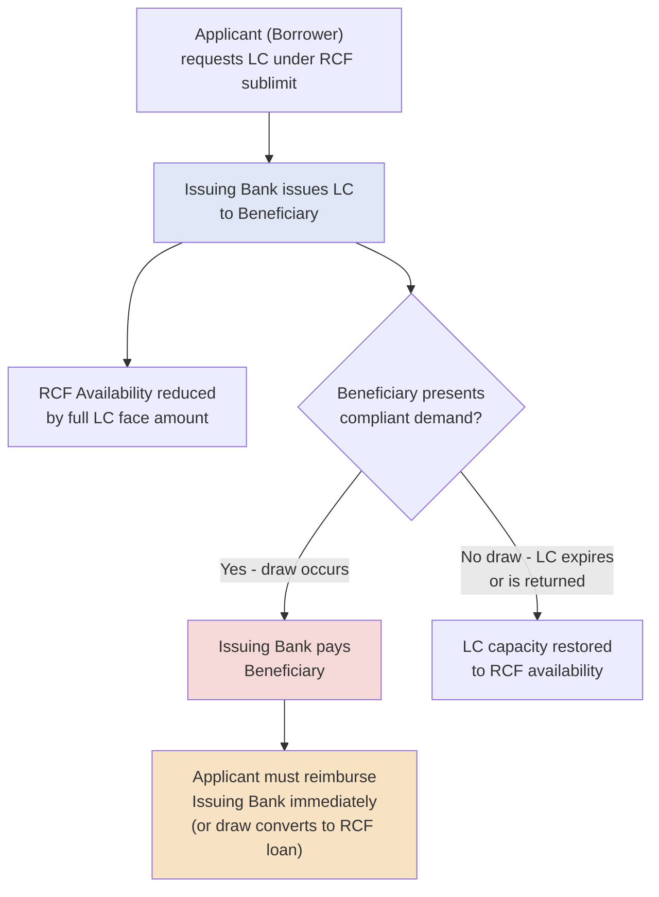

## Letters of Credit and Credit Enhancement Mechanisms

### Overview

Letters of credit (LCs) and related credit enhancement mechanisms are instruments that substitute a highly-rated financial institution's creditworthiness for that of a weaker or less-established obligor, enabling transactions and obligations that would otherwise be difficult to complete on the underlying party's credit alone. In capital structuring, LCs are typically embedded as a sublimit within a revolving credit facility, while broader credit enhancement techniques (guarantees, credit insurance, structural subordination) serve the parallel function of improving the effective credit profile presented to lenders or counterparties across a transaction.

### Letters of Credit: Core Mechanics

**Key Points**

- **Parties involved:** An LC involves three parties — the **applicant** (the borrower requesting the LC, typically to satisfy an obligation to a third party), the **issuing bank** (which issues the LC and commits its own credit), and the **beneficiary** (the third party entitled to draw on the LC if the applicant fails to perform or pay).
- **Function:** The issuing bank substitutes its own creditworthiness for the applicant's, giving the beneficiary confidence that payment will be made even if the applicant itself defaults or becomes unable to pay.
- **Facility mechanic:** Within a syndicated RCF, LC issuance reduces available revolver capacity by the full face amount of the LC (whether or not it is ever drawn), since the issuing bank's exposure and the borrower's contingent reimbursement obligation are both live from the moment of issuance.
- **Fee structure:** LC issuance typically carries a **fronting fee** (paid to the specific bank issuing the LC, compensating it for the administrative and settlement risk of fronting) plus a **participation fee** shared among the broader syndicate of RCF lenders (compensating them for their pro rata credit exposure to the LC), both typically calculated as an annual percentage of the LC face amount.

### Standby Letters of Credit (SBLCs)

**Key Points**

- **Purpose:** A "payment of last resort" instrument — the issuing bank pays the beneficiary only if the applicant fails to perform a specified underlying obligation (a payment default, a contractual non-performance).
- **Typical uses in capital structuring:**
  - **Lease and landlord security deposits** — replacing a large cash security deposit with an SBLC, preserving the tenant's cash for operating purposes.
  - **Insurance collateral** — securing obligations to insurance carriers (particularly workers' compensation self-insurance programs), which frequently require substantial collateral posting.
  - **Utility deposits** — satisfying utility company credit requirements without tying up cash.
  - **Performance guarantees under commercial contracts** — providing counterparty assurance in supply agreements, construction contracts, or similar arrangements without requiring cash collateral.
  - **Credit support for intercompany or joint venture obligations.**
- **Draw mechanic:** The beneficiary draws on an SBLC by presenting a compliant demand (often simply a signed statement asserting non-performance, depending on the LC's specific terms), and the issuing bank must pay regardless of any underlying dispute between applicant and beneficiary (the "independence principle" — discussed below).

### Commercial (Documentary) Letters of Credit

**Key Points**

- **Purpose:** Used primarily in trade finance to facilitate payment for the direct purchase of goods, particularly in cross-border transactions where buyer and seller may not have an established trust relationship.
- **Mechanic:** The issuing bank commits to pay the seller (beneficiary) directly upon presentation of specified shipping and commercial documents (bill of lading, commercial invoice, packing list, inspection certificates) demonstrating that goods have been shipped in accordance with the underlying sale contract — distinct from a standby LC's "payment only on default" structure, since a commercial LC is expected to be drawn in the ordinary, successful course of the transaction.
- **Governing rules:** Commercial LCs are typically governed by the ICC's **Uniform Customs and Practice for Documentary Credits (UCP 600)**, an internationally standardized framework establishing document examination and payment obligation rules. [Inference: specific procedural details and any subsequent revisions to these rules should be confirmed against current ICC publications rather than assumed static.]

### The Independence Principle

**Key Points**

A foundational legal concept underlying LC mechanics is the **independence principle** (also called the "autonomy principle"): the issuing bank's obligation to pay under the LC is entirely independent of, and not affected by, any dispute regarding the underlying contract between the applicant and beneficiary. The bank examines only whether the documents/demand presented strictly comply with the LC's own terms — it does not adjudicate whether the applicant actually breached the underlying agreement. This principle is what makes an LC a reliable credit enhancement tool: the beneficiary can rely on payment without needing to litigate the underlying dispute first.

### LC Fee Calculation Example

**Example**

A borrower requests a $5 million standby letter of credit under its RCF to secure a lease obligation. The credit agreement specifies a 200bps fronting fee (payable to the issuing bank) and a 150bps participation fee (shared pro rata among the syndicate):

$$\text{Annual Fronting Fee} = \$5{,}000{,}000 \times 2.00\% = \$100{,}000$$

$$\text{Annual Participation Fee} = \$5{,}000{,}000 \times 1.50\% = \$75{,}000$$

$$\text{Total Annual LC Cost} = \$100{,}000 + \$75{,}000 = \$175{,}000$$

This $5 million LC also reduces the borrower's available revolver capacity by the full $5 million for as long as it remains outstanding, regardless of whether it is ever actually drawn by the beneficiary.

### LC Issuance and Reimbursement Flow

### Broader Credit Enhancement Mechanisms

**Key Points**

Beyond letters of credit, several other structural mechanisms serve the parallel goal of improving the effective credit profile of an obligor or transaction:

- **Parent/sponsor guarantees:** A stronger parent entity or, less commonly, a financial sponsor guarantees the obligations of a weaker subsidiary or portfolio company, allowing lenders to underwrite based partly on the guarantor's credit strength.
- **Surety bonds:** Similar in function to a standby LC but issued by an insurance company rather than a bank, commonly used in construction (performance and payment bonds) and certain regulatory compliance contexts.
- **Credit insurance (trade credit insurance):** Insures a seller against the risk of buyer non-payment, often used to support receivables-based financing (including within ABL borrowing base eligibility) by improving the effective credit quality of the underlying receivables pool.
- **Cash collateral / cash-collateralized LCs:** Where the applicant's credit alone is insufficient even for the issuing bank to issue an LC on an unsecured reimbursement basis, the bank may require the LC to be fully cash-collateralized, effectively converting the credit enhancement into a secured, cash-backed instrument.
- **Structural subordination and credit tranching:** In securitization and structured finance more broadly, creating subordinated tranches that absorb losses first is itself a credit enhancement technique, improving the credit profile of the senior tranche without any third-party guarantee — a "tranching" rather than "guarantee" approach to enhancement.
- **Overcollateralization:** Pledging collateral in excess of the loan or obligation amount, providing a cushion that improves the effective credit position of the lender or beneficiary.

### Comparative Summary Table

| Mechanism | Issuer/Provider | Primary Use Case | Draw/Payment Trigger |
| --- | --- | --- | --- |
| Standby LC | Bank | Lease deposits, insurance collateral, performance guarantees | Applicant non-performance/default |
| Commercial LC | Bank | Trade finance / goods purchase | Presentation of compliant shipping documents (expected in ordinary course) |
| Surety Bond | Insurance company | Construction performance/payment | Contractor non-performance |
| Parent/Sponsor Guarantee | Corporate parent/sponsor | Subsidiary credit support | Subsidiary default on guaranteed obligation |
| Trade Credit Insurance | Insurance company | Receivables/trade credit risk | Buyer non-payment |
| Overcollateralization | N/A (structural) | Secured lending, securitization | N/A (embedded cushion, not an event-triggered payment) |

### Practical Application in Capital Structuring & Syndication

**Key Points**

- **RCF sizing and sublimit negotiation**: arrangers must negotiate the specific LC sublimit within an RCF (the maximum aggregate LC face amount permitted) alongside the overall facility size, balancing the borrower's anticipated need for lease, insurance, and utility LCs against total revolver capacity available for cash draws.
- **Fronting bank selection**: in a syndicated facility, borrowers and arrangers typically designate one or more specific "fronting banks" with the operational capability and risk appetite to issue LCs, even though credit exposure is shared pro rata across the broader syndicate.
- **Guarantee structuring in credit agreements**: parent/subsidiary guarantee structures are a core element of nearly every syndicated credit agreement's collateral and credit support package, requiring careful negotiation of which entities in a corporate group provide guarantees and how those guarantees interact with local law restrictions (financial assistance rules, thin capitalization limits) in cross-border structures.
- **ABL borrowing base enhancement**: credit insurance on receivables can directly improve borrowing base eligibility and advance rates in an asset-based lending facility, since insured receivables present materially reduced counterparty risk to the ABL lender.
- **Cash collateralization as a fallback structuring tool**: when a borrower's credit does not support an uncollateralized LC facility (whether due to overall leverage, first-time issuer status, or specific counterparty risk concerns), structuring a cash-collateralized LC arrangement allows the underlying commercial need (lease security, insurance collateral) to still be met while protecting the issuing bank's position.

### Related Topics

- Revolving Credit Facilities and LC Sublimit Structuring
- Uniform Customs and Practice for Documentary Credits (UCP 600)
- Guarantee Structures and Cross-Border Financial Assistance Restrictions
- Asset-Based Lending Facilities and Borrowing Base Enhancement
- Trade Finance Instruments and International Payment Mechanisms
- Surety Bonds in Construction and Performance Contracts
- Securitization Tranching and Structural Credit Enhancement
- Intercreditor Agreements and Guarantor Subordination
- Commercial Paper Backstop Facility Mechanics
- Deposit Account Control Agreements in Secured Lending