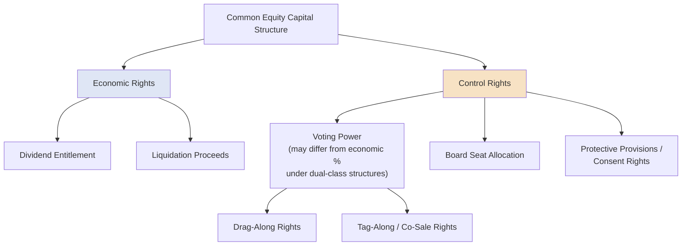

## Common Equity Structuring and Control Rights

### Overview

Common equity structuring encompasses how ownership interests in a company are designed, allocated, and governed — determining not only who bears residual economic risk and reward, but who controls the company's strategic and operational decisions. In capital structuring and syndication contexts, common equity design interacts directly with debt structuring: lenders assess the strength and stability of the sponsor/ownership control structure as part of underwriting, and the allocation of control rights among equity holders shapes how a company manages its capital structure, covenant compliance, and future financing decisions.

### Share Classes and Voting Structures

**Key Points**

- **Single-class common stock:** The simplest structure — one share, one vote, with all economic and voting rights held proportionally and identically across all shareholders.
- **Dual-class (multi-class) structures:** Common particularly among founder-led companies and certain sponsor-backed structures, where different share classes carry different voting power per share (e.g., Class A shares with 1 vote per share, Class B shares with 10 votes per share), allowing founders or controlling sponsors to retain voting control while holding a smaller proportional economic (cash flow) interest.
- **Non-voting common stock:** A share class carrying full economic rights (dividends, liquidation proceeds) but no voting rights at all, sometimes used for employee equity pools or specific investor classes where voting influence is deliberately excluded.
- **Golden shares:** A specialized, typically single share class carrying veto rights over specific fundamental decisions (mergers, asset sales, charter amendments), historically more common in government-linked or strategically sensitive entities, though variants appear in certain private structures.

### Economic Rights vs. Control Rights: The Core Distinction

**Key Points**

A central structuring concept is the deliberate separation of **economic rights** (the right to receive dividends, distributions, and liquidation proceeds proportional to ownership) from **control rights** (the right to vote on corporate decisions, elect directors, and approve major transactions). Dual-class structures are the clearest expression of this separation, but the same principle appears throughout private equity and venture capital structuring via separately negotiated shareholder agreements, even within a nominally single-class capitalization.

$$\text{Voting Power \%} \neq \text{Economic Ownership \%} \quad \text{(when dual-class or side-agreement structures exist)}$$

**Example**

A founder holds 20% of a company's total economic equity value but, through a dual-class structure granting 10 votes per Class B share versus 1 vote per Class A share held by all other investors, controls 60% of total voting power — enabling the founder to control board composition and major corporate decisions despite holding a minority economic stake.

### Board Composition and Governance Rights

**Key Points**

- **Board seats:** Control is frequently exercised (particularly in private equity and venture-backed companies) through negotiated **board seat allocation** rather than pure share voting alone — a sponsor holding a minority equity stake may still negotiate a majority of board seats, or veto/consent rights over specific board actions, as a condition of its investment.
- **Protective provisions / consent rights:** Common in venture capital and private equity structures, these are negotiated rights requiring specific investor approval before the company can take certain actions (issuing senior equity, incurring debt above a threshold, selling the company, amending the charter), regardless of that investor's proportional voting power on ordinary matters.
- **Drag-along rights:** Allow a controlling shareholder (or a defined majority) to compel minority shareholders to participate in a sale of the company on the same terms, preventing a small minority from blocking an otherwise-approved exit transaction.
- **Tag-along (co-sale) rights:** Allow minority shareholders to participate proportionally in a sale being negotiated by a controlling shareholder, ensuring the minority isn't left holding illiquid shares in a company whose control has been sold at a premium the minority didn't share in.

### Governance Rights Structure Diagram

### Preemptive Rights and Anti-Dilution Considerations

**Key Points**

- **Preemptive rights:** Give existing shareholders the right (but not obligation) to purchase their pro rata share of any new equity issuance before it is offered to outside investors, protecting against involuntary dilution of both economic and voting percentage ownership.
- **Standstill and lock-up provisions:** May restrict a shareholder's ability to acquire additional shares beyond a specified threshold (standstill) or to sell shares within a defined period (lock-up), both directly affecting the stability and predictability of the control structure over time.

### Sponsor Control Structures in Leveraged Transactions

**Key Points**

In private equity-sponsored leveraged buyouts (LBOs), the common equity structure typically features:

- **Sponsor majority/control ownership:** The financial sponsor typically holds a controlling equity stake (often 70–100%, with management and co-investors holding the remainder), giving the sponsor unilateral or near-unilateral control over major decisions.
- **Management equity/rollover:** Existing management frequently retains or "rolls over" a minority equity stake (commonly structured with incentive alignment features — see Management Incentive Plans in later chapters), aligning management's economic interests with the sponsor's investment thesis.
- **Board control:** Sponsors typically negotiate the right to appoint a majority (often all, subject to any management or independent director seats) of the board, giving direct operational and strategic control commensurate with their equity investment.
- **Relevance to lenders:** Lenders underwriting a leveraged financing directly assess the sponsor's control structure and track record, since a sponsor's ability to make rapid, unilateral decisions (asset sales, additional capital contributions, operational changes) can materially affect a lender's confidence in the borrower's ability to navigate financial stress if it arises.

### Comparative Summary: Control Mechanisms

| Mechanism | Primary Purpose | Typical Context |
| --- | --- | --- |
| Dual-class shares | Separate voting power from economic ownership | Founder-led public companies |
| Board seat allocation | Direct operational/strategic control | PE/VC-backed private companies |
| Protective provisions | Veto over specific major actions | VC/PE minority investor protection |
| Drag-along rights | Enable clean exit transactions | PE-controlled portfolio companies |
| Tag-along rights | Protect minority from being left behind in a sale | Minority shareholder protection |
| Preemptive rights | Prevent involuntary dilution | Ongoing private company financings |

### Control Rights and Debt Covenant Interaction

**Key Points**

Common equity control structures interact directly with debt covenant design in several ways relevant to capital structuring:

- **Change of Control definitions:** Credit agreements and bond indentures define specific "Change of Control" triggering events (often tied to a shift in voting control below a specified percentage, or replacement of a majority of the board) that can accelerate debt or trigger mandatory offers to repurchase (commonly at 101% for high yield notes) — meaning the equity control structure directly determines what future ownership transitions would trigger these debt provisions.
- **Permitted Holders / Sponsor carve-outs:** Credit documentation frequently defines a list of "Permitted Holders" (typically the original controlling sponsor and its affiliates) whose continued control is explicitly excluded from triggering a Change of Control event, preserving the sponsor's flexibility to conduct certain internal restructurings or partial sell-downs without triggering acceleration.
- **Equity cure rights:** Some credit agreements allow equity holders (typically the sponsor) to inject additional equity capital to "cure" a covenant breach (particularly a financial maintenance covenant breach) retroactively, directly tying the strength and willingness of the controlling equity holder to the practical flexibility available under the debt documentation.

### Practical Application in Capital Structuring & Syndication

**Key Points**

- **Change of Control provision drafting**: structuring the precise Change of Control definition and Permitted Holders carve-out in a credit agreement or indenture requires close coordination with the equity capitalization structure, ensuring the debt documentation appropriately protects lenders against an unanticipated shift in control while preserving legitimate sponsor flexibility.
- **Equity cure negotiation**: the availability, frequency limits (often capped at a specified number of uses over the life of the facility), and mechanics of equity cure rights are a meaningfully negotiated feature in leveraged credit agreements, directly linked to lenders' assessment of the sponsor's financial capacity and willingness to support the investment through a covenant stress scenario.
- **Sponsor credit assessment in underwriting**: arrangers and lenders evaluate a financial sponsor's track record, reputation, and typical behavior in prior portfolio company stress situations as part of underwriting a new leveraged transaction, since the sponsor's common equity control position gives it outsized influence over how the company would respond to financial difficulty.
- **Management incentive alignment**: structuring management's equity rollover and incentive plan alongside the broader capital structure is a key consideration in aligning management's decision-making (particularly around capital allocation and leverage management) with both sponsor and lender interests.
- **Governance disclosure in syndication**: when marketing a syndicated facility to a broad lender group (particularly in the institutional TLB market), arrangers typically disclose the sponsor/ownership control structure and board composition as part of the credit story, since institutional investors factor governance and control stability into their credit assessment.

### Related Topics

- Preferred Equity Structuring and Liquidation Preferences
- Management Incentive Plans and Equity Rollover Structures
- Change of Control Provisions in Credit Agreements and Indentures
- Equity Cure Rights and Financial Covenant Remediation
- Leveraged Buyout Capital Structure Design
- Corporate Bonds and Notes: Investment Grade versus High Yield
- Shareholder Agreements and Protective Provisions in Private Equity
- Drag-Along and Tag-Along Rights in M&A Transactions
- Dual-Class Share Structures in Public Company Governance
- Sponsor Credit Assessment in Leveraged Finance Underwriting