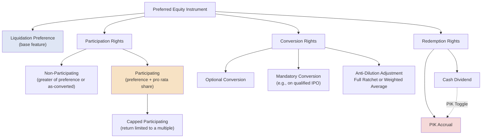

## Preferred Equity: Participating, Convertible, and Redeemable Features

### Overview

Preferred equity occupies a structural position between debt and common equity in the capital stack — it carries a preferential claim on cash flows and liquidation proceeds ahead of common shareholders, while typically ranking behind all debt obligations. Unlike a single homogeneous instrument, preferred equity is a highly customizable structuring toolkit: participating rights, conversion features, and redemption mechanics can each be independently negotiated and layered together, allowing sponsors and investors to fine-tune the precise risk/return profile and downside protection of the instrument to fit a specific transaction.

### Core Preferred Equity Mechanics

**Key Points**

- **Liquidation preference:** The defining feature of preferred equity — upon a liquidation, sale, or dividend distribution, preferred holders are entitled to receive a specified amount (typically their original investment plus any accrued but unpaid dividends) before any proceeds are distributed to common shareholders.
- **Preferred dividend rate:** A stated periodic return (expressed as a percentage of the liquidation preference/original investment), which may be paid in cash, accrued (added to the liquidation preference balance, "PIK" — payment-in-kind), or a combination depending on the borrower's cash flow and the instrument's negotiated terms.
- **Seniority within the capital stack:** Preferred equity ranks below all secured and unsecured debt but above common equity in both the periodic payment waterfall and the liquidation waterfall.

### Participating vs. Non-Participating Preferred

**Key Points**

- **Non-participating preferred:** The holder receives the greater of (a) the stated liquidation preference, or (b) the amount they would receive if they converted to common stock and shared pro rata in the distribution — but not both. This is a simpler, more common structure that caps the preferred holder's return at whichever outcome is more favorable.
- **Participating preferred:** The holder receives the stated liquidation preference **first**, and then also participates alongside common shareholders in any remaining proceeds on an as-converted basis — effectively "double-dipping" and producing a materially higher total return in a liquidity event compared to non-participating preferred.
- **Capped participating preferred:** A hybrid structure limiting the total return a participating preferred holder can receive (often expressed as a multiple of the original investment, e.g., 2.5x), after which the holder's participation rights are effectively capped and any excess proceeds flow to common shareholders.

### Participation Payout Comparison

**Example**

An investor holds $10 million of preferred stock (10% of the company on an as-converted basis) with a 1x liquidation preference. The company is sold for $100 million.

**Non-participating preferred:**

$$\text{Preferred Return} = \max(\$10{,}000{,}000, \; 10\% \times \$100{,}000{,}000) = \max(\$10{,}000{,}000, \$10{,}000{,}000) = \$10{,}000{,}000$$

In this scenario the investor is indifferent between taking the preference or converting, since both produce the same amount at exactly 10% ownership — but if the sale price were higher (e.g., $200 million), converting to common (10% × $200M = $20M) would be more favorable than the fixed $10M preference, and the holder would elect to convert.

**Participating preferred (uncapped):**

$$\text{Preferred Return} = \$10{,}000{,}000 \text{ (preference)} + 10\% \times (\$100{,}000{,}000 - \$10{,}000{,}000)$$

$$\text{Preferred Return} = \$10{,}000{,}000 + \$9{,}000{,}000 = \$19{,}000{,}000$$

The participating structure produces a materially higher return ($19 million vs. $10 million) because the holder receives the liquidation preference off the top **and** shares pro rata in the remaining $90 million alongside common shareholders.

### Convertible Preferred Equity

**Key Points**

- **Conversion right:** Allows the preferred holder to convert their preferred shares into common stock at a specified **conversion ratio** (or conversion price), typically at the holder's option, most commonly exercised when the as-converted common value exceeds the value of holding the preference.
- **Conversion price adjustments (anti-dilution protection):** Credit/investment agreements typically include anti-dilution mechanisms adjusting the conversion price downward if the company issues new shares at a price below the original conversion price (a "down round"), protecting the preferred holder's effective ownership percentage:
  - **Full ratchet:** Resets the conversion price entirely to the new, lower issuance price — highly protective of the preferred holder but heavily dilutive to common/founder shareholders.
  - **Weighted average (broad-based or narrow-based):** Adjusts the conversion price based on a formula weighting the size of the new issuance relative to existing shares outstanding — a more moderate, market-standard approach than full ratchet.
- **Mandatory vs. optional conversion:** Some structures include **mandatory conversion** triggers (e.g., automatic conversion upon a qualified IPO exceeding a specified valuation threshold), converting the preferred to common without requiring investor election.

### Weighted Average Anti-Dilution Formula

**Key Points**

$$CP_{new} = CP_{old} \times \frac{A + B}{A + C}$$

Where $CP_{new}$/$CP_{old}$ are the new/old conversion prices, $A$ is shares outstanding before the new issuance, $B$ is the number of shares that would have been issued at the old conversion price for the new investment amount, and $C$ is the actual number of new shares issued.

**Example**

A company has 10,000,000 shares outstanding (fully diluted, $A$) and an existing preferred conversion price of $5.00. The company raises $2,000,000 in a down round at $2.50 per share, issuing 800,000 new shares ($C$).

$$B = \frac{\$2{,}000{,}000}{\$5.00} = 400{,}000 \text{ shares}$$

$$CP_{new} = \$5.00 \times \frac{10{,}000{,}000 + 400{,}000}{10{,}000{,}000 + 800{,}000} = \$5.00 \times \frac{10{,}400{,}000}{10{,}800{,}000} = \$4.81$$

The conversion price adjusts down from $5.00 to approximately $4.81, partially (but not fully) protecting the preferred holder against the dilutive effect of the down round, in contrast to a full ratchet adjustment which would reset the conversion price directly to the new $2.50 issuance price.

### Redeemable Preferred Equity

**Key Points**

- **Redemption right:** Gives the preferred holder (or, less commonly, the issuer) the right to require the preferred shares to be repurchased for cash at a specified price (typically the liquidation preference plus any accrued dividends) after a defined holding period or upon a specified triggering event.
- **Mandatory redemption:** Some structures require the issuer to redeem the preferred on a fixed schedule or at a fixed maturity-like date, making the instrument economically resemble debt more closely than traditional equity — a structural feature with important accounting and tax classification implications.
- **Optional redemption (issuer call):** Allows the issuer to redeem the preferred at its option (often subject to a premium schedule similar in concept to bond call protection), typically used by issuers seeking to remove an expensive preferred instrument from the capital structure once cheaper financing becomes available.
- **PIK toggle features:** Many redeemable preferred structures include a "PIK toggle," allowing the issuer to elect (subject to defined conditions or unilaterally at its discretion) whether a given dividend period's preferred return is paid in cash or accrued/compounded (payment-in-kind) into the liquidation preference balance — a valuable cash flow flexibility feature, particularly in stressed periods.

### PIK Accrual Mechanics

**Key Points**

$$\text{Liquidation Preference Balance}_{t+1} = \text{Liquidation Preference Balance}_t \times (1 + \text{PIK Rate})$$

**Example**

A redeemable preferred instrument has an initial $50 million liquidation preference and a 12% PIK dividend rate, with the issuer electing PIK (rather than cash) treatment each year for 3 years:

$$\text{Year 1:} \quad \$50{,}000{,}000 \times 1.12 = \$56{,}000{,}000$$

$$\text{Year 2:} \quad \$56{,}000{,}000 \times 1.12 = \$62{,}720{,}000$$

$$\text{Year 3:} \quad \$62{,}720{,}000 \times 1.12 = \$70{,}246{,}400$$

By the end of Year 3, the liquidation preference balance has grown from $50 million to approximately $70.2 million, entirely through compounding PIK accrual without any cash dividend having been paid.

### Feature Interaction Diagram

### Comparative Summary Table

| Feature | Non-Participating | Participating | Convertible | Redeemable |
| --- | --- | --- | --- | --- |
| Downside protection | Liquidation preference floor | Liquidation preference floor | Depends on conversion election | Cash-out right at defined price/date |
| Upside participation | Convert-or-preference election (not both) | Preference + pro rata share (both) | Full common upside upon conversion | Generally capped at preference + accrued return |
| Resembles debt vs. equity | Equity-like | Equity-like (enhanced) | Equity-like (post-conversion) | Debt-like (fixed return, defined cash-out) |
| Typical use case | Standard VC/growth equity | Investor-favorable downside protection | Convertible notes, growth equity | PE structured equity, mezzanine-like instruments |

### Practical Application in Capital Structuring & Syndication

**Key Points**

- **Structuring the debt/preferred/common boundary**: preferred equity is frequently used to fill a capital structure gap between what senior/subordinated debt lenders will underwrite and what pure common equity sponsors are willing to contribute, particularly in transactions where additional leverage capacity is constrained by existing debt covenants or credit metrics.
- **Rating agency and lender treatment**: lenders and rating agencies scrutinize the specific terms of any preferred equity in a capital structure (mandatory redemption dates, cash dividend obligations, PIK toggle mechanics) to determine whether it should be treated as debt-like or true equity for leverage ratio and credit analysis purposes — a mandatorily redeemable, cash-pay preferred is generally viewed far more debt-like than a perpetual, PIK-toggle participating preferred.
- **PIK toggle as covenant flexibility tool**: structuring a preferred instrument with PIK toggle optionality gives an issuer valuable cash flow flexibility during periods of covenant or liquidity stress under its senior debt facilities, since electing PIK treatment preserves cash that would otherwise be needed for preferred dividends.
- **Anti-dilution negotiation in structured equity rounds**: the choice between full ratchet and weighted-average anti-dilution protection is a heavily negotiated term in preferred equity financings, directly affecting how future down-round financings are absorbed across the existing capital structure.
- **Intercreditor and structural subordination considerations**: even though preferred equity sits below debt in the capital stack, its specific redemption and dividend terms must be reviewed against senior debt covenants (restricted payment baskets, permitted preferred stock definitions) to ensure the preferred structure does not inadvertently breach existing debt documentation.

### Related Topics

- Common Equity Structuring and Control Rights
- Mezzanine Debt and Subordinated Financing Structures
- Restricted Payments Baskets and Covenant Capacity for Preferred Dividends
- Anti-Dilution Protection Mechanisms in Venture and Growth Equity
- Payment-in-Kind (PIK) Structures Across the Capital Stack
- Leveraged Buyout Capital Structure Design
- Convertible Notes and Convertible Debt Instruments
- Management Incentive Plans and Equity Rollover Structures
- Rating Agency Treatment of Hybrid Capital Instruments
- Liquidation Waterfall Analysis in Private Company Exits