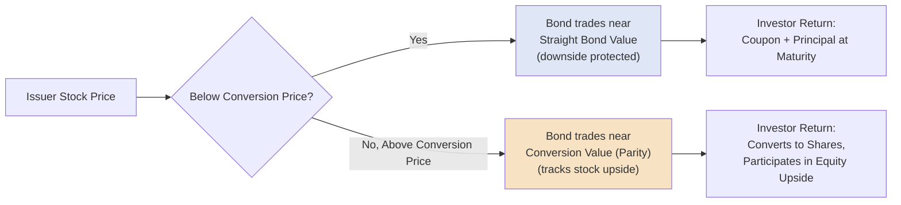

## Convertible Bonds and Convertible Notes

### Overview

Convertible bonds and convertible notes are hybrid debt instruments that combine a fixed-income component (a bond paying periodic interest with a defined maturity) with an embedded option to convert the principal into a predetermined number of the issuer's common shares. This structure allows issuers to raise debt capital at a lower coupon than a comparable straight bond, in exchange for giving investors the potential upside of equity participation if the issuer's share price appreciates. Convertibles are widely used across both public capital markets financing and private company growth/venture financing (where they are typically structured as "convertible notes"), each with distinct structuring conventions.

### Core Convertible Bond Mechanics

**Key Points**

- **Conversion ratio:** The number of common shares an investor receives upon converting each bond, typically fixed at issuance.
- **Conversion price:** The effective price per share implied by the conversion ratio, calculated as:

$$\text{Conversion Price} = \frac{\text{Bond Face Value}}{\text{Conversion Ratio}}$$

- **Conversion premium:** The percentage by which the conversion price exceeds the issuer's current share price at the time of issuance, representing the "hurdle" the stock must clear before conversion becomes economically attractive:

$$\text{Conversion Premium} = \frac{\text{Conversion Price} - \text{Current Share Price}}{\text{Current Share Price}}$$

- **Coupon discount:** Because investors receive equity upside optionality, convertible bonds typically carry a materially lower coupon than an equivalent straight (non-convertible) bond from the same issuer, reflecting the value of the embedded conversion option.

**Example**

A company's stock trades at $40 per share. It issues a convertible bond with a $1,000 face value and a conversion ratio of 20 shares per bond:

$$\text{Conversion Price} = \frac{\$1{,}000}{20} = \$50 \text{ per share}$$

$$\text{Conversion Premium} = \frac{\$50 - \$40}{\$40} = 25\%$$

The stock must appreciate by 25% from its current $40 level before conversion becomes more valuable to the investor than simply holding the bond to maturity at par.

### Convertible Bond Value Components

**Key Points**

A convertible bond's total value can be conceptually decomposed into two components:

$$\text{Convertible Bond Value} = \text{Straight Bond (Investment) Value} + \text{Embedded Call Option Value}$$

- **Straight bond (investment) value:** The present value of the bond's coupon and principal payments discounted at the rate an equivalent non-convertible bond from the same issuer would carry, representing the instrument's value as a pure fixed-income security (its downside "floor," absent issuer credit deterioration).
- **Embedded call option value:** The value of the equity conversion feature itself, which behaves like a call option on the issuer's stock struck at the conversion price, and is priced using option valuation methodology (e.g., a binomial model or a Black-Scholes-derived approach adjusted for the bond's specific features).

### Conversion Value and Parity

**Key Points**

$$\text{Conversion Value (Parity)} = \text{Current Share Price} \times \text{Conversion Ratio}$$

**Example**

Using the prior example, if the issuer's stock price rises to $55:

$$\text{Conversion Value} = \$55 \times 20 = \$1{,}100$$

Since the conversion value ($1,100) now exceeds the bond's $1,000 face value, the bond would trade based substantially on its equity conversion value ("in-the-money") rather than its straight bond value, and investors would generally find conversion economically preferable to holding to maturity for principal repayment alone.

### Convertible Payoff Diagram

### Call and Put Provisions on Convertible Bonds

**Key Points**

- **Issuer call (soft call) provision:** Many convertible bonds allow the issuer to force conversion or redeem the bond early, typically once the stock price has traded above a specified percentage (commonly 130%) of the conversion price for a defined period — allowing issuers to remove the instrument from their capital structure once the conversion option is deeply in-the-money.
- **Investor put option:** Some convertibles include a put right allowing investors to require early redemption at a specified price on defined future dates, providing a downside liquidity option independent of the conversion feature.
- **Contingent conversion (CoCo) features:** Some structures restrict the investor's ability to convert unless specific triggering conditions are met (e.g., the stock trading above a threshold for a defined period, or the bond trading below a specified percentage of conversion value), used primarily for specific accounting or tax treatment objectives. [Inference: the specific accounting and tax motivations for contingent conversion features are technical and jurisdiction/period-dependent; current treatment should be confirmed against applicable accounting standards and tax code provisions rather than assumed static.]

### Convertible Notes in Private/Venture Financing

**Key Points**

Convertible notes used in early-stage and venture financing differ structurally from public convertible bonds in several important respects:

- **Purpose:** Typically used as a fast, lower-cost bridge financing mechanism between priced equity rounds, deferring the need to negotiate a formal company valuation at the time of the note issuance.
- **Conversion trigger:** Rather than a fixed conversion price set at issuance, private convertible notes typically convert automatically into equity upon a subsequent **qualified financing round** (a future priced equity round exceeding a specified minimum size), with the conversion price determined at that future date.
- **Valuation cap:** Sets a maximum company valuation at which the note will convert, protecting early note investors from being diluted to the same conversion price as new investors in a much higher-valued future round.
- **Discount rate:** Provides note holders a discount (commonly 15–25%) to the price per share paid by new investors in the qualifying round, as additional compensation for the early-stage risk taken.
- **Interest accrual:** Convertible notes typically accrue interest (often 4–8%) which is generally added to the principal amount converting into equity, rather than paid in cash.

### Valuation Cap and Discount Interaction

**Key Points**

When both a valuation cap and a discount rate are present, the note typically converts at whichever mechanism produces the **lower** effective conversion price (i.e., the more favorable outcome for the investor):

$$\text{Conversion Price} = \min\left(\frac{\text{Valuation Cap}}{\text{Fully Diluted Shares}}, \; \text{New Round Price} \times (1 - \text{Discount \%})\right)$$

**Example**

A convertible note has a $8 million valuation cap and a 20% discount. The company later raises a Series A at a $12 million pre-money valuation, pricing new shares at $1.00 per share (implying 12,000,000 fully diluted shares at the cap-equivalent basis for comparison):

$$\text{Cap-Based Price} = \frac{\$8{,}000{,}000}{12{,}000{,}000} = \$0.667 \text{ per share}$$

$$\text{Discount-Based Price} = \$1.00 \times (1 - 0.20) = \$0.80 \text{ per share}$$

$$\text{Conversion Price} = \min(\$0.667, \$0.80) = \$0.667 \text{ per share}$$

The note converts at the lower, cap-based price of $0.667 per share, since the valuation cap produces a more favorable (lower) conversion price for the note holder than the discount mechanism in this scenario.

### SAFE Notes as a Related Instrument

**Key Points**

Simple Agreements for Future Equity (SAFEs) are structurally similar in purpose to convertible notes (deferred-valuation financing that converts upon a future priced round) but are **not debt instruments** — they carry no interest rate, no maturity date, and are not treated as a liability creating default risk, functioning instead as a pure equity-linked contractual right to future shares. [Inference: SAFE terms and prevalence vary by market and continue to evolve; current standard forms should be checked against the issuing organization's (e.g., Y Combinator's) most recent published templates.]

### Comparative Summary Table

| Feature | Public Convertible Bond | Private Convertible Note |
| --- | --- | --- |
| Conversion price mechanism | Fixed at issuance | Determined at future qualified financing (cap/discount) |
| Typical issuer | Public company | Early-stage/venture-backed private company |
| Interest treatment | Cash coupon | Often accrues, added to converting principal |
| Maturity | Defined, meaningful (5-10+ years) | Often short, frequently extended or expected to convert before maturity |
| Investor base | Public/institutional convertible bond investors | Venture capital, angel investors |
| Related equity-linked alternative | N/A | SAFE (Simple Agreement for Future Equity) |

### Practical Application in Capital Structuring & Syndication

**Key Points**

- **Lower cost-of-capital financing for growth issuers**: convertible bonds allow growth-oriented or higher-volatility issuers to raise debt capital at a coupon meaningfully below their straight-debt cost, making the structure attractive when an issuer's stock volatility makes the embedded option valuable to investors.
- **Capital structure interaction with existing debt**: arrangers and issuers must consider how a convertible bond issuance affects existing credit agreement covenants (permitted debt baskets, restricted payment capacity if the convertible is later repurchased with cash rather than shares) and how conversion (upon exercise) affects the company's pro forma equity capitalization and existing shareholders' dilution.
- **Convertible arbitrage investor base considerations**: a specific segment of the institutional investor base (convertible arbitrage hedge funds) prices and trades convertibles based on the embedded option's volatility value combined with credit spread analysis, meaning issuance timing and structuring often considers this specialized investor base's demand alongside traditional fixed income buyers.
- **Bridge financing structuring for private companies**: convertible notes are frequently used specifically to provide bridge capital between formal equity financing rounds without requiring an immediate, potentially contentious valuation negotiation, with capital structuring focus centering on appropriate valuation cap and discount terms relative to anticipated next-round pricing.
- **Call provision timing strategy**: issuers of public convertible bonds actively monitor stock price performance relative to the soft-call trigger threshold, since forcing conversion via a call provision removes the debt obligation from the balance sheet entirely (converting it to equity) rather than requiring a cash refinancing.

### Related Topics

- Preferred Equity: Participating, Convertible, and Redeemable Features
- Corporate Bonds and Notes: Investment Grade versus High Yield
- SAFE Notes and Alternative Deferred-Valuation Instruments
- Common Equity Structuring and Control Rights
- Bridge Loans and Bridge-to-Bond Structures
- Convertible Arbitrage Strategies in Fixed Income Markets
- Anti-Dilution Protection Mechanisms in Venture and Growth Equity
- Option Pricing Methodology (Black-Scholes, Binomial Models)
- Call Protection, Make-Whole Premiums, and Prepayment Structuring
- Venture Debt and Early-Stage Growth Financing Structures