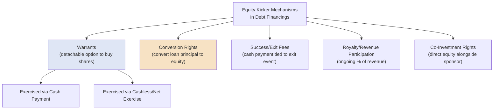

## Warrants and Equity Kickers in Debt Financings

### Overview

Warrants and other "equity kickers" are equity-linked instruments attached to a debt financing to enhance the lender's total expected return beyond the stated interest rate, without requiring the borrower to pay a higher cash coupon. They are especially common in higher-risk lending contexts — venture debt, mezzanine financing, distressed lending, and certain private credit unitranche structures — where the lender's downside credit risk is elevated relative to a traditional senior secured loan, and the borrower's equity upside potential provides a mechanism to compensate the lender without straining near-term cash flow.

### Warrants: Core Mechanics

**Key Points**

- **Definition:** A warrant is a contractual right (but not an obligation) to purchase a specified number of the issuer's shares at a predetermined **strike price**, exercisable during a defined **exercise period**, typically issued to the lender alongside (or "attached to") a debt instrument.
- **Warrant coverage:** The size of the warrant grant is typically expressed as a percentage of the loan amount, called "warrant coverage" — e.g., "5% warrant coverage" on a $10 million loan means the lender receives warrants to purchase shares with an aggregate value (at the strike price) equal to 5% of the loan amount, or $500,000.
- **Strike price:** Commonly set at or near the issuer's most recent equity valuation (e.g., the price per share in the most recent priced financing round), though it can be negotiated higher or lower depending on relative bargaining leverage.
- **Detachability:** Warrants are typically structured as **detachable** from the underlying debt instrument, meaning the lender can exercise (or sell/transfer) the warrant independently of the loan's repayment status — the warrant survives and retains value even after the loan itself is fully repaid.
- **Exercise period:** Commonly 5–10 years from issuance, giving the lender a long window to exercise if the issuer's equity value appreciates, without requiring near-term action.

### Warrant Coverage Calculation

**Key Points**

$$\text{Warrant Shares} = \frac{\text{Loan Amount} \times \text{Warrant Coverage \%}}{\text{Strike Price}}$$

**Example**

A venture lender provides a $5,000,000 venture debt facility with 8% warrant coverage, and the warrant strike price is set at $2.00 per share (matching the company's most recent Series B price per share):

$$\text{Warrant Value Target} = \$5{,}000{,}000 \times 8\% = \$400{,}000$$

$$\text{Warrant Shares} = \frac{\$400{,}000}{\$2.00} = 200{,}000 \text{ shares}$$

The lender receives warrants to purchase 200,000 shares at $2.00 per share, exercisable over the negotiated period, providing the lender an equity upside position without requiring any additional cash outlay from the borrower at closing.

### Warrant Payoff Illustration

**Example**

Continuing the prior example, suppose the company is later acquired at a price implying $8.00 per share for common equity:

$$\text{Warrant Intrinsic Value} = (\$8.00 - \$2.00) \times 200{,}000 = \$1{,}200{,}000$$

The lender can exercise the warrant (typically via a "cashless exercise" mechanic, described below) to capture $1,200,000 of value in addition to the interest income already earned on the underlying loan — this equity kicker return is entirely additive to, and independent of, the loan's stated interest rate.

### Cashless (Net) Exercise Mechanics

**Key Points**

Most warrants include a **cashless exercise** provision, allowing the holder to exercise without paying the strike price in cash — instead receiving a net number of shares reflecting the intrinsic value of the warrant:

$$\text{Net Shares Issued} = \text{Warrant Shares} \times \frac{\text{Current Share Price} - \text{Strike Price}}{\text{Current Share Price}}$$

**Example**

Using the 200,000-share warrant with a $2.00 strike, exercised when the current share price is $8.00:

$$\text{Net Shares Issued} = 200{,}000 \times \frac{\$8.00 - \$2.00}{\$8.00} = 200{,}000 \times 0.75 = 150{,}000 \text{ shares}$$

The holder receives 150,000 shares (worth $1,200,000 at $8.00/share) without needing to pay any cash exercise price, since the warrant issuer effectively "nets" out the shares' value against the aggregate strike price obligation.

### Equity Kicker Structures Beyond Warrants

**Key Points**

- **Conversion rights on the debt itself:** Rather than a separate warrant instrument, some subordinated/mezzanine loans include a direct right for the lender to convert a portion of the loan principal into equity, functioning similarly to a convertible note structure but layered onto what is otherwise structured as a standard term loan.
- **Success fees / exit fees:** A contractually specified fee payable to the lender upon a defined liquidity or exit event (an IPO, sale of the company, or refinancing), often calculated as a percentage of the loan amount or tied to the company's exit valuation, providing equity-like upside without an actual equity instrument.
- **Royalty or revenue participation rights:** Less common but present in certain specialty lending structures (e.g., royalty-based venture debt in biotech/pharma financing), granting the lender a percentage of future revenue or royalty streams in addition to standard debt service.
- **Co-investment rights:** Some mezzanine or private credit lenders negotiate the right (but not obligation) to co-invest alongside the sponsor's equity in the same transaction, providing direct equity upside participation distinct from a warrant attached to the debt itself.

### Equity Kicker Structures Diagram

### Why Lenders Require Equity Kickers

**Key Points**

- **Compensating for elevated credit risk:** In venture debt and mezzanine lending, borrowers are frequently pre-profitability or highly leveraged, presenting default risk that a standard senior-secured interest rate alone would not adequately compensate for on a risk-adjusted basis — the warrant/kicker provides a "tail" return if the underlying business performs well, offsetting the higher probability-weighted losses in scenarios where it does not.
- **Minimizing near-term cash burden on the borrower:** Because a warrant's cost is not a cash expense to the borrower (unlike a higher cash interest rate), it allows early-stage or highly-levered borrowers to access debt capital without straining scarce operating cash flow, deferring the "cost" of the kicker to a future liquidity event only if and when equity value has actually been created.
- **Aligning lender and equity holder incentives:** An equity kicker gives the lender a partial stake in the same upside the sponsor/founders are pursuing, which can reduce friction in later negotiations (covenant waivers, additional financing rounds) since the lender has some incentive to see the business succeed, not merely to be repaid.

### Dilution and Cap Table Impact

**Key Points**

Warrant issuance dilutes existing shareholders on a fully-diluted basis, even though the warrants are typically unexercised (and therefore have no immediate cash flow or share issuance impact) at the time of the debt closing. Cap table and future financing round modeling must account for outstanding warrant coverage as part of the fully diluted share count, since prospective new investors will price their investment based on fully diluted ownership including all outstanding warrants, options, and convertible instruments.

### Comparative Summary Table

| Kicker Type | Cash Cost to Borrower at Issuance | Upside Realization Trigger | Typical Context |
| --- | --- | --- | --- |
| Warrants | None (equity-based) | Exercise (often at exit/liquidity event) | Venture debt, mezzanine, distressed lending |
| Conversion rights | None (embedded in loan) | Lender election to convert | Mezzanine debt, convertible-style loans |
| Success/exit fees | None until trigger event | Defined liquidity event | Mezzanine debt, private credit |
| Royalty participation | None (revenue-based) | Ongoing, tied to revenue generation | Specialty/royalty-based venture debt |
| Co-investment rights | Requires lender capital commitment | Alongside sponsor equity investment | Private credit, mezzanine |

### Practical Application in Capital Structuring & Syndication

**Key Points**

- **Venture debt structuring**: warrant coverage percentage and strike price are among the most heavily negotiated terms in a venture debt term sheet, directly trading off the lender's desired equity upside against the founder/existing investor base's dilution tolerance.
- **Mezzanine and unitranche last-out tranche enhancement**: equity kickers are frequently layered onto the higher-risk, subordinated portion of a unitranche or mezzanine facility specifically to boost the blended return on that tranche without requiring an unsustainably high cash-pay interest rate that could strain the borrower's debt service capacity.
- **Cap table and dilution negotiation**: structuring teams must model the fully diluted dilutive impact of proposed warrant coverage alongside existing option pools and convertible instruments, ensuring the aggregate dilution across all equity-linked instruments remains acceptable to founders, sponsors, and existing equity investors.
- **Tax and accounting bifurcation**: debt instruments issued with attached warrants typically require an allocation of the total proceeds between the debt and warrant components for accounting and original issue discount (OID) tax purposes, since the warrant is a separately valued equity instrument even when issued in the same transaction as the loan. [Inference: specific bifurcation methodology and resulting OID treatment depend on applicable accounting standards and tax rules current at the time of issuance, and should be confirmed with qualified accounting/tax advisors rather than assumed from general principles alone.]
- **Exit and monetization planning**: because warrants are typically only valuable upon a future liquidity event, lenders and structuring teams must consider the practical mechanics of warrant monetization (registration rights in a public exit, tag-along/drag-along treatment in a private sale) as part of the overall financing documentation.

### Related Topics

- Venture Debt and Early-Stage Growth Financing Structures
- Convertible Bonds and Convertible Notes
- Preferred Equity: Participating, Convertible, and Redeemable Features
- Mezzanine Debt and Subordinated Financing Structures
- Second Lien and Unitranche Facilities
- Common Equity Structuring and Control Rights
- Original Issue Discount (OID) Allocation in Hybrid Instruments
- Cap Table Modeling and Fully Diluted Share Calculations
- Royalty-Based Financing Structures in Specialty Lending
- Tag-Along and Drag-Along Rights in M&A Transactions