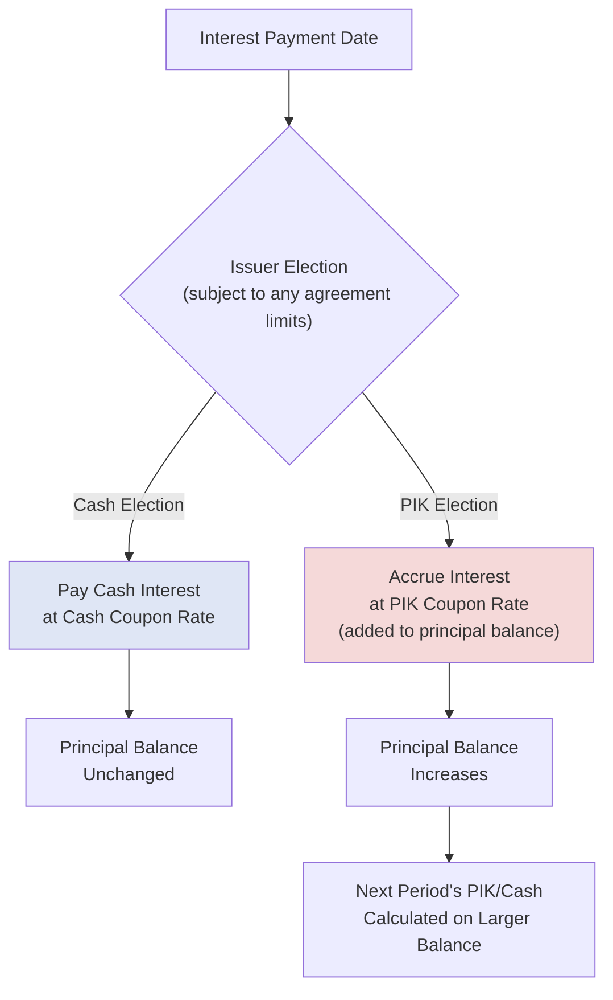
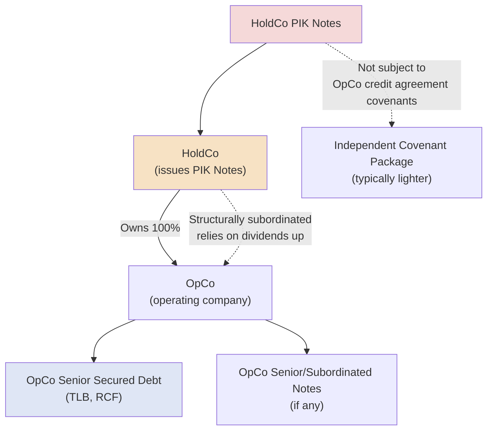

## Payment-in-Kind Instruments

### Overview

Payment-in-Kind (PIK) instruments are debt or preferred equity securities in which the periodic return — interest or dividends — is paid not in cash, but by increasing the outstanding principal or liquidation preference balance, or by issuing additional securities of the same type. PIK structures are a central tool for managing cash flow constraints in highly leveraged capital structures, allowing issuers to preserve cash for operations, growth, or debt service on more senior obligations, in exchange for compounding the total return owed to the PIK instrument's holder over time.

### Core PIK Mechanics

**Key Points**

- **Compounding accrual:** Rather than a cash payment each period, the PIK rate is applied to the current outstanding balance, and the resulting amount is added to that balance — meaning subsequent periods' PIK accrual is calculated on a progressively larger base (compounding).
- **PIK formula:**

$$\text{Balance}_{t+1} = \text{Balance}_t \times (1 + r_{PIK})$$

- **Cash preservation:** The defining benefit to the issuer is that no cash leaves the company to service the PIK instrument during the accrual period, preserving liquidity for operations, capital expenditures, or debt service on more senior cash-pay obligations.
- **Deferred cash obligation:** The PIK-accrued balance does not disappear — it is deferred, not eliminated, and the full compounded balance ultimately becomes due (in cash, through refinancing, or through conversion/redemption) at the instrument's maturity or a defined liquidity event.

### PIK Toggle Notes

**Key Points**

A **PIK toggle** structure gives the issuer an election — typically each interest period — to choose between paying the coupon in cash or accruing it as PIK, often subject to defined conditions (e.g., a maximum number of PIK elections over the life of the instrument, or an automatic reversion to cash-pay after a specified period):

- **All-cash election:** Coupon paid entirely in cash, as with a standard bond.
- **All-PIK election:** Coupon fully accrued/compounded into the principal balance, with no cash outflow.
- **Partial PIK/cash election:** Some structures allow a blended election, with a portion paid in cash and the remainder accrued.
- **PIK rate premium:** PIK toggle notes frequently carry a **higher stated rate for the PIK option** than the cash-pay option (e.g., "9% cash / 9.75% PIK"), compensating investors for the reduced current cash yield and increased duration/credit risk associated with a compounding, unpaid balance.

### PIK Toggle Rate Structure Example

**Example**

A PIK toggle note has a $50 million principal balance with a cash coupon of 9.0% or a PIK coupon of 9.75%, and the issuer elects PIK treatment for the first two years before reverting to cash-pay:

$$\text{Year 1:} \quad \$50{,}000{,}000 \times 1.0975 = \$54{,}875{,}000$$

$$\text{Year 2:} \quad \$54{,}875{,}000 \times 1.0975 = \$60{,}225{,}313$$

By the start of Year 3, the principal balance has grown from $50 million to approximately $60.2 million, at which point the issuer begins paying cash interest at 9.0% on the new, higher $60.2 million balance:

$$\text{Year 3 Cash Interest} = \$60{,}225{,}313 \times 9.0\% \approx \$5{,}420{,}278$$

Note that the Year 3 cash interest payment ($5.42 million) is now substantially higher than what a 9.0% cash coupon on the original $50 million principal would have been ($4.5 million), directly illustrating the compounding cost of the earlier PIK elections.

### PIK Toggle Decision Flow

### PIK Preferred Equity

**Key Points**

- **Structure:** As discussed in preferred equity structuring, PIK preferred accrues its dividend into the liquidation preference balance rather than paying cash dividends, functioning economically similarly to a PIK note but structured as equity (typically subordinated to all debt, including any PIK notes, in the capital stack).
- **Accounting/classification considerations:** The presence of mandatory redemption features, fixed maturity-like dates, or cumulative unpaid dividend obligations can cause PIK preferred to be classified more like debt than equity for certain accounting, leverage ratio, and rating agency purposes, despite its formal legal designation as preferred stock. [Inference: the precise classification treatment depends on the specific instrument's terms and the applicable accounting framework in effect, and should be assessed against current standards rather than assumed uniform across all PIK preferred structures.]

### PIK Notes at the Holdco Level

**Key Points**

A common structural use of PIK instruments in leveraged finance is issuance at a **holding company (HoldCo) level**, structurally separate from the operating company's own debt:

- **Structural subordination:** HoldCo PIK notes are typically issued by a parent holding company that owns the operating company, meaning the PIK notes are structurally subordinated to all operating company debt (which has a direct claim on operating assets and cash flows) — HoldCo noteholders can only be repaid from dividends/distributions the operating company makes upward, or from a sale/refinancing of the entire enterprise.
- **Insulation from operating company covenants:** Because HoldCo PIK notes are issued outside the operating company's own credit agreement or indenture, they are typically **not subject to the operating company's restrictive covenants** (debt incurrence limits, restricted payment baskets), giving sponsors a mechanism to raise additional leverage without breaching existing operating company debt terms — a structuring technique frequently used to fund a dividend recapitalization to sponsor equity holders.
- **No cash service requirement:** Because HoldCo PIK notes typically PIK for their full life (rather than toggle to cash), they impose no cash service burden on either the HoldCo or, indirectly, the operating subsidiary, making them a useful tool where operating company cash flow is fully allocated to its own debt service.

### HoldCo PIK Structural Diagram

### Why Issuers and Sponsors Use PIK Instruments

**Key Points**

- **Liquidity-constrained borrowers:** Companies with tight near-term cash flow (due to high existing leverage, growth investment needs, or cyclical earnings) use PIK toggle features to preserve cash during periods of stress, deferring cash service until the business generates sufficient free cash flow.
- **Dividend recapitalizations:** Sponsors frequently use HoldCo PIK note issuances specifically to fund a dividend distribution to themselves, extracting value from a portfolio company without requiring an outright sale, while avoiding a breach of the operating company's own restricted payment covenant capacity (since the HoldCo notes sit outside that covenant package entirely).
- **Acquisition financing flexibility:** PIK instruments can provide additional acquisition financing capacity in situations where adding further cash-pay debt at the operating company level would breach existing leverage or coverage covenants.

### Investor Perspective and Risk Considerations

**Key Points**

- **Higher required return:** Because PIK investors receive no current cash yield and bear compounding credit risk (the deferred balance grows even as, potentially, the issuer's underlying credit quality does not improve), PIK instruments typically command a materially higher rate than an equivalent cash-pay instrument from the same issuer.
- **Structural subordination risk:** HoldCo PIK note investors bear the risk that the operating company's own creditors and covenants may restrict or prevent upstream dividends needed to eventually service the PIK obligation, leaving PIK noteholders reliant on a future refinancing or sale event for actual repayment.
- **Deferred repayment concentration:** Because PIK compounding continually grows the obligation without interim cash payments, PIK instruments concentrate an increasingly large repayment obligation at maturity or exit, creating a more acute "cliff" repayment risk than an amortizing or cash-pay bullet structure of the same original size.

### Comparative Summary Table

| Feature | Cash-Pay Debt | PIK Toggle Notes | PIK Preferred Equity | HoldCo PIK Notes |
| --- | --- | --- | --- | --- |
| Cash service requirement | Yes | Optional (issuer election) | No (dividends accrue) | No (typically PIKs for life) |
| Compounding | N/A | Yes, when PIK elected | Yes | Yes |
| Position in capital stack | Senior/subordinated debt | Subordinated debt | Below all debt, above common | Structurally subordinated (separate entity) |
| Subject to OpCo covenants | Yes | Yes (if issued at OpCo) | Yes (if issued at OpCo) | Typically no |
| Common use case | Standard financing | Cash flow flexibility in stress | Structured minority investments | Dividend recapitalizations |

### Practical Application in Capital Structuring & Syndication

**Key Points**

- **Dividend recapitalization structuring**: arrangers structuring a HoldCo PIK note issuance to fund a sponsor dividend must carefully confirm the notes are issued at an entity and structural level genuinely outside the operating company's restricted payment covenant, since a mischaracterized or improperly structured issuance could inadvertently breach existing operating company debt documentation.
- **Cash flow modeling under PIK toggle scenarios**: credit analysis and lender underwriting for a PIK toggle instrument must model both the "worst case" (full PIK election for the maximum permitted period) and "base case" (partial or full cash-pay) scenarios, since the compounding effect of extended PIK elections can materially change the issuer's total leverage and refinancing burden at maturity.
- **Rating agency and covenant classification analysis**: determining whether a PIK preferred or PIK note should be treated as debt or equity for leverage ratio calculation purposes is a frequent point of analysis and negotiation between issuers, rating agencies, and senior lenders, given the material impact on reported leverage metrics.
- **Investor targeting for PIK instruments**: because PIK instruments carry elevated risk and receive no current cash yield, they are typically placed with a specific subset of credit investors (mezzanine funds, distressed/special situations investors, certain private credit funds) comfortable with deferred, compounding return profiles, rather than broadly syndicated to traditional cash-yield-focused institutional lenders.
- **Exit and refinancing planning**: because PIK balances compound significantly over time, structuring teams must model the true all-in repayment obligation (including all accrued PIK) well before a planned refinancing or exit event, since the total obligation can be materially larger than the instrument's original issuance amount.

### Related Topics

- Preferred Equity: Participating, Convertible, and Redeemable Features
- Mezzanine Debt and Subordinated Financing Structures
- Dividend Recapitalization Structuring and Restricted Payment Covenants
- Structural Subordination and HoldCo/OpCo Capital Structure Design
- Warrants and Equity Kickers in Debt Financings
- Leveraged Buyout Capital Structure Design
- Rating Agency Treatment of Hybrid Capital Instruments
- Amortizing versus Bullet Repayment Structures
- Intercreditor Agreements and Structural Subordination Analysis
- Distressed Debt and Turnaround Financing Structures