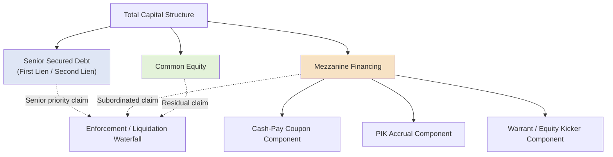

## Mezzanine Financing Structuring

### Overview

Mezzanine financing occupies the structural layer between senior secured debt and common equity in the capital stack, combining features of both subordinated debt and equity to fill a financing gap that neither traditional senior lenders nor common equity holders are positioned to fund alone. It is typically deployed when a transaction's total leverage need exceeds what senior lenders will underwrite on a first-lien (or even second-lien) basis, but the sponsor prefers not to contribute additional common equity to bridge the gap. Mezzanine capital is characterized by junior/unsecured (or deeply subordinated) claim priority, high blended cost of capital, and typically incorporates one or more of the hybrid features discussed elsewhere in this chapter — PIK accrual, warrants, and conversion rights.

### Core Structural Characteristics

**Key Points**

- **Position in the capital stack:** Ranks below all senior secured debt (first lien, second lien) and, where present, senior unsecured notes, but above common equity (and often above certain preferred equity as well) in both the periodic payment waterfall and liquidation priority.
- **Security status:** Typically **unsecured** or, where secured, subordinated in lien priority to all senior creditors' claims on the same collateral — mezzanine lenders generally rely far more on the enterprise's overall cash flow generation and equity cushion than on any specific collateral package.
- **Blended return structure:** Almost universally structured as a combination of a **cash-pay coupon** (lower than the instrument's total required return) plus a **PIK component** and/or an **equity kicker** (warrants or conversion rights), together producing the lender's total targeted return.
- **Typical total return target:** [Inference: total return targets vary meaningfully by market cycle, borrower risk profile, and prevailing credit spreads; current pricing should be benchmarked against contemporaneous market data rather than assumed fixed.] Mezzanine capital is generally priced at a materially higher all-in cost than senior or even second-lien debt, reflecting its subordinated position and reliance on enterprise cash flow and equity value rather than specific collateral.
- **Covenant structure:** Typically includes incurrence-based covenants similar in style to high yield bonds, often with meaningfully more restrictive limitations on the borrower's ability to incur additional senior debt or make restricted payments, reflecting the mezzanine lender's structurally junior and often unsecured position.

### Blended Return Structure Example

**Example**

A mezzanine loan of $20 million is structured with a 10% cash-pay coupon, a 4% PIK component, and warrant coverage targeting an additional 2% annualized equivalent return, for a total blended targeted return of approximately 16%:

$$\text{Total Blended Return} \approx \text{Cash Coupon} + \text{PIK Accrual} + \text{Warrant/Equity Kicker Value}$$

$$\text{Total Blended Return} \approx 10\% + 4\% + 2\% = 16\%$$

This structure allows the borrower to service only the 10% cash-pay portion currently ($2,000,000 annually on the $20 million facility), while the PIK component compounds into the principal balance and the warrant coverage provides additional upside to the lender only if and when the borrower's equity value appreciates — deferring the majority of the instrument's true cost until a future refinancing or exit event.

### Mezzanine Structural Position Diagram

### Mezzanine vs. Second Lien vs. Senior Unsecured Notes

**Key Points**

| Feature | Senior Unsecured Notes | Second Lien Debt | Mezzanine Financing |
| --- | --- | --- | --- |
| Security | Unsecured | Secured (junior lien) | Typically unsecured |
| Coupon structure | Fully cash-pay | Fully cash-pay | Cash-pay + PIK, often + equity kicker |
| Equity kicker (warrants) | Rare | Rare | Common |
| Typical investor base | HY bond investors, institutional funds | Institutional credit funds | Specialty mezzanine funds, insurance companies, BDCs |
| Documentation style | Bond indenture | Credit agreement (with intercreditor) | Often a hybrid credit agreement/note purchase agreement |
| Typical use case | Broadly syndicated capital markets execution | Extending secured leverage capacity | Filling remaining capital structure gap without new equity |

### Why Sponsors Use Mezzanine Financing

**Key Points**

- **Extending total leverage without diluting equity:** Mezzanine capital allows a sponsor to increase total transaction leverage (and correspondingly reduce the amount of common equity capital required) beyond what senior and second-lien lenders alone would provide, without issuing additional common equity that would dilute the sponsor's ownership percentage.
- **Flexibility relative to senior debt covenants:** Because mezzanine investors typically expect a more subordinated, higher-risk position from the outset, mezzanine documentation can sometimes provide more operational flexibility to the borrower in specific negotiated areas compared to what senior lenders would accept, though this varies significantly by transaction and lender.
- **Speed and certainty in competitive processes:** A single mezzanine fund can often commit to and fund a full mezzanine tranche quickly, similar to the private credit unitranche dynamic, providing execution certainty in competitive M&A auction processes without requiring the borrower to complete a broader syndication or bond issuance process for this layer of the capital structure.
- **Return enhancement for the mezzanine lender rather than incremental sponsor cost pressure:** because a meaningful portion of the mezzanine lender's return is deferred (PIK) or contingent (warrants), the instrument imposes less immediate cash flow pressure on the borrower than raising the same incremental leverage entirely through a cash-pay senior tranche would.

### Call Protection and Prepayment in Mezzanine Structures

**Key Points**

Mezzanine debt frequently carries **more restrictive prepayment terms** than senior debt, reflecting the lender's desire to lock in its full targeted blended return (including the PIK and equity kicker components) rather than have the loan prepaid early before that full return is realized:

- **Extended non-call periods:** Often longer than comparable high yield bond non-call periods, sometimes covering the majority of the instrument's stated tenor.
- **Minimum return / make-whole provisions:** Some mezzanine agreements include a **minimum multiple of invested capital (MOIC)** or **minimum IRR** provision, requiring the borrower to pay an additional premium upon early repayment if the actual realized return (cash coupon plus any PIK and warrant value realized to that point) would otherwise fall short of a contractually guaranteed minimum return to the lender.

### Minimum Return Provision Example

**Example**

A mezzanine facility includes a minimum 1.5x MOIC (multiple of invested capital) provision. The lender invested $20 million, and the borrower seeks to prepay after 2 years, at which point the lender has received $5 million in cumulative cash coupon and PIK-related value:

$$\text{Required Total Proceeds for 1.5x MOIC} = \$20{,}000{,}000 \times 1.5 = \$30{,}000{,}000$$

$$\text{Additional Make-Whole Payment Required} = \$30{,}000{,}000 - \$5{,}000{,}000 - \$20{,}000{,}000 \text{ (principal)} = \$5{,}000{,}000$$

The borrower must pay an additional $5,000,000 premium (beyond principal and previously received cash/PIK value) to satisfy the minimum 1.5x MOIC requirement upon early prepayment, ensuring the mezzanine lender achieves its contractually guaranteed minimum return regardless of the timing of repayment.

### Mezzanine Investor Base

**Key Points**

- **Dedicated mezzanine funds:** Specialty private credit funds focused specifically on mezzanine risk/return profiles, often affiliated with larger private equity or credit platforms.
- **Insurance companies:** Life insurance companies and similar long-duration institutional investors are frequent mezzanine investors, given the instrument's higher yield relative to investment grade credit and its suitability for long-duration liability matching.
- **Business Development Companies (BDCs):** Publicly traded or private BDCs frequently allocate a portion of their portfolios to mezzanine investments, particularly in middle-market transactions, sometimes alongside a senior/unitranche investment in the same borrower.
- **Mezzanine tranches within a unitranche "last-out" structure:** As discussed in the second lien/unitranche material, the economically mezzanine-like risk profile is sometimes embedded directly within a unitranche facility's last-out tranche rather than issued as a formally separate mezzanine instrument.

### Practical Application in Capital Structuring & Syndication

**Key Points**

- **Capital structure gap-filling analysis**: arrangers and sponsors use mezzanine financing specifically to bridge the quantified gap between senior/second-lien debt capacity (based on leverage and coverage ratio underwriting) and the sponsor's targeted equity check size, making mezzanine sizing a direct output of the broader capital structure sources-and-uses analysis.
- **Blended cost of capital and IRR modeling**: because mezzanine's true cost includes cash coupon, PIK accrual, and equity kicker value, structuring teams must model the full blended cost (not merely the stated cash coupon) when assessing the transaction's overall weighted average cost of capital and the sponsor's projected equity returns.
- **Intercreditor and subordination negotiation**: even where mezzanine debt is unsecured, sponsors and senior lenders typically require a **subordination agreement** (a lighter-weight analog to a full intercreditor agreement) establishing payment blockage rights, standstill periods, and turnover provisions protecting senior lender priority in a default scenario.
- **Minimum return provision negotiation**: negotiating the presence, level, and calculation methodology of any minimum MOIC or IRR make-whole provision is a critical structuring point, since it directly affects the borrower's practical flexibility (and cost) to refinance or repay the mezzanine tranche earlier than originally anticipated.
- **Warrant coverage and dilution coordination**: where mezzanine financing includes an equity kicker, structuring teams must coordinate the resulting dilution with the broader equity capitalization table and any existing management incentive plan, ensuring the aggregate dilutive impact across all equity-linked instruments in the capital structure remains within acceptable parameters for the sponsor and management.

### Related Topics

- Warrants and Equity Kickers in Debt Financings
- Payment-in-Kind Instruments
- Second Lien and Unitranche Facilities
- Preferred Equity: Participating, Convertible, and Redeemable Features
- Subordination Agreements and Intercreditor Structuring
- Leveraged Buyout Capital Structure Design and Sources-and-Uses Analysis
- Business Development Companies (BDCs) as Mezzanine and Unitranche Lenders
- Corporate Bonds and Notes: Investment Grade versus High Yield
- Weighted Average Cost of Capital (WACC) in Leveraged Structures
- Management Incentive Plans and Equity Rollover Structures