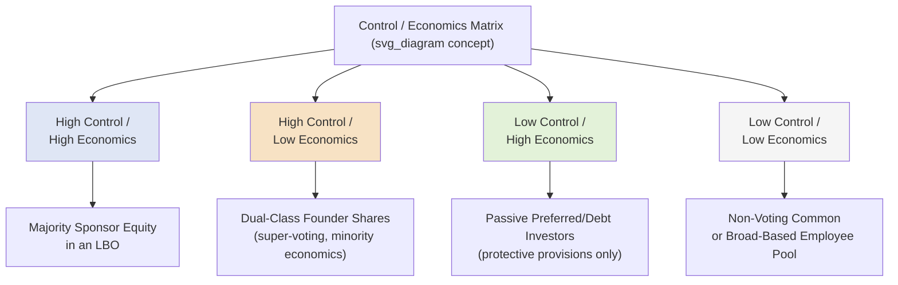
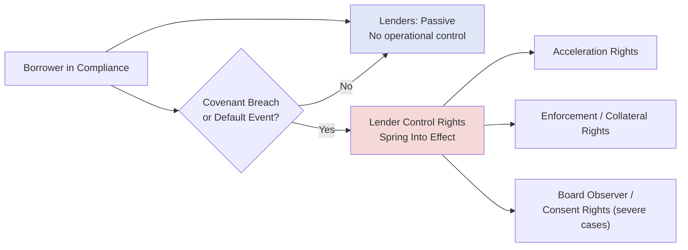

## Structuring for Control versus Economic Ownership

### Overview

The distinction between control and economic ownership is a recurring design axis across nearly every instrument covered in this chapter: a party can hold a large share of a company's cash flow rights while holding little or no decision-making authority, and vice versa. Deliberately structuring this separation — rather than defaulting to proportional "one dollar invested, one vote" alignment — is a core technique in leveraged finance, private equity, venture capital, and family/founder-controlled company structuring. This topic consolidates the mechanisms introduced elsewhere in this chapter (dual-class stock, protective provisions, warrant structures, holding company layering) into a unified framework for analyzing why and how control and economics are deliberately decoupled.

### Why Control and Economics Are Separated

**Key Points**

- **Capital efficiency for controlling parties:** Founders, families, or sponsors often want to raise substantial outside capital without giving up decision-making authority proportional to the capital raised — separating control from economics allows a smaller economic stake to retain full or majority control.
- **Risk allocation without governance dilution:** Debt and preferred equity investors often want economic protection (seniority, fixed returns, downside cushions) without necessarily wanting — or being granted — day-to-day operational control, since their objective is capital preservation and return generation rather than running the business.
- **Regulatory and tax-driven structuring:** Certain holding structures, joint ventures, and cross-border investments separate control and economics specifically to satisfy regulatory ownership limitations (e.g., foreign ownership caps in regulated industries) or tax planning objectives, allocating economic interests differently from voting control to comply with specific legal thresholds. [Inference: the specific regulatory frameworks driving such structures vary substantially by jurisdiction and industry and should be confirmed against current, applicable law rather than treated as a general template.]
- **Incentive alignment without full ownership transfer:** Management incentive structures frequently grant meaningful economic upside (profits interests, carried interest, equity kickers) without corresponding voting control, preserving the sponsor's or founder's governance authority while still motivating management's performance.

### The Control/Economics Matrix

**Key Points**

Every equity or hybrid position in a capital structure can be conceptually mapped along two independent axes — economic exposure and control authority:

### Mechanisms That Separate Control from Economics

**Key Points**

| Mechanism | Effect on Control | Effect on Economics | Typical User |
| --- | --- | --- | --- |
| Dual-class shares | Concentrates voting power | Economic ownership can be proportionally lower | Founders, controlling families |
| Protective provisions / consent rights | Grants targeted veto power, not general control | No direct economic effect | Minority preferred/VC investors |
| Non-voting common stock | Removes voting rights entirely | Full economic participation retained | Employee equity pools, certain investor classes |
| Board seat allocation (independent of ownership %) | Direct operational control | No direct economic effect | PE sponsors, strategic investors |
| Warrants / equity kickers | Typically no control rights attached | Adds economic upside without governance role | Mezzanine and venture debt lenders |
| HoldCo/OpCo structural layering | Concentrates control at HoldCo level | Distributes economic claims across layers | Sponsors structuring dividend recaps |
| Profits interests / carried interest | Typically no voting control | Grants economic upside above a threshold | Management, fund sponsors (GPs) |

### Quantifying the Control/Economics Gap

**Key Points**

A useful structuring metric is the ratio between a party's voting power and its economic (cash flow) ownership percentage:

$$\text{Control Premium Ratio} = \frac{\text{Voting Power \%}}{\text{Economic Ownership \%}}$$

**Example**

A founder holds 15% of a company's fully diluted economic equity value, but through a dual-class structure (10 votes per share on their Class B shares versus 1 vote per share for all other Class A holders) controls 55% of total voting power:

$$\text{Control Premium Ratio} = \frac{55\%}{15\%} \approx 3.67x$$

This ratio quantifies the degree to which the founder's control exceeds what their proportional economic stake alone would provide — a ratio of 1.0x would indicate perfectly proportional control and economics (a standard single-class structure), while a ratio well above 1.0x indicates a deliberately engineered control premium.

### Debt Investors: Economics Without Control (By Design)

**Key Points**

Lenders in a leveraged capital structure represent the clearest illustration of the "high economics exposure (in the risk-bearing sense), low control" quadrant under normal operating conditions:

- **Passive under normal performance:** So long as the borrower remains in compliance with its covenants, lenders typically have no operational control or board representation, despite bearing significant capital at risk.
- **Control rights activate upon covenant breach or default:** Credit agreements and indentures are structured so that lender control rights (acceleration, enforcement, board observer or replacement rights in severe distress, veto over specific major transactions) **spring into effect** specifically upon default or covenant breach — a deliberately contingent, rather than continuous, control mechanism.
- **This is a defining feature of debt as an instrument class:** the entire debt/equity distinction can be reframed through this lens — debt investors accept limited (contingent) control in exchange for priority and (theoretically) more predictable economic return, while equity investors accept residual, uncapped economic risk in exchange for full, continuous control.

### Contingent Control Activation Diagram

### Structuring Applications Across Instrument Types

**Key Points**

- **Sponsor/management alignment in LBOs:** Sponsors typically retain overwhelming voting control (often 100% of voting equity) while granting management a meaningful economic stake via rollover equity and incentive plans, deliberately separating operational decision authority (sponsor) from performance-linked economic upside (management).
- **Venture capital protective provisions:** VC investors frequently hold a minority economic stake but negotiate specific, targeted control rights (protective provisions over defined major actions) rather than general operational control, preserving founder-led governance while protecting the investor's capital against value-destructive decisions.
- **Mezzanine and venture debt equity kickers:** As covered in the warrants topic, lenders receive economic upside participation (warrants) explicitly without corresponding control rights, keeping the instrument's governance profile debt-like even as its return profile becomes partially equity-like.
- **HoldCo PIK structuring:** As covered in the PIK instruments topic, HoldCo-level financing allows a sponsor to add leverage (and therefore alter the economic waterfall) at a structurally separate level from the operating company, without extending any new party's control rights into the operating company's own governance or covenant package.

### Practical Application in Capital Structuring & Syndication

**Key Points**

- **Sponsor control preservation across financing rounds**: private equity sponsors and founder-led companies structure successive rounds of debt and preferred equity financing specifically to preserve voting control at each stage, often accepting a smaller relative economic stake or more restrictive protective provisions in exchange for keeping board and voting control concentrated.
- **Lender risk pricing based on contingent control adequacy**: arrangers and lenders price and negotiate covenant packages partly based on how quickly and effectively their contingent control rights would activate in a distress scenario — a credit agreement with weak or slow-triggering default/covenant mechanics effectively leaves lenders bearing "high economics, low control" risk for longer than one with tighter, faster-triggering provisions.
- **Cap table and governance modeling for multi-instrument structures**: when a capital structure includes several instruments with different control/economics profiles (senior debt, mezzanine with warrants, preferred equity, common equity, management incentive plans), structuring teams must model the aggregate governance and economic waterfall holistically, since individual instrument terms interact (e.g., warrant exercise dilutes common equity's economic share without directly affecting voting control unless the warrant shares themselves carry votes).
- **Change of Control definition drafting**: because control and economics can shift independently, credit agreements and indentures must precisely define what specific change (in voting power, board composition, or economic ownership) actually triggers a Change of Control event — a change in economic ownership alone, without a corresponding shift in voting control, may or may not constitute a triggering event depending on the specific contractual definition negotiated.
- **Regulatory and cross-border structuring coordination**: in transactions involving regulated industries or cross-border ownership limitations, structuring teams must coordinate closely with regulatory counsel to ensure any deliberate separation of control and economics satisfies the specific legal requirements driving that structure, rather than assuming a generic dual-class or holding structure will automatically achieve the desired regulatory outcome.

### Related Topics

- Common Equity Structuring and Control Rights
- Preferred Equity: Participating, Convertible, and Redeemable Features
- Warrants and Equity Kickers in Debt Financings
- Payment-in-Kind Instruments and HoldCo/OpCo Structuring
- Change of Control Provisions in Credit Agreements and Indentures
- Management Incentive Plans and Equity Rollover Structures
- Structural Subordination in Multi-Entity Capital Structures
- Protective Provisions and Consent Rights in Private Equity/VC Financing
- Leveraged Buyout Capital Structure Design
- Cross-Border Ownership Restrictions and Regulatory Structuring