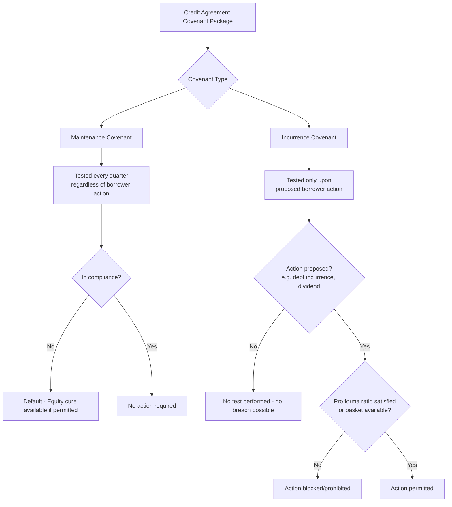

## Financial Maintenance Covenants versus Incurrence Covenants

### Overview

Covenants are contractual promises embedded in credit agreements and indentures that constrain borrower behavior and provide lenders with early warning mechanisms and remedies. The fundamental architectural distinction in covenant design separates **maintenance covenants**, which are tested on a recurring, mechanical basis regardless of borrower activity, from **incurrence covenants**, which are only tested when the borrower elects to take a specific action. This distinction is arguably the single most important structural feature separating traditional bank loan documentation from high-yield bond and covenant-lite loan documentation.

### Financial Maintenance Covenants

#### Definition and Mechanics

A maintenance covenant requires the borrower to satisfy a specified financial ratio or test at every measurement date (typically quarter-end), irrespective of whether the borrower has taken any corporate action. Compliance is demonstrated through a compliance certificate delivered alongside quarterly or annual financial statements.

**Key Points**

- Tested continuously (e.g., quarterly), not triggered by an event
- Breach occurs automatically if the ratio is out of compliance at the test date, even if the borrower did nothing "wrong"
- Provides lenders with an early, proactive warning system and negotiating leverage before a payment default occurs
- Standard in traditional syndicated bank loans, particularly revolving credit facilities and term loan A (TLA) tranches
- Typically set with headroom (cushion) above the borrower's projected financial performance at closing

#### Common Maintenance Covenant Types

- **Leverage ratio (Net Debt/EBITDA)**: Maximum permitted ratio, stepping down over time as the credit matures
- **Interest coverage ratio (EBITDA/Cash Interest Expense)**: Minimum permitted ratio
- **Fixed charge coverage ratio (FCCR)**: (EBITDA − Capex − Taxes)/(Interest + Scheduled Principal + Dividends), minimum threshold
- **Minimum liquidity or net worth tests**: Less common in corporate lending, more typical in asset-based or real estate lending

#### Example

A $200 million term loan A includes a maintenance covenant requiring the borrower to maintain a Net Leverage Ratio not to exceed $4.50:1.00$ at each fiscal quarter-end, stepping down to $4.00:1.00$ after year two. If quarter-end EBITDA declines such that leverage rises to $4.75:1.00$, the borrower is in default at that testing date even though no new debt was incurred — this is a "maintenance breach."

#### Cure Mechanisms

Many maintenance covenants include an **equity cure** right, allowing sponsors to inject cash (treated as EBITDA or debt paydown) to retroactively cure a breach, subject to limits:

- Capped number of cures over the life of the loan (e.g., 2 cures in any 4-quarter period, 5 over the life)
- Cap on cure amount (typically limited to the minimum amount needed to regain compliance)
- No "cure on cure" — cannot use the same cure to satisfy two consecutive periods

### Incurrence Covenants

#### Definition and Mechanics

An incurrence covenant is only tested when the borrower proposes to take a specific affirmative action — such as incurring additional debt, making a restricted payment (dividend, buyback), or completing an acquisition. If the borrower takes no such action, the ratio is never tested and no breach can occur, even if underlying credit metrics deteriorate significantly.

**Key Points**

- "Springs" into effect only upon a triggering event/transaction
- No automatic default purely from financial deterioration absent an action
- Standard in high-yield bonds (indentures) and covenant-lite (cov-lite) term loan B (TLB) facilities
- Provides borrowers/sponsors with significant operational flexibility, particularly valuable in leveraged buyouts
- Compliance is demonstrated on a pro forma basis at the time of the proposed transaction

#### Common Incurrence Covenant Applications

- **Debt incurrence test**: Cannot incur additional debt unless pro forma leverage ratio is below a specified level (or under a "ratio debt" basket), separate from enumerated "permitted debt" baskets
- **Restricted payments (RP) covenant**: Dividends, distributions, and buybacks permitted only if a leverage/coverage ratio is satisfied and sufficient capacity exists in the cumulative "builder basket" (typically accreting from 50% of consolidated net income since a reference date)
- **Restricted subsidiary designation**: Governs whether subsidiaries are subject to covenants
- **Asset sale covenant**: Requires proceeds application (debt paydown or reinvestment) but does not require ongoing ratio maintenance
- **Affiliate transactions and liens covenants**: Also structured as incurrence-style, action-triggered tests

#### Example

A high-yield bond indenture permits the issuer to incur additional debt if, after giving pro forma effect, the Consolidated Leverage Ratio does not exceed $5.00:1.00$. If the issuer's actual leverage organically rises to $6.00:1.00$ due to EBITDA decline (no new borrowing), there is no default — the issuer simply loses the ability to incur *new* ratio debt until leverage falls back under $5.00:1.00$, though "permitted debt" baskets (credit facilities, capital leases, general baskets) typically remain available regardless.

### Comparative Analysis

| Attribute | Maintenance Covenant | Incurrence Covenant |
| --- | --- | --- |
| Testing frequency | Every quarter (periodic) | Only upon specified action |
| Trigger | Time-based (mechanical) | Event-based (transactional) |
| Typical instrument | Bank loans (TLA, revolvers) | High-yield bonds, cov-lite TLB |
| Borrower flexibility | Lower | Higher |
| Lender monitoring | Proactive/early warning | Reactive/transactional gate |
| Default risk from EBITDA decline alone | Yes | No |
| Typical holder | Banks, direct lenders | Institutional investors (CLOs, bond funds) |
| Negotiating leverage point | Regular renegotiation opportunity | Limited to transaction moments |

### Covenant-Lite Structures

The "cov-lite" TLB market emerged as institutional term loan investors (CLOs, mutual funds) competed for allocations, converging term loan documentation toward bond-style incurrence-only covenant packages while retaining loan-style features (first-lien security, floating rate, callability). [Inference] The prevalence of cov-lite structures tends to expand during periods of strong investor demand and loose credit conditions and contract during periods of market stress, though the precise cyclicality varies by credit cycle and should be verified against current market data for any specific period.

**Key structural implications of cov-lite:**

- Revolving credit facility often retains a "springing" maintenance covenant (see below) even when the term loan is fully cov-lite
- Reduces early lender intervention points, shifting risk toward reliance on incurrence-based baskets and liability management protections (see also: "J.Crew trapdoor," "Chewy/Serta uptier" precedents in loan documentation)
- Increases importance of definitional precision (EBITDA add-backs, basket sizing) since ratio tests occur less frequently

### Springing Maintenance Covenants

A hybrid structure common in cov-lite term loans with a revolving facility: the maintenance covenant (typically a maximum net leverage test) only "springs" into effect and becomes testable if revolver utilization exceeds a specified threshold (commonly 35–40% of revolver commitments) at a quarter-end.

**Example**: A $50 million revolver has a springing leverage covenant tested only if outstanding revolver draws (excluding certain letters of credit) exceed 35% ($17.5 million) at quarter-end. If the borrower keeps the revolver largely undrawn, the covenant is never tested, benefiting from cov-lite-like flexibility while giving revolving lenders a monitoring backstop when their exposure is material.

### Structuring Considerations for Practitioners

**Key Points**

- **Covenant headroom sizing**: Set initial maintenance covenant levels with sufficient cushion (typically 25–35%) above the sponsor's base case model to absorb reasonable underperformance without technical default
- **Step-downs**: Maintenance ratios typically tighten over the loan's tenor to track expected deleveraging
- **Basket architecture in incurrence regimes**: Requires careful drafting of "Permitted Debt," "Permitted Liens," "Permitted Investments," and "Restricted Payments" baskets, since these — not a single ratio — govern most day-to-day flexibility
- **Cross-default and cross-acceleration provisions**: Interact differently with each covenant type; a maintenance breach under one facility can trigger cross-default under others even absent payment default
- **EBITDA add-back negotiation**: Because incurrence tests are pro forma and forward-looking, aggressive EBITDA add-backs (synergies, cost savings) materially expand incurrence capacity — a frequent point of lender pushback

### Practical Negotiation Dynamics

[Inference] In practice, private credit and direct lending markets have generally continued to favor maintenance covenants even for middle-market sponsor-backed deals, since direct lenders value the earlier intervention rights; broadly syndicated loan and high-yield markets have trended toward incurrence-based or cov-lite structures for larger, more liquid credits. Market convention shifts with credit cycles and should be confirmed against current deal comparables rather than assumed static.

### Next Steps

- **Financial Covenant Ratio Definitions and EBITDA Add-Backs**
- **Restricted Payments Baskets and Builder Basket Mechanics**
- **Debt Incurrence Tests and Permitted Debt Baskets**
- **Equity Cure Rights: Structuring and Limitations**
- **Cross-Default and Cross-Acceleration Provisions**
- **Covenant-Lite Loan Structures and Market Cyclicality**
- **Liability Management Transactions (Uptier Priming, Drop-Down Financings)**
- **Springing Covenants in Revolving Credit Facilities**
- **Compliance Certificates and Financial Reporting Covenants**