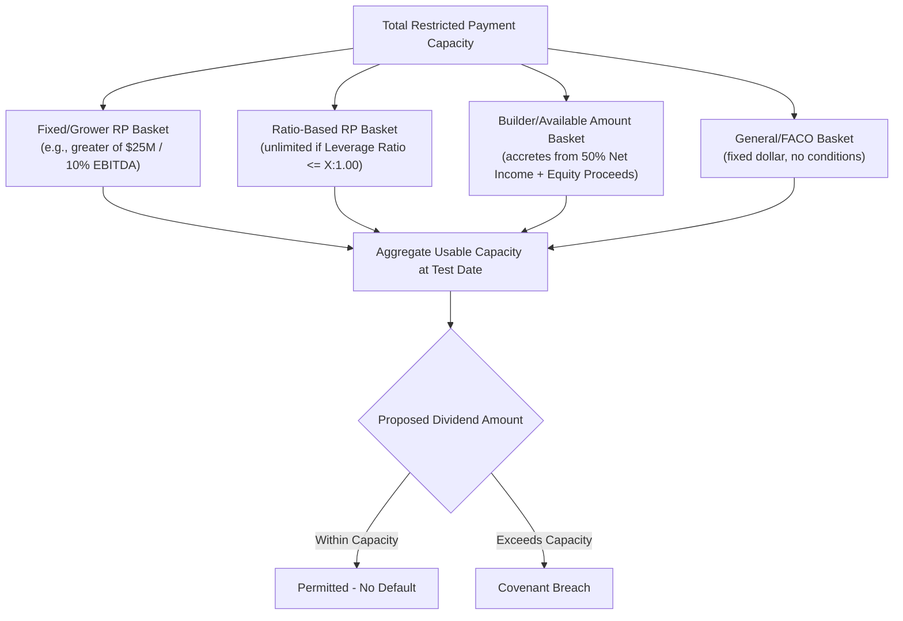

## Negative Covenants and Basket Capacity

### Overview

Negative covenants are contractual restrictions in credit agreements and indentures that prohibit or limit borrower actions unless specific conditions are satisfied. Rather than functioning as a blanket prohibition, each negative covenant typically operates through a system of enumerated exceptions — "baskets" — that carve out permitted activity up to defined thresholds. Basket capacity is the aggregate room available under these carve-outs at any point in time, and its architecture is one of the most heavily negotiated aspects of credit documentation because it defines the practical operating flexibility of the borrower group.

### Core Negative Covenant Categories

**Key Points**

- **Indebtedness**: Restricts incurrence of additional debt
- **Liens**: Restricts granting security interests to third parties (negative pledge)
- **Investments**: Restricts loans, advances, and equity investments in non-guarantor subsidiaries or third parties
- **Restricted Payments (RP)**: Restricts dividends, distributions, and equity/subordinated debt repurchases
- **Asset Sales/Dispositions**: Restricts sale or transfer of assets outside the ordinary course
- **Fundamental Changes**: Restricts mergers, consolidations, and changes in business
- **Affiliate Transactions**: Restricts dealings with sponsors/affiliates absent fair-value protections
- **Sale-Leasebacks**: Restricts monetizing owned assets via leaseback arrangements
- **Restrictive Agreements**: Restricts agreeing to limits on subsidiary dividends/upstreaming (anti-layering protection)
- **Changes to Fiscal Year/Organizational Documents**: Restricts changes affecting lender rights or reporting

### Basket Architecture

#### Basket Types

- **Fixed-dollar (hard cap) baskets**: A flat dollar amount, unrelated to company size (e.g., "$50 million general debt basket")
- **Grower baskets**: The greater of a fixed dollar amount or a percentage of a financial metric (typically EBITDA or total assets), allowing capacity to scale as the business grows (e.g., "greater of $50 million and 20% of Consolidated EBITDA")
- **Ratio-based (incurrence) baskets**: Uncapped in dollar terms but subject to satisfying a pro forma financial ratio at the time of use (e.g., unlimited debt incurrence so long as pro forma Net Leverage Ratio does not exceed $4.00:1.00$)
- **Builder/basket accretion ("available amount")**: Capacity that accumulates over time based on retained earnings, equity issuances, and other credited amounts, usable across multiple covenants (RP, investments, junior debt prepayments)
- **Free-and-clear (FACO) baskets**: General-purpose baskets usable without a ratio test, of a fixed or grower size, often layered with ratio-based capacity so borrowers can choose the more favorable path
- **Reclassification/basket-swapping rights**: Allows borrowers to redesignate a transaction from one basket or covenant exception to another (or split usage across multiple baskets) to maximize headroom

#### Example — Layered Debt Basket

A term loan credit agreement's indebtedness covenant might read:

> Indebtedness is prohibited except: (a) debt existing on the Closing Date; (b) purchase money/capital lease debt up to the greater of $30 million and 15% of Consolidated EBITDA; (c) unlimited debt so long as pro forma Consolidated Net Leverage Ratio does not exceed $4.00:1.00$ (or, if incurred to finance a Permitted Acquisition, no worse than the ratio immediately prior — a "leverage-neutral" or "no worse than" test); (d) an additional $75 million general basket; and (e) intercompany debt among loan parties.

This layering means actual incurrence capacity is the sum of applicable baskets, not a single number — a key point often underappreciated by less experienced credit analysts.

#### Example — Restricted Payments Builder Basket

A typical "available amount" or "builder basket" formula for dividends:

$$\text{Available Amount} = 50\% \times \text{Cumulative Consolidated Net Income (since a reference date)} + \text{Net Cash Equity Proceeds} + \text{Returns on Investments} - \text{Prior RP Usage}$$

If the reference date net income since inception totals $40 million and $10 million of qualifying equity has been raised, the builder basket capacity would be approximately $50\% \times \$40\text{M} + \$10\text{M} = \$30\text{M}$, available for dividends/buybacks in addition to any fixed RP basket and ratio-based RP capacity (if the leverage ratio test is satisfied).

### Basket Capacity Diagram

### Conditions Attached to Basket Usage

**Key Points**

- **No Default/Event of Default condition**: Many baskets require that no default exists (or would result) at the time of use
- **Pro forma compliance**: Ratio-based baskets require pro forma calculation of the relevant test as if the transaction had occurred on the last day of the test period
- **Anti-cash-trap/leakage conditions**: Investment and RP baskets often require that resulting cash does not leave the credit group in a way that undermines collateral value
- **MFN (Most Favored Nation) protection**: In term loan documentation, incremental debt baskets often carry MFN pricing protection requiring incremental yield to be within a specified spread of existing loans, or existing loan pricing adjusts upward

### Negative Covenant Interplay with Collateral

Liens covenants and negative pledge provisions interact directly with basket capacity: even where debt incurrence is permitted under an indebtedness basket, a separate Permitted Liens basket must independently authorize any security interest securing that debt. Structuring practitioners must confirm that debt and lien baskets are "matched" — it is a common drafting trap to permit debt incurrence without corresponding lien capacity, effectively forcing the debt to be unsecured despite lender/sponsor intent otherwise.

### Practical Structuring Considerations

- **Grower vs. fixed-dollar tension**: Sponsors favor grower baskets (scale with growth); lenders often prefer fixed caps or grower baskets with a hard ceiling to prevent unlimited flexibility on strong performance
- **Basket stacking risk**: Aggressive borrowers may combine general baskets, builder baskets, and ratio baskets to fund a single large transaction — lenders should model worst-case cumulative usage, not headline basket size in isolation
- **"J.Crew blocker" provisions**: Many post-2017 credit agreements add restrictions preventing unrestricted subsidiaries from holding IP or other material assets transferred via investment baskets, directly responding to the J.Crew liability management precedent
- **Unrestricted subsidiary designation**: Investment baskets are frequently the mechanism enabling designation of subsidiaries as "unrestricted," removing them from covenant compliance and collateral — a key point of tension in recent liability management litigation (e.g., Serta, Envision precedents)

[Inference] Basket sizing conventions (grower percentages, ratio-based thresholds) vary meaningfully by market segment (investment-grade vs. leveraged loan vs. high-yield vs. private credit) and by prevailing market conditions at the time of syndication; specific benchmark levels for any given period should be confirmed against current comparable transactions rather than treated as fixed norms.

### Next Steps

- **Restricted Payments Covenant and Builder Basket Mechanics**
- **Permitted Liens and Negative Pledge Structuring**
- **Incremental Debt Facilities and MFN Protection**
- **Unrestricted Subsidiary Designations and Liability Management Risk**
- **Investment Covenant Baskets and Intercompany Structuring**
- **Asset Sale Covenants and Mandatory Prepayment Triggers**
- **Anti-Layering and Restrictive Agreement Covenants**
- **Cross-Reference: Financial Maintenance Covenants versus Incurrence Covenants**