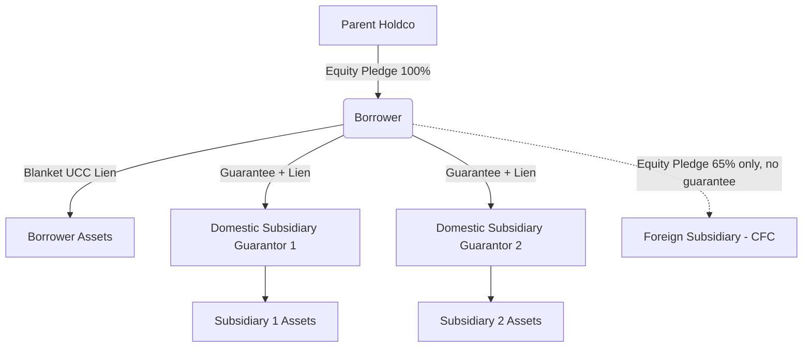

## Collateral Packages and Security Interests

### Definition and Purpose

A collateral package is the complete set of assets, rights, and credit support pledged by a borrower (and its subsidiaries/guarantors) to secure repayment obligations under a credit facility. A security interest is the legal right granted to a lender or collateral agent over specific assets, enabling seizure and liquidation upon default, ahead of unsecured creditors.

In capital structuring, the design of the collateral package determines:

- Recovery rates in a workout or bankruptcy scenario
- Relative priority among tranches of debt (first lien vs. second lien vs. unsecured)
- Covenant flexibility available to the borrower (e.g., capacity to incur additional debt, pay dividends)
- Pricing — better/broader collateral generally lowers the cost of capital

**Key Points**

- Collateral does not create value; it reallocates the risk of loss in a downside scenario among creditor classes.
- The strength of a security interest depends on three things: (1) attachment (the interest is validly created), (2) perfection (the interest is enforceable against third parties), and (3) priority (ranking versus other claimants).

### Legal Framework: Attachment, Perfection, and Priority

**Attachment**

Attachment is the point at which a security interest becomes enforceable between the debtor and secured party. Under UCC Article 9 (the governing framework in most U.S. jurisdictions), attachment requires:

1. Value has been given by the secured party (e.g., the loan has been funded or committed)
2. The debtor has rights in the collateral
3. A security agreement exists (either signed by the debtor or collateral is in the secured party's possession/control)

**Perfection**

Perfection makes the security interest enforceable against third parties, including a bankruptcy trustee. Perfection methods vary by collateral type:

| Collateral Type | Perfection Method |
| --- | --- |
| Accounts receivable, inventory, equipment, general intangibles | UCC-1 financing statement filing |
| Real property (mortgages, deeds of trust) | Recording in county land records |
| Deposit accounts | Control agreement (account control agreement, or ACA) |
| Securities/investment property | Control (via securities account control agreement) or possession |
| Intellectual property | UCC filing plus separate filing with USPTO/Copyright Office for certain rights |
| Chattel paper | Possession or control |
| Instruments (notes, drafts) | Possession, or filing as a fallback |

[Inference] The exact filing office and required forms vary by jurisdiction outside the U.S.; non-U.S. deals often layer local-law security instruments (e.g., pledges, mortgages, floating charges under English law, or fiduciary transfers under civil law systems) atop or instead of a UCC-style regime.

**Priority**

Priority generally follows a "first to file or perfect" rule under UCC Article 9, with important exceptions:

- Purchase-money security interests (PMSIs) can prime an earlier-filed general lien on the same collateral, with proper notice.
- Statutory/possessory liens (e.g., mechanic's liens, tax liens) may prime consensual security interests depending on jurisdiction and timing.
- Intercreditor agreements can contractually re-order priority regardless of filing dates (contractual subordination).

### Components of a Collateral Package

**Key Points**

A comprehensive collateral package in a syndicated leveraged loan or project finance context typically includes:

1. **Equity Pledges** — pledge of the capital stock/membership interests of the borrower and each material subsidiary, giving lenders the ability to foreclose and take control of the corporate structure.
2. **Real Property** — mortgages or deeds of trust on owned real estate, and sometimes leasehold mortgages on material leased facilities.
3. **Personal Property (UCC blanket lien)** — a "blanket lien" over substantially all tangible and intangible assets: accounts receivable, inventory, equipment, general intangibles, intellectual property, and proceeds.
4. **Cash and Deposit Accounts** — control agreements over operating and collection accounts.
5. **Intercompany Notes** — pledges of any intercompany receivables to prevent value leakage through related-party loans.
6. **Insurance Proceeds** — lender loss-payee/additional-insured designations.
7. **Material Contracts** — collateral assignment of key contracts (e.g., offtake agreements, PPAs in project finance, or material customer contracts), often subject to consent requirements from counterparties.

**Example**

A middle-market leveraged buyout term loan B might include: (i) a first-priority pledge of 100% of the borrower's equity, (ii) a first-priority blanket UCC lien on all personal property of the borrower and guarantors, (iii) mortgages on owned real property with a value above a materiality threshold (e.g., $5,000,000), and (iv) a pledge of 65% (not 100%) of the equity of first-tier foreign subsidiaries to avoid adverse U.S. tax consequences under CFC (controlled foreign corporation) rules. [Inference: the 65% convention reflects historical tax-driven market practice and may shift depending on evolving tax regulations in a given jurisdiction.]

### Guarantee Structure and the Collateral Package

Collateral is almost never granted in isolation — it typically accompanies a guarantee structure:

- **Borrower** grants direct security interests on its own assets.
- **Subsidiary guarantors** (usually all "material" wholly-owned domestic subsidiaries, subject to exceptions) both guarantee the debt and grant security interests over their own assets.
- **Excluded subsidiaries** — often includes immaterial subsidiaries, subsidiaries where granting security triggers adverse tax consequences (e.g., foreign subsidiaries, CFCs), regulated entities, and non-wholly-owned joint ventures — are typically carved out of the guarantee/collateral requirement, subject to negotiated thresholds.



### First Lien vs. Second Lien vs. Unsecured Structures

**Key Points**

| Tranche | Priority on Collateral | Typical Pricing | Typical Instruments |
| --- | --- | --- | --- |
| First Lien | Senior-most claim on collateral proceeds | Lowest spread | Revolving credit facility, Term Loan A/B |
| Second Lien | Subordinate lien on same collateral pool | Higher spread | Second lien term loan |
| Unsecured | No collateral claim; relies on general recourse | Highest spread/yield | Senior unsecured notes, subordinated debt |

The relationship between first and second lien creditors sharing the same collateral pool is governed by an **intercreditor agreement** (sometimes called an "ABL Intercreditor Agreement" when the first lien is an asset-based revolver, or a "First Lien/Second Lien Intercreditor Agreement" in cash-flow deals). Key provisions typically include:

- Standstill periods restricting the second lien agent's ability to exercise remedies
- Waterfall provisions dictating application of collateral proceeds (first lien paid in full before second lien recovers)
- Release provisions allowing the first lien agent to release collateral in a sale without second lien consent, subject to certain protections
- DIP financing consent rights in a bankruptcy scenario

### Collateral Valuation and Coverage Analysis

Lenders assess collateral packages using several metrics:

- **Loan-to-Value (LTV)**: 


  $$LTV = \frac{\text{Outstanding Loan Balance}}{\text{Appraised Collateral Value}}$$
- **Collateral Coverage Ratio**:


  $$CCR = \frac{\text{Net Orderly Liquidation Value (NOLV) of Collateral}}{\text{Total Secured Debt}}$$
- **Borrowing Base** (common in asset-based lending): a formula-driven advance rate against eligible collateral, recalculated periodically.

$$\text{Borrowing Base} = (AR_{eligible} \times Advance\ Rate_{AR}) + (Inv_{eligible} \times Advance\ Rate_{Inv}) - Reserves$$

**Example**

A borrowing base certificate might apply an 85% advance rate on eligible accounts receivable and a 50% advance rate on eligible inventory at the lower of cost or market, less standard reserves (e.g., for rebates, returns, or dilution). If eligible AR is $10,000,000 and eligible inventory is $6,000,000, the borrowing base is:

$$(10{,}000{,}000 \times 0.85) + (6{,}000{,}000 \times 0.50) = 8{,}500{,}000 + 3{,}000{,}000 = 11{,}500{,}000$$

[Inference] Actual advance rates and reserve categories are lender- and industry-specific and are subject to periodic field examinations and appraisals.

### Springing Liens and Collateral Fallaway

Two structural mechanics frequently appear in negotiated deals:

- **Springing Lien Provisions**: Certain collateral (commonly deposit account control agreements or mortgages on lower-value real property) only needs to be perfected upon the occurrence of a specified trigger (e.g., a ratings downgrade below a threshold, or an event of default), reducing upfront administrative burden and cost.
- **Collateral Fallaway**: Provisions under which security interests (and sometimes guarantees) are automatically released once specified conditions are met — commonly a ratings upgrade to investment grade, or achievement of a target leverage ratio — converting a secured facility into an unsecured one.

### Covenant Interaction with Collateral

Collateral packages interact directly with negative covenants:

- **Liens covenant**: restricts the borrower from granting liens to other creditors that could dilute or prime the existing collateral package, subject to a list of "permitted liens."
- **Asset sale covenant**: typically requires that proceeds from sales of collateral be applied to repay secured debt or be reinvested within a specified period, preserving collateral value.
- **Additional debt covenant**: often permits incurrence of additional secured debt only if it ranks pari passu or junior and satisfies a leverage-based incurrence test (e.g., first lien net leverage ratio).

### Cross-Border and Structural Considerations

[Unverified — jurisdiction-specific] In cross-border syndications, collateral packages must often be split into parallel local-law security documents because a single governing-law security agreement typically cannot be perfected against assets located in, or entities organized in, another jurisdiction. Common structures include:

- Local law share pledges for each jurisdiction where a subsidiary is incorporated
- Local law mortgages/charges over real property situated in that jurisdiction
- Parallel debt structures (particularly in civil law jurisdictions that do not recognize the concept of an agent holding security on behalf of multiple lenders) to allow a single security agent to hold enforceable security for the benefit of a syndicate

### Diagram: Security Interest Lifecycle (svg_diagram)

<svg xmlns="http://www.w3.org/2000/svg" viewBox="0 0 900 260">
<text x="450" y="25" font-size="18" font-weight="bold" text-anchor="middle" fill="#1a1a1a">Security Interest Lifecycle (svg_diagram)</text>
<g font-family="sans-serif" font-size="14">
<rect x="20" y="80" width="160" height="80" rx="8" fill="#e8f0fe" stroke="#4a6fa5" stroke-width="2" />
<text x="100" y="115" text-anchor="middle" fill="#1a1a1a">Attachment</text>
<text x="100" y="135" text-anchor="middle" font-size="11" fill="#444">Value + Rights + Agreement</text>



```
<rect x="240" y="80" width="160" height="80" rx="8" fill="#fef3e0" stroke="#c98a2c" stroke-width="2" />
<text x="320" y="115" text-anchor="middle" fill="#1a1a1a">Perfection</text>
<text x="320" y="135" text-anchor="middle" font-size="11" fill="#444">UCC-1 / Recording / Control</text>

<rect x="460" y="80" width="160" height="80" rx="8" fill="#e6f4ea" stroke="#3c8047" stroke-width="2" />
<text x="540" y="115" text-anchor="middle" fill="#1a1a1a">Priority</text>
<text x="540" y="135" text-anchor="middle" font-size="11" fill="#444">Ranking vs other claimants</text>

<rect x="680" y="80" width="180" height="80" rx="8" fill="#fdeaea" stroke="#b03a3a" stroke-width="2" />
<text x="770" y="115" text-anchor="middle" fill="#1a1a1a">Enforcement</text>
<text x="770" y="135" text-anchor="middle" font-size="11" fill="#444">Foreclosure / UCC sale</text>

<path d="M180 120 L240 120" stroke="#333" stroke-width="2" marker-end="url(#arrow)" />
<path d="M400 120 L460 120" stroke="#333" stroke-width="2" marker-end="url(#arrow)" />
<path d="M620 120 L680 120" stroke="#333" stroke-width="2" marker-end="url(#arrow)" />
```

</g>
</svg>

**Conclusion**

Collateral packages and security interests form the structural backbone that translates a credit agreement's payment promises into enforceable economic priority. Effective structuring requires coordinating corporate law (guarantee scope), commercial law (attachment/perfection/priority under UCC or local equivalents), covenant drafting (permitted liens, asset sales, incurrence tests), and intercreditor mechanics (waterfalls, standstills, releases) to align legal enforceability with the credit's intended risk allocation.

**Related Topics**

- Intercreditor Agreements and Lien Subordination
- Guarantee Structures and Guarantor Coverage Tests
- Asset-Based Lending and Borrowing Base Mechanics
- Springing Liens and Collateral Fallaway Triggers
- Cross-Border Security and Parallel Debt Structures
- UCC Article 9 Perfection Mechanics
- Permitted Liens Baskets in Credit Agreements
- Fraudulent Transfer Risk and Guarantee Limitations